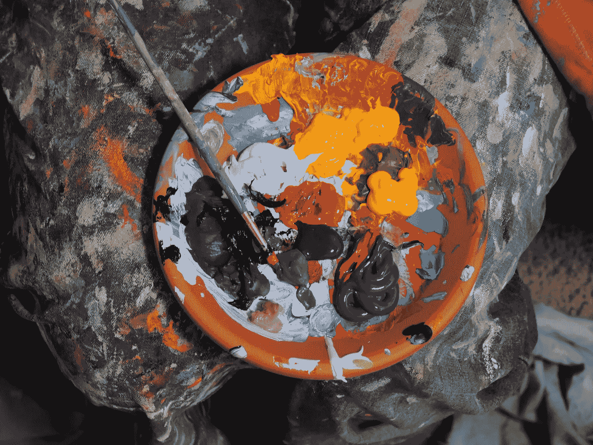
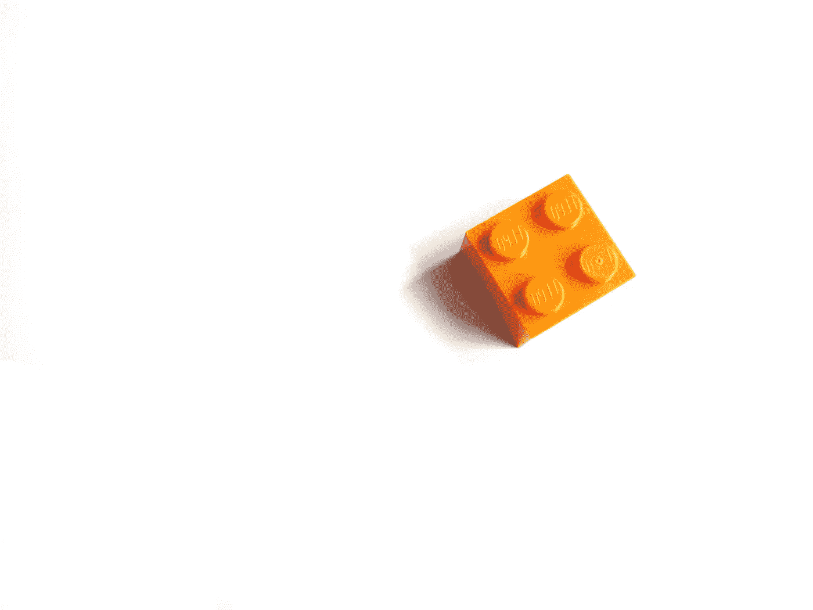
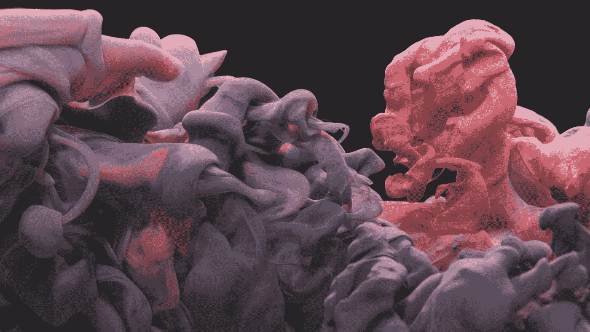

# 什么是 Android Gradle 插件

> 原文：<https://levelup.gitconnected.com/what-is-the-android-gradle-plugin-d859303c0b68>

## Android Studio 的每个项目都要经过 Gradle，是什么？

Gradle 成为 Android 官方构建工具已经有一段时间了。它是与 Android Studio 一起推出的。在 Android Gradle 插件之前，Android 应用程序是用另一个构建工具 ANT 在 Eclipse 中构建的。但即使它是我们作为 Android 开发者的基本日常工具之一，有时我们也不知道它背后是什么。让我们来了解一下这个强大工具的背后是什么。


比亚·安德拉德在 [Unsplash](https://unsplash.com/s/photos/mix?utm_source=unsplash&utm_medium=referral&utm_content=creditCopyText) 上的照片

# 格拉德是什么？

我们首先需要定义和理解 Gradle 是如何工作的。让我们回顾一下 Gradle 官方页面中的定义:

> *Gradle 是一个开源的构建自动化工具，专注于灵活性和性能。Gradle 构建脚本是使用 Groovy 或 Kotlin DSL 编写的。阅读 Gradle 特性，了解 Gradle 的功能。*
> 
> [*https://docs.gradle.org/current/userguide/userguide.html*](https://docs.gradle.org/current/userguide/userguide.html)

# 构建自动化

综上所述，理解什么是构建自动化是很重要的。它是构建软件的完整过程，由一个程序在没有我们交互的情况下完成。其中发生的一些过程是将你的代码编译成二进制、打包和运行自动化测试。

有两种类型的构建自动化工具。

1.  构建自动化服务器——顾名思义，它们是在线工具，以预定的方式或通过手动触发来自行构建。在从事大型项目时，您通常会看到这些工具。例如，构建可以在晚上运行，第二天早上你就有了所有合并变更的新版本。
2.  构建自动化工具——这是 Gradle 所属的组。它们安装在本地机器上，您手动创建构建。


Jo Szczepanska 在 [Unsplash](https://unsplash.com/s/photos/tools?utm_source=unsplash&utm_medium=referral&utm_content=creditCopyText) 上拍摄的照片

# 为什么是外挂？

Gradle 在他们的网站上解释得很好:

> Gradle 本质上有意为现实世界的自动化提供很少的东西。所有有用的特性，比如编译 Java 代码的能力，都是由插件*添加的。*
> 
> [*https://docs.gradle.org/current/userguide/plugins.html*](https://docs.gradle.org/current/userguide/plugins.html)

*简而言之，Android Gradle 插件包含了构建 Android 应用程序所需的所有操作。如果你没有插件和 Gradle 文件，你将不得不在终端中一个接一个地运行许多命令。此外，如果您手动执行所有这些命令，您将花费更多时间来创建您的项目，因为 Gradle 知道如何优化和重用这些信息。*

# *Android Studio 中的 Android Gradle 插件是做什么的？*

*基本上，它运行捆绑所有资源(图像、布局 XML 文件、字符串资源等)、Kotlin 或 Java 源代码、添加到项目中的任何库的过程。*

```
*Note: It is important to understand that Gradle in itself is not the compiler, linker or bundler itself. It is just the tool that supervises the compilation, and other processes that happen to get the final Android executable.*
```

**

*照片由[迈克·彼得鲁奇](https://unsplash.com/@mikepetrucci?utm_source=unsplash&utm_medium=referral&utm_content=creditCopyText)在 [Unsplash](https://unsplash.com/s/photos/mix?utm_source=unsplash&utm_medium=referral&utm_content=creditCopyText) 上拍摄*

*它把一切变成了**。dex** 文件。在幕后，Android 使用了一个名为 ***Dalvik*** 的虚拟机。Dex 代表 Dalvik 可执行文件。最新版本的 Android 已经移植到一个叫做 ART 的系统中，这是 Android Runtime 的缩写。虽然 Dalvik 和 ART 略有不同，但都运行 Dex 文件。*

*最后，Gradle 输出一个 APK 文件，这是 Android 的主要可执行文件。在这个 APK 中，您可以找到 Android 使用的一组 Dex 文件和其他资源。类似于一个 zip 文件，里面有一堆其他文件，但是有 Android 的文件类型。*

*这听起来可能非常简单，几分钟就能完成，但是要做到这一点，确实需要大量的工作和优化。如果我们没有一个高效的插件，构建会花费很多时间，我们的开发会大大减慢。*

# *一个 settings.gradle 文件*

*这个文件只是用来映射应用程序中使用的所有“模块”。默认情况下，当您在 Android Studio 中创建应用程序时，它只有一个名为 app 的模块，因此 settings.gradle 文件通常如下所示:*

```
*rootProject.name='EvanaApp' include ':app'*
```

*在大型应用程序中，你最终会把你的代码分解成多个模块，很可能它们就不叫“app”了。在这种情况下，您最终会在 settings.gradle 文件中包含多个 includes。*

*一个常见的例子是，当你开发一个手机应用程序和一个电视应用程序时，你可能有几个模块。在这种情况下，每一个都有自己的模块，但是它们都可以包含在同一个项目中。*

**

*你好，我是尼克🍌 on [Unsplash](https://unsplash.com/s/photos/build?utm_source=unsplash&utm_medium=referral&utm_content=creditCopyText)*

# *项目级 build.gradle 文件*

*如果你已经为 Android 开发了一个应用程序，你可能已经注意到大多数项目都有两个 Gradle 文件。如果你还没有，你可以看看我的[新 Android Studio 项目中最基本的例子——教程](http://www.evanamargain.com/blog/wp-admin/post.php?post=212&action=edit)。*

*添加库或依赖项时，有时会将它们添加到 App Gradle，有时会添加到 Project Gradle。*

*这个文件就是你通常发现的 build.gradle(项目:EvanaApp)。对于每个项目，无论它有一个还是多个模块，都只有一个项目级的 build.gradle。该文件中应用的配置将被 settings.gradle 文件中列出的每个模块继承。*

# *模块级 build.gradle 文件*

*默认情况下，这个文件的名称是 build.gradle(Module: app)。对于项目中的每个模块，您都会有一个。这意味着您将拥有与 settings.gradle 文件中列出的模块一样多的模块级文件。*

**

*照片由 [Unsplash](https://unsplash.com/s/photos/mix?utm_source=unsplash&utm_medium=referral&utm_content=creditCopyText) 上的 [Bilal O.](https://unsplash.com/@lightcircle?utm_source=unsplash&utm_medium=referral&utm_content=creditCopyText) 拍摄*

# *包扎*

*这是 Android 中 Gradle 插件背后逻辑的基本分解。希望这篇文章对你有用。如果你有任何问题，请在下面的评论中告诉我。*

*下次见！*

*埃娃娜·马尔甘·普伊格*