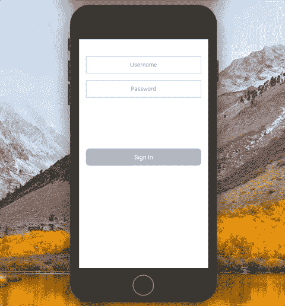
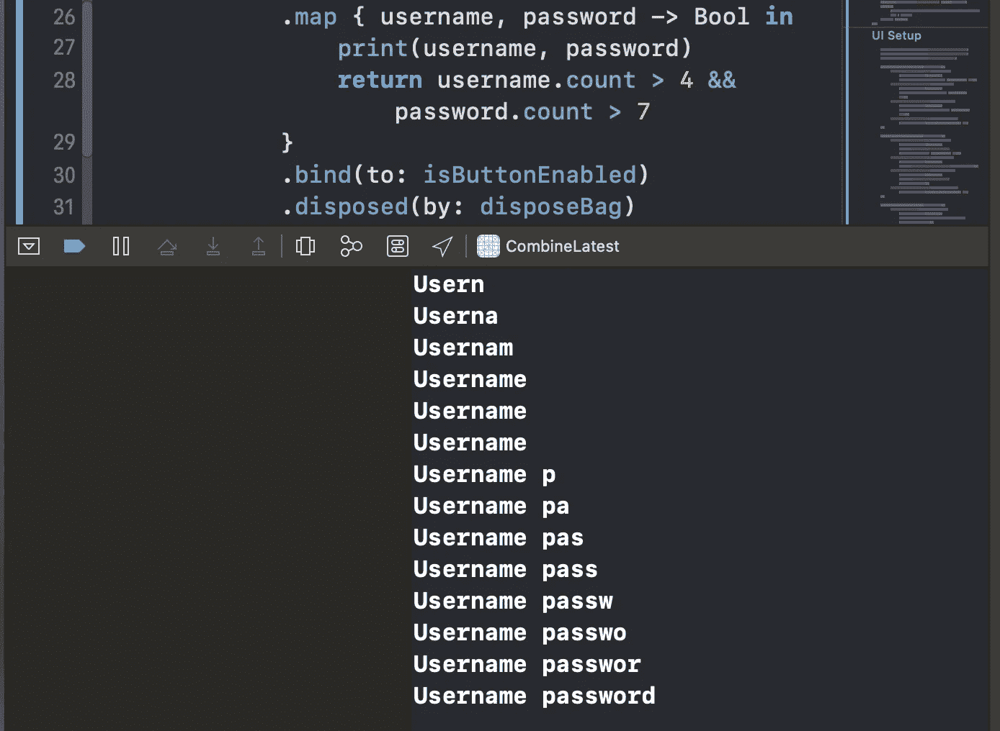

# RxSwift 中的“combineLatest”运算符是什么？

> 原文：<https://levelup.gitconnected.com/what-is-the-combinelatest-operator-in-rxswift-5a63c555e22b>

## 将几个可观察的序列合并成一个

[RKTKN](https://unsplash.com/@rktkn?utm_source=medium&utm_medium=referral) 在 [Unsplash](https://unsplash.com?utm_source=medium&utm_medium=referral) 上拍照

在本文中，我们将快速了解一个非常有用的 RxSwift 操作符— `combineLatest`。它允许我们将几个可观察的序列合并成一个可观察的元组序列，只要任何可观察的序列产生一个元素。

例如，当我们想要验证用户名和密码`UITextField`中的用户输入，并在输入有效时启用“登录”按钮时，我们可以使用它。这正是我们在本文中要达到的目标:

# 我们开始吧

我们从一个基本的`UIViewController`开始，它包含两个`UITextField`和一个`UIButton`:

现在让我们添加两个属性:

*   A `DisposeBag`存储我们未来的订阅
*   一个包含`Bool`值的`BehaviorRelay`,表示“签到”按钮是否启用

下面是我们的文件现在的样子:

现在我们的任务是观察用户名和密码`UITextField`的输入，并相应地更改`isButtonEnabled`属性的值。让我们使用`combineLatest`操作符来组合两个观察值:

正如我们所见，在`viewDidLoad()`方法中，我们订阅了每个文本字段的两个`text`观察值。然后，在`.map`操作符中，我们获得每个文本字段的最新值，并返回一个`Bool`值。*如果用户名超过 4 个字符，密码超过 7 个字符*，则返回`true`。最后，我们使用`.bind(to:)`操作符将得到的`Bool`值绑定到`isButtonEnabled`属性。

让我们在`.map`操作符中添加`print()`语句，看看我们是如何接收用户名和密码值的:

现在，当我们在任一文本字段中输入内容时，我们会看到控制台中打印出用户名和密码`String`的值:

现在需要做的就是调整按钮的 UI 来反映它的状态:

如果按钮被激活，我们将`backgroundColor`设置为`.systemOrange`并将`isEnabled`设置为`true`。否则，颜色设置为`.lightGray`，按钮不允许接收触摸事件。

这就是我们实现目标所需的全部内容——我们已经成功地实现了对用户输入的验证，并将结果`Bool`值绑定到了`UIButton`:

# 资源

GitHub 上提供了源代码:

 [## zafarivaev/rx swift-CombineLatest

### 展示 RxSwift 中 combineLatest 操作符的使用的简单项目。为中型教程编写的 GitHub 是…

github.com](https://github.com/zafarivaev/RxSwift-CombineLatest) 

# 包扎

对更多 RxSwift 文章感兴趣？那么你可能会发现这些很有帮助:

*   [用 RxSwift 替换委托](https://medium.com/better-programming/replace-delegation-with-rxswift-32ad18d75140)
*   [在 Swift 5 中实施反应式 MVVM 架构](https://medium.com/better-programming/mvvm-in-swift-infinite-scrolling-and-image-loading-d47780b06e23)
*   [如何用 RxDataSources 实现 UITableView 和 UICollectionView】](https://medium.com/better-programming/how-to-implement-uitableview-and-uicollectionview-with-rxdatasources-1afcd68729bf)
*   [如何在 RxSwift 中创建定时器](https://medium.com/better-programming/how-to-create-a-timer-in-rxswift-578bf8712678)
*   [RxSwift 单元测试在 2 分钟内说明](https://medium.com/better-programming/rxswift-unit-testing-explained-in-3-minutes-c024b7a26d)

感谢阅读！