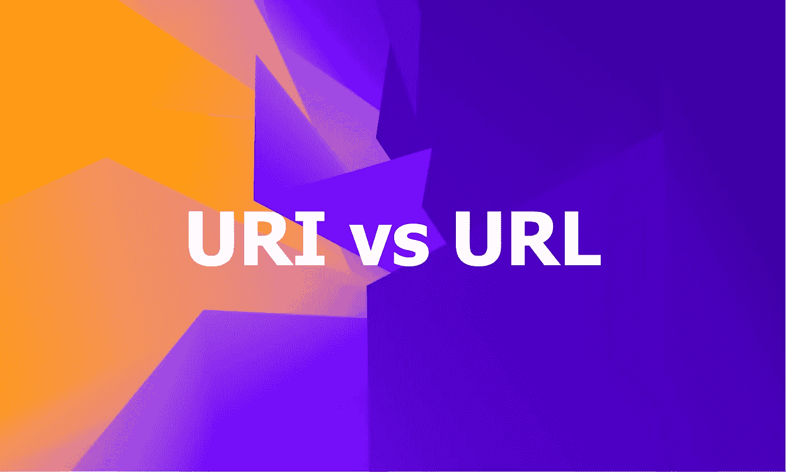
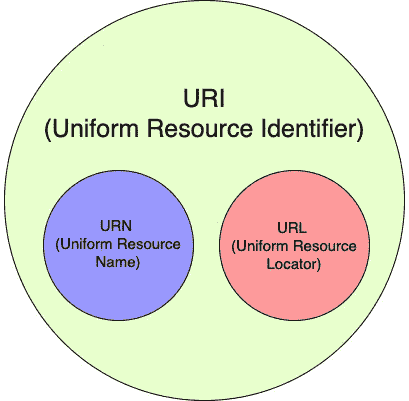
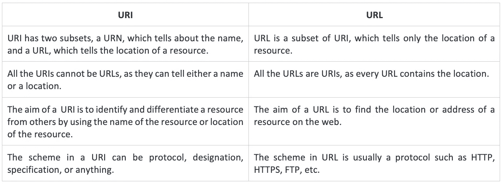

# URI、URL 和 URN 之间有什么区别

> 原文：<https://levelup.gitconnected.com/what-is-the-difference-between-a-uri-url-and-urn-6c6ea3b49bf0>

## 理解这三个网络概念的基础

图片由作者编辑|原图由[法库里安设计](https://unsplash.com/@fakurian?utm_source=unsplash&utm_medium=referral&utm_content=creditCopyText)在 [Unsplash](https://unsplash.com/s/photos/graphic?utm_source=unsplash&utm_medium=referral&utm_content=creditCopyText) 上

作为开发人员，您已经听说过 URL。你可能也遇到过 URI 和骨灰盒这两个术语。术语 URL 和 URI 经常互换使用。在这里，我们将根据规范( [RFC3986](https://www.ietf.org/rfc/rfc3986.txt) 、 [RFC1738](https://www.ietf.org/rfc/rfc1738.txt) 和 [RFC2141](https://www.ietf.org/rfc/rfc2141.txt) )了解这些术语是什么。我们还将了解它们之间的区别。

# 什么是 URI？

**URI(统一资源标识符)**是一个字符串标识符，它使用位置、名称或两者来标识互联网上的资源。

URI 进一步具有两个子集，一个 **URL(统一资源定位符)**和一个 **URN(统一资源号)**。

URI、URL 和骨灰盒(作者创建的图像)之间的关系

一个 URI 由一个**方案、权限、路径、查询和片段组成。**一些最常用的 URI 方案有 **HTTP、HTTPS、ldap、telnet、FTP、file 等**。

## URI 语法

URI 语法(图片由作者创建)

方案:“URI”的第一个组成部分是一个方案，它指定了以什么方式或者使用什么特定的协议来访问一个资源。该方案通常包含一系列字符，这些字符可以是字母、数字、连字符(_)或加号(+)的组合，然后是冒号(:)。最流行的几个方案是 **HTTP** 、 **FTP** 、**文件**、**数据**。

**权威:**权威组件前面有两个斜杠(//)。它还包含三个子组件:

*   **用户信息:**这是一个可选的子组件，可能包含用户名和密码(可选)，由冒号(:)分隔，后跟@符号。
*   **主机:**此子组件是注册的域名或 IP 地址。IP 地址用方括号([])括起来。
*   **Port:** 这个可选的子组件是一个数字，它指向域或 IP 地址的端口号。

**Path:** 这个组件是一系列的段，表示由斜杠(/)分隔的资源的位置。URI 总是指定一个路径；但是，在某些情况下，指定的路径也可能为空。

**查询:**这是一个可选组件，在问号(？).它包含进一步标识资源的查询字符串。

**Fragment:** 这也是一个可选组件，位于散列符号(#)之前。它进一步指向所标识的资源中的不同部分。

## **URI 的一些例子**

1.  mailto:hey.john@website.com
2.  文件:website . com/pathtofile/intro . pdf
3.  [https://john@website.com:5052/path/to/page](https://john@website.com:5052/path/to/page)

# 什么是 URL？

一个 **URL(统一资源定位符)**指的是一个资源在互联网上的位置。它包含引用以及访问资源的方式。URL 总是指向一个唯一的资源。

URL 利用一种协议来访问资源，这种协议可以是 **HTTP、HTTPS、FTP 等。**

> **注意:**所有的 URL 都可以是 URIs，但是所有的 URIs 都不能是 URL，因为 URI 同时包含 URL 和 URN。

## URL 的语法

每个 URL 都遵循通用 URI 的语法。因此，URL 的语法也类似于 URI 的语法。

URL 语法(图片由作者创建)

**Scheme:**URL 的第一个组成部分是一个 Scheme，它表示浏览器用来请求资源的协议，后跟一个冒号(:)。网站最常用的协议是 **HTTP** 或 **HTTPS** 。

**Authority:**Authority 组件前面有两个斜杠(//)。该组件有两个子组件。

*   **主机:**这要么是一个**域名，要么是一个 IP 地址。**域名可以是任何东西，像**example.com 资源的注册域名。**
*   **Port:** 这是一个可选的子组件，指向端口号以访问 web 服务器上的资源。

**路径:**路径表示 web 服务器上资源的完整路径。

**查询字符串:**这是一个包含名称和值对的字符串，前面有一个**？**经过小路。它用于进一步分类资源的位置。一个例子是“**？key 1 = value 1&key 2 = value 2****。**

**片段:**这也是一个可选组件，前面有一个散列符号(#)。这指向该资源中更小的组件，比如资源的不同部分。

## URL 的一些示例:

1.  http://website.com/path/to/page
2.  https://website.com/path/here?name=html#head
3.  http://website.com:5500/path/here

# 什么是骨灰盒？

一个 **URN(统一资源名)**是 URI 的子集。它指的是互联网上的一种资源，但实际上没有指明它的位置或存在。

## URN 的语法:

URN 语法(由作者创建的图像)

**Scheme:** 主方案( **urn:** )不区分大小写。

**NID:** 这个组件是名称空间标识符，可以包括字母、数字和连字符(-)，后跟一个冒号(:)。

**NSS:** 这个组件是特定于名称空间的字符串，它的解释依赖于指定的名称空间。NSS 可能包含 ASCII 字母、数字、许多标点符号和特殊字符。

## 骨灰盒的一些例子:

1.  urn:网站:语言:html:head
2.  urn:isan:0000-0000-2 CEA-0000-1-0000-0000-Y
3.  骨灰盒:国际刊号:0167-6423

## URI 和 URL 的主要区别

URI 和 URL 的区别(图片由作者创建)

这些是 URI、URL 和 URN 的标准定义，以及它们之间的区别。我希望你也发现这些概念是有帮助的。

感谢阅读，祝学习愉快！