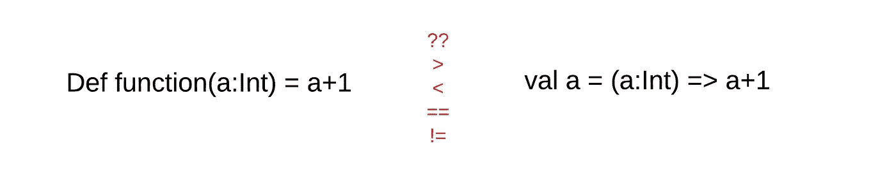

# Scala 中函数文字和值的区别是什么

> 原文：<https://levelup.gitconnected.com/what-is-the-difference-between-function-literal-and-values-in-scala-7cced2e3867c>



几周前，我在尝试使用部分应用的函数时遇到了一个 bug。

部分应用的函数是部分创建的函数，留下一些未应用的参数。当您调用该函数时，您可以声明一些参数，并且在需要时提供左边的参数。

以此为例:

```
def add(a: Int, b: Int): Int = a + b val addition = add _addition(1,2) // 3
```

然而，当我试图在函数文本中这样做时:

```
val add = (a:Int,b:Int) => a+b
// add: (Int, Int) => Int = $$Lambda$844/1630986748@1736c1e4val addition = add _
// addition: () => (Int, Int) => Int = $$Lambda$845/1518517336@4aab7195addition(1,2) // this doesn't workaddition()(1,2) // 3
```

这让我想知道函数字面量和函数值的区别。

在 Scala 的书中，函数文字和函数值的定义是在编译和运行时。

For 函数 literal(匿名函数或 val 函数)将被编译成 Function2 trait。通常，他们用 apply 方法捕捉它，该方法也作为 def 函数(value 函数)运行。

因此，如果你把一个 val 赋值为匿名函数，Scala 会把它转换成一个应用了函数的 singleton 对象。

```
final class anonFun extends scala.runtime.AbstractFunction2 {
    final def apply(a: Int, b:Int) = a + b
}val add = new anonFun();
```

当您将函数文字作为`a`赋给另一个变量时，该变量也将由具有另一个`apply`方法的另一个对象创建，使其成为一个高阶函数`() => () => something`。

但是 Scala 中的函数值(def function)是作为 Java 中的常规方法。因此，当您编写`def`并将其赋给另一个变量时，该变量将获得访问该类中其他成员变量的方法。因此，编译器不会创建一个`Function2`特征和一个应用方法。

它创建对象的实例方法。

```
package <empty> {
  object Main extends Object {
    def add(a: Int, b:Int): Int = a.+(b);
    def <init>(): Main.type = {
      Main.super.<init>();
      ()
    }
  }
}
```

# 主要外卖:

*   函数文字(val function)在运行时实例化为函数值时编译成类。*成为物体本身*。
*   如果将另一个变量作为部分应用的函数赋给一个函数文本，它会创建另一个对象文本，其中包含一个 apply 方法。因此，它创建了一个高阶函数。
*   如果使用函数值，def 函数会编译成 Java 中的方法。所以变成了一个对象的`instance method`。

# 喜欢这篇文章？

注册我的[简讯](https://edward-huang.com/subscribe/)每周获取此内容！

*原载于*[*https://edward-huang.com*](https://edward-huang.com/programming/tech/scala/software-development/2020/01/14/what-is-the-difference-between-function-literal-and-values-in-scala/)*。*