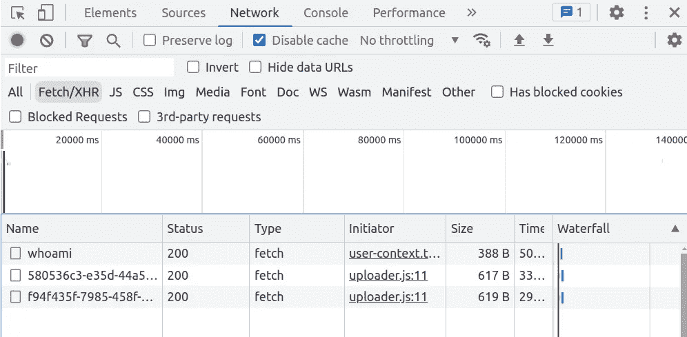
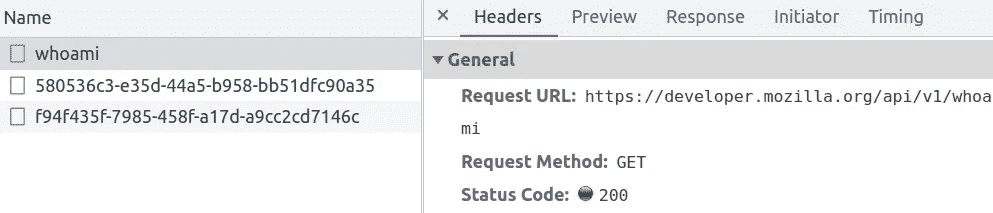

# HTTP 和 HTTPS 有什么区别

> 原文：<https://levelup.gitconnected.com/what-is-the-difference-between-http-vs-https-239fc204f478>

## 掌握 HTTP 和 HTTPS 的区别。了解如何在浏览器中查看 HTTP 请求

> TL；博士: **HTTPS 是 HTTP** 的安全版本

这些都很好，但是 HTTP 到底是什么呢？它是如何工作的？

由[奎诺·阿尔](https://unsplash.com/@quinoal?utm_source=medium&utm_medium=referral)在 [Unsplash](https://unsplash.com?utm_source=medium&utm_medium=referral) 上拍摄的照片

# 什么是 HTTP？

简单来说， **HTTP 是一个协议**。

事实上，缩写代表**超文本传输协议**。该协议控制客户端和服务器之间发生的请求和响应的结构和语言。

换句话说，这个协议定义了客户机和服务器之间的通信规则。

当您通过浏览器访问网站时，连接是通过 HTTP 建立的。该协议允许接收数据，包括文本、图像、视频、样式表、脚本等等。

根据 [MDN](https://developer.mozilla.org/en-US/docs/Web/HTTP/Overview) ，“ *HTTP 是一种客户端-服务器协议:请求由一个实体，即用户代理(或代表它的代理)发送。大多数情况下，用户代理是一个 Web 浏览器，但也可以是任何东西，例如，一个在 Web 上爬行以填充和维护搜索引擎索引的机器人。*

## HTTP 请求的示例

服务器和浏览器使用 HTTP 协议相互通信。“网络”选项卡显示浏览器和服务器如何通信。

如果您打开开发人员控制台并转到 Network 选项卡，对于 HTTP [MDN](https://developer.mozilla.org/en-US/docs/Web/HTTP/Overview) 页面，您会看到类似下面的内容。

开发人员控制台中的网络选项卡

确保选择 Fetch/XHR 并重新加载页面(在浏览器上按 F5 键或↻符号)，这样控制台将只显示少数事件。

点击 *whoami* 然后点击 Headers 选项卡，我们会看到 HTTP 请求。

开发人员控制台中的“标题”选项卡

浏览器使用 [GET](https://developer.mozilla.org/en-US/docs/Web/HTTP/Methods/GET) 方法向地址[https://developer.mozilla.org/api/v1/whoami](https://developer.mozilla.org/api/v1/whoami)发出请求，请求成功，因为服务器响应具有[状态代码](https://en.wikipedia.org/wiki/List_of_HTTP_status_codes) 200。

HTTP 支持其他类型请求的其他方法，但这不是本文的重点。

## HTTP 是如何工作的？

让我们按照上面的例子，或者你在互联网上搜索某个东西时通常会做的事情，做一些简化。

1.  **你在互联网上搜索某样东西** —客户端打开与服务器的连接。
2.  **当你等待的时候** —客户端发送一个 HTTP 消息，在 HTTP/2 之前，这个消息是人类可读的。简而言之，HTTP/2 允许每个连接同时处理多个请求。这不是 HTTPS。参见上面*标题/常规*选项卡中的请求 URL 或*标题/请求标题*选项卡中的请求标题。
3.  **等待** —客户端读取服务器发送的响应。您可以在*标题/响应标题*选项卡中看到这一部分。
4.  **最后，您得到您的结果**——连接被关闭，或者在必要时被重用。

# 什么是 HTTPS？

HTTPS 代表**超文本传输协议安全**。

通过**加密客户端和服务器**之间的通信，HTTPS 努力确保通信安全。

HTTPS 通过在 HTTP 协议和传输层之间添加一个安全层来扩展 HTTP。HTTPS 要求客户端和服务器通过握手协商来验证它们的身份。

# HTTPS 和 HTTP 的区别

显然，安全部分是一个关键的区别，但让我们列出安全层的一些后果。

*   与 HTTP 不同，HTTPS 支持客户端和服务器之间的安全加密通信
*   反过来，加密降低了有人窥探在客户端和服务器之间传输的数据的风险
*   不像 HTTP，HTTPS 可能会积极影响你的谷歌排名
*   与 HTTP 不同，某些行业可能需要 HTTPS，尤其是与银行和金融部门相关的行业
*   另一方面，HTTPS 可能会稍微慢一些，因为它需要加密和解密数据，而这对于 HTTP 来说是不必要的