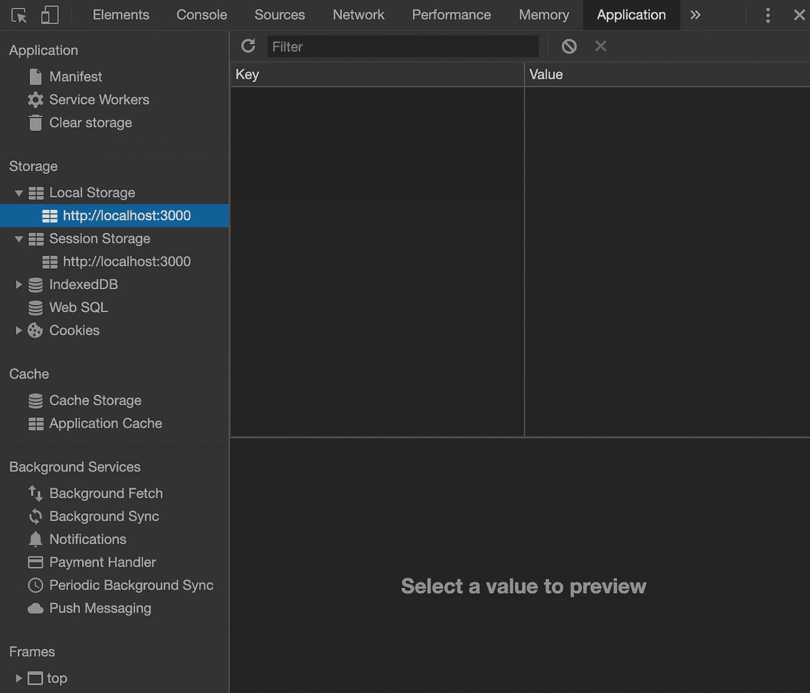
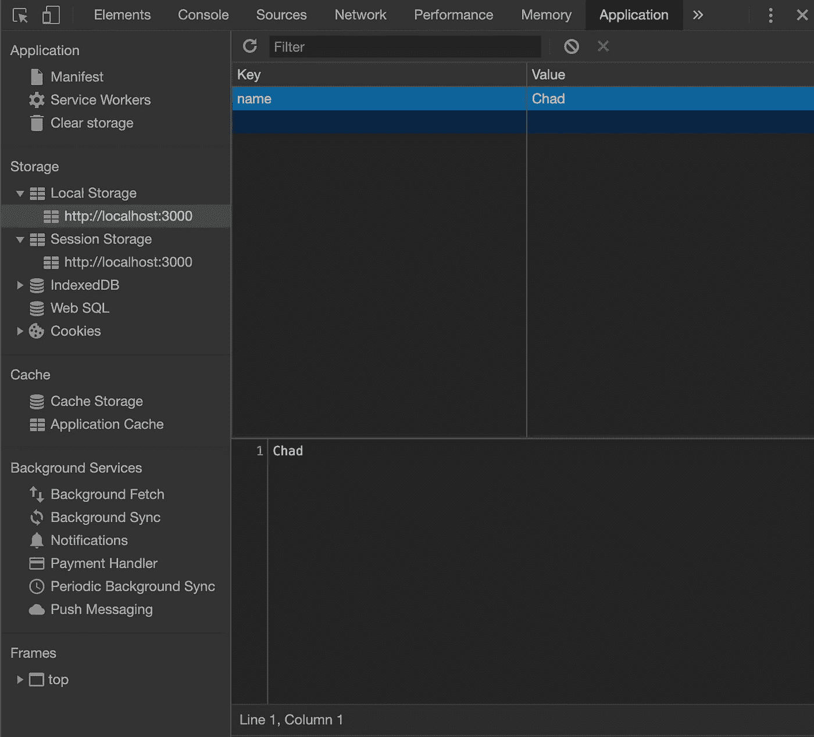

# 本地存储和会话存储有什么区别？

> 原文：<https://levelup.gitconnected.com/what-is-the-difference-between-local-storage-and-session-storage-1bd81d8375b4>

## 如何在浏览器中存储特定域的数据


照片由[斯蒂夫·约翰森](https://unsplash.com/@steve_j?utm_source=medium&utm_medium=referral)在 [Unsplash](https://unsplash.com?utm_source=medium&utm_medium=referral) 上拍摄

`localStorage`和`sessionStorage`都是浏览器使用 Web 存储 API 存储特定域的键/值对的方式。

在这篇文章中，我们将看看`localStorage`和`sessionStorage`的区别，并学习如何使用它们。在本文结束时，您应该对以下内容有所了解:

*   `localStorage`和`sessionStorage`有什么区别？
*   如何使用`localStorage`和`sessionStorage`？
*   如何在浏览器中查看`localStorage`和`sessionStorage`？

# 本地存储和会话存储有什么区别？

> “ [Web 存储 API](https://developer.mozilla.org/en-US/docs/Web/API/Web_Storage_API) 的`Storage`接口提供对特定域的会话或本地存储的访问。例如，它允许添加、修改或删除存储的数据项

`localStorage`和`sessionStorage`差不多。两者都有以下规则:

*   它们存储特定域的键/值对。
*   存储的值只能是字符串。
*   他们的存储空间限制在 5MB 左右。

`localStorage`和`sessionStorage`的一个主要区别是有效期。

*   `localStorage`跨浏览器会话保存存储。因此，即使在新标签页中打开域，或者关闭并重新打开浏览器，也可以节省存储空间。没有过期。
*   当页面会话结束时,`sessionStorage`被清除。只要选项卡或浏览器打开，页面会话就会持续。因此，当您打开新选项卡或新窗口时，会创建新会话和新存储。

# 如何使用本地存储和会话存储？

您可以使用`window`对象访问`localStorage`或`sessionStorage`。

```
myStorage = window.localStorage;myStorage = window.sessionStorage;
```

对于本地存储和会话存储，您可以使用适当的方法设置、获取、移除和清除项目。

## 一组

`setItem()`方法接受一个键名和值作为参数。然后它会将键/值对添加到`Storage`对象中。如果该项已经存在，它将更新该项的值。

```
window.localStorage.setItem(keyName, keyValue);window.sessionStorage.setItem(keyName, keyValue);
```

## 得到

`getItem()`方法接受一个键名作为参数。它将返回该项的值。如果这个键在`Storage`对象中不存在，它将返回`null`。

```
var aValue = window.localStorage.getItem(keyName);var aValue = window.sessionStorage.getItem(keyName);
```

## 去除

`removeItem()`方法接受一个键名作为参数。它将从`Storage`对象中移除该键(如果存在的话)。如果没有与该键相关联的项目，它将什么也不做。

```
window.localStorage.removeItem(keyName);window.sessionStorage.removeItem(keyName);
```

## 清楚的

`clear()`方法将清除存储在`Storage`对象中的所有键。

```
window.localStorage.clear();window.sessionStorage.clear();
```

# 如何在浏览器中查看本地存储和会话存储？

现在我们知道如何使用`localStorage`和`sessionStorage`，让我们在浏览器中检查一下。对于这个例子，我使用的是 Mac 和谷歌 Chrome 浏览器。

首先，我创建了一个基本的应用程序，并在谷歌浏览器中打开它。

要检查`Storage`，右击页面并选择*检查*打开 Chrome 开发工具。或者，你可以使用快捷键， *Cmd + Opt + J* 。

从那里，选择*应用*，您将看到*存储*部分。该部分包含*本地存储*和*会话存储*选项卡。如果我们打开这两个选项卡，我们可以看到页面，[*http://localhost:3000*](http://localhost:3000)*。*在该选项卡中，我们可以看到键/值对表。目前，应该没有显示任何内容。



在我的应用程序中，我可以使用`setItem()`方法在本地存储中设置一个键/值对。

```
window.localStorage.setItem('name', 'Chad');
```

保存后，我将看到存储在`localStorage`中的键/值对。你也可以用`sessionStorage`做同样的事情。



然后，我们可以使用`getItem()`方法来检索名称的值。

```
window.localStorage.getItem('name');
```

这将返回值`"Chad"`。

# 结论

感谢阅读！我希望这篇文章对你了解`localStorage`和`sessionStorage`有所帮助。当您需要在浏览器中存储一些数据时，使用 Web 存储 API 很容易使用并且很有帮助。

**更多阅读**

[](https://blog.devgenius.io/how-to-use-the-set-object-in-javascript-745b10a64e16) [## 如何在 JavaScript 中使用 Set 对象

### 设置的对象是什么，如何使用？

blog.devgenius.io](https://blog.devgenius.io/how-to-use-the-set-object-in-javascript-745b10a64e16)