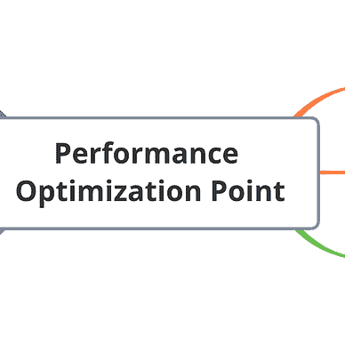
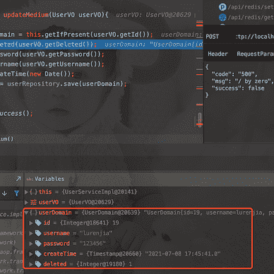

# Java 反射和 Java New 的效率有什么区别

> 原文：<https://levelup.gitconnected.com/what-is-the-difference-between-the-efficiency-of-java-reflection-and-java-new-1169cb5fe896>

在 [Unsplash](https://unsplash.com?utm_source=medium&utm_medium=referral) 上由 [Clément Hélardot](https://unsplash.com/@clemhlrdt?utm_source=medium&utm_medium=referral) 拍摄的照片

在我们的日常使用中，使用最多的是 Java new，但是有些框架经常使用 Java 反射来实现灵活性，但是它们的直接效率有什么区别呢？

那么，你有没有想过，我们什么时候应该用 new 来创建对象，什么时候应该用 reflection 来创建对象？

两者之间创建对象的效率如何？

# 1.新对象与创建对象的反射之间的效率比较

最后，我们发现新建 100000000 个对象的效率和反射创建 100000000 个对象的效率相差很多倍。

**那么我们来探讨一下为什么会有这么大的差异。**

首先，一般来说，我们的 Java 代码需要在虚拟机上编译运行。

我们一般通过前端编辑器，比如`javac`，把 java 文件转换成类文件。

接下来，在程序执行期间，JIT，即时编译器，可以将字节码文件转换成计算机识别的机器代码文件。

另一种可能是通过 AOT 编译器将 java 文件直接编译成本机代码文件。其中 JIT 会在程序运行时对程序进行优化，但是反射是通过动态分析，所以可能无法执行 Java 虚拟机的一些优化。

**综上，有几个原因:**

`Method#invoke`方法将`encapsulate`和`unencapsulate`参数

*   需要检查方法是否可见
*   需要验证参数
*   反射方法很难内联
*   JIT 无法优化

# 2.反射和 new 的使用场景

**反射的一些使用场景**

*   Spring 帮助我们通过反射实例化对象，并将它们放入 IOC 容器中
*   使用 JDBC 链接数据库时加载数据库驱动程序`Class.forName()`
*   反编译等逆向代码
*   使用反射，在泛型类型为 int 的`ArrayList`集合中存储一个类型为`String`的对象

**新物体与倒影的区别**

*   新对象不能访问它的私有属性，通过设置`setAccessible()`方法可以省略反射的属性。
*   `New`必须知道类名，而反射可以在不知道类型的情况下创建对象

# 最后

**感谢阅读**。期待您的关注，阅读更多高质量的文章。

[omgzui](https://medium.com/@omgzui?source=post_page-----1169cb5fe896--------------------------------)

## 更好的编程

[View list](https://medium.com/@omgzui/list/better-programing-9b4c9bb174aa?source=post_page-----1169cb5fe896--------------------------------)108 stories

[omgzui](https://medium.com/@omgzui?source=post_page-----1169cb5fe896--------------------------------)

## Java 语言(一种计算机语言，尤用于创建网站)

[View list](https://medium.com/@omgzui/list/java-e7c93884d94b?source=post_page-----1169cb5fe896--------------------------------)55 stories

[omgzui](https://medium.com/@omgzui?source=post_page-----1169cb5fe896--------------------------------)

## 新闻

[View list](https://medium.com/@omgzui/list/news-67ec0a972660?source=post_page-----1169cb5fe896--------------------------------)23 stories