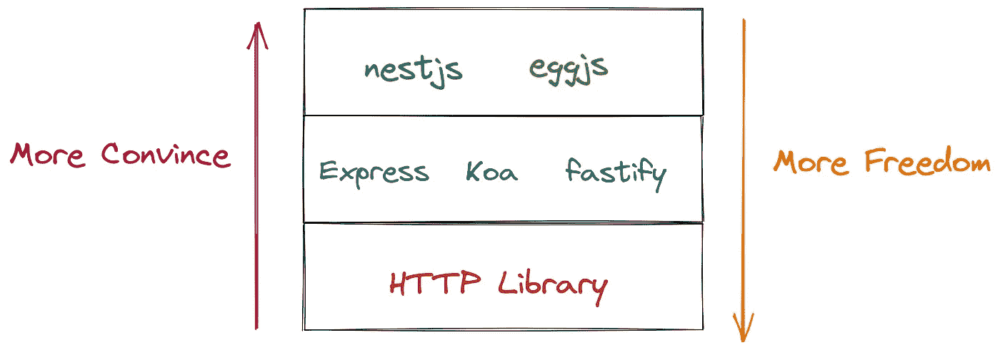
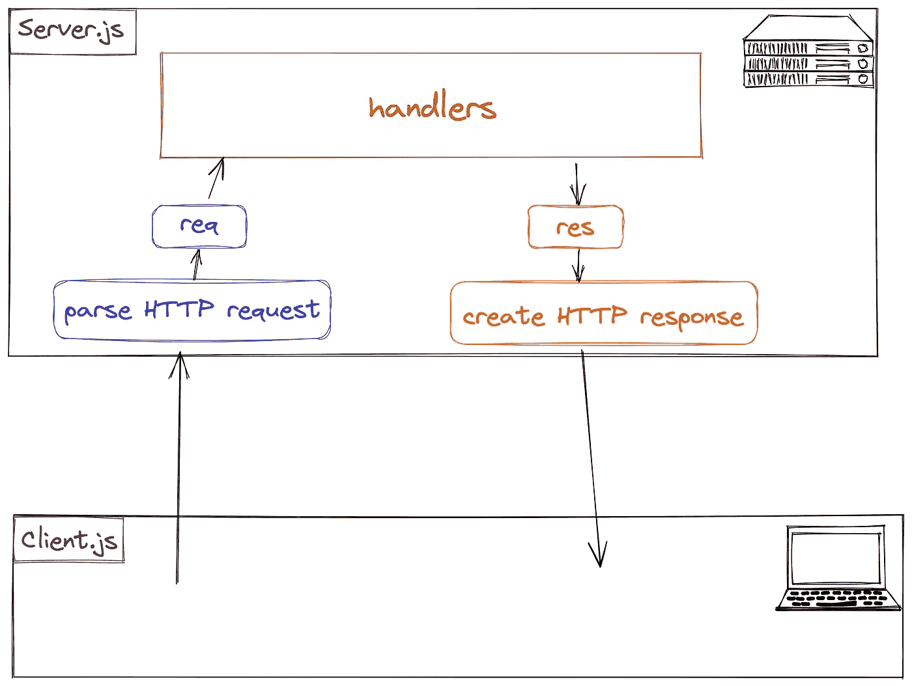
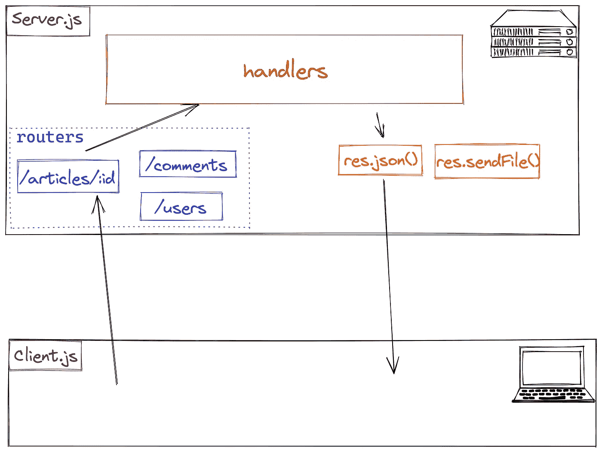
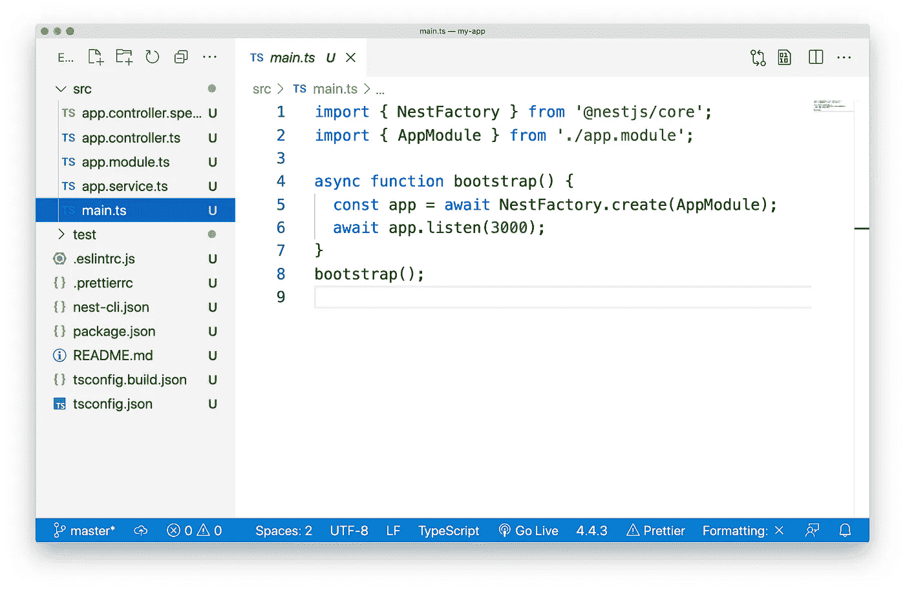
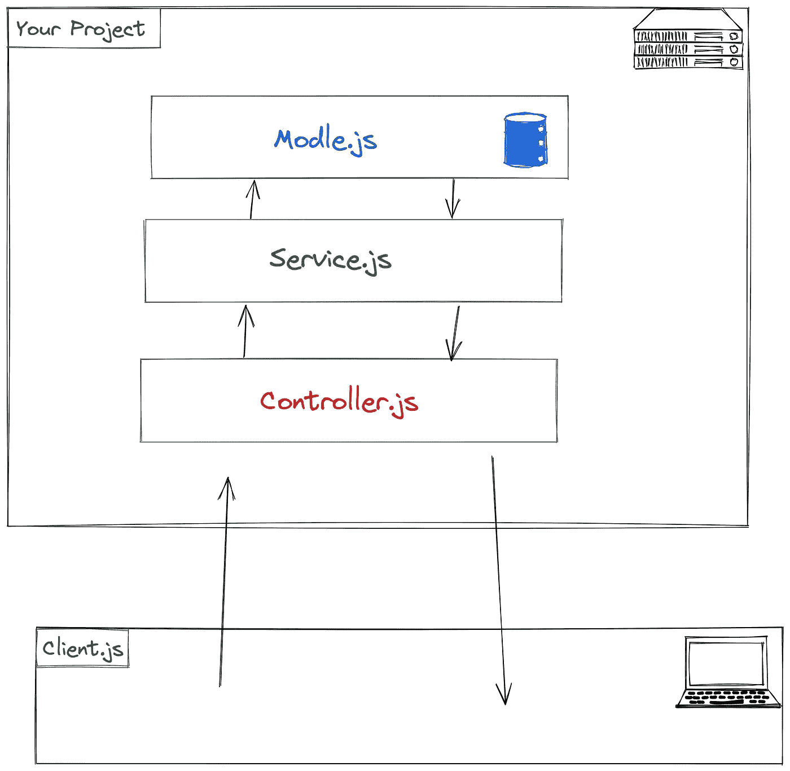
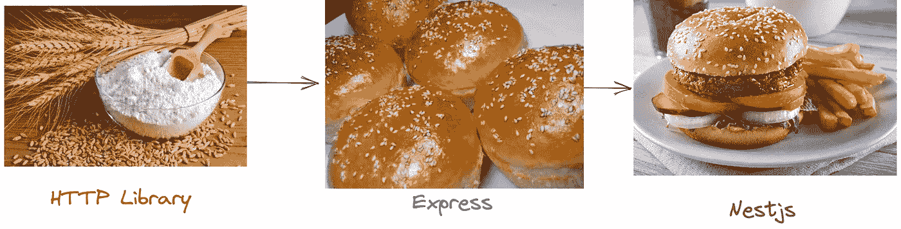

# 节点 HTTP 库，Express，和 Nestjs 有什么区别？

> 原文：<https://levelup.gitconnected.com/what-is-the-difference-between-the-node-http-library-express-and-nestjs-df6a11ca0e48>

## 理解节点框架的 3 个层次。

当我们谈到与节点相关的 web 框架时，您可能会想到 Express、Koa、Nestjs 和 Node 的 HTTP 模块。那么你知道这些框架的区别吗？让我们在文章中讨论这个问题。

简单概述:

# HTTP 图书馆

先说一下`http`模块。`http`模块是 Node 本机提供的一个库，用于处理 HTTP 请求和响应。它也是开发 web 服务器时最重要的模块。

`http`库的用法一般是这样的:

用图表表示，就是这样:

作为 Node 原生提供的模块，它的作用是解析 HTTP 请求，生成 HTTP 响应，所以它提供的 API 非常灵活。我们可以通过`req.url`获取请求的 URL，通过`req.method`获取请求消息的方法，通过`res.end`发送响应消息。

但是如果我们需要完成一些稍微复杂的需求，使用`http`模块就不是很方便了。

例如，我们的项目有这样的需求:

*   当用户访问`/artciles/2`时，则返回 id 为 2 的文章内容；
*   当用户访问`/users/325`时，返回 id 为 2 的用户的信息。

要直接使用`http`模块，可以这样写:

显然，这种写作方式臃肿低效。这是因为`http`模块只能算是一个库，而不是一个框架。这个时候我们需要 Express、Koa 等 web 框架。

# 表达

Express，Koa，Fastify 等。属于 Web 框架。它们基于 Node 的`http`模块，封装了一些开发 web 服务器时常用的功能，比如路由。

快递的用法一般是这样的:

在图表中:

有了 Express 提供的路由功能，我们再也不需要像以前一样写各种低效的`if`语句了。在处理 HTTP 响应时，也可以通过`res.json()`直接返回 JSON 文件，使用`res.sendFile()`返回二进制文件。Express framework 将自动为我们设置适当的内容类型，而不是手动设置内容类型。

但是像 Express 这样的轻量级框架仍然没有解决一些问题:

*   (在大型项目中，)如何设计项目的架构？
*   如何设计项目的目录结构？

这时候就需要 Nestjs、Eggjs 这样的重量级框架了。

# Nestjs

Nest 等框架要求我们使用固定的文件目录结构，使用特定的项目架构。它们本身不直接处理 HTTP 请求和响应，具体工作交给 Express 或 Fastify 等底层框架。

Nest 生成的文件目录结构如下:

Nest 项目的架构一般是这样的:

# 结论

`http`模块提供的特性非常原始，适合开发框架，但不适合直接用于普通 web 项目的开发。

Express 等框架提供了基于 HTTP 模块的合适的包，适合开发中小型项目。

Next 等框架都是基于 Express，Koa 等。做二次包装，适合开发比较复杂的项目。

最后，吃一个汉堡。

