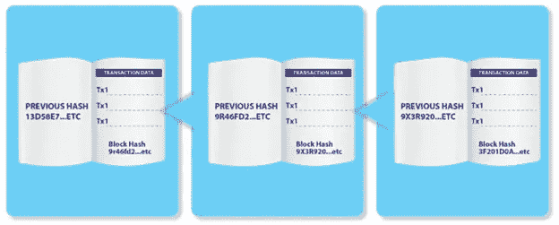
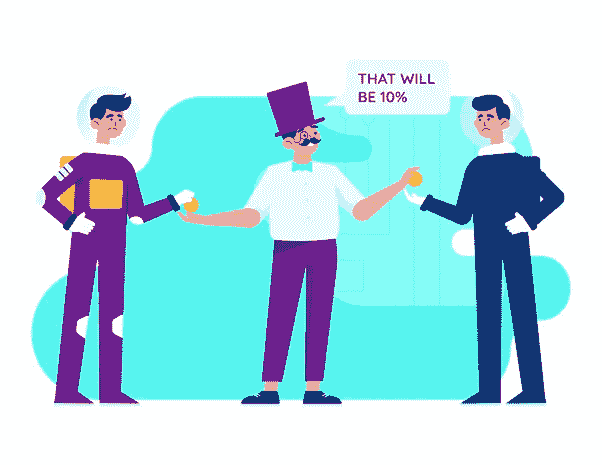
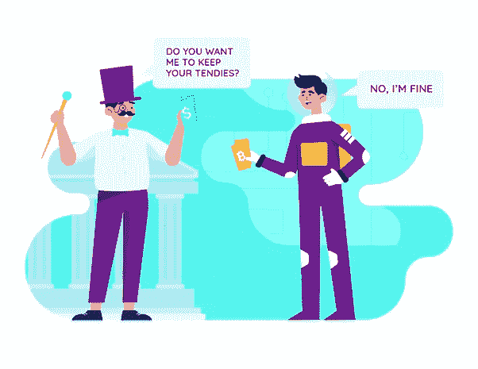
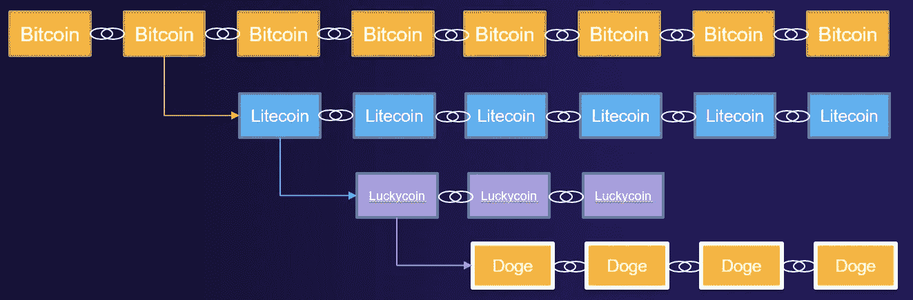
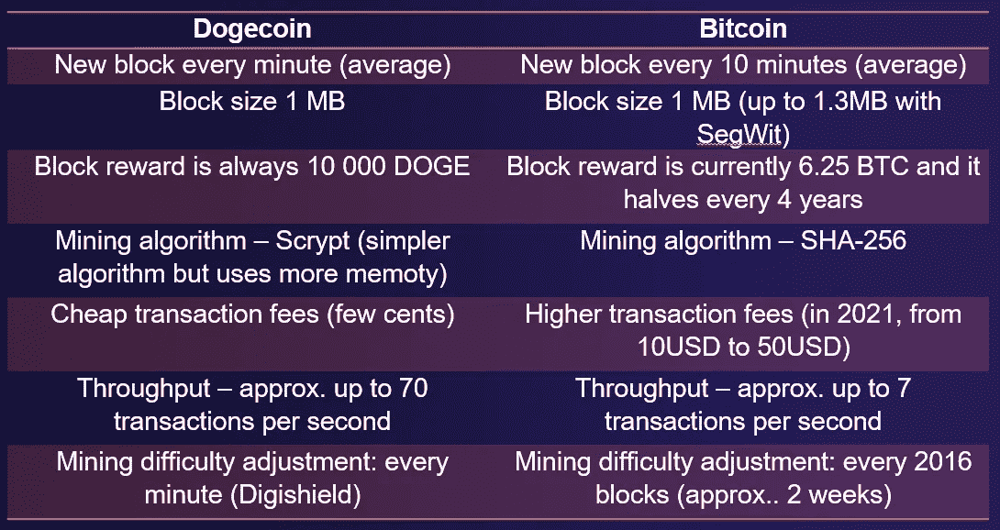

# 什么是 Dogecoin 区块链

> 原文：<https://levelup.gitconnected.com/what-is-the-dogecoin-blockchain-65de0d9d5ac3>

## Dogecoin —什么？

让我们揭开什么是 Dogecoin，什么是区块链的神秘面纱。Dogecoin 无疑是一个很大的乐趣！然而，如果我是 Doge，当有人叫我“笑话”时，我会感到被冒犯。900 亿美元对你来说是个笑话吗？在说 DOGE 是个笑话之前，你最好给我看看你的垃圾桶。

Dogecoin 的技术并不复杂。Dogecoin 就像比特币一样，是由一些很酷的技术组成的，这些技术一旦放在一起，就创造了拥有加密货币的可能性。这些技术是数字签名和加密、散列和共识机制。

Dogecoin 是一个区块链，作为一个分布式分类账，允许记录一些数据或交易，为可能互不了解的各方之间建立不信任关系创造了可能性。如何实现这一点？

作为一个分布式系统，Dogecoin 的网络将账本保存在一个点对点的网络中，网络中有数千台相连的计算机，每台计算机都可以保存账本的更新副本。网络中的这些计算机也可以称为节点，任何人都可以是节点。

分类帐在所有这些节点之间共享，这样每个节点和矿工都可以验证单个事务处理并审计区块链。

**魔法书比喻:**

区块链的 Dogecoin(实际上是区块链的大部分)，可以被看作是一本旧的纸质书，每一页(或每一块)都用一个代码与前一页连接起来。

*   试着想象一本旧的纸质书，其中每一页都用一个代码引用上一页。我们称之为代码哈希
*   这本书是区块链，每一页都是一块积木。页面上的每一行都是一个 Doge 事务
*   因为每个页面都使用这个哈希代码引用前一个页面，所以很容易检测到页面是否被删除或更改
*   页面引用上一页的方式使得检测和防止恶意活动变得容易
*   由于页面是堆叠在一起的，所以很难篡改旧页面

该分类账在许多对等节点(目前在区块链的 dogecoin 有近 1000 个节点)之间共享，每台机器都可以验证单个交易并宣布交易是否有效。

Dogecoin 使用 sha256 链接书的页面，即块。对于挖掘，它使用一个继承自 Litecoin 的不同算法:scrypt 算法。

## 那么我们为什么需要 Dogecoin 呢？

我们为什么需要 dogecoin？因为 dogecoin 太棒了！这是一种快速、廉价、分散、可靠的人与人之间的价值交换方式！但是让我们后退几步。

直到最近，人们总是需要一个集中的可信方来做生意。这一直是银行等金融机构的角色。他们跟踪客户的余额，并更新所有客户的分类账。银行还允许我们在个人和企业之间传递价值。每当我们用借记卡/信用卡购买商品时，每当我们进行银行转账、贷款或向不同国家的卖家汇款时，我们都需要有一家银行充当中间人。银行的作用极其重要，数百年来它一直是社会的支柱。

如果我告诉你，现在你可以以点对点的方式完成所有这些，不需要银行，不需要金融机构，交易费用更低，甚至更快，会怎么样？这将是一个惊人的提议，它可以解决传统金融系统的许多痛点:

*   中间人——通常是银行或汇款公司——收取转账费用。有时费用超过转账金额的 10%。而 Dogecoin 交易费用极低(通常只有几美分甚至更少)

*   大多数情况下，银行和金融机构都有交易的最小规模，这降低了小额交易和小额支付的可能性。Dogecoin 是一种神奇的小额支付加密货币。它通常用于在线给内容创建者小费，例如，我可以给某人发送价值 0.5 美分的 Dogecoin
*   在一些国家，跨境支付系统不透明。Dogecoin，因为它是一个公共分权的区块链，它更加透明
*   金融交易很慢，跨境电汇通常需要几天才能完成。Dogecoin 非常快。一笔交易通常不超过 1 分钟就能得到确认。
*   在传统的金融系统中，汇款人和收款人对交易几乎没有控制权。因为 Dogecoin 是对等的，发送者和接收者对事务有完全的控制权！
*   美元等法定货币的供应由中央银行控制。货币政策一直在增加货币供应(即印刷货币)，这造成了通货膨胀和货币贬值。与法定货币相比，Dogecoin 可以抵御通货膨胀。是的，你听得很清楚。尽管 dogecoin 具有通货膨胀性，即每天都会印刷新的 doge coin，但通货膨胀率目前接近 4 %,并将随着时间的推移而下降。

所以如你所见，Dogecoin 其实可以解决很多痛点。Dogecoin 是一个可以让人们减少对充当中间人的大机构的依赖的系统，可以解决比特币等其他加密货币存在的一些问题:昂贵和缓慢。

此刻，你可能还会问:“嘿，但当比特币由于高额交易费而无法实现这一目标时，Dogecoin 能否扩大规模，并真正成为一个支付系统？”

Dogecoin 每秒可以处理比比特币网络多 10 倍的交易。因此，dogecoin 比来自壁虎的比特币更适合用作支付系统。

目前，比特币交易费用与小额支付不兼容(即，没有人愿意支付 20 美元的费用来支付 5 美元的咖啡)，比特币就像一个核心层或信任层，允许以非常高的信任度结算更大的交易。

另一方面，Dogecoin 确实能以相当快的速度处理小额支付。

*   Dogecoin 被调节(通过数学算法)以保持固定和可预测的 dogecoin 供应(每分钟 10 000 个新 doge coin)
*   没有一个中央集权的当局控制着 Dogecoin。这也是一个无人领导的令人敬畏的社区
*   它消除了对中介的需求，从而降低了交易成本
*   透明且防篡改。它阻止了任何操纵或欺诈的可能性
*   将交易速度和交易终结时间从几天缩短到几分钟，无论地理位置如何，都有助于快速更新分类帐

Dogecoin(和其他加密货币)也有一些基本的特征和优势，这些特征和优势为 Dogecoin 带来了更多的价值和作为世界货币工作的能力，或者如 Elon Musk 所说，作为人民的密码。

*   分散化:Dogecoin 是完全分散化的。没有第三方控制区块链及其交易，没有中央管理和领导。只要交易符合区块链中编码的规则，网络就接受交易。例如，Alice 可以向 Bob 发送 10 个 DOGE，只要她拥有该 DOGE 的数量，并且她没有将它发送给任何其他人。除此之外，没有人能审查这项交易。
*   伪匿名:Dogecoin 是伪匿名的，这意味着用户的真实身份与他的 Dogecoin 身份无关。对于 Dogecoin 身份，我指的是 Dogecoin 地址或相应的公钥。
*   安全:Dogecoin 是一个非常安全的区块链。区块链的安全性由共识机制和非常难以破解的公钥加密(Dogecoin 案例中的 ECDSA)来确保
*   快速和全球性:Dogecoin 网络可以从世界上任何地方接入互联网，任何人都可以从任何地方进行交易。交易可以在 1 分钟甚至几秒钟内完成
*   Dogecoin 是无权限和公开的:任何人都可以是网络中的一个节点。任何人甚至可以使用个人笔记本电脑下载和审计整个区块链 Dogecoin，这带来了额外的信任优势。这称为“完整节点”。此外，任何人都可以是矿工(即验证交易)，任何人都可以看到/阅读区块链分类账，这意味着公众可以检查任何交易(这可以通过 DOGE explorer 来完成)

## 我们为什么需要 Dogecoin？

**因为 dogecoin 太牛逼了！**

嗯，因为我之前说过的所有原因，还有…

*   付给中间人的高额费用。目前，在一些国家，银行之间的跨境转账非常便宜。例如，在欧洲，SEPA 转账相当快且便宜。然而，世界上仍有数十亿人支付非常高的转账费用。尤其是那些最需要的人，是支付最高费用的人。MoneyGram、Western Union 和 UAE Exchange 等汇款公司经常向希望将部分储蓄汇回家的移民收取 10%以上的费用。我知道这些机构一直在发挥重要作用，他们确实需要收取费用，因为他们有运营成本和资金成本，但是…我们这些中介机构真的认为使用 dogecoin 可以以快速可靠的方式以低费用转移价值吗？
*   审查:集中处理你的资金的一方——银行或金融机构——必须遵守当地法规。很多时候，人们的资产被政府冻结，因为他们的政治观点，或者因为他们没有遵守合法的盗窃(也称为税收)，或者因为他们没有遵守一些任意的规则。Dogecoin 根本不在乎你是谁。

# Dogecoin 技术

**Dogecoin vs 比特币**

与比特币相比，Dogecoin 有几个显著的区别。

正如我们之前讨论过的，dogecoin 是一个叉或幸运币，是莱特币的一个叉，是比特币的一个叉。最终，Dogecoin 获得了这些区块链的一些特征。

首先，矿工可以更快更容易地完成数学方程，从而完成并记录交易，这使得 Dogecoin 在处理支付方面更加高效。

在比特币区块链上，矿工需要 10 分钟来验证新区块的交易，而在区块链的比特币上只需要 1 分钟。

另一个显著的区别是对可以创建的 Dogecoins 的数量没有任何生命周期限制。有一个 2100 万比特币的终身上限，限制了可以创造的硬币的最大数量。每 4 年，比特币块奖励减半。例如，目前，块奖励是 6.25 BTC，2024 年比特币块奖励将是 3.125 BTC。然而，Dogecoin 块奖励总是每块 10 000，即每分钟铸造 10 000 只新 Doge。这使得 dogecoin 供应量相当高，并造成了一些通胀压力:目前约为 4%。这种通胀压力并不太大，随着时间的推移，它将从 4%下降到 3%再到 2%等等。虽然供应量受到控制，但仍会产生一些供应压力，这将降低硬币的稀缺性，并使其略微贬值。

Dogecoin 与比特币非常相似，但主要区别如下:

我们将在本课程的后面详细介绍 dogecoin 采矿。但是 Dogecoin 和 Litecoin 混合开采，所以它共享 Litecoin hashrate 的保护，因此与其他小区块链相比，它更难被依附。由于 Litecoin/Dogecoin 使用与比特币(SHA256)不同的哈希算法(Scrypt)，因此挖掘硬件不会传输，它只与其中一个兼容。

一些人以安全问题为由，认为 Dogecoin Core 在比特币 Core 的后面，因为许多安全更新应用于比特币，而不是 Dogecoin。Dogecoin 中还没有实现安全修复和性能改进。Dogecoin 网络只有大约 800 个[公共节点](https://blockchair.com/dogecoin/nodes)，帮助 dogecoin 网络的最好方法之一就是在笔记本电脑上运行一个完整的节点。你可以在节点部分查看。

**🚀关注我，也查看我的🧱·区块链的书和课程:**

**🐶** [**有史以来第一次 Dogecoin 课程**](https://www.udemy.com/course/-dogecoin-course-the-first-complete-dogecoin-course/?referralCode=9416B1408224CE309DD8)

**👨‍🎓** [**金融科技、云和网络安全课程**](https://www.udemy.com/course/fintech-technologies-cloud-and-cybersecurity/?referralCode=F1D4EA005A2881735A36)

**📖****[**完整 NFTs 教程**](https://www.udemy.com/course/the-complete-nft-course-learn-everything-about-nfts/?referralCode=AAEE908D13D0E2276B19)**

****👨‍🎓** [**Unblockchain 课程**](https://www.udemy.com/course/blockchain-deep-dive-from-bitcoin-to-ethereum-to-crypto/?referralCode=B8463EE382E6D313304B) **—脑洞大开的区块链课程****

***声明:所表达的观点纯属个人观点，并不反映本文作者所属或相关的任何组织的观点或想法。这不是财务建议，我也不推荐任何东西。本文仅供教育之用。***