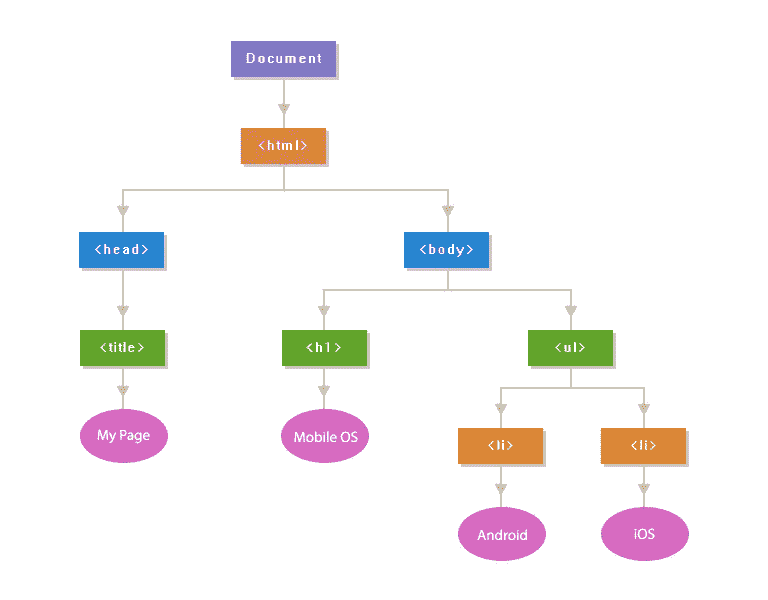

# 什么是 DOM？

> 原文：<https://levelup.gitconnected.com/what-is-the-dom-6522bf1d312b>


文档对象模型或“DOM”是网页的接口。它本质上是页面的 API，允许程序读取和操作页面的内容、结构和样式。

当一个网页被加载时，浏览器创建一个页面的 **D** 文档 **O** 对象 **M** 模型。

我们来分析一下。

# 一个网页是怎么搭建的？

浏览器从源 HTML 文档到在视口中显示样式化的交互式页面的方式被称为“关键呈现路径”。虽然这个过程可以分解成几个步骤，但这些步骤可以大致分为两个阶段。第一阶段涉及浏览器解析文档以确定最终将在页面上呈现什么，第二阶段涉及浏览器执行呈现。


第一阶段的结果是所谓的“渲染树”。呈现树是将在页面上呈现的 HTML 元素及其相关样式的表示。为了构建这棵树，浏览器需要两样东西:

1.  CSSOM，表示与元素相关联的样式
2.  DOM，元素的一种表示

# DOM 是如何创建的(它看起来像什么)？

DOM 是源 HTML 文档的基于对象的表示。正如我们将在下面看到的，它有一些不同之处，但本质上是试图将 HTML 文档的结构和内容转换成可以被各种程序使用的对象模型。

DOM 的对象结构由所谓的“节点树”来表示。之所以这样称呼它，是因为它可以被认为是一棵树，只有一个母干，而母干又分支成几个子干，每个子干又可能有叶子。在这种情况下，父“stem”是根`<html>`元素，子“branches”是嵌套元素，“leaves”是元素中的内容。

让我们以这个 HTML 文档为例:

```
<!doctype html>
<html lang="en">
 <head>
   <title>My first web page</title>
  </head>
 <body>
    <h1>Hello, world!</h1>
    <p>How are you?</p>
  </body>
</html>
```

该文档可以表示为以下节点树:



## 有了对象模型，JavaScript 获得了创建动态 HTML 所需的全部能力:

*   JavaScript 可以改变页面中的所有 HTML 元素
*   JavaScript 可以改变页面中的所有 HTML 属性
*   JavaScript 可以改变页面中所有的 CSS 样式
*   JavaScript 可以删除现有的 HTML 元素和属性
*   JavaScript 可以添加新的 HTML 元素和属性
*   JavaScript 可以对页面中所有现有的 HTML 事件做出反应
*   JavaScript 可以在页面中创建新的 HTML 事件

# 什么是 HTML DOM？

HTML DOM 是 HTML 的标准**对象**模型和**编程接口**。它定义了:

*   HTML 元素作为**对象**
*   所有 HTML 元素的**属性**
*   **方法**访问所有 HTML 元素
*   所有 HTML 元素的**事件**

换句话说:**HTML DOM 是如何获取、更改、添加或删除 HTML 元素的标准。**

# DOM 不是 DevTools 中的东西

这种差别稍微小一点，因为 DevTools 元素检查器提供了与浏览器中的 DOM 最接近的近似。然而，DevTools 检查器包含了 DOM 中没有的附加信息。

最好的例子就是 CSS 伪元素。使用`::before`和`::after`选择器创建的伪元素构成了 CSSOM 和渲染树的一部分，但从技术上讲并不是 DOM 的一部分。这是因为 DOM 是单独从源 HTML 文档构建的，不包括应用于元素的样式。

尽管伪元素不是 DOM 的一部分，但它们在我们的 devtools 元素检查器中。


这就是为什么伪元素不能被 Javascript 作为目标，因为它们不是 DOM 的一部分。


# 概述

DOM 是一个 HTML 文档的接口。浏览器使用它作为确定在视口中呈现什么的第一步，Javascript 程序使用它来修改页面的内容、结构或样式。

虽然与源 HTML 文档的其他形式相似，但 DOM 在许多方面有所不同:

*   它总是有效的 HTML
*   它是一个可以被 Javascript 修改的活模型
*   它不包括伪元素(如`::after`)
*   它确实包含隐藏元素(例如使用`display: none`)

## 使用 DOM:

*   JavaScript 可以改变页面中的所有 HTML 元素
*   JavaScript 可以改变页面中的所有 HTML 属性
*   JavaScript 可以改变页面中所有的 CSS 样式
*   JavaScript 可以删除现有的 HTML 元素和属性
*   JavaScript 可以添加新的 HTML 元素和属性
*   JavaScript 可以对页面中所有现有的 HTML 事件做出反应
*   JavaScript 可以在页面中创建新的 HTML 事件