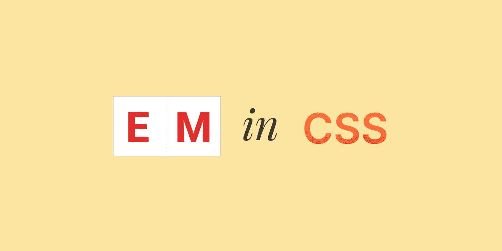
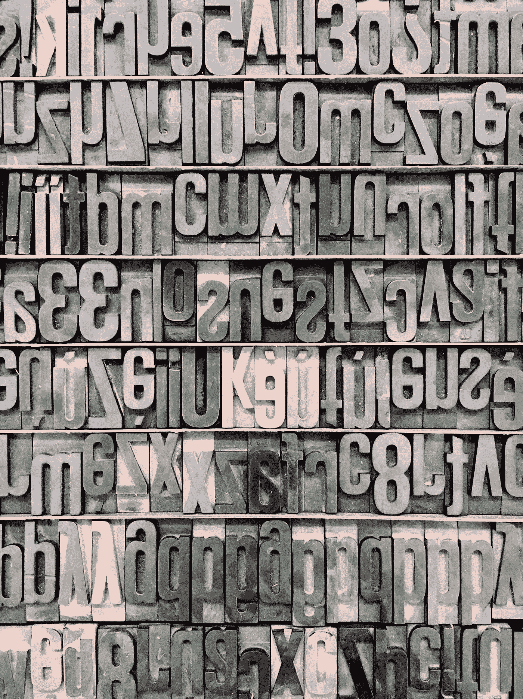
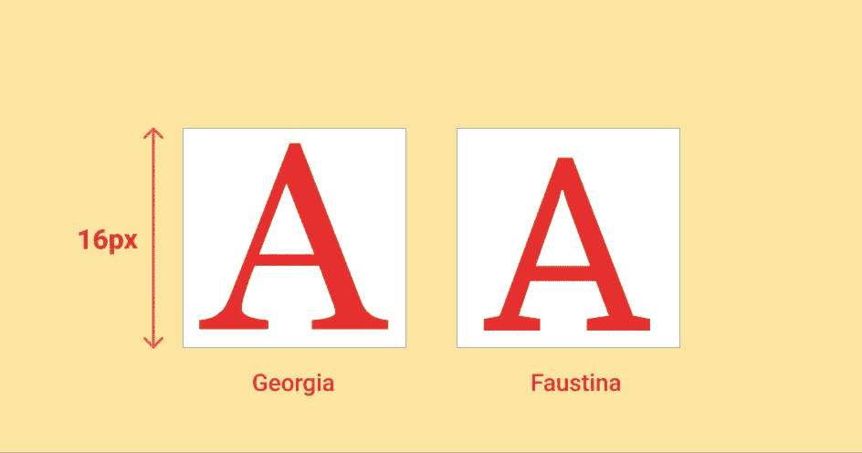
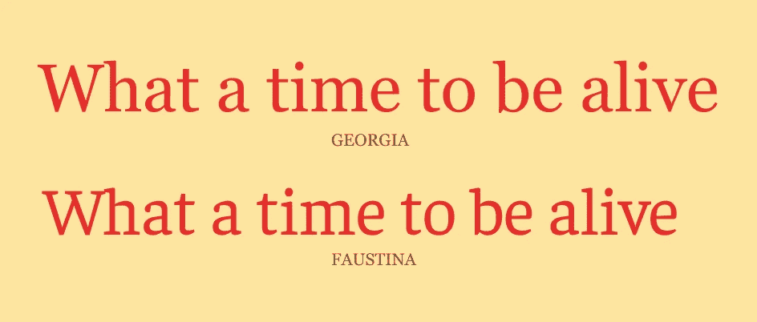

# CSS 中的 Em 单位是什么？

> 原文：<https://levelup.gitconnected.com/what-is-the-em-unit-in-css-3985d8e68060>

## 以及它与印刷术的关系。

CSS 中的 EM。作者插图。

作为一名 web 开发人员，很有可能在 CSS 中遇到 em 单元。

它是响应式设计中最常用的单元之一。

有些人说这令人困惑，有些人是忠实的粉丝，还有一些人对此根本不在乎。我发现 ems 很神秘，并决定继续探索。

探索理解“什么是环境管理，它们来自哪里？”

为了找到我的问题的答案，我决定回到过去。

# Em 的历史

em 的起源可以追溯到印刷术，当时印刷工艺使用木头和金属块在纸上创造字母。

每个字母周围都有一个预先定义好的金属或木头容器。

这个容器有一个固定的高度，不同的宽度取决于字体。

字体设计师决定了容器的尺寸。这个容器被称为 **Em(短暂的)盒子**。

em 盒里的每个字母。由[法比奥·桑塔尼耶洛·布鲁恩](https://unsplash.com/@fabiosbruun?utm_source=medium&utm_medium=referral)在 [Unsplash](https://unsplash.com?utm_source=medium&utm_medium=referral) 上拍摄的照片

好吧，但是这些和 em 有什么关系？

Em，我的朋友不过是 em 盒的高度。

因此，1em =盒的高度(无论是什么数字)。

酷毙了。那么这对我们浏览器中的数字字体意味着什么呢？

让我们转移到下一站，未来，去了解它。

# 数字时代的新兴市场

在这个现代时代，我们不再使用金属或木块作为数字字体，但 em 盒仍然存在。

数字字体的每个字母周围都有一个假想的 em 框。

em 框的高度由你的字体大小决定。

格鲁吉亚和福斯蒂娜设置在相同的字体大小。作者插图。

例如，在这里，我们有两种字体，格鲁吉亚和福斯蒂娜。

尽管像素大小相同，但您可能会注意到两种字体的字母 A 的尺寸有所不同。

这就是问题所在。

使用 ems 时设置的字体大小不是字体字符的高度，而是 em 框的高度。

这就是为什么即使设置为相同的字体大小，您也可能会看到单词大小的差异。

Georgia 和 Faustina 尽管字体大小相同，但显示的大小却不同。作者插图。

现在我们理解了 em 的含义，让我们看看它在 HTML 中的用法。

# 用于网络的 Em

在网络世界里，em 仍然是 em 盒的高度。

但是谁来决定网页字体的 em 框的高度呢？

em 框的高度被认为是相对的，它总是取决于从其直接父代继承的字体大小。

犯罪..什么？

因为代码比语言更有说服力，所以让我们来看几个代码示例。

## 案例 1:父元素有一个默认的字体大小

在上面的代码示例中，我们有一个包含如下元素的 DOM 树:

→ →

在这个树中，

元素是唯一一个指定字体大小等于 2em 的元素。

它的直接父元素没有明确设置的字体大小，元素也没有。

如果您还记得，我们之前说过 em 是一个相对单元，它依赖于从其直接父元素继承字体大小。

在这种情况下，没有为直接父级指定字体大小，至少没有明确指定。

那么现在会发生什么呢？

元素当前从元素继承了它的字体大小，后者又从浏览器的默认设置中获得它的字体大小。

通常情况下，浏览器默认为 16px(尽管您可以根据需要随时更改)。

使用默认值，

元素的字体大小

=直接父级的默认字体大小* 2

= 默认字体大小* 2

= 16px * 2

= 32px

回想起来，

元素最终使用了浏览器的默认字体大小设置。

让我们看看如果直接父元素指定了字体大小会发生什么。

## 情况 2:父元素有一个明确设置的字体大小

继续前面的代码示例，我们的 DOM 元素树仍然保持不变，

→ →

将和

元件分别设置为 2em。

您可能会注意到，包含文本的同一个

现在看起来更大了，尽管我们没有改变它的字体大小。相反，我们只是为它的父对象指定了一个。要知道为什么会这样，让我们看看下面的计算。元素的字体大小

=父字体大小* 2

= 字体大小* 2

= 字体大小* 2 * 2 ( 字体大小= 字体大小* 2)

= 16px(浏览器默认)* 4

= 64px

啊哈，

元素的字体大小现在是元素的四倍。

这就是为什么

元素的内容变得巨大。

这就是麻烦的开始。

# Em 的问题

正如您在前面的代码示例中看到的，文本大小是通过增加其父元素的字体大小来放大的。

您可以想象一个场景，其中我们有一个 DOM 元素树，树中的每个元素都有指定的字体大小。

尺寸效应不会花很长时间像滚雪球一样沿着树往下滚，导致最后一个元素的字体变得很大。

为了抵消这些影响，我们有了救星 rem。

# 快速眼动的诞生

Rem 是 **Root em 或****Root periodic**的缩写，是一个相对单位，它为根元素指定字体大小，根元素就是< html >元素。

如果元素本身没有明确指定字体大小，则考虑浏览器的默认字体大小。

DOM 树中的元素忽略其父元素的字体大小，根元素充当所有元素的接触点。

让我们来看一个代码示例，以便更清楚地理解。

在上面的代码示例中，DOM 树保持不变

→ →

将元件设置为 3 重，将元件设置为 1 重。

你能猜出现在

元素的字体大小吗？

考虑到浏览器的默认字体大小为 16px，

1 红色= 16px

所以，

元素的字体大小

=根元素的字体大小( ) * 2

= 32px

没错。即使

元素的直接父元素(即元素)指定了字体大小，仍然使用根元素的()字体大小来计算其值。

现在我们更好地了解了 em 和 rem，是时候知道何时使用哪一个了。

# Em 与 Rem —何时使用哪个单位

在使用 em 和 rem 时，没有一种通用的方法。这两种单位的使用取决于你的目标。

如果您只需要子元素随着父元素大小的变化而缩放，那么就使用 em。

如果希望子元素有一个固定的参考点来缩放并保持行为可预测，请使用 rem。

Em 和 rem 是不同的单位，但两者的共同点是，它们可以帮助您在设计中增加对不同分辨率的响应。

你可以试着用这两种设备做实验，然后决定哪一种最适合你。最终归结为个人喜好。

就这样了，伙计们。我希望这种对 em 和 rem 的新认识能帮助你更好地使用它们，并支持你构建响应式设计。

如果你有任何问题、意见或建议，欢迎在下面的评论中提出。

到那时，快乐的编码！

***参考文献:***

网络排版——杰森·圣玛丽亚

[Em 盒](http://designwithfontforge.com/en-US/The_EM_Square.html)

[Em 对 Rem](https://www.digitalocean.com/community/tutorials/css-rem-vs-em-units)