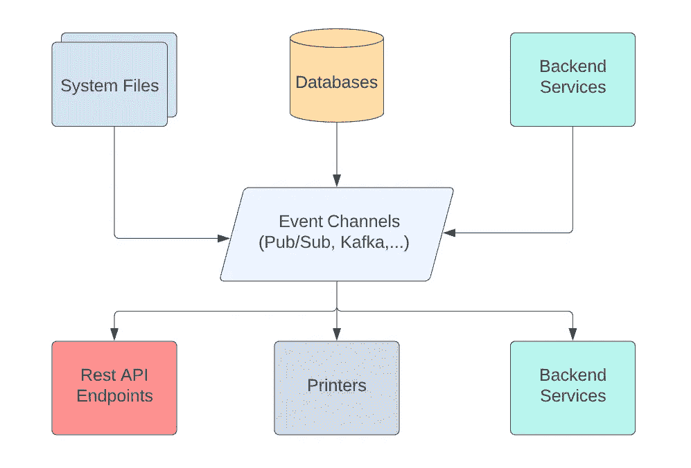
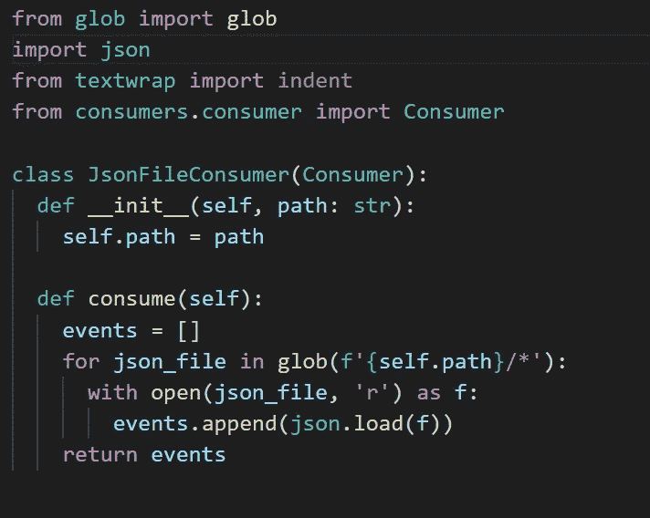
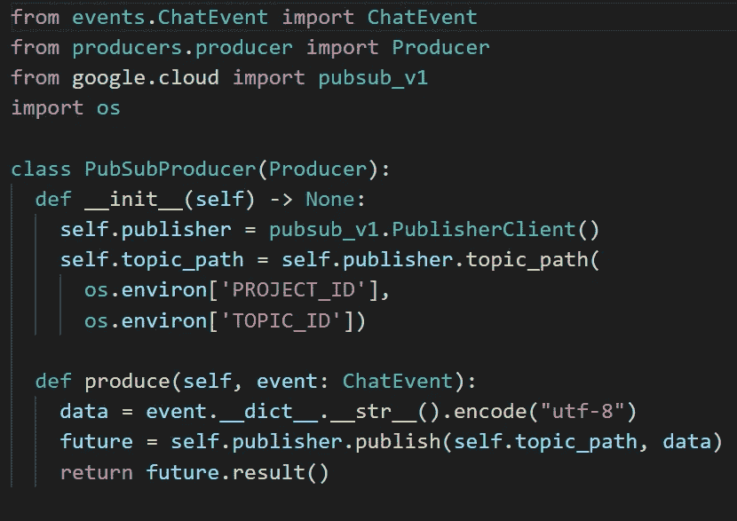
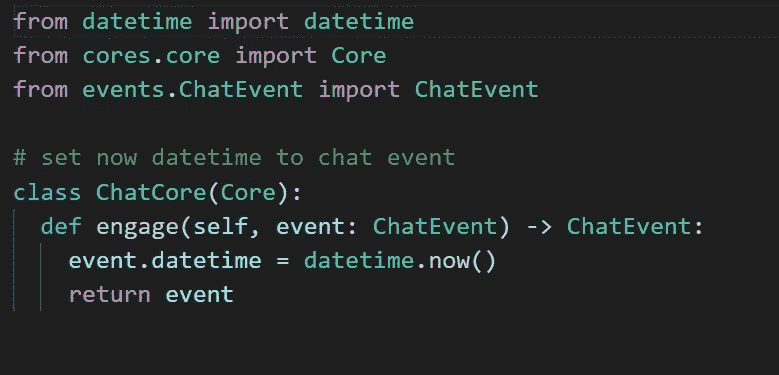
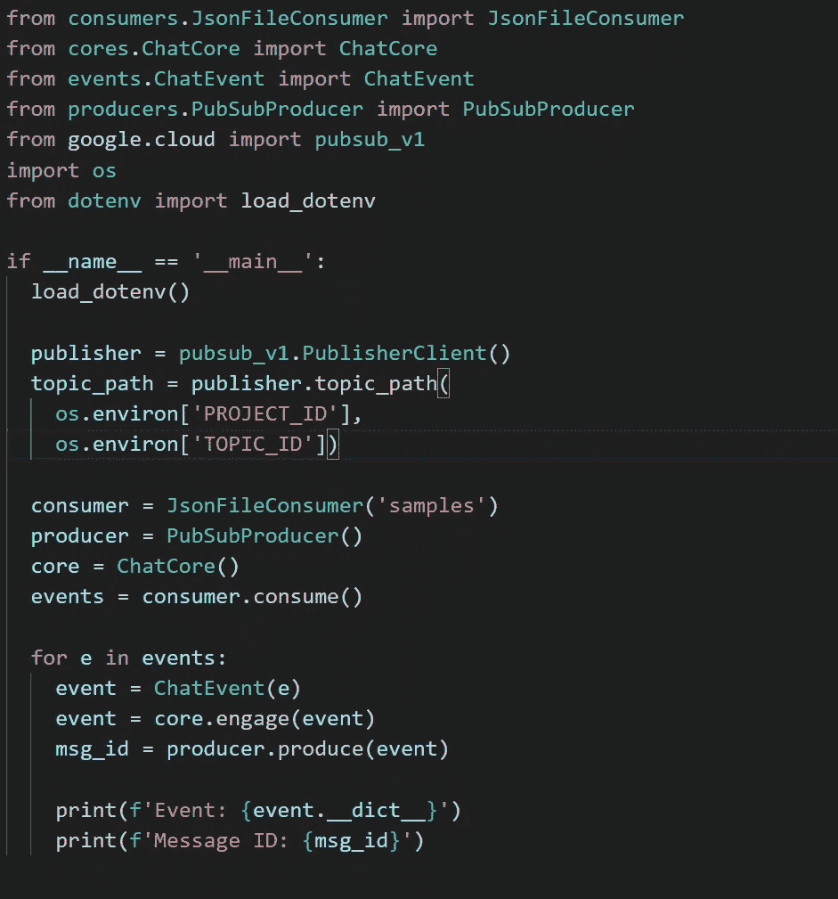
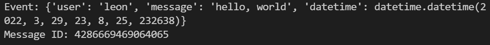
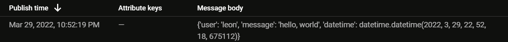

# 人们谈论的事件驱动架构是什么？

> 原文：<https://levelup.gitconnected.com/what-is-the-event-driven-architecture-that-people-are-talking-about-9f27843a56dc>

近年来，事件驱动架构一直是后端和系统开发人员的热门话题。我们没有设计一个输入和输出来自不同地方的服务，而是将 **I/O** 数据交付集中到通道中。我们称这些数据为事件。

在我看来，事件驱动系统是非常通用的。当它和 **GraphQL** 一起使用时，你就拥有了两个最强大的数据交付工具。它帮助我们不再考虑如何高效地传输数据，而是将精力集中在交付核心业务价值上。

今天，我将向大家展示如何用 Python 和 Google Pub/Sub 快速构建一个简单的事件驱动系统，这是我根据自己在公司工作的经验设计的。我保证你只需要 3 分钟就可以拥有一个几乎可以生产的系统。您也可以在以下网址找到我的源代码:

> [https://github.com/leon-to/event-driven-system](https://github.com/leon-to/event-driven-system)

通常，我的系统由 3 个主要组件组成:**消费者**、**生产者**和**核心**。我将逐一介绍它们，并详细解释它们的功能。

# 消费者

onsumer 类从事件通道中提取任何消息，或者从系统文件中生成事件。

# 生产者

P roducer 类将核心系统处理后的消息发布到事件通道，或者写入系统文件或打印机。

# 核心

矿石类别是项目中最重要的类别。他们负责商业逻辑。

# 综合

现在，我们将所有内容放在 main.py 中并运行它。

这是来自终端和 Google Pub/Sub 的结果。

末端的

发布/订阅:

恭喜你！您刚刚成功构建了您的第一个事件驱动系统。我希望你喜欢这个小练习。

总之，事件驱动系统是一个非常棒的架构。如果你喜欢我的内容，请不要忘记给我掌声，并关注我的下一篇文章。此外，请考虑通过以下方式支持我:

*   [我的全新 Patreon(简历/自由职业服务)](https://www.patreon.com/leonto101)
*   [中等会员](https://leon101.medium.com/membership)