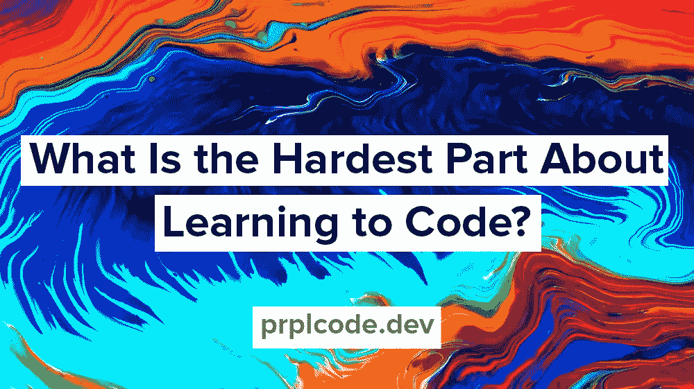

# 学习编码最难的部分是什么？

> 原文：<https://levelup.gitconnected.com/what-is-the-hardest-part-about-learning-to-code-37c549b61a74>

当我写第一段代码时，我不知道自己在做什么。就这样持续了好几年。对我来说，学习编码最困难的部分是知道在哪里可以找到可靠的、最新的和相关的信息。比如，我谷歌搜索什么？我对计算机及其工作原理有很好的了解，但软件对我来说仍然很神奇。

大约 15 年后的今天，气候已经不同了，有如此多令人惊奇的资源可以学习编程和软件工程。**在这篇文章中，我将分享我刚开始编程时希望拥有的 5 个资源**，然后我希望你能与我分享你的资源！

另外，请务必查看 [**为学生提供的四大免费编码资源**](https://medium.com/@prplcode/top-four-free-coding-resources-for-students-6cc7109f966a) ！

学习编码最难的部分是什么？

# 学习编码时的巨大资源

## 自由代码营

在 freeCodeCamp.org，你可以学到很多东西——完全免费！我是说，没有比这更好的了。他们的任务是:

> *[…]免费帮助人们学习编码。我们通过创建数以千计的视频、文章和交互式编码课程来实现这一目标——所有这些都免费提供给公众。我们在世界各地也有数千个 freeCodeCamp 学习小组。*
> 
> [*https://www.freecodecamp.org/*](https://www.freecodecamp.org/)

去年，他们提供了“超过 10 亿分钟的学习时间”。真的很神奇！⭐️

## 堆栈溢出

一个程序员最好的朋友。如果你不知道[栈溢出](https://stackoverflow.com/)，这里是程序员提问的地方，也是其他友好的程序员回答所说的问题并获得积分的地方。它从 2008 年就存在了，因为它已经存在了这么长时间，你心中的问题很可能已经得到了答案。所以大多数时候你甚至不需要问，你只需要谷歌一下。

你也知道栈溢出是管理其他站点的[栈交换](https://stackexchange.com/)网络的一部分，就像不同主题的栈溢出一样。例如 [Unix & Linux 栈交换](https://unix.stackexchange.com/)或者[软件工程栈交换](https://softwareengineering.stackexchange.com/)等等。

⚠️别忘了阅读[我如何问一个好问题？](https://stackoverflow.com/help/how-to-ask)发帖以最大化你获得答案的机会。

## 堆栈溢出聊天

几年前我发现了[栈溢出聊天](https://chat.stackoverflow.com/)。这是一个提出快速问题的好地方，这些问题在堆栈溢出时可能不值得提问。在 Stack Overflow 中问一个写得很好的问题需要时间，但是在聊天中你可以抛出一个简单的问题，如果你幸运的话，一些好心人会帮助你。对于不太符合堆栈溢出模型的后续问题，它也很棒。

有 **JavaScript** 、 **Python** 、 **Rust、**和我最喜欢的 **#等不同主题的房间！/bin/bash** (针对 bash 问题)。

## 重构。大师

这个网站是针对那些知道如何写代码，现在想学习如何写更好的*代码的人。在我们职业生涯的开始，我们都写过蹩脚的代码。例如，对于我的第一个网站，我使用了 LAMP stack ( **L** inux， **A** pache， **M** ySQL， **P** HP)，我被黑了*因为我不知道我在做什么🙃。[重构。Guru 可能不会教你如何避免被黑客攻击，但是它有大量的免费信息](https://refactoring.guru/)**

*   重构:它是什么，为什么你应该这么做
*   **干净代码:**是什么，怎么写
*   **代码气味:**如何检测并修复
*   设计模式:它们是什么，好处以及如何使用它们
*   …以及更多

## 蛋头

我过去订阅了 [Egghead.io](https://egghead.io/) ，我被他们内容的质量惊呆了。这是一个了解你最喜欢的框架或库的好地方，比如 **React** 、 **D3** 、 **GraphQL、**或 **Tailwind CSS** 。看看他们的[主题列表](https://egghead.io/topics)！

参与这个内容不是免费的，但是如果你有钱，我推荐你。他们确实有免费资源，而且质量也很高。

# 结论

这是我今天学习编码最喜欢的 5 个资源。每天都有人在教别人——而且是免费的！再次感谢你们每一个人，这太棒了💚。

现在我很好奇，**你觉得学习编码**最难的部分是什么？也许我或其他人能帮上忙😊

# 了解有关软件工程的更多信息

*   [软件工程师的 5 个好习惯](https://medium.com/@prplcode/5-good-habits-of-a-software-engineer-e8520b1894db)
*   [什么样的技能造就了一名伟大的软件工程师？](https://medium.com/@prplcode/what-skills-makes-a-great-software-engineer-25b97a1f50e5)

*在*[*Twitter*](https://twitter.com/prplcode)*，*[*LinkedIn*](https://linkedin.com/in/simeg)*，或* [*GitHub*](https://github.com/simeg) 上与我联系

*最初发布于*[*prplcode . dev*](https://prplcode.dev/)