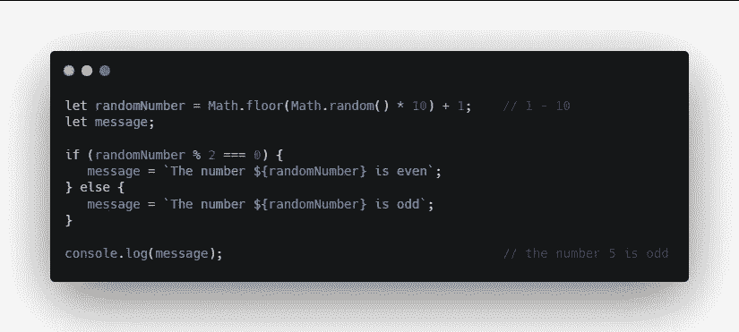
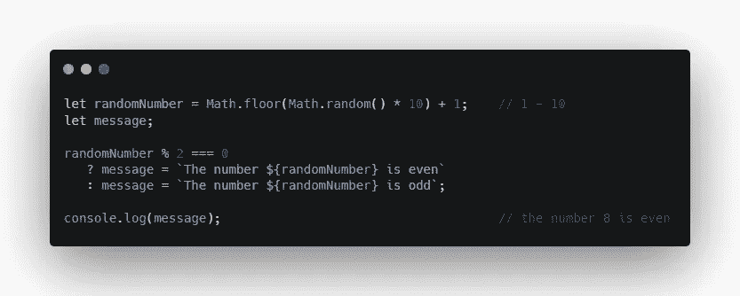
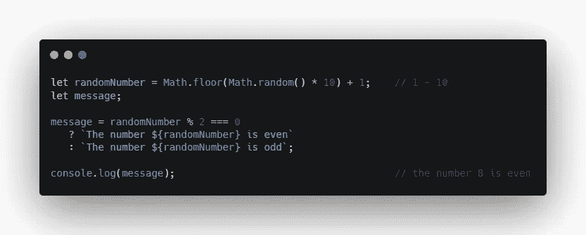
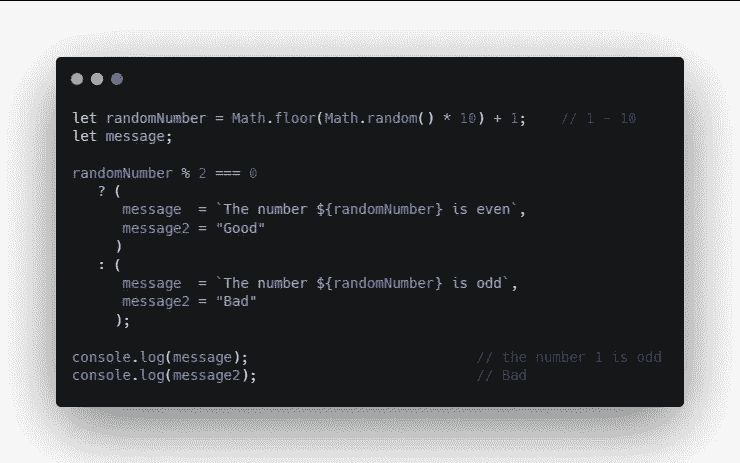
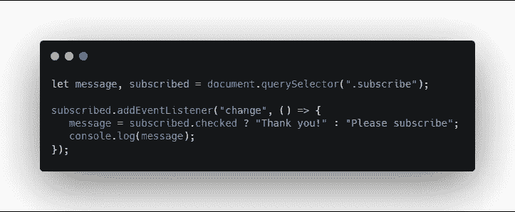

# 什么是 JavaScript 三元运算符

> 原文：<https://levelup.gitconnected.com/what-is-the-javascript-ternary-operator-c29fe57bf765>

## 知道 JavaScript 三元运算符吗？“是”:“不是”

照片由[埃文·丹尼斯](https://unsplash.com/@evan__bray?utm_source=medium&utm_medium=referral)在 [Unsplash](https://unsplash.com?utm_source=medium&utm_medium=referral) 拍摄

三元运算符是一个条件运算符。它基本上是一个简写的`**if-else**`语句。它测试一个条件，如果**为真**则返回一个值，如果**为假**则返回另一个值。

这里有一个 if 语句的例子。

如果语句

我们正在生成一个 1 到 10 之间的随机数。然后我们检查这个数是否能被 2 整除，余数是否为 0。如果是的话，那么这个数字就是偶数。如果不是，那就很奇怪了。

我们可以通过删除 if-else 语句将它变成一个三元运算符。

三元运算符

我们从条件开始，然后我们有一个问号`?`。问号后面的语句是如果条件为真会发生什么。

在那之后，我们有一个冒号`:`，冒号后面的语句是如果条件为假将会发生什么。

移动冗余消息

我们也可以通过将多余的消息移到开头来重写。

但是如果我们想要在条件为真或假的情况下执行多个操作呢？在 if 语句中非常简单。

三元运算符中的多重运算

在三元运算符中，我们可以做同样的事情，将每组运算用括号括起来，并用逗号分隔每个运算。

这是最后一个更真实的例子。

三元运算符的另一个例子

这里我们有一个 subscribe 复选框，我们正在监听“change”事件。关于更改，我们将根据复选框是否被选中来设置消息。

编码快乐！