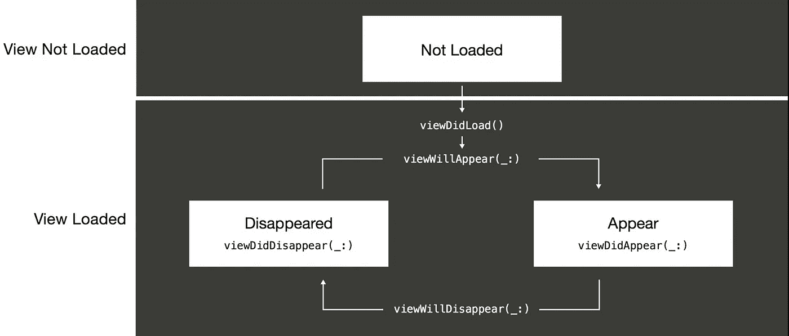
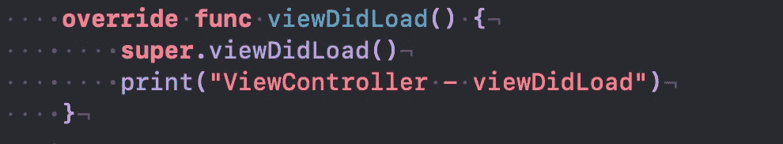
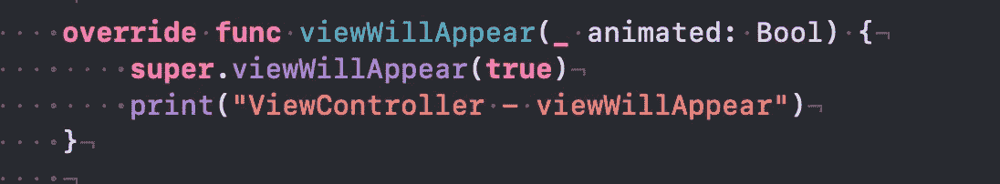
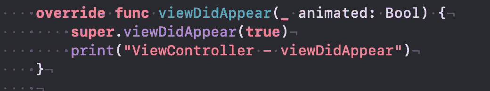
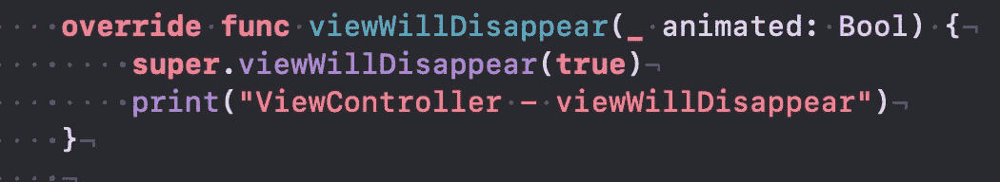
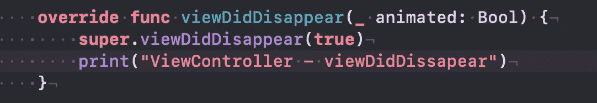
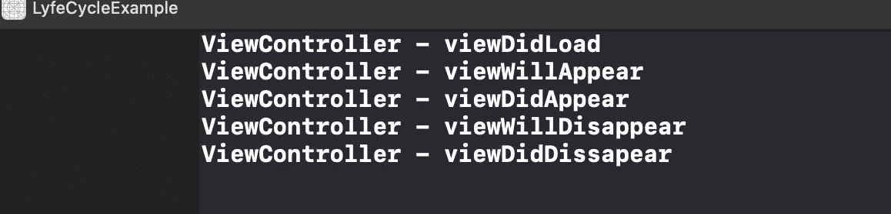

# Swift 中 UIViewController 的生命周期是怎样的？

> 原文：<https://levelup.gitconnected.com/what-is-the-life-cycle-of-a-uiviewcontroller-in-swift-56d2b8ebaf48>

## 简单的解释

照片由[凯特琳·贝克](https://unsplash.com/@kaitlynbaker?utm_source=medium&utm_medium=referral)在 [Unsplash](https://unsplash.com?utm_source=medium&utm_medium=referral) 上拍摄

# 介绍

在 Swift 中，View Controller 有特定的周期——不同操作可能起作用的阶段。在设置视图和视图层次结构之后，您需要构建一些幕后逻辑。也就是说，在视图生命周期的过程中，根据视图的状态处理事件，并在视图变得不必要时处理它们。

# 我们开始吧

在 iOS 中，视图有几种不同的状态:

*   视图未加载
*   视图出现
*   视图出现
*   视图消失
*   视图消失

这里您可以看到视图层次结构的示例

## ViewDidLoad

当您第一次创建 viewController 时，您已经自动编写了`viewDidLoad(),`,因为所有的初始数据都被加载到其中。此外，有些工作单元可能只执行一次，例如，最初加载的背景颜色或按钮的颜色。对于那些任务，`viewDidLoad()`是最准确的执行地点。

## ViewWillAppear 和 ViewDidAppear

在`viewDidLoad()`之后，viewController 生命周期中的下一个方法是`viewWillAppear()`。它在视图出现在屏幕上之前被调用。这是做幕后工作的好地方。例如，如果您正在编写美食餐厅应用程序，那么关于您餐厅中最新鲜食物的信息将在屏幕上显示之前在此处*更新*。其他任务包括:启动网络请求，刷新或更新视图。

正如你可能猜到的，`viewDidAppear()`是在视图出现在屏幕上后被调用的。如果您的工作需要在每次视图出现时都执行，但是这很费时间，那么您可能希望使用 viewDidAppear()。例如，显示动画或其他长时间运行的代码，如获取数据。

## 视图将消失，视图已消失

在视图从屏幕上消失之前调用`viewWillDissapear()`。该方法在用户离开屏幕时执行—例如，点击*后退按钮*。您可以使用此方法来保存编辑内容、隐藏键盘或取消网络请求。

viewController 生命周期中的最后一个方法是`viewDidDisappear()`。它让你确信你已经不在屏幕上了。`viewDidDissapear()` 方法可用于停止与视图相关的服务，例如，播放音频或移除通知观察者。

现在，让我们运行并构建我的项目，并向您展示控制台输出的内容:

# 结束语

在这一点上，我们来到了视图控制器生命周期的终点。现在，我希望你已经对它们有了深入的了解，并且能够很容易地选择和使用你喜欢的方法。如果还有一些问题困扰着你，欢迎留下评论。

如果你想看看我创建的项目，我会留下下面的链接:

 [## abboshonshukurulaev/生命周期示例

### 在 GitHub 上创建一个帐户，为 abboshonshukurullaev/life cycle example 开发做出贡献。

github.com](https://github.com/AbboskhonShukurullaev/LifeCycleExample) 

感谢阅读！