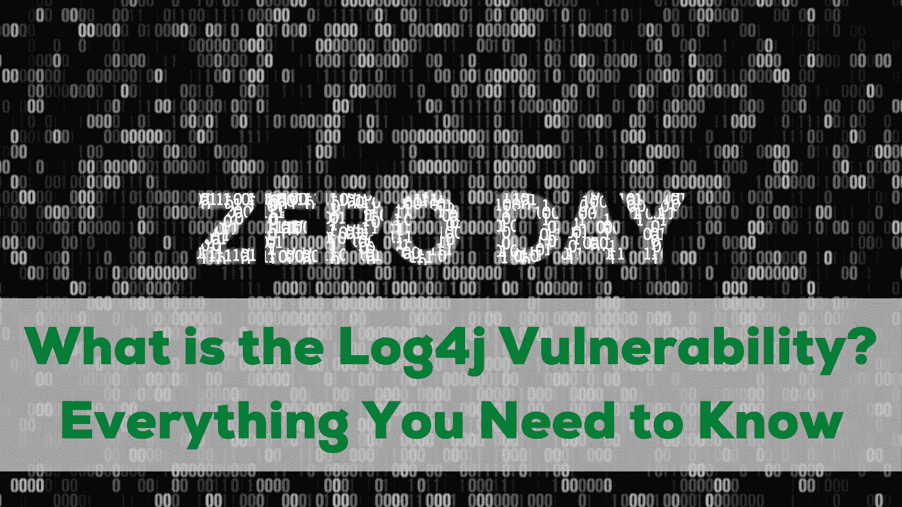
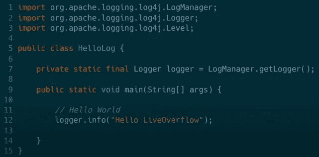
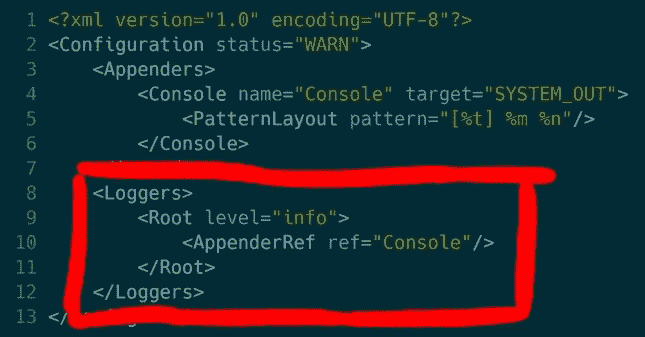

# Log4j 漏洞是什么？|您需要知道的一切

> 原文：<https://levelup.gitconnected.com/what-is-the-log4j-vulnerability-everything-you-need-to-know-f8197f2f6dac>

## 这是有史以来最严重的零日攻击吗？

## 在过去的几天里，网络安全领域有什么传言？需要采取一些措施吗？

Java 应用程序中使用的 Log4J 日志框架内存在一个可利用的缺陷，也称为 bug。

这个问题正被已经成功入侵至少 20，000 台不同机器的黑客所利用。如果不修补，此问题可能允许攻击者在没有用户交互的情况下远程执行恶意代码。

在这篇博文中，我将详细介绍这个问题是什么，以及为了保护您自己和您的组织免受这些类型的攻击，您需要做些什么。别浪费时间了，让我们继续写这篇文章吧。

# Log4J 日志框架是什么？

LOG4J 是从版本 1.2 开始内置到 Java 中的日志框架。它允许开发人员向任意数量的目的地输出消息；包括文件、数据库、web 服务、电子邮件或 SMS 文本消息。

单个应用程序可以同时写入所有这些目的地。这些记录器可能是静态的，也可能是动态的，这取决于它们是否附加到特定的对象上。静态记录器将总是写到同一个目的地，不管它附加到什么对象；动态记录器根据引用它们的人而动态变化。

如今，现代应用程序并不是完全从零开始构建的，它们是由已经工作的和可用的功能块组成的。一个团队通常不会花上几周的时间去做一些已经可用的东西，这就是为什么他们使用块方法一起构建应用程序。

在 Java 世界中，log4j 是许多帮助您创建软件的库之一。它旨在使那些想写代码而不必考虑日志记录的程序员的生活更加轻松。它是一个日志工具，帮助开发人员记录系统中发生的所有事情。这使他们能够在问题影响用户体验之前发现并修复它们。

# 为什么 Log4j 不一样？

Log4j 是高度可定制的，正如你在下面的图片中看到的，我们有一个日志记录器，它将记录从日志级别“info”开始的所有东西到我们称为“Console”的目标。而“控制台”指的是目标突出的“系统输出”。

我们还可以在“Appenders”部分定义我们是否想要写入文件或将信息发送到远程位置。

您还可以在“PatternLayout”部分指定邮件的布局。[%t]显示威胁名称，而%m 显示实际消息。最后有%n 是线路终止。我们还可以制定许多其他规范，例如日期、警告级别、调用方法的名称等。

# 嗡嗡声是怎么回事？

这是现代史上最大的零日攻击之一，说出来可不容易。我可以肯定地说，大多数软件(如果不是全部的话)都有某种形式的日志记录，log4j 库非常常见。

由于这个漏洞攻击 Java 和运行在 JVM 上的应用程序，它可以攻击任何操作系统，不管你是在 Linux 还是 Windows 上。一旦系统被感染，攻击者就可以利用它运行任何类型的应用程序，包括..甚至勒索软件。根据最近的数据，已经确认勒索软件正在利用 Log4Shell 漏洞进行部署。

## log4j 漏洞会影响个人吗？

Log4j 几乎出现在您日常生活中使用的每一个设备甚至服务中。这意味着几乎每个人都可能被这个漏洞利用。保持安全的唯一方法是更新您经常使用的应用程序，尤其是在接下来的几天，并希望开发人员已经找到了解决方案。

## log4j 漏洞会影响组织吗？

正如我上面提到的，我们日常使用的几乎所有应用程序都会受到影响，这意味着组织及其服务器也会面临风险。然而，这有点复杂，因为不清楚他们的硬件或服务是否使用 log4j 框架。无论哪种方式，系统管理员都应保持最高的警惕级别，并应遵循适当机构提供的指导。

# 什么是 RCE 类漏洞？

由 [Unsplash](https://unsplash.com?utm_source=medium&utm_medium=referral) 上的 [RoonZ.nl](https://unsplash.com/@dlanor_s?utm_source=medium&utm_medium=referral) 拍摄的照片

RCE 级漏洞是一种允许黑客在受害者的计算机上运行任意代码的漏洞。该类名来自反射跨站点脚本，当攻击者利用嵌入的 JavaScript 创建恶意网页，诱骗受害者在他们的机器上运行恶意脚本时，就会出现这种情况。

这些攻击通常利用浏览器本身的漏洞，如缓冲区溢出或使用过期版本的脚本引擎。当成功时，这些漏洞允许黑客完全控制目标机器，甚至部署勒索软件。

# 反病毒软件对这些攻击有帮助吗？

防病毒软件对该漏洞没有帮助，因为您在设备上使用的应用程序的编程中存在缺陷。逻辑上没有意义，因为应用程序运行正常，但其中有漏洞。然而，反病毒软件会帮助攻击者执行代码。

例如，在您受到攻击后，攻击者远程启动勒索软件，如果您的防病毒软件确实提供了对这种勒索软件的保护，那么它将在不造成损害的情况下阻止它。否则，如果它是以前没有检测到的新版本，并且没有添加到库中，那么它将会造成损害。

这就是这个新漏洞正在发生的事情。攻击者正在利用该漏洞推出新的定制勒索软件，这些软件是顶级防病毒软件无法检测到的。

如果你正在寻找一个强大的杀毒软件，那么请点击这里的链接。

# 使用 log4j 库的应用有哪些？

Apache Log4J 库用于为 Java 程序提供日志服务。Log4J 是目前使用最广泛的库之一。使用 Log4J 库的一些应用程序包括 Apple iCloud、Twitter、《我的世界》、Steam Tomcat、Jetty、Glassfish、JBoss、IBM WebSphere Application Server、Oracle JDeveloper、Eclipse、CVS、Geronimo、Hibernate、Spring、Struts、Ant、Maven、Jenkins、Subversion、MySQL、HBase、Hive、Informatica、JIRA、Confluence、JBoss Developer Studio、Weblogic 以及 Git 等其他软件工具。

由[亚历山大·沙托夫](https://unsplash.com/@alexbemore?utm_source=medium&utm_medium=referral)在 [Unsplash](https://unsplash.com?utm_source=medium&utm_medium=referral) 上拍摄的照片

你可以在国家网络安全中心[这里](https://www.ncsc.gov.uk/news/apache-log4j-vulnerability)查看漏洞状态。他们定期更新信息并提供额外信息。

# 什么是 JNDI 功能？

Java 命名和目录接口(JNDI)是一个标准接口，用于访问数据库、目录、远程主机、网络资源和用户的名称、主机地址和其他信息。

有了它，您可以轻松地从任何连接到互联网的机器上访问文件和数据。这个函数可以用来连接到几个应用程序，比如 JDBC 和 ODBC，它们允许您使用 SQL 和 PL/SQL 语言。

Log4j CVEs 的早期版本使用此功能来影响机器并启动 RCE(远程代码执行)甚至 LCE(本地代码执行)。

## 为防止今后发生类似袭击而采取的措施

为了防止这种情况发生，在与几位专家讨论后，决定在 2.16.0 版中完全禁用 JNDI 功能(并删除消息查找)。因此，人们认为不可能通过上下文查找 API 造成 RCE 或 LCE 漏洞。

但是，由于它不能防止手工输入导致对上下文查找的递归调用，因此仍然存在一个潜在的 StackOverFlowException 问题。

# 结束语

这种类型的漏洞并不经常发生，围绕这一点有很多议论也就不足为奇了。这种影响可能是巨大的，因为它可能会影响到几乎每个人，但我们已经看到了开发商的快速反应。

我希望这篇文章能给这种情况和正在发生的事情带来一些启发。如果你想看更多像这样的文章，别忘了订阅我的时事通讯。