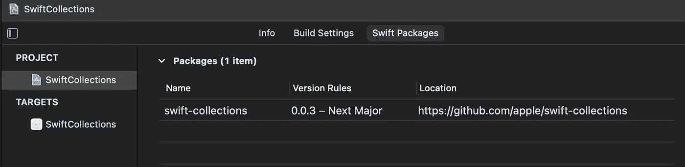
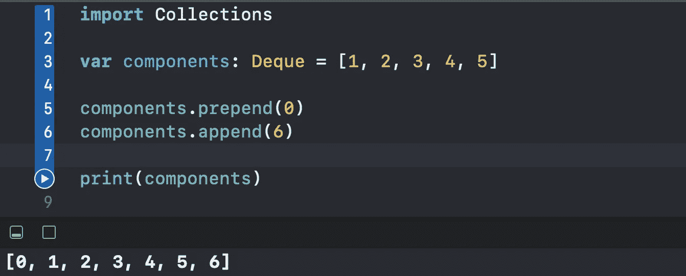
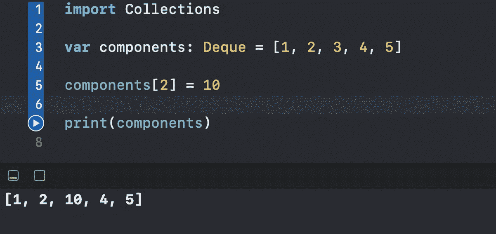
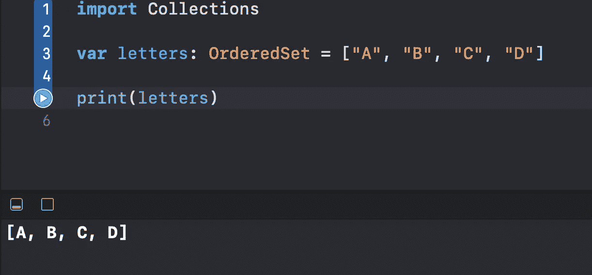
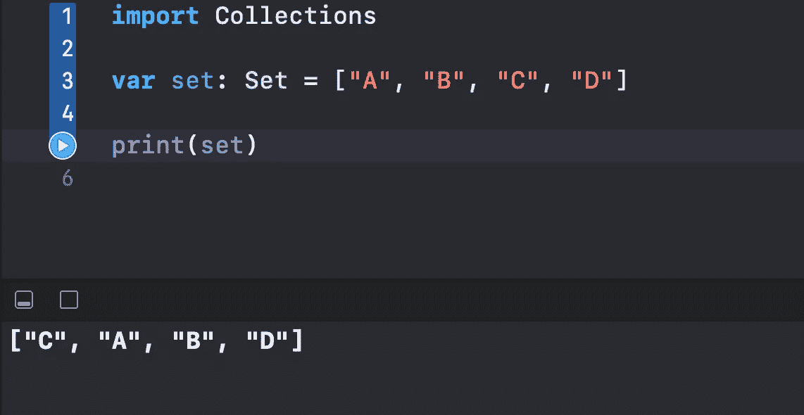
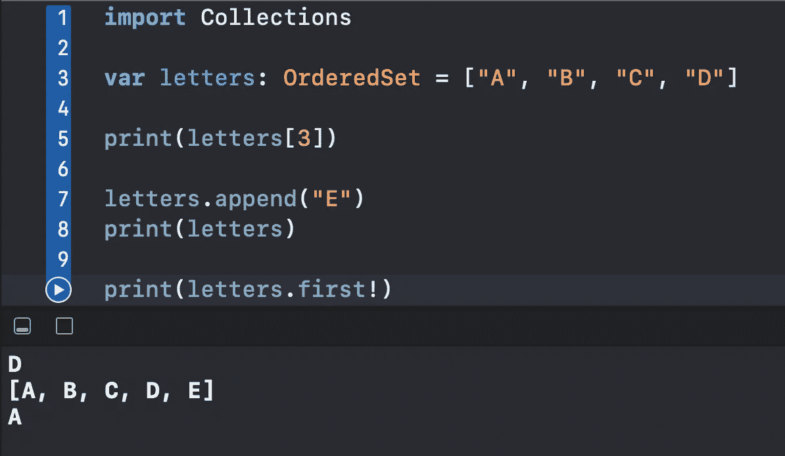
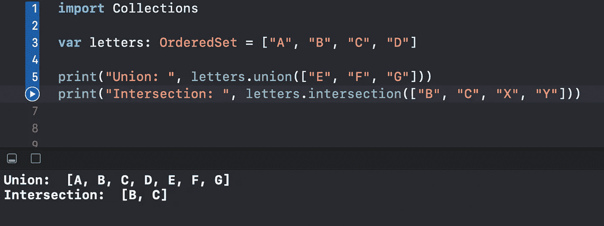
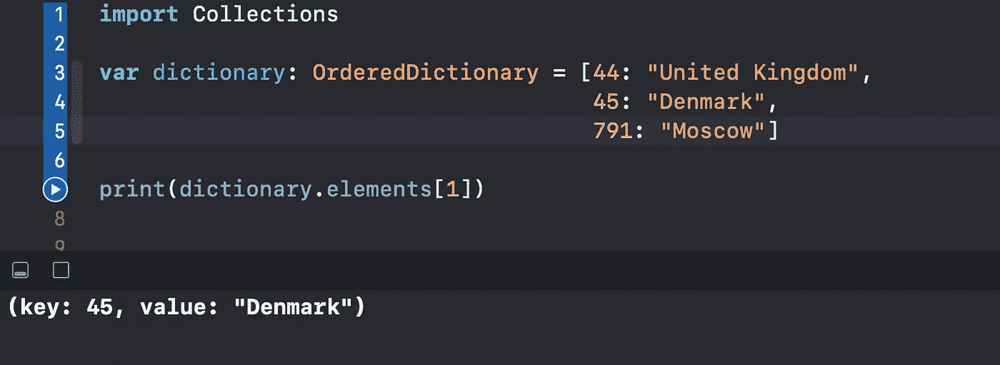
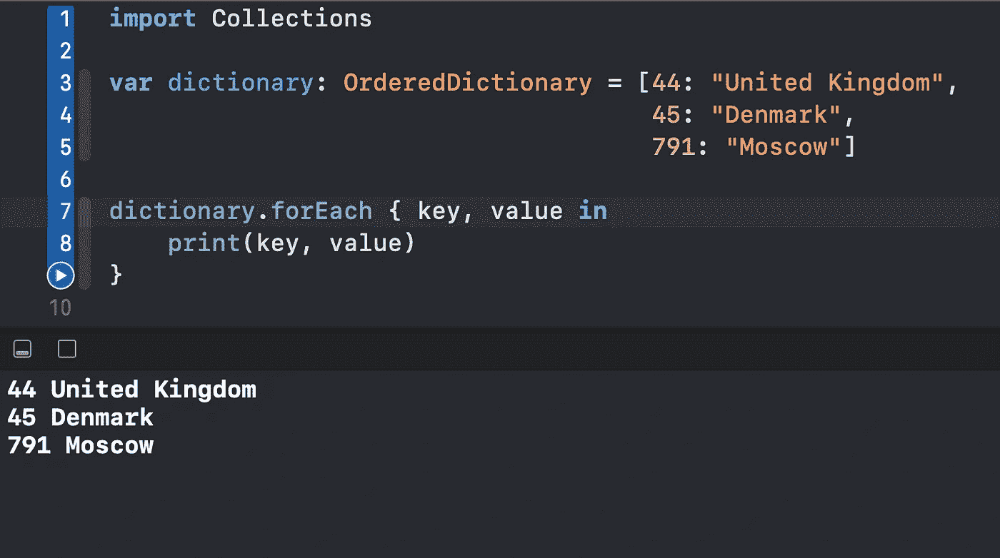
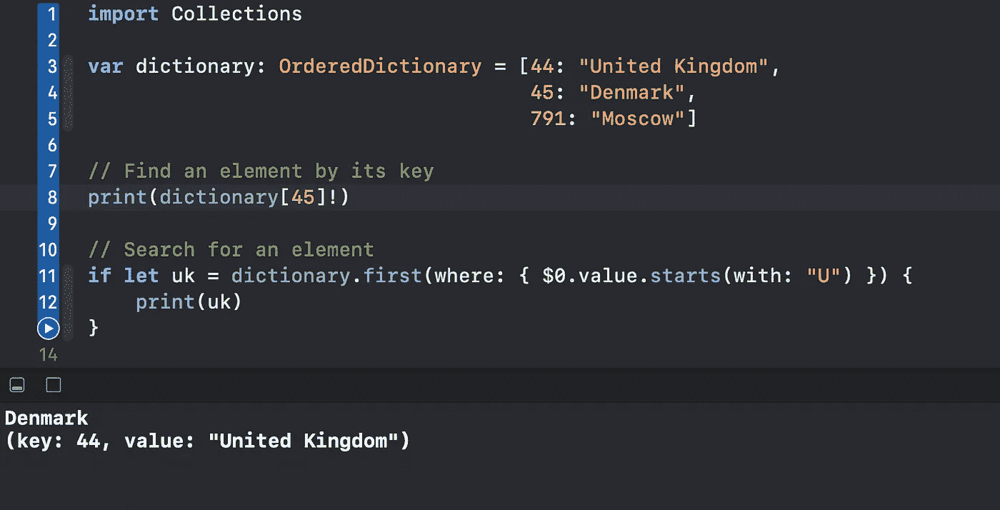

# 什么是 Swift 托收包

> 原文：<https://levelup.gitconnected.com/what-is-the-swift-collections-package-99527e2b9b8c>

## 使用双端队列、有序集和有序字典来提高性能和简化代码

照片由 [Marcin Nowak](https://unsplash.com/@marcin?utm_source=medium&utm_medium=referral) 在 [Unsplash](https://unsplash.com?utm_source=medium&utm_medium=referral) 上拍摄

在本文中，我们将学习如何在一个简单的 Xcode 游乐场中利用苹果 Swift Collections 包中的有用数据结构。我们将探索并掌握这些数据结构:

*   双端队列
*   有序集合
*   有序字典

# 我们开始吧

首先，我们需要将 [Swift 托收包](https://github.com/apple/swift-collections)添加到我们的项目中:

现在我们准备将它导入 Xcode Playground 并开始。

# 双端队列

让我们创建一个包含`Int`项的简单`Deque`:

双端队列意味着我们既可以向它追加元素，也可以向它预先添加元素:

这会产生以下结果:

最棒的是，`Deque`和`Array`遵循几乎相同的协议。我们可以很容易地通过索引来更改成员:

因此，该系列会根据我们的需要进行更新:

我们还可以通过使用`popFirst()`变异方法方便地删除出列的第一个元素:

现在，你可能想知道如果一个`Deque`的行为方式和一个`Array`一样，那么它有什么用？看看这个简单的操作:

与数组相比，出列的主要优点是*预先*一个元素或者*弹出出列中的第一个元素*花费相同的时间，而不管集合中已经有多少元素。

然而，在一个数组中，有更多的元素意味着需要更多的时间来预先计划一个新的元素。

因此，当我们需要一个*先进先出*队列，或者弹出第一个成员或者预先添加一个新元素时，使用`Dequeue`会比`Array`更有效。

# 有序集合

我们要探索的下一个数据结构是一个`OrderedSet`。

让我们初始化一个包含`String`项的`OrderedSet`并打印其内容:

这是控制台向我们展示的内容:

如果我们创建一个包含与上面的`OrderedSet`相同元素的普通`Set`，我们会看到项目的顺序是随机的:

我们可以使用与`Array`中相同的一组操作，比如通过索引访问成员，添加新元素，以及使用`.first`和`.last` 属性:

结果是:

同样方便的是，`OrderedSet`可以使用与普通`Set`相同的操作:

就性能而言，在`OrderedSet`上完成的操作与在典型`Set`上完成的操作花费的时间大致相同。

当将其性能与`Array`进行比较时，无论`Set`或`OrderedSet`中已经有多少元素，访问集合的成员都要花费相同的时间。

然而，如果我们试图在随机位置插入或删除一个元素，`OrderedSet`的性能比典型的`Set`差。

要了解更多实际的`Array`和`Set`有什么不同，请看安托万·范德·李·🇳🇱的[伟大指南](https://betterprogramming.pub/array-vs-set-fundamentals-in-swift-explained-9c78f3552e52)。

# 有序字典

我们将使用的最后一个数据结构是一个`OrderedDictionary`。

我们从初始化`OrderedDictionary`开始，如下所示:

字典被排序意味着我们可以通过索引来访问它的元素。为此我们有一个`elements`属性:

我们可以很容易地遍历字典，看到顺序得到了保持:

像本文前面的数据结构一样，`OrderedDictionary`仍然可以访问我们在普通`Dictionary`上使用的标准方法:

# 包扎

如需了解更多信息，请随时访问关于 Swift Collections 的[官方文档](https://swift.org/blog/swift-collections/)。

感谢阅读！