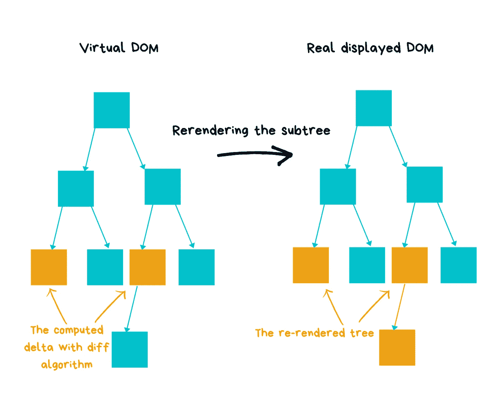

# React 中的虚拟 DOM 有什么用？

> 原文：<https://levelup.gitconnected.com/what-is-the-use-of-the-virtual-dom-in-react-62a2ad61bb88>

## React 的虚拟 DOM 哲学。


通过我学习和理解 ReactJS 哲学的旅程，我遇到了虚拟 DOM，我发现它非常有趣。React 应用又快又快。

如今，现代网站的挑战是关于用户体验和响应时间。没有用户愿意在浏览网页时等待，对吗？

React 创造了自己的概念和[算法](https://grfia.dlsi.ua.es/ml/algorithms/references/editsurvey_bille.pdf)来应对这一挑战。这个概念被命名为 ***虚拟 DOM*** 。这个概念是 React JS 出名的因素之一，也是开发人员和公司首选的 UI 库。

在本文中，我将分享我迄今为止对虚拟 DOM 概念的了解。像往常一样，每一个反馈都受到愉快的欢迎，所以请随意让这些内容因您而成长。

准备好了，我们走！

# 什么反应？

React 是一个前端库，一个特殊的库，我说到做到。如果您想知道 React 为什么如此特别，并且每个前端开发人员都应该学习它，我建议您看看这篇文章:

[](https://medium.com/the-innovation/whats-so-special-about-react-js-7707f706e038) [## React JS 有什么特别之处？

### 什么反应？为什么它如此受欢迎？

medium.com](https://medium.com/the-innovation/whats-so-special-about-react-js-7707f706e038) 

# React 中的虚拟 DOM (VDOM)是什么？

> 虚拟 DOM 只不过是内存中的一个 JavaScript 对象，表示页面的整个 HTML 文档。

让我解释一下。要在你的浏览器中渲染东西，你使用 ***render()*** 函数。这个函数创建了一个 React 元素树。下面是一个带有生成树的渲染代码的示例。

```
<div>
  <div class="container">
    <h1>Hello world</h1>
  </div>
</div>
```

渲染时，虚拟 DOM 可以表示如下:

```
{
  tag: 'div',
  children: [
    {
      tag: 'div',
      attributes: {
        class: 'container'
      },
      children: [
        {
          tag: 'h1',
          children: 'Hello World'
        }
      ]
    }
  ]
}
```

当状态或道具改变时，React 需要更新 DOM。React 可以愚蠢地生成另一棵树，替换之前的 DOM。那就太容易了，问题不在这里，但是对于大的 app 来说，从性能和用户体验上来说会很贵。

当您使用 React 时，在单个时间点，您可以将`render()`函数视为创建 React 元素树。在下一次 state 或 props 更新时，`render()`函数将返回一个不同的 React 元素树。React 然后需要找出如何更新 UI 来有效地匹配最近的树。

# 虚拟世界背后的哲学

更新 DOM 是一个应用程序的最大成本。想象一下，我们需要为每个新的状态变化更新 DOM 多少次，并且每次都要重新呈现 UI。那将是无法忍受的。那么 React 是如何快速更新 DOM 的呢？引擎盖下发生了什么？

很好奇，不是吗？让我们开始吧。

如果到目前为止，我们知道您看到的每个 React web 页面都有一个等价的 DOM 表示，即虚拟 DOM。该对象保存页面所有 UI 组件的结构表示。

React 维护虚拟 DOM 的两个副本。每当 UI 组件中的状态发生变化时，React 都会跟踪这些变化。这些更改不会应用于实际的 DOM，而是应用于虚拟 DOM。因此，不在每次更改时都更新实际的 DOM 可以提高性能。但是，真正显示的 DOM 是如何更新的呢？

React 有自己的算法，在特定的时间，它执行显示的 DOM 和虚拟 DOM 之间的区分算法。该算法计算增量，并仅应用于相关区域，而不是重新呈现整个网页。这个过程称为协调，算法称为差异或协调算法。

# 【React 和解是如何工作的？

到目前为止，我们知道协调是将虚拟 DOM 与真实 DOM 同步的过程。如前所述，react 在每次渲染 DOM 时都会创建一棵树。当 app 的状态发生变化时， ***diffing 算法*** 来到现场，对比真实和虚拟 DOM 的根元素。然后，它将更改应用于状态已更改的节点。

还没完呢！React 使用 ***键*** 来确定我们需要挂载列表中的哪些项目。这就是为什么每次你想显示一个列表时都需要一个键。这个唯一的标识符有助于识别元素。

示例:

```
<ul>
  <li key="0">ELEMNT 1</li>
  <li key="1">ELEMENT 2</li>
  <li key="2">ELEMENT 3</li>
</ul>
```

最后，React 使用了非常有效的 too ***属性*** ，因为他需要做的只是改变 DOM 节点的属性。

## **重新渲染真实 DOM 子树的示例:**



# 外卖

*   每次调用 render(à函数都会创建一个 React 元素树。
*   更新 UI 以匹配新树的复杂度与树中元素的数量大约为 O(n3)。我会让你想象为什么高效地做这件事如此重要。
*   React 保持相同的 DOM 节点，改变已经改变的子树。仅应用增量，而不是重新绘制整个网页。
*   React 拥有强大高效的 UI 渲染系统。
*   想了解更多详情，这里是 [*React 对账单据*](https://reactjs.org/docs/reconciliation.html) 。

亲爱的读者朋友们，感谢你们的支持和宝贵时间。我希望这对你有用和有帮助。

**关注我上** [**中**](https://medium.com/@famzil/) **，**[**Linkedin**](https://www.linkedin.com/in/fatima-amzil-9031ba95/)**，** [**【脸书**](https://www.facebook.com/The-Front-End-World) **，**[**Twitter**](https://twitter.com/FatimaAMZIL9)**查看更多文章。**

回头见(ﾉ◕ヮ◕)ﾉ*:･ﾟ✧)

**FAM**