# 这种“多态性”是什么？—你可能正在寻找的最简单的解释

> 原文：<https://levelup.gitconnected.com/what-is-this-polymorphism-the-a-z-easy-explanation-you-might-be-looking-for-54d64041c013>

我们都学过“*多态性*”这个词，可能在学术生活中，也可能在职业生活中。虽然这个词似乎很难拼写，但这个概念很容易理解。书中的理论甚至是网上的这个概念都是用一种非常复杂的方式来解释的，以至于我们弄糊涂了，而不是学会了！甚至我们在编码中使用它，但没有意识到它。

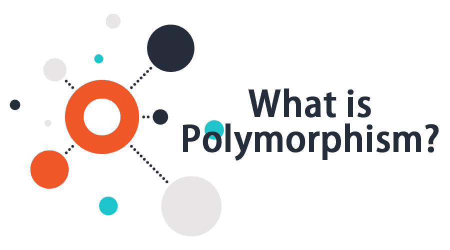

与*继承*、*多态*一样，也是面向对象编程的一个原则。它依赖于*类*类&类*继承*的概念，所以你可能需要一些它们的先验知识来理解，但是没问题，*类* & *继承*也在这里讨论！我们在这里使用 Java 作为编码示例。如果你对 Java 不太熟悉，你可以仔细阅读一下解释，然后用你想要的 OOP 语言检查一下，这应该没什么不同。
让我们一步步来学习吧:

# 1.我们开始吧

如果我们考虑运算符:" **+** "和" **-** "，我们可以看到，它们有一个相似的性质，它们需要两个数来运算。
例如。6+5 = 11，6–5 = 1
如果一个运算符需要两个数进行运算，则与上述运算符一样称为**二元运算符**。

# 2.班级

让我们想象一下，我们有一个类名“ **BinaryOperator** ”，它存储两个整数(=操作数)，还有一个名为 operate 的帮助方法。

我们可以看到，这个简单的类包含:
——两个名为 *operand1* 、 *operand2* 的整数。-初始化整数的构造函数。
-一个方法 *operate()* ，刚好返回 0。
这个类作为二元操作符是没有用的，因为它没有对 *operate()* 方法中的操作数执行任何有用的操作，而是返回 0！

# 3.遗产

如果一个操作符想要成为二元操作符，它可以继承**二元操作符**类，该类提供了一些有用的属性，比如存储两个操作数，一个操作方法。加法&减法运算符可以继承**二元运算符**的属性，并操作操作数。让我们看看下面的代码:

我们可以看到，这两个类都继承了类 **BinaryOperator** 。因此，他们都可以访问整数 *operand1* 、 *operand2* ，以及方法 *operate()* 。看吧！我们不需要声明任何操作数或任何像 operate 这样的方法，只需要继承它们就可以了！

我们需要按照操作者的要求*覆盖*父类方法 *operate()* 。**加法运算符**查找和，**减法运算符**查找 *operate()* 方法中两个操作数的减法。

在 OOP 语言中， **BinaryOperator** 现在是**addition operator**&**subtraction operator**的父类(基类/超类)。相反，**加法运算符** & **减法运算符**是**二元运算符**的子类(子类)。

此外，我们还添加了一些额外的方法:
- *getGreater()* 在***addition operator**中，它只是返回较大的操作数。(从 6，5 它将返回 6)
-*isBothOperandEqual()*in***减法运算符**检查两个操作数是否相同。(对于 6，5 它将返回*假*)**

**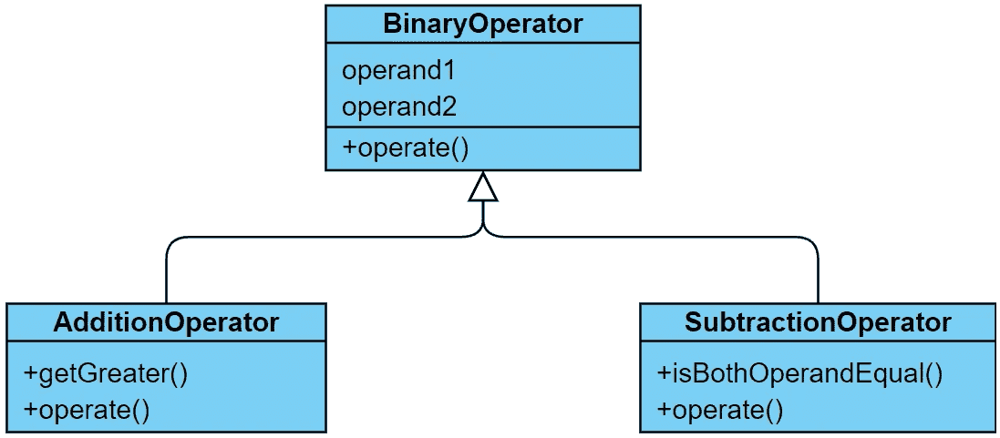**

**类图**

# **4.检查上面的类**

**让我们在 main 函数中检查上面的类，并打印方法 *operate()* 的结果:**

**如您所料，如果我们运行代码，上述代码的输出将是:**

**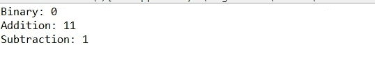**

**上述代码的输出**

*   **对象 *binaryOperator* 的 *operate()* 方法返回 **0** ，那是因为在 **BinaryOperator** 类中我们刚刚返回了 0。**
*   **对象*加法运算符*的 *operate()* 方法返回 **11** ，这是因为在**加法运算符**类中我们返回了 sum (6+5)。**
*   **对象*减法运算符*的 *operate()* 方法返回 **1** ，这是因为在**减法运算符**类中我们返回了减法(6–5)。**

# ****5。多态性—例如****

**到目前为止，我们讨论的非常简单，也没有使用多态性。但是，我们现在准备使用它！
在**步骤 4** 中，我们声明了如下对象(第 3–5 行):**

**没有多态性**

> **在多态中，我们可以将子对象赋给或初始化给它的父对象**

**所以，我们可以将**加法运算符** & **减法运算符**的子类对象赋给父类对象**二元运算符**！？😮**

**让我们再次回到**步骤 4** ，将子对象声明为父对象，如下所示:**

**具有多态性**

**在上面的代码中，一切都是一样的，除了第 3 和第 5 行，我们将**加法运算符** & **减法运算符**对象初始化为**二元运算符**。**

**您可能会想，当我们运行代码时，会导致如下编译错误:**

```
**“*Type mismatch: cannot convert from AdditionOperator to BinaryOperator…*”.**
```

**神奇的是，它不会，而是会给出如下输出:**

****

**使用多态性输出**

**该输出与**步骤 4** 中的先前输出相同！！**

**等等！！如果我们尝试将它们分配给字符串**会怎么样，如下所示:****

**分配为字符串类对象**

**会导致编译错误！😒**

**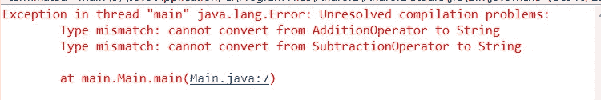**

**上述代码的输出**

**让我们来探索这里发生了什么！我们被允许将一个子对象赋给父对象(=多态)。因此，我们可以将**加法运算符**(子)分配给**二元运算符**(父)，但不能将**加法运算符**分配给**字符串** ( **字符串**不是父)。**

> **根据以上测试，我们成功验证了多态性！**

# **6.多态性——用例**

**多态性的主要用例是我们可以忘记单个子类，而是可以一般性地使用它们。让我们看看例子:**

****用例 1:** 我们可以想到一个通用列表，它应该允许任何 **BinaryOperator** 对象。在这个列表中，我们可以添加 **BinaryOperator** 对象以及任何子对象(**加法运算符** & **减法运算符**的对象),如下所示:**

**列表中的多态性**

**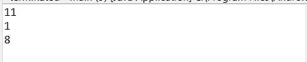**

**上述代码的输出**

**如果没有多态性，我们将无法在一个列表中添加它们，而是必须为**加法运算符**和**减法运算符**使用单独的列表！！😿这减少了我们的重复工作，特别是在职业生活中，应该有无数的子类。**

****用例 2:** 我们可以认为，我们需要一个方法来接受两个二元操作符，这两个操作符评估操作符并检查两者的结果是否相同。有了多态性，我们可以像下面这样做:**

**方法参数中的多态性**

**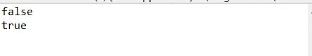**

**上述代码的输出**

**由于多态，我们可以将**加法运算符** & **减法运算符**对象传递给 *isSameResult()* 方法中的**二元运算符**参数。**

**第 14 行的输出为**假** : 6 + 5！= 6 - 5
第 16 行的输出为**真** : 6 + 5 == 12 - 1**

**没有多态性，我们不得不重载所有可能的方法参数组合，如下所示，这是非常繁琐的工作！如果父类的孩子很多，那么每个组合都是不可能写出来的！**

**没有多态性**

**您可能会面临更多的用例，这些用例可以使用多态性来解决。它可以让你的代码更易读，更简短，更不容易被接受。奖金部分也给出了更多的例子。**

# **6.多态性—一些问题**

**如果将子对象赋给父对象(使用多态性)，我们将丢失在子类中声明的附加属性或方法！😤这是因为，父类不知道子类的实现(显然，子类知道父类的实现)。**

**在**第三步:
- AdditionOperator** 有一个子特定的加法方法 *getGreater()* ，返回较大的操作数。
- **减法运算符**有一个子特定的附加方法 *isBothOperandEqual()* ，如果两个操作数相等或不相等，则返回。**

**让我们看看下面的例子，我们将在使用多态后通过调用*get greater()*&*isBothOperandEqual()*方法来实现这个场景:**

**从父类调用特定于子类的方法**

**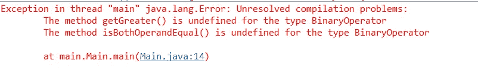**

**上述代码的输出**

**这导致第 5 & 6 行出现编译错误。使用多态性*addition op*&*subtraction op*对象后，成为 **BinaryOperator** 的对象，它不知道子方法*get greater()*&*isBothOperandEqual()*。因此，我们看到了编译错误。**

## **找回孩子:**

**那么，如果我们需要特定于子级的方法/属性，该怎么办呢？😟**

**你一定听说过选角。是啊！我们说的是我们经常使用的将整数转换为双精度数的转换。类似地，我们可以将父对象转换为子对象，然后毫无麻烦地取回完整的子对象:**

**回到孩子身上**

**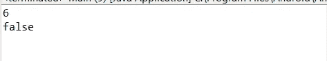**

**上述代码的输出**

**你看！？转换后，我们现在可以在第 8 行& 9 中调用**加法运算符**的子方法 *getGreater()* 和**减法运算符**的子方法 *isBothOperandEqual()* 而没有任何编译错误。**

## **铸造注意事项:**

**如果我们错误地从父对象转换到错误的子对象，将导致运行时错误！怎么会？让我们探索一下…**

**举个例子，我们可以用多态把一个**加法运算符**的对象保存为**二元运算符**，然后，如果我们想把它强制转换为**减法运算符**(但实际上是**加法运算符** ) ，它会立即崩溃:**

**错误的铸造示例**

**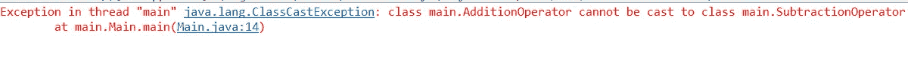**

**上述代码的输出**

**如果我们使用多态性，子对象就不会丢失，它们只是成为父类的一个影子，如果我们想从影子中找回子类，我们必须得将它投射回真正的子类。如果我们将类型转换为错误的子类型，就会产生一个类似上面的运行时错误。**

## **检查类别类型:**

**我们可以检查一个对象是否是从一个特定的类创建的。Java/JS 有关键字 **instanceof** ，C++有 **dynamic_cast** ，Python 有 **isinstance()** 等等，每一种 OOP 语言都有这种类型的对象检查。它们都返回 true/false，表明对象是否属于该类型。对于 Java，我们可以这样做:**

**类型检查**

**你能猜出产量吗？？**

**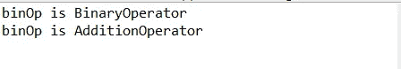**

**上述代码的输出**

**第 5 & 11 行被执行并打印在控制台中。但是，第 8 行被跳过。那是因为， *binOp* 对象既是 **BinaryOperator** (父)*&**addition operator**(子阴影)的类型，又返回 true，但不是 **SubtractionOperator** 的类型，所以第 7 行返回 false。***

## **安全铸件类型:**

**使用类型检查，我们可以确保安全转换(即没有运行时错误)。这种现象称为类型安全转换。让我们看看下面的代码片段:**

**铸造前的类型检查**

**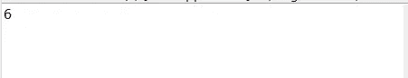**

**上述代码的输出**

**我们可以看到， *binOp* 是**加法运算符**的类型，因此与**加法运算符**的*instance 返回 true，第 7–8 行被执行并在控制台打印输出 **6** (较大的操作数)。但是， *binOp* 不是**减法运算符**的类型，并且*的*instance 返回 false。因此，如果*程序块，将跳过整个*程序块中可能导致运行时错误的造型(第 13 行)。***

# *7.多态性——加分*

*综上所述，我们来查一些可能的案例和解释:*

*关于多态性的一些常见问题:*

*   *你知道吗，在 Java 中，每个对象都可以被分配给**对象**类？
    **答:**Java 中的每个类都是**对象**类的子类，因此，你可以使用多态。*
*   *如果发生多级遗传，我们可以对祖父母或更多的顶级亲属以及父母使用多态性吗？
    **Ans:** 我们来想一个例子，类 **A** 被继承到 **B** ， **B** 被继承到 **C** 。能否将 **C** 的对象赋给 **A** (多态)？是的，我们可以！我们可以分配给任何顶级父母！*
*   *可以给我一些多态的真实编码例子吗？
    **答:**我们在不知不觉中使用了多态性。在开发中，我们可能会过多地使用这个概念，以至于我们可能已经隐含地了解了它。你可以看到下面的代码:*

*唷！那可是多形态啊！它不应该像书本理论或其他互联网解释那样过于强硬！！*

*你可以浏览用 Java 写的代码，自己测试。整个项目可以在这里找到解释:*

*[](https://github.com/tareqjoy/OperatorProject/) [## GitHub-tareqjoy/operator 项目

### 在 GitHub 上创建一个帐户，为 tareqjoy/OperatorProject 的开发做出贡献。

github.com](https://github.com/tareqjoy/OperatorProject/) 

不要忘记👏 😉！

在 LinkedIn 上与我联系:

[](https://www.linkedin.com/in/tareqjoy/) [## Tareq Rahman Joy -软件工程师- TigerIT 孟加拉有限公司| LinkedIn

### 经验丰富的软件工程师，对面向对象编程&数据结构和算法有广泛的了解…

www.linkedin.com](https://www.linkedin.com/in/tareqjoy/)*