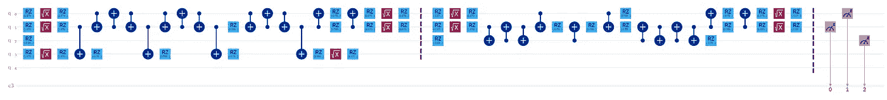
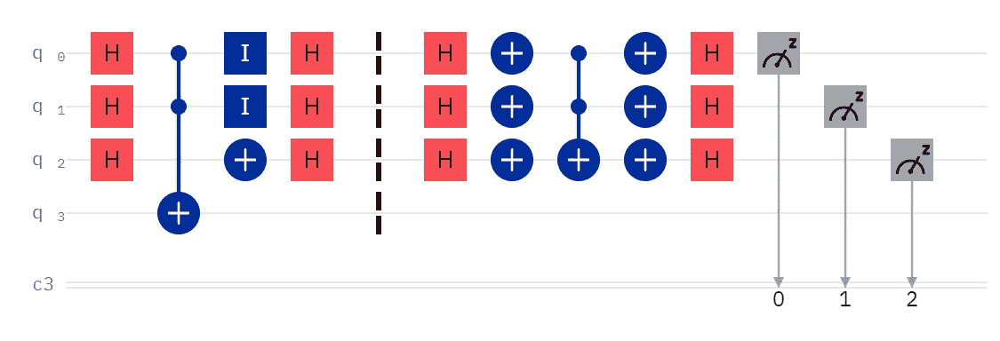

# 什么是“transpilation？”

> 原文：<https://levelup.gitconnected.com/what-is-transpilation-4d12d51e2aa4>

蒸发后的量子电路

# 你的量子计算电路到底是什么样子的？

作为 IBM 第一个也是唯一一个非官方的 OpenQASM 倡导者，我一直在关注透明的量子计算电路。我没有想到 Qiskit 和其他框架用户不一定会遇到这个术语，更不用说查看这些电路了。虽然在这个领域编造专有术语和拼写是很平常的事情，但我没有这样做。我在 IBM Quantum Experience 中了解到这个术语，并一直使用至今。

这是什么意思？我猜是 translate + compile = transpile 的合并。它是输入我们都喜欢的用户友好的操作，并输出在量子处理器上实际执行的极少数操作的过程。例如，Toffoli gates，又名 CCX，又名 CCNOT，又名 controlled-controlled-X，又名 controlled-controlled-NOT，又名 AND，使我们可以很容易地执行布尔与逻辑，并构造自定义的多量子位操作。但是，Toffoli 并不只是在量子处理器上运行，它必须被分解成一系列的操作，然后这些操作才是可以执行的。

这就好像我们把 Python 代码翻译成汇编语言(ASM)一样。ASM 更接近于传统计算机实际理解的东西，尽管它还没有完全理解。ASM 仍然需要翻译成机器代码，而 transpiled 电路，对于量子处理器来说，仍然需要转换成微波脉冲。

蒸发前的量子电路

你认得上面的电路吗？这是 Grover 算法的一个相对简单的实现。我们用的都是 Hadamards，Xs，CCXs。为了本文的目的，我们可以忽略 id、障碍和度量。

现在，你能认出这篇文章最上面的电路吗？是同一个电路！一种是用户友好的，相对容易构建。另一个准备好被转换成微波脉冲。那是相当不同的，不是吗？

那么，有什么意义呢？

优化！

我们可以分析 transpiled 电路，并尝试减少电路的宽度和深度。例如，我在传输电路中看到五次交换操作——对两个量子位进行三次连续的交换。那是相当低效的。也许我应该看看我选择的设备上的量子位连接，并尝试以不同的方式分配我的量子位。此外，我看到障碍两边的哈达玛，彼此抵消；移除障碍(它只是为了解释的目的而存在)应该会自动清理这些障碍。

总之，如果你已经关注我一段时间了，…谢谢你！但是,“transpilation”并不是我创造的一个术语，因为所有酷孩子都这么做。如果您登录 IBM Quantum Experience，在 Quantum 处理器上运行一个电路(模拟器不会 transpile)，并查看详细的结果(不仅仅是初始结果)，您将会看到您的原始电路和 transpiled 电路。

*感谢* [*杰克·克鲁潘斯基*](https://jackkrupansky.medium.com/list-of-my-papers-on-quantum-computing-af1be336410e) *启发了这篇文章。*