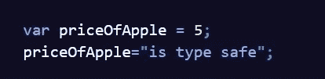
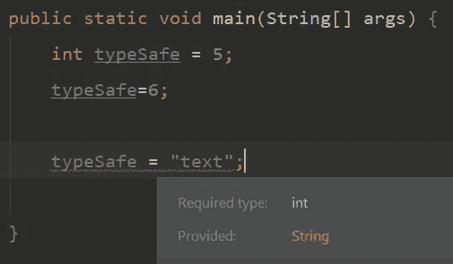
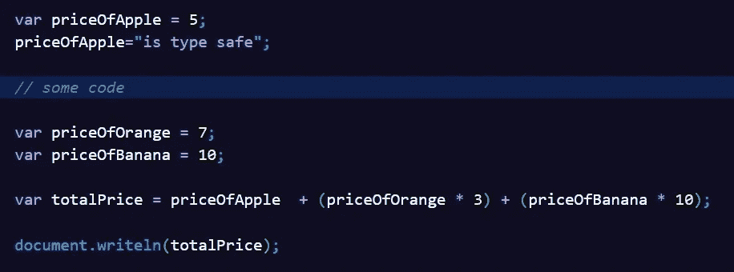
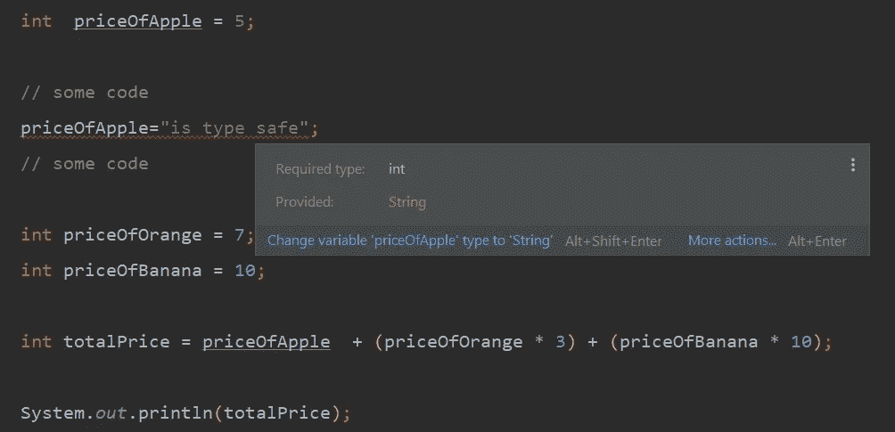
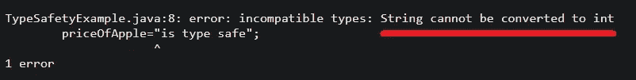

# 什么是 Safety❓类型

> 原文：<https://levelup.gitconnected.com/what-is-type-safety-705b1813e0bb>

> 简而言之，编译器在编译过程中对变量的验证。

## **让我们开一点点**

假设我们有一个取数值的变量。我们以后不应该给这个变量赋一个字符串值。但是有时我们会分心，我们会犯这样的错误。这些错误浪费了我们的时间。如果一个应用程序被仓促处理并且测试很差，在应用程序上线后，当用户进入出错的屏幕时，应用程序崩溃并收到与他们预期不同的结果。之后，抱怨纷至沓来。现在搜索，试着找出错误发生的原因等等。

为了防止这种情况的发生，类型安全的概念随着语言和编译器的合作而出现。

编译器在编译时检查变量的赋值是否正确。如果将错误的值赋给变量，它将在编译过程中出错，并防止运行时可能出现的错误。如果我们在编写代码的时候给变量分配了错误的数据类型，一些编译器甚至会警告我们。

## 现在让我们来看几个例子

例如，Java 是类型安全语言，而 JavaScript 不是类型安全语言。

在 **Javascript** 中编写变量时，没有义务指定其类型。这叫做类型推断。这样，初始值为 int 的变量就可以被赋予一个字符串值。这将导致我们在使用该变量时出错。

JavaScript 中没有类型安全

尽管我们在上面的代码片段中用 int 为变量赋值了一个字符串值，但是我们没有收到任何错误或警告。

当用 **Java** 编写变量时，你必须指定它的类型。然后，您不能将该类型以外的数据赋给该变量。您将在编码时和编译期间得到一个错误。

Java 中的类型安全

当我们在上面的代码片段中给我们定义为 int 类型的变量赋予一个字符串时，我们在编写代码和编译期间会得到一个错误。我们得到这个错误是因为类型安全的概念。

让我们来解决一个问题。假设妈妈去了一家杂货店。妈妈买了 1 公斤苹果，3 公斤橘子，10 公斤香蕉。让我们写一个程序来显示妈妈将要支付的总价格。

用于解决问题的 JavaScript 代码(Visual Studio 代码)

如果我们用一种*非类型安全语言*写这个问题，如果我们在构思的时候给一个应该取 int 值的变量一个字符串值，如果编译器在写代码的时候没有给我们一个错误，无论是在编译的时候，还是在执行的时候，我们得到的结果都会是如下一个荒谬的数据。

可能在非类型安全语言中

当我们在等待一个数字作为总价的时候，一个完全不同的数据出来了。这就是类型安全发挥作用的地方。

现在让我们用 **Java** 来写这个。

iliş kin Java kodu 问题

如果你注意的话，在写代码的时候，代码的底部会变红并给出一个错误。假设我们如此分心以至于没有看到那个错误。当我们开始编译代码时，编译器给我们一个类似下面的错误。

类型安全错误

通过这种方式，我们可以纠正我们的错误，而无需将我们的应用程序投入使用。

你可以[点击这里](https://stackoverflow.com/questions/260626/what-is-type-safe)查看更多例子。

**脚注**:Java 和 JavaScript 除了名字上的相似，没有太多相似之处。Java 是 Sun 微系统公司在网景公司即将发布 JavaScript 时开发的一种流行语言。网景公司也用 JavaScript 这个名字来利用 Java 的这种流行性，达到了它的目的😂。

# 结论

简而言之，类型安全就是编译器在编译代码时给出一个错误，如果变量的类型和赋值的类型不同，就不编译代码。

我们已经到了另一篇文章的结尾。我试图解释类型安全的概念，这是一个简单但重要的概念。如果你喜欢它，如果你点击👏按钮。请分享，让更多人受益。保重，在我的下一篇文章中再见。

 [## Cengiz TORU —软件工程师—华为| LinkedIn

### 查看世界上最大的职业社区 LinkedIn 上 Cengiz TORU 的个人资料。Cengiz 有 7 个工作列在他们的…

www.linkedin.com](https://www.linkedin.com/in/cengiztoru/)  [## 岑吉兹·托鲁

### Github 帐户

github.com](https://github.com/cengiztoru)