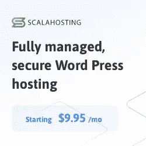
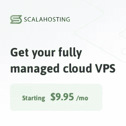

# 什么是虚拟主机？对初学者友好的指南

> 原文：<https://levelup.gitconnected.com/what-is-web-hosting-a-beginner-friendly-guide-88a7648fee9a>

学习复杂的概念并不总是一个愉快的经历，这就是为什么在这篇文章中，我希望尽可能地向初学者解释虚拟主机。不要犹豫，在评论区留下回复，我很乐意给你们每个人一个答案。

卡尔·海尔达尔在 [Unsplash](https://unsplash.com?utm_source=medium&utm_medium=referral) 上拍摄的照片

# 什么是虚拟主机？

虚拟主机指的是一种允许个人或公司在互联网上提供网站的服务。提供网络主机的公司将把它的服务器放在某个地方，通过称为“互联网线路”的电缆与其他计算机相连。

当有人想浏览你的网站时，他/她将自己的电脑直接与你的电脑相连，并通过使用[互联网浏览器](https://medium.datadriveninvestor.com/top-5-best-web-browsers-to-use-in-2021-3a14d4116dc7)如 ie、Firefox、 [Brave](https://kgabeci.medium.com/f23946dde120) 等向你的电脑请求信息。

该请求通过互联网线路发送，互联网线路又向该位置的服务器发送消息，询问是否有任何数据等待发送给该特定用户。

如果是，那么它将收到一个这样说的响应。如果没有响应，您将会收到一个通知，告诉您连接不成功！由于大多数用户不喜欢屏幕上满是通知，他们会直接关闭通知，而不看通知内容。

因此，当客户端关闭这些消息时，这意味着它成功地接收了所请求的内容，或者未能这样做。但是这是怎么发生的呢？嗯，首先让我告诉你一些在计算机网络中使用的基本术语。

## 计算机网络中使用的基本术语

*   术语“**服务器**”既可以指硬件，也可以指软件。服务器通常比运行个人台式 PC 所需的资源多，但比大型商业级机器的容量少。

服务器还可以提供存储文件之外的服务；它们可能充当电子邮件主机、数据库管理器、内部网网关或网络文件系统。它们通常包括为执行特定任务而设计的专用应用程序，如会计或文字处理。

这些程序可能需要特殊的访问权限。例如，一个程序会在系统启动时自动运行。另一种类型的应用程序被称为 ***瘦客户端*** ，因为它只需要最小的存储空间和带宽。瘦客户机通常连接到高性能的远程服务器，而不是拥有数据的本地副本。

*   术语“**客户机**指的是使用另一台机器提供的服务的机器。根据所执行的任务，客户端有很大的不同。

客户端的一些例子是浏览器、电子商务网站、搜索引擎、FTP 客户端、媒体播放器等。客户端计算设备包括从低成本的笔记本电脑到运行 Windows NT Server Edition 等操作系统的强大大型机。大多数现代分布式计算平台允许多个客户端同时共享资源。

*   术语“**互联网协议组**”，缩写为 IP 组，是管理互联网内计算机之间通信的一组协议。它由 TCP/IP、UDP/IP、ICMP 和 IGMP 组成。有三种类型的地址:局域网使用私有地址空间，而广域网使用公有地址空间。
*   一个**域名**标识了一个实体和该实体下的一组逻辑名。例如，[www.att.com](http://www.att.com)可以识别 T 的网站，而 random132sd54d2.com 可以识别一个人的电子邮件账户。发明域名是为了让每个组织在万维网上有一个独特的身份。我将在文章的后面更深入地讨论这个话题，所以请继续阅读。

域名有两种——***注册域名*** 和 ***未注册域名*** 。你需要注册才能购买域名。注册费取决于你是否想要 COM。网，。组织，。信息，。商业。博物馆，甚至。EDU 域名。一旦注册，只要你付费，你就拥有这个域名。然而，许多注册商提供额外的功能，可以帮助保护您的投资和保持您的域名安全。

# 虚拟主机的类型

虚拟主机主要有两类——共享主机和虚拟主机。共享主机是指一台服务器同时托管多个网站。这种类型的托管是小企业的理想选择，因为他们只需要基本的功能，如电子邮件帐户和 FTP 登录。然而，共享主机有许多缺点，包括存储容量有限、加载速度慢和成本高。

你的网站值得更快、更安全、更可靠的托管。

**VPS 代表虚拟专用服务器**。虚拟专用服务器提供了专用服务器的所有优势，但没有高昂的价格。用户不再拥有一台物理计算机，而是租用远程服务器的处理能力。

分配给任何给定用户的 RAM 数量取决于他们的封装选择。一般来说，较大的封装比较小的封装提供更大的存储空间。

# 共享主机与专用服务器

专用主机指的是完全控制你的网站。与共享主机相反，提供商控制着你网站的一切。你的主机将安装软件以确保你的网站运行顺畅。

他们也可以优化它，使其加载速度更快。相比之下，如果你有一个专用的服务器，你可以完全自由地选择什么样的硬件。

虽然不是必需的，但出于安全原因，有些人更喜欢专用服务器。如果有人侵入你的服务器，那么他们很可能获得你整个系统的访问权，而不仅仅是你的个人文件。

由 [Kelvin Ang](https://unsplash.com/@kelvin1987?utm_source=medium&utm_medium=referral) 在 [Unsplash](https://unsplash.com?utm_source=medium&utm_medium=referral) 上拍摄的照片

因此，在选择托管服务时，考虑安全性对您有多重要。黑客不能泄露您的数据，这一点很重要吗？或者你只是想知道没有其他人可以访问你的信息而安心？

在选择专用服务器时，最好是通过几家不同的公司，直到找到一家你信任的。就我个人而言，当我发现 [Scala 托管](https://shareasale.com/r.cfm?b=1240759&u=2997627&m=82629&urllink=&afftrack=)时，这个过程变得简单多了。

在做出承诺之前，确保你确切地知道谁拥有你将要租赁的公司。你不想在后来发现他们还拥有另一家企业，甚至更糟，一家非法企业后，最后还要付钱给他们吧！

# 什么是域名？

域名是你的网站或博客的地址。它告诉人们在网上哪里可以找到你。例如:如果我想访问[www.futura-creative.com，](http://www.example.com,)那么我的浏览器将查找它应该首先联系的 DNS 服务器。

答案可能是 1.1.1.1 或 2.2.2.2。如果它找到其中一台服务器，它会向它们发送一个请求，询问“我是谁？”。作为响应，每台服务器返回自己的 IP 地址。然后，客户端计算机使用该信息，通过两个已建立的连接(一个从本地机器到远程机器，另一个从远程机器回到本地机器)发送数据，从而在它自己和所请求的因特网上的资源之间建立连接。

这样，两台机器都知道对方的位置，并最终建立直接通信通道。它们有一个永久标识符，允许计算机直接连接，而不依赖第三方中介。

# 域名与子域

如果你是网站新手，你可能想知道是否应该使用域名或子域。一个域只是一个父域下多个子域的集合。因此，举例来说，如果你想发布一个食谱博客，一个想法可能是留出一个子域，如 recipes.futura-creative.com。

但是还有一个更有效的选择。你可以简单地注册一堆指向其他地方相同内容的子域名，而不是创建单独的域名。一个简单的方法可能包括使用谷歌应用程序的免费转发功能。

要链接到你博客上的某篇文章，你可以输入[www.yourwebsiteaddress.com/?postrecipe_for_ch](http://www.yourwebsiteaddress.com/?postrecipe_for_ch)ocolate _ chip _ cookies&id 1234567890987654321。你会注意到网址包括？postrecipe_for…你的原始食谱标题的一部分。现在你已经链接到一个包含关于巧克力曲奇的文章链接列表的页面，访问者会自动点击进入正确的页面。

# 共享主机——利弊

一些人喜欢能够定制他们网站体验的每个方面，而另一些人喜欢让别人处理细节。共享主机给了你足够的定制能力，所以你不需要雇佣 IT 人员来管理你网站的方方面面。

点击[此处](https://shareasale.com/r.cfm?b=1240759&u=2997627&m=82629&urllink=&afftrack=)跳转至该优惠。

因为它们运行在专用硬件上，所以在可伸缩性和性能调整方面会失去一些灵活性。此外，一些客户报告在寻找足够的支持资源或技术帮助方面存在问题。

# 虚拟专用服务器—利弊

使用虚拟专用服务器，您可以获得对系统的完全根级访问权限，但是与传统的托管方法相比，您仍然有某些限制。但是，因为您可以完全控制您的环境，所以您获得了很多共享主机客户端所没有的灵活性和特性。

点击[此处](https://shareasale.com/r.cfm?b=1240759&u=2997627&m=82629&urllink=&afftrack=)可重定向至该优惠。

通常，VPS 帐户的大小从 10GB 到 40GB 不等。许多提供商以额外的费用提供更大容量的磁盘存储。然而，有了 Scala 托管，你可以根据自己的规范配置自己的服务器，这太棒了。

# 结束语

读完这篇文章后，我相信我已经涵盖了初学者需要知道的关于虚拟主机的一切。我还添加了一些过去帮助过我的很酷的资源和提供商，希望它们也能帮助你们。

以下是本文中一些最重要的要点列表:

*   虚拟主机指的是一种允许个人或公司在互联网上提供网站的服务。
*   术语“服务器”可以指硬件或软件。服务器还可以提供存储文件之外的服务；它们可能充当电子邮件主机、数据库管理器、内部网网关或网络文件系统。
*   术语“客户端”是指使用由另一台机器提供的服务的机器。
*   术语“因特网协议组”，缩写为 IP 组，是管理因特网内计算机之间通信的一组协议。
*   VPS 代表虚拟专用服务器。虚拟专用服务器提供了专用服务器的所有优势，但没有高昂的价格。
*   共享主机是指一台服务器同时托管多个网站。
*   域名是你的网站或博客的地址。

正如我在文章开头提到的，不要犹豫，在评论区回复你可能有的任何问题。此外，如果喜欢像这样的内容，考虑订阅媒体或我的通讯。