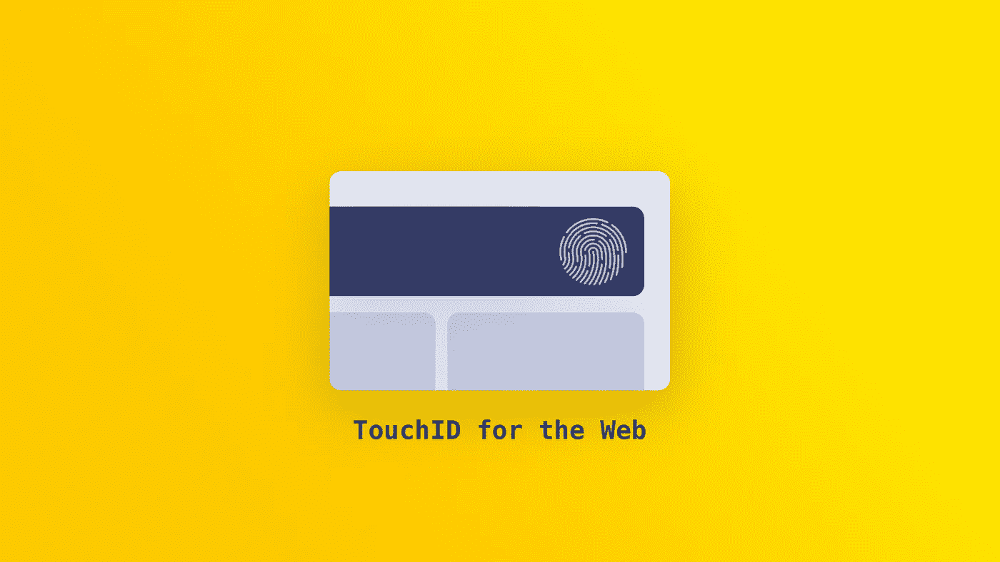
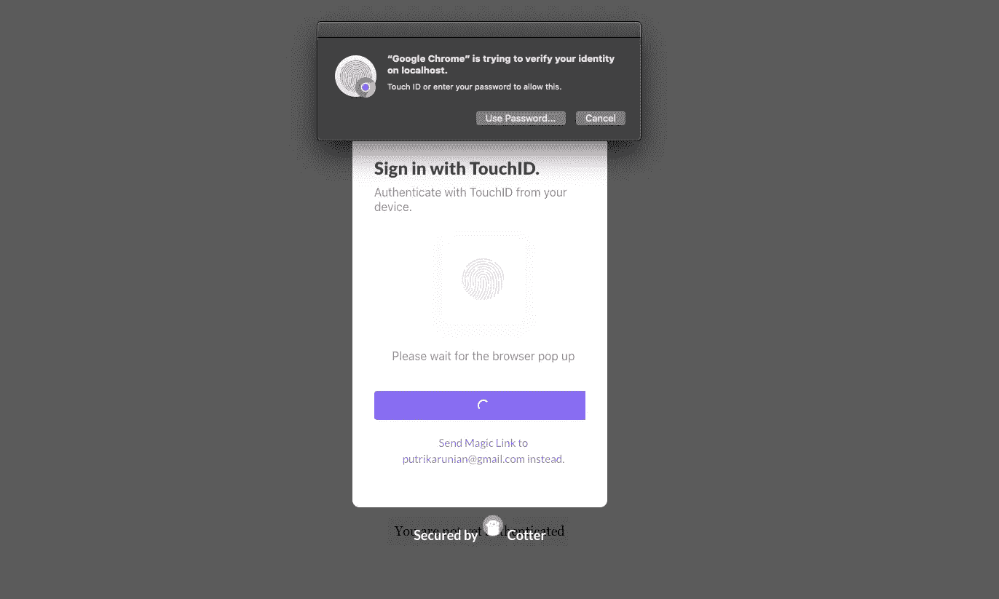
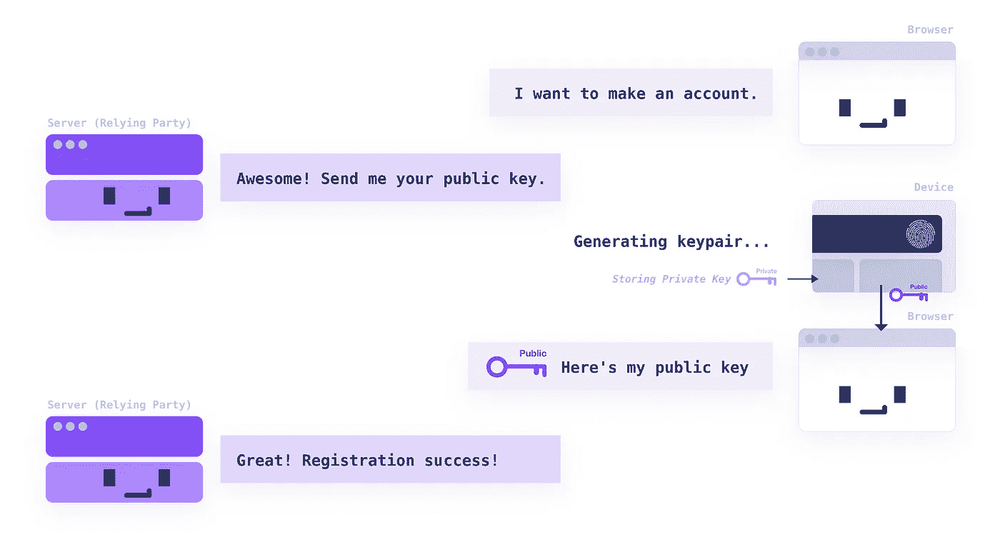
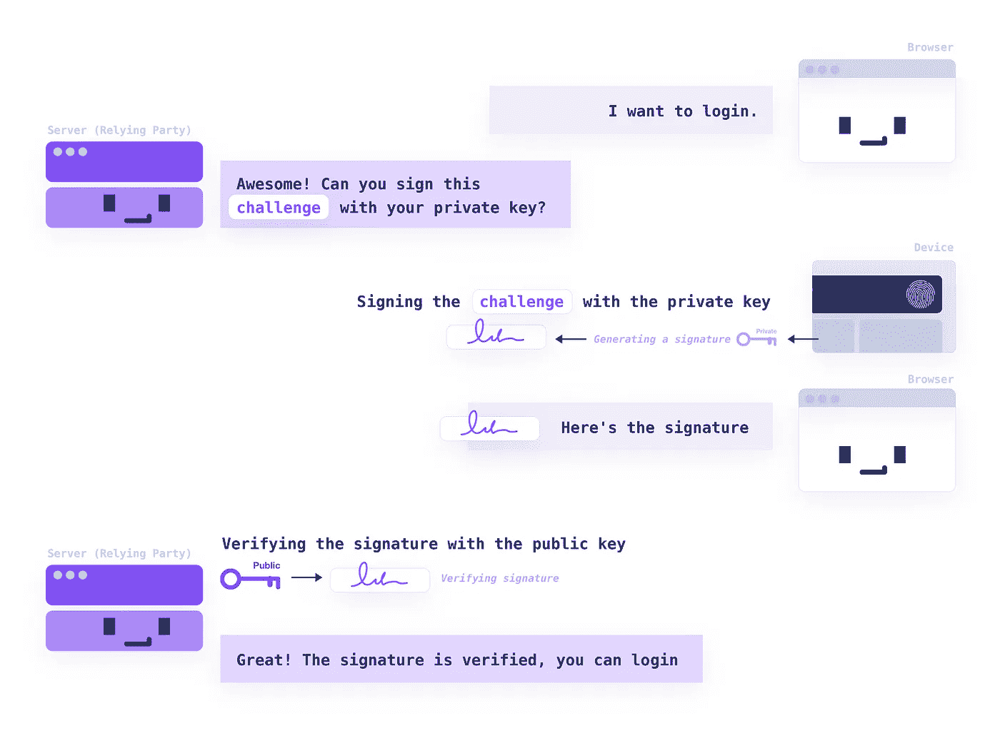

# 什么是 WebAuthn:在 web 上用触控 ID 和 Windows Hello 登录

> 原文：<https://levelup.gitconnected.com/what-is-webauthn-logging-in-with-touch-id-and-windows-hello-on-the-web-c886b58f99c3>

*为您的网站启用 TouchID 和 Windows Hello 身份验证。介绍 WebAuthn:它如何工作以及如何实现。*

# **什么是 WebAuthn？**

Web 认证 API 是一种认证[规范](https://w3c.github.io/webauthn/)，允许网站使用内置的认证器(如 Apple TouchID 和 Windows Hello)或使用安全密钥(如 Yubikey)来认证用户。

**它利用公钥加密代替密码**。当用户注册时，会为该帐户生成一个公钥-私钥对。私钥安全地存储在用户的设备中，而公钥被发送到服务器。然后，服务器可以要求用户的设备使用私钥对质询进行签名，以认证用户。

## 向 WebAuthn 注册

在注册过程中，网站通常会要求用户输入用户名和密码。使用 WebAuthn，网站将生成一个公钥-私钥对，将公钥发送到服务器，并将私钥安全地存储在用户的设备中。

WebAuthn 注册流程

## 使用 WebAuthn 登录

在登录过程中，网站通常会检查用户是否提供了正确的用户名和密码。通过 WebAuthn，网站将发送一个质询，并检查浏览器是否可以使用存储在用户设备中的私钥签署该质询。

WebAuthn 登录流程

# **用普通 JS 实现**

要了解更多关于 WebAuthn 的信息，这里有一个关于如何用纯 JavaScript 实现 WebAuthn 的深入解释。从 WWDC20 查看[苹果指南。](https://developer.apple.com/videos/play/wwdc2020/10670/)

## 登记

**步骤 1:你的站点请求服务器注册 WebAuthn。**

要求用户输入一些标识符(用户名、电子邮件等)。然后，向您的服务器发送请求，注册一个新的 WebAuthn 凭据。

**步骤 2:服务器指定一些选项来创建新的密钥对。**

服务器指定一个包含一些必需和可选字段的`PublicKeyCredentialCreationOptions`对象来创建一个新的`PublicKeyCredential`(一个密钥对)。

`rp`:指定依赖方信息，用户注册/登录的网站。如果用户注册到**你的网站**，那么你的网站就是依赖方。

*   `id`:主机的域名，不含方案或端口。例如，如果 RP 的原点是`https://login.example.com:1337`，那么`id`就是`login.example.com`或`example.com`而不是`m.login.example.com`。

`[pubKeyCredParams](https://w3c.github.io/webauthn/#dom-publickeycredentialcreationoptions-pubkeycredparams)`:服务器可以接受哪些公钥类型。

*   `alg`:描述服务器接受什么算法的数字，在 [COSE 注册表](https://www.iana.org/assignments/cose/cose.xhtml#algorithms)的 **COSE 算法下有描述。**例如，-7 代表 ES256 算法。

`[authenticatorSelection](https://w3c.github.io/webauthn/#dom-publickeycredentialcreationoptions-authenticatorselection)`:(可选)限制认证器为`platform`或`cross-platform`。使用`platform`允许 Windows Hello 或 TouchID 等授权码。使用`cross-platform`允许像 Yubikey 这样的授权码。

**步骤 3:在前端，使用选项创建一个新的密钥对。**

使用`creationOptions`，我们可以告诉浏览器生成一个新的密钥对。

返回的`credential`如下所示:

**第四步:发送** `**credential**` **到你的服务器。**

首先，您可能需要将`ArrayBuffer`转换成 base64 编码的字符串或者只是字符串。你需要在你的服务器上解码。

遵循[规范在您的服务器](https://w3c.github.io/webauthn/#sctn-registering-a-new-credential)中验证 `[credential](https://w3c.github.io/webauthn/#sctn-registering-a-new-credential)` [。然后，您应该存储凭据信息，以允许用户使用此 WebAuthn 凭据登录。](https://w3c.github.io/webauthn/#sctn-registering-a-new-credential)

## 注册

**步骤 1:向您的服务器发送登录请求。**

这允许服务器发送一个挑战，您的前端需要签名。

**步骤 2:服务器发送一个挑战和一个用户可以登录的 WebAuthn 凭证列表。**

服务器指定一个`PublicKeyCredentialRequestOptions`对象，该对象包含要签名的挑战和用户先前注册的 WebAuthn 凭证列表。

**第三步:前端签名挑战。**

返回的`assertion`如下所示:

**第四步:发送** `**assertion**` **到你的服务器并验证。**

在将 ArrayBuffers 发送到服务器之前，您可能需要将其转换为字符串。遵循[验证断言的规范](https://w3c.github.io/webauthn/#sctn-verifying-assertion)。

当断言被验证时，**用户已经成功登录**。您现在可以生成您的会话令牌或设置您的 cookies 并返回到前端。

# 一些需要考虑的事情:

**如果用户使用其笔记本电脑的 TouchID 登录，您如何允许他们从其他人的笔记本电脑登录？**

如果他们只能从自己的笔记本电脑登录，这可能是一个糟糕的用户体验。一个可能的方法是使用 WebAuthn 作为**的替代方案**，并且总是有一个后备登录方法(例如，使用 magic link 或 OTP)。

**为一个帐户添加多个 WebAuthn 凭据。**

您可能希望有一个“设置”页面，允许您的用户允许 WebAuthn 从其他设备登录。例如，如果他们想从笔记本电脑和 iPad 上登录 WebAuthn。

浏览器不知道您在服务器中为用户保存了哪些凭据。如果您的用户已经注册了他们笔记本电脑的 WebAuthn 凭据，您需要告诉浏览器，这样它就不会创建新的凭据。使用`PublicKeyCredentialCreationOptions`中的`excludeCredentials`。

# 对 WebAuthn 的支持

并非所有的浏览器都支持 WebAuthn，但它正在成长。查看 FIDO 的网站，获取支持 WebAuthn 的浏览器和平台列表。

# 就是这样！

这应该包括注册和登录 WebAuthn 的基础知识，并帮助您在您的站点上实现它。

如果您想实现 WebAuthn，这些文档可能会有所帮助:

*   [React Quickstart —使用 WebAuthn 登录](https://docs.cotter.app/quickstart-guides/react-webauthn)
*   [WebAuthn SDK 参考](https://docs.cotter.app/sdk-reference/web/sign-in-with-webauthn)

# 参考

我们参考了这些非常有用的文章来写这篇文章:

*   [网络认证指南](https://webauthn.guide/)
*   来自 W3C 的 WebAuthn 规范

# 问题和反馈

如果您需要帮助或有任何反馈，请随时在这里发表评论！

这篇文章是由 [Cotter](http://cotter.app/) 的团队撰写的——你的网站或应用程序的无密码登录。