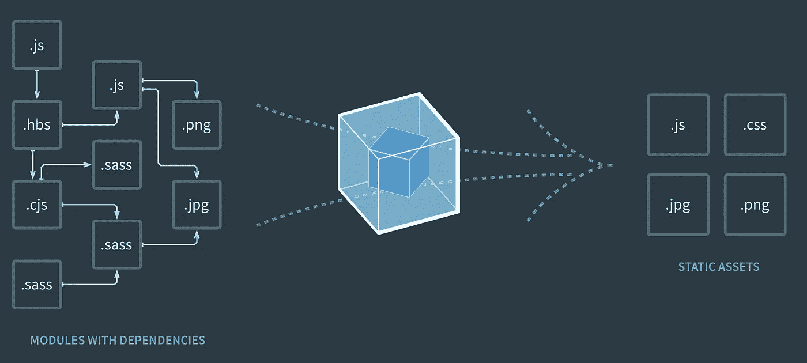
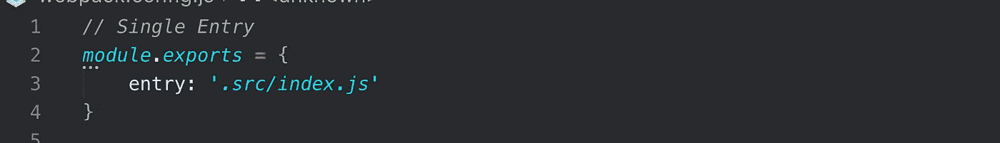
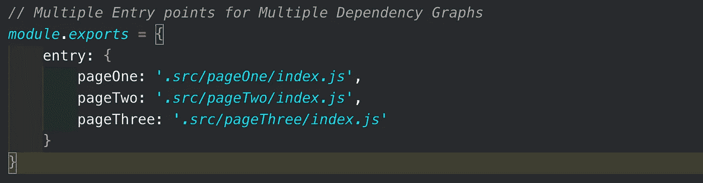
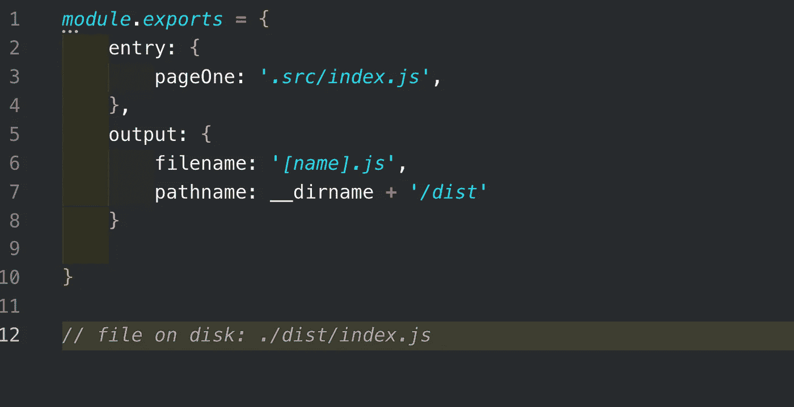
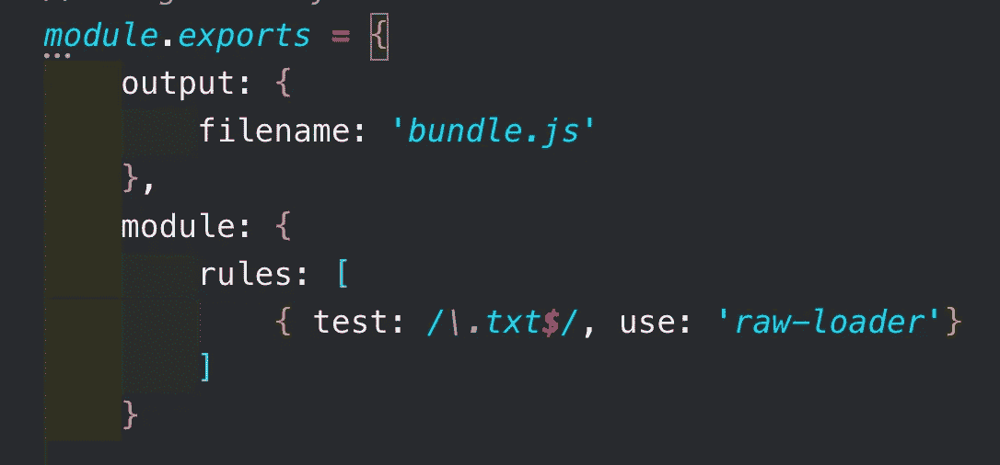
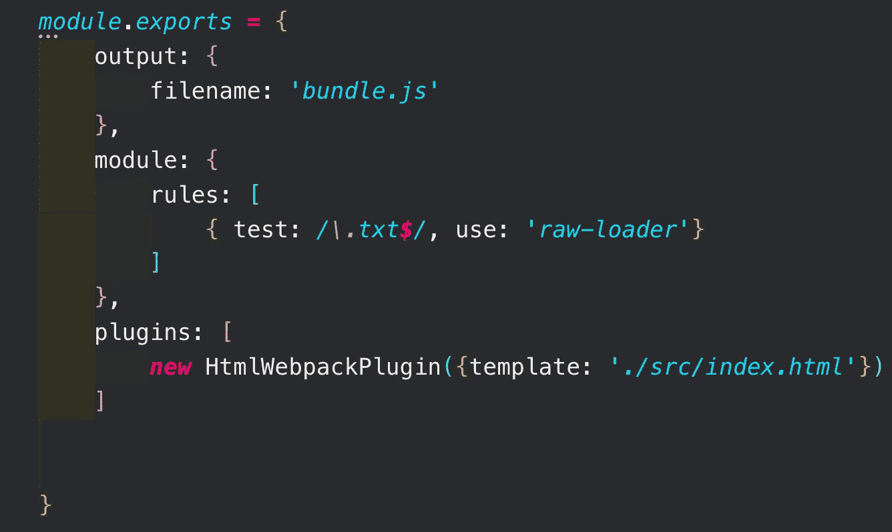
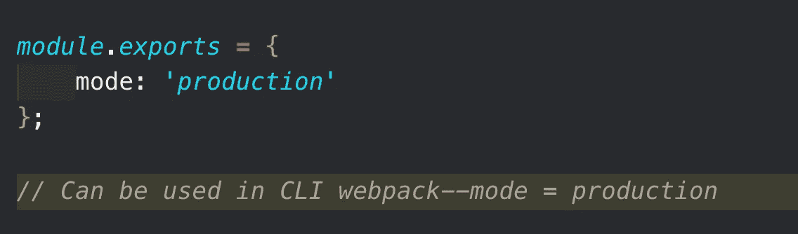

# 什么是 Webpack？

> 原文：<https://levelup.gitconnected.com/what-is-webpack-4fdb624597ae>

如果您正在构建一个现代 JavaScript 应用程序，您可能听说过前面提到的术语“webpack”。Webpack 是 JavaScript 应用程序的一个静态模块捆绑器——它从您的应用程序中取出所有代码，并使其在 web 浏览器中可用。模块是可重用的代码块，由应用程序的 JavaScript、node_modules、图像和 CSS 样式构建而成，打包后易于在网站中使用。Webpack 根据代码在应用中的使用方式来分离代码，通过这种模块化的职责划分，管理、调试、验证和测试代码变得更加容易。

带有 Webpack 的依赖图

当 Webpack 处理您的应用程序时，它会构建一个依赖图，该图会绘制出您的项目需要的模块，并生成一个或多个**包**。包是一组不同的连接代码，已经为浏览器进行了编译和转换。

如果一个文件依赖于另一个文件(它使用另一个文件中的代码)，Webpack 会将其视为依赖关系。Webpack 还会占用您的非代码资产(图像、字体、样式等)。)并将它们转换为应用程序的依赖项。

Webpack 可以分为以下 5 个原则:

*   进入
*   输出
*   装载机
*   插件
*   方式

**条目**是应用程序的入口点。这是 Webpack 将处理的第一个模块(JavaScript 文件),以构建完整的依赖关系图。它将查看导入到条目中的文件，并将这些文件添加到依赖图中。然后，它继续遍历所有导入的文件，直到完成运行应用程序所需的所有代码。

Webpack 指出哪些其他模块直接或间接地依赖于入口点。现代 JavaScript 应用程序的默认入口点是**。/src/index.js，**但是它可以设置为您选择的任何文件。也可以有多个入口点。以下是一些指定条目的示例:

多入口点专门用于多页面应用程序。在上面的例子中，您告诉 Webpack 创建三个独立的依赖图。它用新的资源获取一个新的 HTML 文档。这允许在应用程序的不同页面中最大化可重用代码，使其更加优化。

**输出点**是文件以文件名写入磁盘的位置。主输出文件被写成**。/dist/main.js** 和任何其他文件被添加到 **dist** 目录中。输出设置在与入口点相同的位置。输出还可以使用内容的散列或块名，允许它在代码改变时动态更新。这确保您能够提供正确的代码。

默认情况下，Webpack 只知道如何处理`.js`或`.json`文件，这是有限制的。使用**加载器**，Webpack 可以扩展功能，通过将其他文件类型转换为应用程序的模块来处理它们。

装载机在`rules`下的`module`键中指定。添加一个加载器需要两个配置选项— **测试**确定应该转换的文件或文件类型，而**使用**告诉 Webpack 使用哪个加载器来转换这些文件。它看起来像下面这样:

加载器也可以通过命令行与导入语句内联使用。

**插件**处理加载程序无法完成的额外任务。这包括诸如包优化、定义环境变量等。另一个例子是为单页 web 应用程序提取一个样式表或者生成一个`index.htm` l 文件。

为单页 web 应用程序提供新的 index.html 页面

**模式**告诉Webpack 为您的应用程序使用哪些配置和优化。这触发了 Webpack 的一些特定模式插件，这些插件内置于 Webpack 中，为正确的环境构建它。模式有**开发、生产或无。**如果未指定模式，则 Webpack 自动默认为生产。

开发针对更快的构建时间和调试的代码可读性进行了优化。生产优化尽可能最小的构建，需要更长的构建时间来解析和收缩代码。

你应该知道的最后一件事是浏览器兼容性。目前，Webpack 被设置为支持兼容 ES5 及以上版本的浏览器。

希望通过这个小小的介绍，您可以开始修改您的 Webpack 配置，并创建一个适合您和您的 JavaScript web 应用程序工作流的设置。

 [## 学习 Webpack -最佳 Webpack 教程(2019) | gitconnected

### 8 大 Webpack 教程-免费学习 Webpack。课程由开发人员提交并投票，使您能够…

gitconnected.com](https://gitconnected.com/learn/webpack)