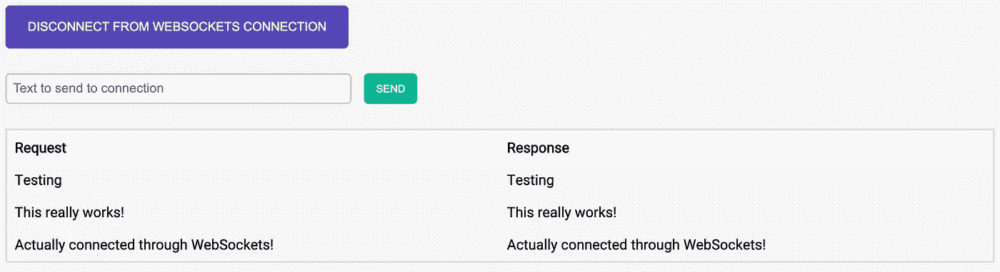

# 什么是 WebSockets？—将客户端和服务器连接在一起的技术

> 原文：<https://levelup.gitconnected.com/what-is-websocket-bring-that-multiplayer-feel-to-your-web-or-mobile-application-2c945a8e7246>


当您键入一个 URL 并按 Enter 键时，您的浏览器实际上向与该 URL 相关联的服务器发送了一个 [HTTP 请求](https://www.tutorialspoint.com/http/http_requests.htm)。然后，服务器用一个 [HTTP 响应](https://www.tutorialspoint.com/http/http_responses.htm)进行响应，并可能发回类似 HTML 文件的内容。

一旦建立了连接，交易完成，连接就不复存在。您的浏览器和服务器之间无法再进行通信。

如果我们想构建一个聊天应用程序，让我们知道别人何时发送了新消息，那会怎么样？使用常规 HTTP，您必须不断刷新页面才能看到新消息。但是这并不方便用户使用。我们可以做得更好。

# 实时网络通信的历史


当客户端和服务器之间的实时通信问题在 21 世纪初首次出现时，答案是 AJAX，即异步 Javascript 和 XML。它允许 web 开发人员向服务器发出请求，而不必重新加载整个页面。现在，您可以发送特定信息的请求，并在页面上更新您的信息，而无需重新加载。

然而 AJAX 的缺点是它是单向的。基本上，您的浏览器可以向服务器发送请求，查看是否有新数据。但是，服务器无法启动与您的浏览器的连接，也无法向您的浏览器发送数据更新。

所以开发人员创造性地使用 AJAX，创造了一种叫做 ***轮询的东西。本质上，你的浏览器会在设定的时间间隔发送请求，或者保持连接直到服务器传回新的数据。***

定期轮询是指在设定的时间间隔内发送 AJAX 请求。例如，使用聊天应用程序，您可以每 5 秒钟向服务器发送一次请求，以获取最新消息。

长轮询是指服务器和客户机之间的连接保持足够长的时间，以便数据用新数据进行响应。一旦服务器提供了新的数据，连接就被关闭。但是，您可以立即向服务器发送一个新的长轮询请求，以模拟数据的实时事务。

## 拯救世界的网络插座


AJAX 只允许我们在需要的时候向服务器发送请求，但是它不允许服务器在需要的时候发送响应。

WebSockets 力挽狂澜。WebSockets 允许双向(双工)通信。这意味着您可以让您的客户机和服务器在不中断连接的情况下相互通信。我们不再需要依赖 HTTP 协议进行实时通信。相反，我们“升级”了 HTTP 协议，这样我们就可以保持客户机和服务器之间的通信。

当 WebSocket 第一次启动时，它向您指定的 URL 发送一个简单的 HTTP 请求。从那里，HTTP 请求“升级”为 TCP 套接字，实质上是 HTTP 握手发生后数据流动的安全隧道。握手可以被认为是客户机和服务器之间保持连接的“协议”。

## 什么时候使用 WebSockets？

尽管听起来很棒，但 WebSockets 并不能完全取代 HTTP 协议。使用 WebSockets 的最佳时机是当您需要服务器和客户端之间的低延迟实时通信时。

例如，如果你正在开发一个聊天应用程序，你希望你的用户应用程序与你的应用程序服务器保持连接，这样它就可以在用户回复信息时收到通知。WebSockets 可以帮助实现连续的数据流。

从本质上讲，当您希望通过互联网“流式传输”数据时，无论是客户端到服务器还是服务器到客户端，WebSockets 都是一个好主意。

值得注意的是，WebSockets 并不能在所有浏览器上工作。有些浏览器支持，有些不支持。用来测试 WebSockets 是否已经集成到浏览器中的一个很好的资源是 CanIUse.com。

> ***你知道吗？*** Google Drive 不使用 WebSockets 来启用 Drive 的协作功能。他们使用自己的标准，与 WebSockets 略有不同。这个[答案](https://stackoverflow.com/questions/35070217/what-technology-does-google-drive-use-to-get-real-time-updates)解释的很好。
> 
> Google 可能已经决定这样做了，因为 WebSockets 还不是所有浏览器都支持的。许多人在国际上依赖于谷歌产品，因此旧技术也必须得到支持，以便提供更统一的用户体验，无论技术质量如何。
> 
> 然而，这并不意味着您应该放弃 WebSockets。仅仅因为 Google 不使用它并不意味着 WebSockets 不应该被使用。WebSockets 有自己的时间和地点。尤其是当您的企业不关心大型浏览器支持时。

# WebSockets 如何工作

WebSockets 使客户机和服务器之间的 HTTP 连接保持开放成为可能，这样它们就可以相互通信。这是网络通信的一个重大发展。以下是 WebSockets 的一些重要区别:

*   WebSockets 是一个独立的基于 TCP 的协议。HTTP 是一个独立的基于 TCP 的协议来发送和接收数据。然而，WebSockets 被设计为支持在 TCP 连接上运行的任何其他协议。本质上，您可以同时使用 HTTP 和 WebSockets。
*   WebSockets 是一个传输层，允许其他协议在其上运行。WebSockets API 允许您定义子协议。子协议是帮助解释特定类型的其他协议的库。将子协议视为 WebSockets 技术的“插件”。
*   您可以运行的其他协议或“插件”的例子有 XMPP、STOMP、SOAP、WAMP 等。
*   使用 WebSockets 的唯一要求是您使用一个 Javascript 库，该库可以处理“握手”并维护 WebSockets 连接。可以把 Javascript 库想象成一个模块，它允许你启动一个 WebSockets 连接并保持它打开。

## 旅程的开始

WebSocket 连接从简单的 HTTP 请求开始。您的浏览器发送到网络服务器的连接，网络服务器将看到您想要“升级”您的连接。这开始了“握手”过程。一旦完成，就创建了一个 WebSocket 连接。

具体情况是这样的:

1.  您的浏览器发送一个普通的 HTTP 请求，请求一个额外的头。
2.  web 服务器获得 HTTP 请求并注意到对`Upgrade`头的请求。这让 web 服务器知道我们正在请求 WebSockets 连接。
3.  如果服务器支持 WebSockets 协议，并且基本上以通信协议已经切换的确认来响应。

需要注意的是，WebSocket URLs 使用了`ws`或`wss`方案。你将不再使用`http`或`https`来交流。

> ***附加信息*** 如果您正在使用某种会话 cookie 来识别发起 HTTP 请求的用户，您会想知道如何防范 CSRF(跨站点请求伪造)攻击。这里有一篇令人惊叹的文章[涵盖了为基于 WebSockets 的应用程序实现“稳固握手”的内容。](https://blog.securityps.com/2020/05/websockets-importance-of-firm-handshake.html)

第一步中启动的常规 HTTP 请求的示例可能如下所示。我加粗了额外的标题，让 web 服务器知道我们正在尝试升级连接:

```
GET wss://websocket.sunnychopper.com/ HTTP/1.1
Origin: [http://sunnychopper.com](http://sunnychopper.com)
Connection: Upgrade
Host: websocket.sunnychopper.com
**Upgrade**: **websocket**
```

## 让交流成为可能

一旦 HTTP 请求被升级为 WebSockets 连接，您的浏览器和服务器现在就可以通信了。

需要注意的是，移动设备行业的所有主要参与者都为他们的本地应用程序提供了 WebSocket APIs。这意味着您可以在 web 浏览器之外使用 WebSockets。您可以使用 Swift 和 Java/Kotlin 在移动应用程序中启用 WebSockets。

> ***用 React Native 或者 Flutter 之类的东西构建的应用呢？如果你正在使用 React Native、Flutter、Ionic、Xamarin 或其他混合方法开发应用程序，你可以随时检查该库是否支持 WebSockets。***
> 
> 例如，React Native 有一个名为`[react-native-websocket](https://www.npmjs.com/package/react-native-websocket)`的 NPM 包，可以帮助建立 WebSockets 连接，尽管它不是直接用本地语言开发的。

# 实现 WebSockets

为了开始使用 WebSockets，您可以使用下面的 WebSockets URL 进行测试:`wss://echo.websocket.org`

这是 WebSockets 背后的善良的人们提供给我们的一个公共地址，这样我们就可以熟悉这项技术，而不需要我们自己建立一个服务器。

你可以通过链接[在这里](https://codepen.io/sunnychopper/project/editor/XkGLgG)查看所有的代码。它会把你带到 CodePen，在那里你可以实时分析代码，并对其进行研究。

 [## 连接到 WebSockets

### 关于如何使用 Javascript 连接到 WebSockets 连接的基础教程。它涵盖了四个主要的…

codepen.io](https://codepen.io/sunnychopper/project/editor/XkGLgG) 

> ***想自己设置后端服务器？*** 取决于你使用的后端技术(Node.js，PHP，Python 等。)，将有不同的方法来实现 WebSockets 到您的 web 服务器中。
> 
> 只需谷歌一下“node expressjs websockets”或“php laravel websockets”，你就会找到大量信息。

## WebSocket 事件

WebSocket API 有四种主要的事件类型:打开、消息、关闭和错误。

***Open*** 一旦客户端和服务器之间建立了连接，Open 事件就会被触发。这也称为客户端和服务器之间的“初始握手”。

如果你想在连接建立后做一些动作，你需要定义一个`onopen`函数。


当 WebSockets 连接建立后更改按钮的文本。

***消息*** 每当服务器想要发送一些数据时，它就被称为“消息”，因为它实际上是浏览器将从服务器获得的新消息。消息可以是纯文本、二进制数据、JSON、图像数据等等。

如果您想在浏览器收到来自服务器的消息时执行某种操作，那么您需要定义一个`onmessage`函数。


基于从 WebSockets 连接接收的消息更新表。

现在，每当我向测试 WebSockets 连接发送消息时，它会立即发回一条消息，只是“回应”您所说的内容。



发送带有数据的请求并接收消息作为响应。

***关闭*** 每当客户端和服务器之间的连接关闭时，就会触发关闭事件。由于连接不良或定义了一个`onclose`事件，可以关闭一个连接。

连接关闭后，客户端和服务器不能再交换任何消息。在`onclose`函数的定义中，您可以添加一些其他的功能，比如保存、缓存，或者您想在连接关闭之前做的任何事情。


每当 WebSockets 连接关闭时运行一些代码。

***错误*** 每当客户端与服务器通信过程中出现错误，就会触发错误事件。您可以通过定义`onerror`函数获得关于错误以及如何处理它的详细信息。


添加代码以在发生错误时将错误条目追加到我的表中。

## WebSocket 操作

当某些事情发生时，事件被触发。事件是反动的。他们对某些事件的发生做出反应。这是您处理后端服务器扔给应用程序的数据的方式。

另一方面，有行动。行动是主动的，有意图的。动作是当用户想要做某事时运行的东西。动作只能由客户端使用对 WebSocket 函数的显式调用来发起。

主要有两个动作: ***发送*** 和 ***关闭*** 。

***发送***
当您希望您的客户端应用程序向后端服务器发送一些数据时，您将需要使用`send()`函数。例如，如果您正在开发一个实时聊天应用程序，每当用户想要向聊天发送消息时，您希望用户的浏览器向后端发送一个请求。


通过 WebSockets 连接将输入的值发送到后端服务器。

***关闭*** 如果您想关闭 WebSockets 连接，可以使用`close()`功能。这种方法本质上是“告别握手”一旦连接被关闭，如果要进行进一步的通信，必须重新建立连接。


## 构建您的应用程序

这些是 WebSockets 的基础:事件和动作。一旦你理解了这四个事件和这两个动作，其他的事情就应该开始有条不紊了。

您可以使用`send()`向服务器发送数据。这可以是字符串、JSON 对象、XML 对象或数组缓冲区。

例如，假设您正在构建一个实时团队代码编辑器。您希望每个人都能看到每个人的光标在代码中的位置。每当团队中的任何人启动代码编辑器时，您就让他们的浏览器通过 WebSockets 连接到您的后端服务器。

您可以使用一些 Javascript 读取用户光标在代码中的位置，并使用`send()`函数发送具体的光标位置信息。例如，您发送的对象的结构如下:

```
{
  line: 192,
  column: 56,
  userId: 424
}
```

后端服务器可以接收、读取这些信息，并将您的新位置发送给其他所有连接到 WebSockets 连接的人。一旦你的队友通过一个`onmessage`功能接收到你的新光标位置，他们的浏览器就可以更新你的光标在队友屏幕上的位置。

# TL；DR —结论

在我看来，如果你想给你的产品增加“多人”的感觉，WebSockets 是一项值得研究的技术。

与传统的 RESTful API 和 HTTP 相比，使用 WebSockets 连接有很多好处。以下是所有优势的总结:

1.  **双向
    传统的 HTTP 请求是单向的。它们只能从客户端发送到服务器。服务器无法启动与客户端的连接并向其发送数据。使用 WebSockets，客户端和服务器都可以相互发送和接收消息。**
2.  **全双工**
    本质上这意味着客户端和服务器可以同时向对方发送消息。客户端和服务器都不必等待响应。
3.  **单一 TCP 连接** 每当你使用一个简单的 RESTful API 时，每当你想发送数据时，你必须通过发送一个 HTTP 请求来创建一个到服务器的新的 TCP 连接。在您通过 HTTP 收到来自 API 的响应后，TCP 连接被终止。另一方面，WebSockets 升级 HTTP 连接并保持连接活动，以便客户端和服务器可以通过同一个 TCP 连接进行通信。这导致处理大量消息所需的时间大大减少。


WebSockets 在流式传输大量数据时，在性能方面抽 RESTful API。

WebSockets 需要记住四个主要事件:打开、消息、错误和关闭。

Open ( `socket.onopen`)在 WebSockets 连接建立后被触发。当客户端收到来自服务器的消息时，Message ( `socket.onmessage`)被触发。当通过 WebSockets 连接的数据传输出错时，将触发 Error ( `socket.onerror`)。当 WebSockets 连接关闭时，Close ( `socket.onclose`)被触发。

用户可以采取两种主要的操作类型:发送或关闭。

Send ( `socket.send(data)`)允许客户端通过 WebSockets 连接向后端服务器发送数据。Close ( `socket.close()`)允许客户端关闭与服务器的 WebSockets 连接。

## 有什么问题吗？

如果您对 WebSockets 有任何疑问，请随时在社交媒体上联系我。联系我的最好方式是通过 Twitter ( [sunnychopper](https://www.twitter.com/sunnychopper) )，我很乐意回答任何问题，甚至只是就技术和业务进行交谈。

如果这个指南帮助你对 WebSockets 有了基本的了解，以及它们能为你和你的企业做些什么，请留下一些掌声，因为它能帮助我决定下一步制作什么类型的内容！我一直在倾听反馈。💯