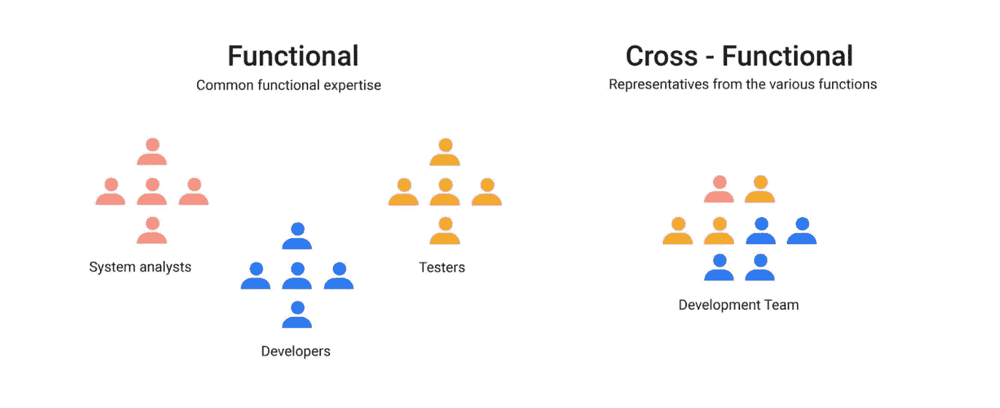
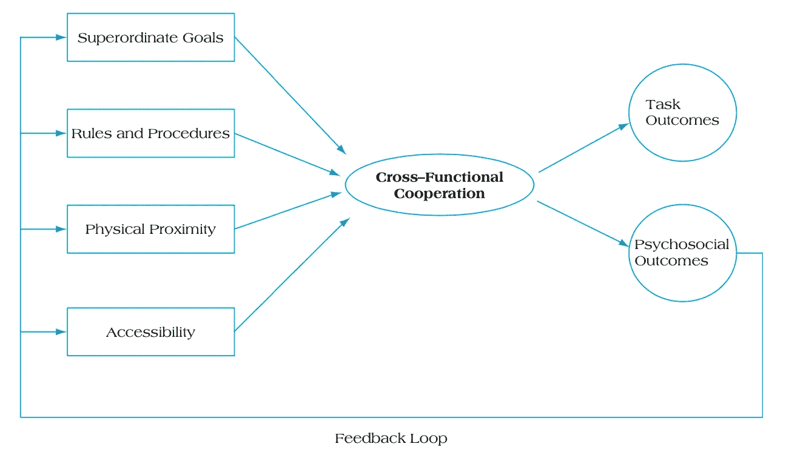
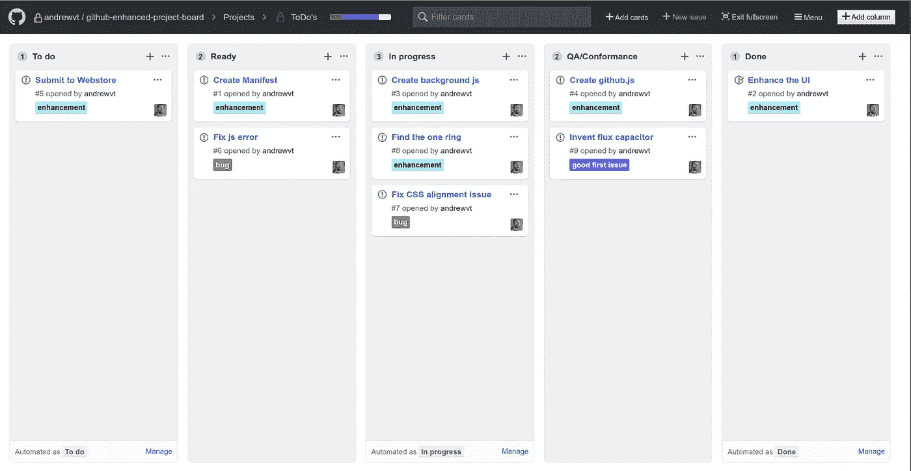
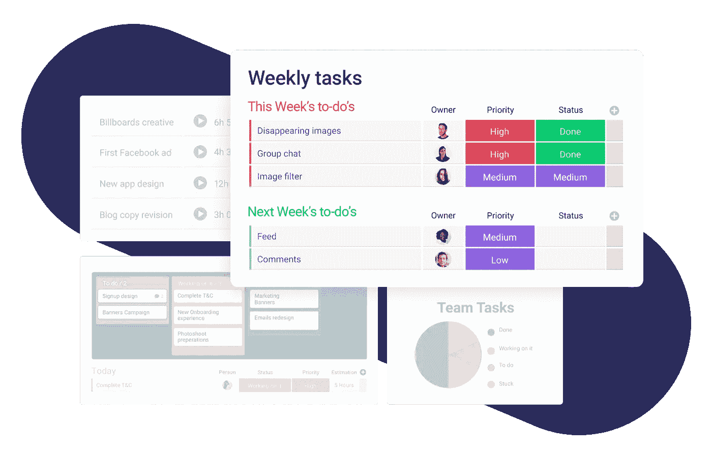

# 如何建立一个成功的跨职能团队？

> 原文：<https://levelup.gitconnected.com/what-it-takes-to-have-a-successful-team-cooperation-bc21b82e9f3>

## 复杂环境下的战略决策越多，对优秀项目经理的要求就越高。

# 作者说明

问候读者，

本文是“ ***【我与创业公司一起成长】”***系列的一部分，该系列由各种*技术教程、新闻和软件开发技巧*组成:

1.  [用 Node.js(第 1 部分)— ES6](https://medium.com/swlh/a-complete-guide-build-a-scalable-3-tier-architecture-with-mern-stack-es6-ca129d7df805) 构建一个结构良好的三层架构
2.  [提高团队代码质量的两个简单技巧](https://medium.com/swlh/2-simple-tips-to-increase-your-team-code-quality-143b879ae2f7)
3.  [认证的完美结构&用 Node.js 授权你的 API](https://medium.com/swlh/perfect-structure-to-authenticate-authorize-api-with-node-js-and-passport-jwt-d529b1a618ba)
4.  [我在一个小时内构建了一个 M.E.R.N 代码库](https://medium.com/swlh/i-built-a-m-e-r-n-codebase-in-an-hour-742acd71ed7e)(第 2 部分)
5.  [如何用 Java 构建 REST API&MySQL 使用 Tomcat](https://medium.com/@calvinqc/build-a-simple-rest-apis-with-java-8-tomcat-jsp-mysql-intellij-on-mac-3308f4e59a03)
6.  [使用 Nodemailer、Gmail & Google OAuth2](https://medium.com/swlh/multi-purposes-mailing-api-using-nodemailer-gmail-google-oauth-28de49118d77) 构建自己的邮件 API
7.  [WebRTC——支持 Google Meet、Facebook Messenger 的技术](https://medium.com/swlh/webrtc-the-technology-that-powers-google-meet-hangout-facebook-messenger-and-discord-cb926973d786)
8.  向新的 Github CLIs 问好
9.  [使用 Java、Springboot、Kafka 进行简单设置](/easy-java-springboot-apache-kafka-setup-on-macos-ceb481e167f8)
10.  **成功的团队合作需要什么**
11.  [如何使用 Docker、EC2、ECS 和 ECR 将应用程序部署到 AWS](https://medium.com/swlh/how-to-deploy-an-application-to-aws-using-docker-ecs-and-ecr-aa7785fc9667)
12.  [通过将我们的客户端托管到云存储，我们节省了 45%的总成本](https://medium.com/@calvinqc/we-cut-down-45-of-our-budget-by-switching-to-google-cloud-storage-7e5a6a10542)

感谢访问这个系列，并享受阅读！

图片来源按任务鸽博客

当一个项目或组织变得越来越大，并且涉及来自不同专业的不同人之间的更多协作时，确保不同团队之间的顺利集成是必不可少的。

因此，了解***【CFC】***的特性已经成为任何管理者的基本知识之一。

# 什么是跨职能合作？

跨职能合作是指一群人，包括那些在财务、运营、营销、人力资源和 IT 方面拥有不同专业知识的人，为了一个共同的目标而共同努力。每个人将专注于他们的领域，但分享知识和资源，以促进和加快成功的团队目标。

来源于 Pingboard

# 经理需要清楚地了解成功的 CFC 的定义

当具有不同工作风格和职能的个人走到一起时，结果可能是创新和变革。然而，研究表明，尽管有积极的影响，许多跨职能团队功能失调。

因此，领导者或经理必须清楚地了解哪些**影响者**会影响团队的生产力及其可能的**结果**，这一点很重要。

# 影响者

影响合作的主要因素有 4 个

资料来源:M. B .平托、J. K .平托和 J. E .普雷斯科特。(1993)

# 至高无上的目标

为了完成项目的一个主要目标，管理人员通常会拆分成许多目标明确的小功能/项目，这些功能/项目将支持一个最终的大项目。

为了打造一款漂亮且功能强大的 Macbook，我们不能让一个团队来做所有的事情。

因此，它被分成许多小团队来完成特定的任务，这些任务支持 Macbook 的一个功能。

例如，我们可能有 2 个团队:软件和硬件。

软件团队可以分成许多子团队:

*   云，iOS 版本，UI/UX…

硬件团队也是如此:

*   电池、触控板、主板、Wifi、蓝牙…

当然，上面列出的那些团队可以分成许多更小的团队来处理更小的部分以支持那个特性。在最后阶段，所有的小功能结合在一起，创造出我们今天看到的成功的 Macbook Pro。

# 规则和程序

*没有规章制度的团队是不成功的*

当我们作为一个团队编码时，有一个特定的规则或指导方针供所有开发人员遵循，这样其他人就可以容易地阅读代码并减少理解的时间。

如果一个团队由 10 个开发人员组成，而这 10 个开发人员都有 10 种不同的编码风格，那么当其他开发人员试图合并不同的功能以使他们的功能工作时，我们将会有一个巨大的合并冲突。会浪费很多时间和头痛。

3 个月前，我写了 [2 个简单的技巧](https://medium.com/swlh/2-simple-tips-to-increase-your-team-code-quality-143b879ae2f7)来增加代码开发，现在我的所有团队成员都可以比班上的其他团队更有信心地编写代码。

*因此，必须定义清晰的层级，并且所有人都理解参与和沟通的规则。*

# 物理接近度

对于一个团队来说，要产生最好的结果，最好是每个人都保持相互接近。

当我在 PayPal 实习时，所有的团队成员都坐在同一层楼的同一区域。因此，每当我的经理想要召开站立会议时，每个人都可以在 5 秒钟内走到自己的办公桌前。或者我有问题可以把椅子挪到导师旁边提问。这样会节省很多时间，提供更好的沟通。

> 当项目团队成员在彼此附近工作时，他们更有可能交流，并最终合作

**由于新冠肺炎:**许多公司现在通过 Zoom、Facebook Messenger、Google Meet/Google Hangout、Discord 等转向远程会议。

我一直是[Facebook Messenger 和 WebRTC 技术](https://medium.com/swlh/webrtc-the-technology-that-powers-google-meet-hangout-facebook-messenger-and-discord-cb926973d786)的粉丝，现在他们刚刚发布了新功能，可以共享屏幕，并在群组视频通话中添加更多人，这太棒了。

# 易接近

拥有相同的工作环境系统将使每个人更好地相互协作。

当我们要安排会议时，团队成员应该有相同的日历系统，如 Outlook、Google calendar、Calendar。这使得每个人都可以很容易地看到彼此的日程安排，并在没有连续重新安排冲突的情况下进行会议。

项目管理有很多很棒的工具，比如 [MS Project](https://www.microsoft.com/en-us/microsoft-365/project/project-management-software) 、 [Asana](https://asana.com/) 、[周一](https://monday.com/)、 [Sunsama](https://sunsama.com/) 、 [Smartsheet](https://www.smartsheet.com/) 等等。但是由于大部分工具都是付费的，所以作为开发者，我只是更喜欢 [Github 项目](https://github.com/features/project-management/)

图片由 Bluehouse Group 提供

# 结果

在里程碑结束时，项目经理将根据两种不同的结果分析和评估团队的绩效:

## 1.任务结果

首先，管理者将通过最终结果来检验项目的成功:

*   团队**是否在本周或本月实现了目标**。
*   通过给团队提供最好的资源，他们已经全部或部分实现目标了吗

## 2.心理社会结果

这种类型的结果通常导致团队的沟通，个人的情绪。

> 出色的表现将对项目团队产生的情绪和心理影响。

*   每个人在一起都快乐吗？
*   每个成员是否容易表达和听取不同的想法？

然后，经理将学习下次为了更好的结果需要改进什么，并继续保持或改变团队的工作方式！

# 后续行动

*   如果你喜欢阅读 ***《我与创业公司一起成长》*** ，并希望在未来阅读更多。请在此订阅[。​](http://eepurl.com/g5qIBf)
*   在 [Github](https://github.com/calvinqc) 、 [LinkedIn](https://www.linkedin.com/in/calvinqc/) 上与我联系