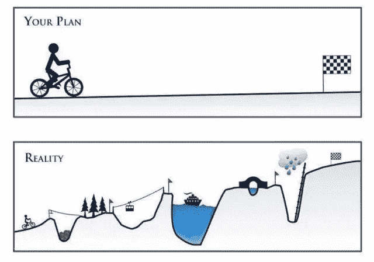
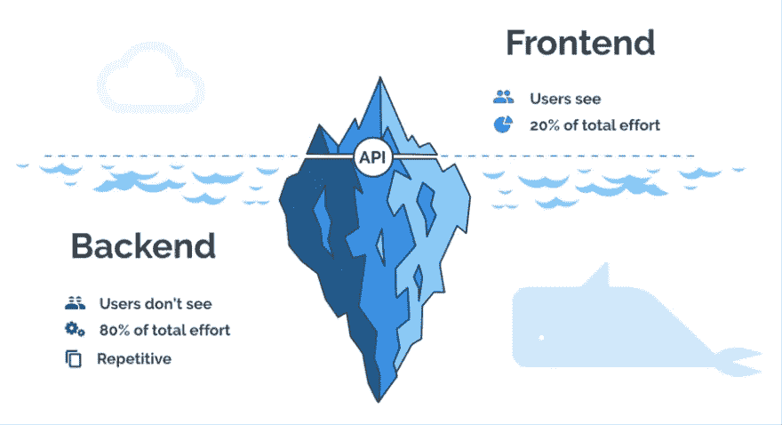

# 做一名软件工程师是什么感觉

> 原文：<https://levelup.gitconnected.com/what-its-like-to-be-a-software-engineer-40fbf9bc9c6a>

## 揭露软件工程本质的短篇故事

来源: [Steemit](https://steemit.com/cryptocurrency/@sidgoenka/things-you-should-know-before-investing-in-crypto-currencies)

在我写这篇文章的时候，我已经作为一名专业软件工程师工作了大约 4 年。我喜欢它。总是有新的挑战和技术让我保持警觉。在大学期间，我对成为一名软件工程师有一个宏伟的想法。我的愿景是坐在白板前，一边和同事喝咖啡，一边解决复杂的算法问题。虽然有时可能是这种情况，但这里有一个故事来展示软件工程到底是什么样的。

# 3 个月添加昵称

在过去的三个月里，我一直在为我们的业务做一个项目。我被要求给我们的软件添加一个昵称功能。很有道理。我们所做的大部分工作都涉及到与客户的互动，许多人使用昵称而不是真实姓名。例如，一个叫罗伯特的人可能被称为鲍勃。我们想确定我们叫他鲍勃，但是如果我们用他的卡收费，我们需要保留罗伯特的档案，因为那是他的法定姓名。

这是一个小小的添加昵称的项目是如何变成一个为期三个月的项目的。

## 阶段 1 —数据库更新

来源:[数据库更新框架](https://projects.vdf-guidance.com/projects/the-database-update-framework)

第一步是确保我们的数据库有存储昵称所需的字段。我不得不在这里做一些研究，以找到名字所在的地方，因为我们可能需要在那里添加昵称。原来有几个数据库和表都有名字。在缩小了拥有名字字段的数据库和表的范围之后，我不得不问哪个数据库和表真正需要昵称？

用于数据导入的一个表有名字字段。然后，我不得不联系那些负责提供数据的人，询问他们在表单上添加昵称字段是否有意义。经过一番反复讨论，我们认为这样做没有意义。

之后，在与所有可能写这个字段的人交谈之后，我向我们的数据库管理员提交了 RFC(变更请求)票。不到一天，他们转过身来问我，我是否与数据分析团队讨论过这将如何影响他们的工作流，以及我是否考虑过添加任何这种内容是否会影响他们现有的任何存储过程。不用说，我没有。

我与数据库管理员(数据库管理员)和分析团队一起工作了一周，以确保现场工作对于他们的工作流程是安全的，然后我们将新的现场投入生产。

## 阶段 2 —后端应用程序更新

来源:[dev . to-Saeed Ahmad](https://dev.to/saeeddev/5-free-tutorials-you-should-complete-to-master-the-back-end-3077)

下一步是更新我们现有的几个应用程序。我们的一个程序是用来匹配现有账户的进口。在这里，我必须添加一个检查来查看导入的名字字段是否与任何帐户的名字或昵称相匹配。如果匹配足够强，则不需要做进一步的工作。

接下来是决胜局。如果导入与我们寻找的一些字段有松散的匹配，它将被发送到那里，用户将手动查看数据，看看它是否匹配。如果是的话，更新是他们使用了一个我们在文件上没有的昵称，他们需要能够设置昵称字段。

更新记录调整和决定应用程序的问题是，两年多来没有人碰过它们，它们是在我不熟悉的 ASP.NET 写的。因此，整个发布管道都过时了，必须更新包，然后必须修复更新包中任何不赞成使用的特性。

## 第 3 阶段—用户界面更新

来源:[米基尼斯塔](https://kinsta.com/feature-updates/gmail-mx-records-ui-security/)

最后，在数据库有了正确的字段并且后端支持它之后，我就可以对 UI 进行修改了。这涉及到向各种表单添加字段。需要 JavaScript 将数据加载到几个不同的位置。ASPX 文件已更新，以反映这些变化。甚至需要一些手工 HTML。

## 最后

没人告诉我，发展会有多少繁文缛节。有些事情听起来很简单，并不一定意味着就是这样。老实说，我喜欢我的工作。当然，有些部分出乎意料地复杂或枯燥，但它们比我要解决的挑战更重要。软件工程也是一个不断发展的领域。我喜欢学习，所以不断有新的东西知道是很好的。

如果你喜欢这篇文章，这里还有一些你可能感兴趣的:

 [## 停止写垃圾代码

### 编写易读易调试代码的实用指南。

medium.com](https://medium.com/better-programming/stop-writing-crap-code-7d3458f42384)  [## 创建可扩展搜索引擎的简单架构

### 构建搜索引擎的简单方法

levelup.gitconnected.com](/simple-architecture-for-creating-a-scaleable-search-engine-b6db74b122f7)