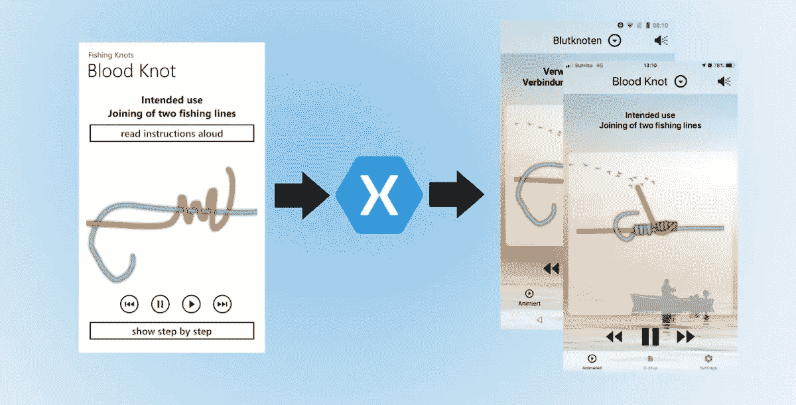

# 我从用 Xamarin 将我的第一个应用移植到 Android 和 iOS 系统中学到了什么

> 原文：<https://levelup.gitconnected.com/what-ive-learned-from-porting-my-first-app-ever-to-android-and-ios-with-xamarin-f3ac43c13f94>

我终于完成了我的第一个应用程序从 Windows Phone 到 Android 和 iOS 的移植——“钓鱼结+”现在已经在谷歌 Play 商店和苹果应用商店发布。这篇文章总结了我在移植过程中学到的东西。

# 这个应用程序是关于什么的？

这个应用程序是关于钓鱼结的。对大多数人来说，这听起来很无聊，但对我来说，这个应用程序让我成为了一名开发人员。我对它有某种情感上的联系。那是在 Windows Phone 7 又新又热的时候。这是微软新推出的闪亮操作系统，但它明显缺乏 iOS 和 Android 上可用的应用程序。那时候我也在德国设法拿到了钓鱼执照。

由于我很难记住如何打钓鱼结，所以我搜了一下商店，什么也没找到。我对这个事实感到非常愤怒，部分原因是这意味着我当时必须使用一个静态网站，但更沮丧的是存在这个应用程序差距的事实(WP7 用户会记得)。因此，我最终决定学习如何为 Windows Phone 编写代码，并在几个月的自学后编写了我的第一个应用程序。

# 为什么要移植

写代码很快成为我最喜欢的业余活动，有效地取代了钓鱼。就这样，几年过去了，我开发了更多的应用程序(其中大部分是为 Windows Phone 开发的)，并设法成为了一名开发人员。过了一段时间，s·纳德拉成了微软的 CEO，手机用 Windows 也就死了。

所以我创造了我所有的“宝贝”，现在它们就像 Windows Phone/Mobile 一样被设定为死亡。不接受这一点，我开始创建一个计划，将我的应用程序移植到其余的移动平台上。在脸书有效地扼杀了我最成功的应用程序(UniShare——不过，那是另一个故事)之后，我停止了移植那个应用程序，开始用“钓鱼结+”。

# 阅读你自己的旧代码可能会有伤害

当我开始分析代码的哪些部分可以重用时，我有点震惊。当然，我知道有这样一段代码是我在不了解它的情况下编写的，但是我拒绝研究它并重构它(从今天的角度来看，原因很明显)。当时我违反了许多最佳实践，其中最突出的是:

*   没有 MVVM
*   一遍又一遍地重复我自己
*   包含超过 100 行的怪物方法

最后，我做了唯一正确的事情，没有重用任何一行旧代码。

# 重用概念而不重用旧代码

在我做出不使用旧代码库的正确决定后，我需要从旧应用中抽象出概念，并将其转化为我所知道的最佳实践和 MVVM。然而，我并没有立即开始实现。

我做的第一件事是在一张纸上画出这个概念。我在草图中使用了一种无代码语言，并问我的家人是否理解这款应用背后的想法(你也可以问你的非技术朋友)。这种方法帮助我确定了该应用的 3 大特点:

*   每个结的可控动画
*   每个结都有简单易懂的 3 步说明
*   说明的朗读功能

在定义了所谓的“*最小可行产品”*之后，我准备考虑实现了。

# 新的实现

找到正确的实现并不总是一帆风顺的。我写的第一个东西是自定义控件，它为幕后的可控动画提供动力。完成后，我将它打包到一个 Nuget 包中，并在一个独立的解决方案中脱离了上下文。这也是整个应用程序中最复杂的部分。它在`Xamarin.Forms`中使用一个通用的 API，并为 Android 和 iOS 使用定制的渲染器。由于性能原因，我不得不走这条路——这是我从移植中学到的一点。

很明显，我将在新版本中使用 MVVM 模式。所以我用自己的 Nuget 包设置了一些基本的东西，这些包是我在其他基于 Xamarin 的项目中编写的。

当谈到我的应用程序的整体结构时，我认为一个主/细节实现就可以了。然而，这种感觉总是不对，所以我转向了 Shell(这是一个非常新的领域，所以我尝试了一下)。最后，我采用了一种更加定制的方法。该应用程序使用一个带有 3 个标签的标签页，一个是动画，第二个是 3 步教程，最后但并非最不重要的是设置/关于页面。前两个页面共享一个自定义的自顶向下菜单实现，为其项目和选择绑定到同一个 ViewModel。

# 更多的 Xamarin。我学会的形体特征(去爱)

Xamarin 和 Xamarin。自从我用表单为 Telefonicá Germany 编写第一个 Xamarin 应用程序以来，表单本身已经非常强大，并且已经成熟了很多。以下是我开始使用的(高级)功能列表:

*   **Xamarin。essentials**——启动你的应用程序的库——真的！
*   **Xamarin Forms Animations** —在用户界面中添加一些好看的视觉活动，美化你的应用程序的外观
*   **Xamarin Forms Effects** —轻松修改/增强现有控件，无需创建成熟的自定义渲染器
*   xa marin Forms VisualStateManager——使基于属性改变来改变用户界面(有时)变得更加容易
*   **Xamarin。表单触发器** —基于属性更改修改 UI 的替代方法(但不限于此)

# 三个火枪手

因为 Xamarin 和 Xamarin。表格是如此强大的工具，你可能会遇到需要帮助/更多信息的情况。我的三个火枪手获得缺失的信息、实施帮助或解决思路:

*   **微软 Xamarin 文档**—Xamarin 的文档非常广泛，通过阅读它们(甚至再次阅读)，我经常会有这样的“明白了！”-时刻
*   Github——如果这些文档没有帮助，Github 可以。无论是在 Xamarin(.表单)或研究呈现器，Github 对我的帮助就像文档一样大。
*   **网络搜索**——很有可能有人解决了类似的问题/想法，并就此写了一篇博客。我不盲目照搬那些解决方案。*首先我读它们，然后我试着理解它们，最后，我实现我自己的抽象。这样，我就处于一个稳定的学习过程中。*

# 学习理解本机实现

我保证你会遇到这样的情况，当你只关注 Xamarin 的时候，火枪手帮不上忙。接受 Xamarin 位于其他人的本机代码之上并为我们完成大量转换的情况。学会阅读 Objective-C、Swift、Java 和 Kotlin 代码，并翻译成 C#代码。一旦你在本地样本、博客文章或文档中找到了可能的解决方案，你会发现它们中的大多数都很容易翻译成 Xamarin 代码。不要回避 Xamarin 开发的这一部分，相信我，它会在将来帮助你。

# 结论

将我的第一个应用移植到 Android 和 iOS 上不仅给我带来了很多乐趣，也让我学到了很多东西。有些是行为性质的，有些是代码实现。这篇文章是关于行为部分的——我将在接下来的博客文章中写一些实现。

我希望你喜欢阅读这篇文章。如果你有问题或有类似的经历，并希望讨论，请随时在这个帖子上留下评论或通过社交媒体与我联系。

## 直到下一个帖子，编码快乐！

# 有用的链接:

*   [https://docs.microsoft.com/en-us/xamarin/](https://docs.microsoft.com/en-us/xamarin/)
*   [https://github.com/xamarin](https://github.com/xamarin)
*   [https://docs.microsoft.com/en-us/xamarin/essentials/](https://docs.microsoft.com/en-us/xamarin/essentials/)
*   [https://docs . Microsoft . com/en-us/xa marin/xa marin-forms/app-fundamentals/effects/](https://docs.microsoft.com/en-us/xamarin/xamarin-forms/app-fundamentals/effects/)
*   [https://docs . Microsoft . com/en-us/xa marin/xa marin-forms/user-interface/animation/](https://docs.microsoft.com/en-us/xamarin/xamarin-forms/user-interface/animation/)
*   [https://docs . Microsoft . com/en-us/xa marin/xa marin-forms/user-interface/visual-state-manager](https://docs.microsoft.com/en-us/xamarin/xamarin-forms/user-interface/visual-state-manager)
*   [https://docs . Microsoft . com/en-us/xa marin/xa marin-forms/app-fundamentals/triggers](https://docs.microsoft.com/en-us/xamarin/xamarin-forms/app-fundamentals/triggers)
*   https://developer.android.com/docs/
*   【https://developer.apple.com/documentation 

*原载于 2019 年 11 月 19 日*[*https://msicc.net*](https://msicc.net/what-ive-learned-from-porting-my-first-app-ever-to-android-and-ios-with-xamarin/)*。*