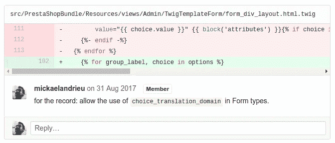
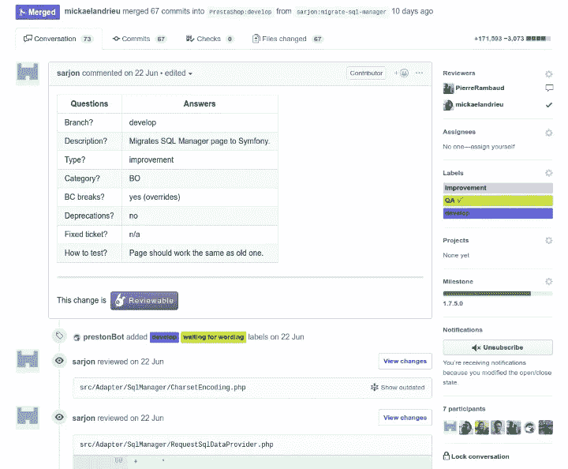
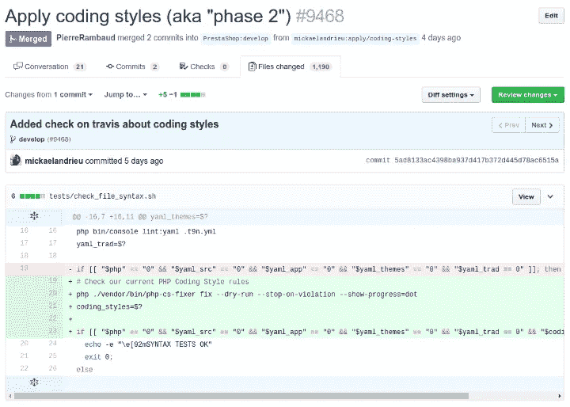

# 在 GitHub 上查看超过 3500 个拉取请求，我学到了什么

> 原文：<https://levelup.gitconnected.com/what-ive-learned-reviewing-over-3500-pull-requests-on-github-ff542e35ee96>

## 该做的和不该做的以及如何改进。

我写这篇文章是为了帮助你的校对工作，因为我觉得这项任务被误解了或者被认为是忘恩负义的。

> 但是什么是代码审查呢？

对于许多人，也许是绝大多数开发人员或数据人员来说，这是一个极好的定义:

> 此任务包括分析代码以检测错误和 bug，无论它们是功能问题(代码没有做它应该做的事情)、回归(代码破坏了现有的行为)、语法错误(一个被遗忘的 chevron，一个未定义的变量)还是符合项目的标准(缩进、命名规范、语言标准)等。

**代码审查**由 [Alvaro Reyes](https://unsplash.com/@alvarordesign?utm_source=medium&utm_medium=referral) 在 [Unsplash](https://unsplash.com?utm_source=medium&utm_medium=referral) 上进行

因此，在一个开源项目的环境中，校对者判断同事甚至外部人员的工作，并且必须指出其中所有负面的东西。

如果这是你期望从同事那里得到的那种代码审查，你将很难找到志愿者。

在不质疑这个定义的情况下，我发现它是有限的，有时还有点错误:我将与您讨论代码评审的其他用途。

## 代码评审是一个知识来源

我要求或做的大多数代码评审都是在这种背景下完成的。

例如，在 2019 年的 PrestaShop 项目中，没有一个公认的贡献逃过 Sauro…uh Mick al Andrieu 的眼睛。

据 GitHub 称，这仍然占我贡献的 40%,在我看来，占我工作时间的 60 %- 70%。

为什么？因为我们都知道，不是所有的东西都将被记录，不是所有的东西都将被测试，然而有人必须能够维护在开发分支上已经被接受的所有东西:)

真诚地说，认为做出贡献的人会在需要的时候出现是一种错觉；在大多数开发人员每两年换一份工作的情况下，这是非常幼稚的。

在这个代码审查期间，我可以问一些关于上下文的问题，关于“ ***为什么*** ”我们正在这样做，如果我们做了一些有点脏的事情，解释一下原因。看到我写“为了记录……”并不罕见，因为有一天当你不得不回到贡献上来理解为什么“那个混蛋”(妈的，是我 xD)那样编码时，有时间的背景是有帮助的…

但是他为什么要碰这个模板呢？啊…好吧！

## 代码评审是一种交流工具

我在代码评审中越来越多地整合的一件事是“非开发人员”的意见，通过获取一段代码并解释其来龙去脉来获得他们对该主题的意见。

例如，当添加一个新特性时，我意识到所选择的实现会对另一个特性产生影响。那时，我联系了产品团队的某个人，解释了所选解决方案的优缺点，并请他们做出决定。

理想情况下，在代码审查中，我希望所有相关人员都参与进来:架构师验证实现没有破坏所选的架构选择，内容经理验证内容，开发人员回顾代码错误或优化，产品/QA 经理确认这是所期望的…有了我们的工具，我们可以让每个人都参与到代码审查过程中。

PrestaShop 已经是这种情况，根据捐款情况，有:

*   负责验证翻译密钥的人员；
*   有时社区成员会发表他们的意见；
*   至少一个甚至两个开发者，取决于贡献的大小；
*   一个来自产品团队的人，因为软件必须保证产品的一致性；
*   …最后是质量和保证团队，没有他们，任何东西都不会被接受！

而且七个参与者都知道这个功能！

很多人围绕一段代码交流，这没什么👼

## 代码评审是一种工具，用于…代码改进

当然，这始终是代码评审的目标之一，但我倾向于限制范围(或者限制自己)。让我们明确一点:我们总是可以改进代码。

> 问题是:什么时候足够好？

在这些问题上，只要代码具有足够的可扩展性，被测试覆盖，并且不存在明显的错误风险，就很好。

对我来说，更重要的是命名、结构和文档:一致性是必不可少的，尤其是对于理解起来很复杂的大型旧项目。

有时，一个好的命名或者将一段代码重构为一个或多个好的函数(并且只有一个职责)可以限制编写文档的需要。

我有一个非常个人化的规则:**没有记载的就不存在**。

我还决定禁止 PrestaShop 添加任何带有 boolean 参数的函数:不仅在 3 周内没有人知道这个参数改变了什么，而且更重要的是，如果函数的行为根据 boolean 而改变，它有两种行为😃

我在代码审查中改进得越多，我就越要求短函数，理想情况下，有 0 或 1 个参数，以及有特殊责任的短类。

**大遗留**项目的主要问题不是拥有成千上万的文件，而是理解和掌握每个文件的作用…

## 编码标准的重要性

**不要浪费你的时间⛔**

一定要喜欢 Symfony、API Platform、PrestaShop 或任何其他严肃的项目:设置您需要的 linter/fixer 工具，尽量不要发明您的标准，让机器人来处理它！

我们最终在 PrestaShop 完成了这种类型的代码审查。

> 如果有一件事让我恼火，也应该让你们所有人恼火的话，那就是看到一个开发人员在一个贡献上浪费了一个半小时，却只得到了没有对齐的空格、逗号和大括号。

## 如何提高自己的代码审查技巧？

照片由 [Unsplash](https://unsplash.com?utm_source=medium&utm_medium=referral) 上的 [Afif Ramdhasuma](https://unsplash.com/@javaistan?utm_source=medium&utm_medium=referral) 拍摄

以下是我在过去几个月里做的/理解的一些小事，它们产生了积极的影响:

1.  指出错误并**还一些你认为做得很好的事情**(例如，哇，很好地使用了* * *)；
2.  在所有情况下，**感谢审查和验证你的代码的人**；
3.  无论如何，**感谢贡献的人**，即使你拒绝了(反正开源更合适)；
4.  将你的贡献联系起来！我们说 RTFM(阅读 F***手册)，而不是 RTFC(阅读 F***代码)有一个很好的理由:**代码不包含所有的商业知识**，这是即使你是一个 DDD 迷(但它有帮助👊);
5.  **千万不要说“真蠢，……”之类的话**而如果非要进行强烈的批评，就说“这个代码/这个块”来指向作品而不是人；
6.  我再次强调善意。**幽默可以帮助**；
7.  如果有不清楚的地方，不要犹豫**把代码带回你的机器并尝试。**
    我越来越多地问我的同事，“你是检查了它的工作情况，还是只是看了代码？”通常…一些代码重读需要检查诱发的行为。这不是奖金，而是预期工作的一部分😜；
8.  **做代码评审比写代码更有价值。为什么？因为一份贡献，只要不被接受，就没有价值:每周做 20 份贡献并接受 10 份，比做 70 份贡献并接受 5 份要好。这个规则，不管是什么项目，总是有效的；**

你如何组织你的代码评审？我期待着听到你对这个问题的不同观点！

如果你喜欢这篇文章，[关注我](https://medium.com/@mickael-andrieu/)，我会在以后发布文章时通知你！

 [## 通过我的推荐链接加入 Medium-mickal Andrieu

### 作为一个媒体会员，你的会员费的一部分会给你阅读的作家，你可以完全接触到每一个故事…

medium.com](https://medium.com/@mickael-andrieu/membership)