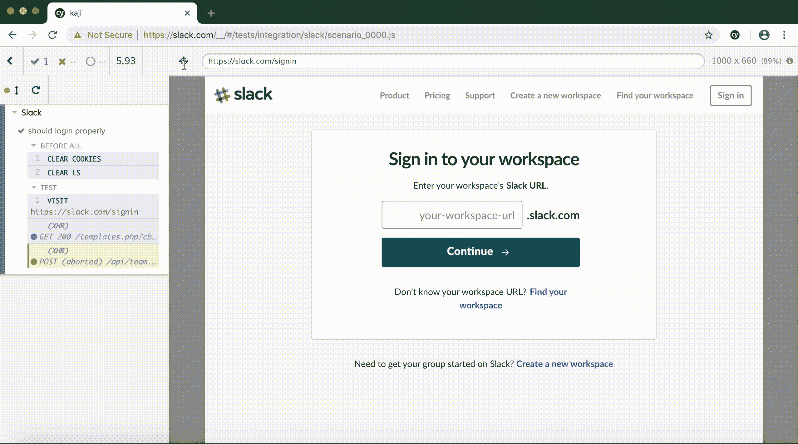

# 在过去的三周里，我从 Cypress.io 中学到了什么

> 原文：<https://levelup.gitconnected.com/what-ive-learnt-using-cypress-io-for-the-past-three-weeks-c1597999cd2f>


如果你正在阅读这篇博客，你可能听说过端到端测试、集成测试、单元测试和 UI 测试。然而，就在三周前，这些短语对我来说是完全陌生的。事实上，软件测试作为一个整体对我来说基本上是一个陌生的概念。

仅仅三周前，我还在我的编码训练营中，完成了毕业所需的两个项目中的第一个。对于我的第二个项目，我有幸有机会在一家名为 **HBSmith** 的软件测试初创公司开始实习。作为这次实习的一部分，我和我的一个合作伙伴一起承担了一个项目，使用 Cypress.io 为知名网站创建 UI 测试。这将作为官方公司[网站](https://hbsmith.io/)主页上的宣传材料。

因此，在过去的几周里，我一直致力于学习 Cypress.io、[软件测试](https://www.zuaneducation.com/software-testing-training-course)及其应用的复杂性。在这个博客中，我希望整理我的想法，分享我新获得的知识。

# 柏树是什么？

Cypress 是一个 Javascript [端到端](https://www.techopedia.com/definition/7035/end-to-end-test)测试框架，它允许你为前端代码和 UI 有效地、逻辑地编写测试。在过去，这是众所周知的困难。它允许在 web 应用程序中模拟普通用户交互的测试，同时还提供大量额外的信息和工具。

Cypress 是一个相对较新的测试框架，所以仍然存在一些 bug 和缺失的特性。但是，它普遍受到好评，并且正在积极开发中。在过去， [Selenium](https://www.seleniumhq.org/) 主要是构建端到端测试的唯一方法，但是最近几年，这些测试工具出现了热潮，Cypress 是先驱之一。

# 那么为什么是赛普拉斯呢？

硒几乎是 15 年前的技术。在这段时间里，网络发生了巨大的变化，因此，测试也应该如此。Cypress 是一个全新的测试框架，它是为当今 web 的高响应性、异步性而定制的。这允许快速和一致的测试结果。以下是其官方[网站](https://docs.cypress.io/guides/overview/why-cypress.html)上宣传的一些主要特性和优势。

## **可调试性**

*   你可以使用熟悉的工具直接调试，比如 Chrome 开发工具。数百个定制的错误消息和堆栈跟踪也使得发现测试失败的地方变得容易。

## **自动等待**

*   Cypress 在继续前进之前会自动等待命令和断言。*不再有异步地狱*。Cypress 将等待元素存在，等待元素停止动画，或者等待特定的网络请求完成。

## **实用建筑**

*   大多数测试工具(比如 Selenium)都是在浏览器之外运行，并通过网络执行远程命令。相反，Cypress 在与应用程序相同的循环中执行。这允许对每一个对象进行本地访问——`window`、`document`、一个 DOM 元素、应用程序实例等。

## **简易快捷方式**

*   Cypress 防止你被迫总是像用户一样为给定的情况产生状态。相反，你可以通过编程来交互和控制应用程序。(这将在后面显示)

# **柏树在行动**

在这一节中，我希望展示 Cypress 的一些关键特性和命令。我还将包括来自官方文档和我自己项目的示例代码。

## **cy.visit**

这个命令将访问一个指定的 URL，然后允许你与页面上的元素进行交互。

```
cy.visit(‘https://slack.com/signin')
```

这个命令的*最佳实践*是在`cypress.json`文件中设置一个 **baseUrl** ，这将允许您省略将它传递到这个命令中。通过设置一个`baseUrl`，您还可以避免在第一次运行测试时浪费宝贵的时间，因为 Cypress 会将主窗口直接加载到指定的`baseUrl`中。

在`cypress.json`

```
{
  "baseUrl": "https://slack.com"
}
```

在`exampletest.js`

```
cy.visit(‘/signin’)
```

## **cy.get / cy.contains**

这两个命令是 Cypress 中任何 UI 测试的主干。它们有两个主要目的。

1.  检查某个元素或文本是否正确显示
2.  链接指定元素的动作或断言

理想情况下，应该基于`data-*`属性选择元素，因为类和 ID 可以动态变化。然而，如果这是不可能的，只需确保您选择使用的选择器(类、id 等。)不会轻易改变。

*例如*，对于看起来像这样的按钮:

```
<button id="main" class="btn btn-large" data-cy="submit">
    Submit
</button>
```

*最佳实践*是使用:

```
cy.get(‘[data-cy=submit]’).click()// ORcy.contains(‘Submit’).click()
```

这些命令是相似的。`get`方法允许您根据元素(如`class`或`id`)来查找节点，而`contains`方法根据节点内部的测试来查找节点。

Cypress 还在其测试浏览器中添加了一个名为“选择器游乐场”的功能，允许您快速找到屏幕上任何元素的选择器，如下所示。



*总是确保仔细检查选择器，因为我发现它不是 100%可靠。*

## **cy.request**

如前所述，Cypress 允许通过某些命令实现简单的快捷方式，防止您总是像用户一样行事。`cy.request`是其中的一个命令，它允许你发出 HTTP 请求，看起来像是来自浏览器。该命令最明显的用途是生成登录用户的状态。它可以自动获取和设置 cookies，让您完全绕过浪费时间总是使用用户界面登录。

```
cy.request({
  method: 'POST',
  url: '/login',
  form: true,
  body: {
    username: 'hbsmith',
    password: 'password123'
  }
})cy.getCookie('cypress-session-cookie').should('exist')
```

在上面的例子中，POST 请求被发送到'/login '端点，通过这个，浏览器中的`cypress-session-cookie`将被自动设置，允许达到登录状态。

一个好的做法是将这个`cy.request`包装在一个[自定义 Cypress 命令](https://docs.cypress.io/api/cypress-api/custom-commands.html)中，并将其放在`cypress/support/commands.js`文件中，这样它就可以在整个测试文件夹结构中重用。如下图所示:

**在**在`commands.js`

```
Cypress.Commands.add('login', function () {
  cy.request({
    method: 'POST',
    url: '/login',
    form: true,
    body: {
      username: 'hbsmith',
      password: 'password123'
    }
  })
})// Thus, cy.login can be used in all other files
```

## **cy.wait**

此命令允许您等待一段指定的时间，或者等待别名请求得到解决，然后再执行下一个命令。当涉及到 Cypress 不能完全识别的客户端渲染时，这个命令特别有用。

尽管您可以根据任意设置的时间等待资源加载，如下所示:

```
cy.wait(1000) // wait 1 second
```

不建议这样做，因为有更好的方法可以达到同样的效果。一种这样的方法是等待别名 XHR 响应。以下示例显示了如何等待请求。

Trello:创建一个列表，将卡片拖放到新创建的列表中。

```
cy.server()
cy.route(‘POST’, ‘/1/lists').as('postList')createCards()createList() // sends POST request to ‘/1/lists'cy.wait(‘@postList’)dragAndDropCardsToList()
```

在上面的例子中，通过`cy.route`和`cy.server`为到“/1/lists”端点的 POST 请求设置了一个别名。然后，当一个列表被创建并且需要时间加载时，一个`cy.wait`命令被调用到别名“postList”路由。

这实现了两个主要目标。

1.  Cypress 知道在卡片被拖放之前，要等待新的列表被完全加载和创建。
2.  通过确保在创建新列表时发出正确的请求，并返回正确的响应，来减少测试的不完整性。

# **克服赛普拉斯的局限性**

到目前为止，Cypress 不支持 iframes 和测试文件上传。然而，在本节中，我将介绍我发现的解决这两个问题的临时方法。

## 内联框架

由于驱动程序中的疏忽，Cypress 不支持定位 iframe 中的任何元素或与之交互。在为协作工具 [Quip](https://quip.com/) 实现测试时，我遇到了这个问题，但幸运的是我找到了一个足够简单的解决方案。

*首先*，如果处理跨来源的 iframes，`chromeWebSecurity`需要在`cypress.json`中设置为`false`。

```
{
  "chromeWebSecurity": false
}
```

然后*，*为了在 iframe 中选择元素，您必须:

1.  `cy.get`您想要定位的 iframe
2.  `cy.find`iframes 内容中的元素
3.  `cy.wrap`该元素为了将适当的 Cypress 命令链离它

```
cy.get('iframe').then($iframe => {
  const $body = $iframe.contents().find('body') cy.wrap($body)
    .find('button')
    .click()
})
```

我发现实现这一点的最有效的方法是将这一切放在一个定制的 Cypress 命令中。

```
Cypress.Commands.add('iframe', (iframeSelector, elSelector) => {
    return cy
      .get(`iframe${iframeSelector || ''}`, { timeout: 10000 })
      .should($iframe => {
        expect($iframe.contents().find(elSelector||'body')).to.exist
      })
      .then($iframe => {
        return cy.wrap($iframe.contents().find('body'))
      })
  })
```

因此，您可以为某些 iframes 起别名，并通过别名有效地链接 Cypress 命令。

***妙语:创建日历事件***

```
cy.iframe('[title="Calendar"]').as('calenderIframe') // create aliascy.get('@calenderIframe') // use alias to efficiently chain commands
      .find('.Calendar__day')
      .eq(0)
      .click()cy.get('@calenderIframe')
      .find('.Calendar__day')
      .eq(1)
      .click()cy.get('@calenderIframe')
      .find('.Calendar__day')
      .eq(2)
      .click()
```

## 文件上传

我在测试 Slack 的文件上传功能时遇到了这个问题。到目前为止，Cypress 还没有本地事件支持，所以还没有一个官方的方法来测试这个特定的函数。然而，作为一个临时的解决方法，你可以利用已经被烘焙成 Cypress 的 [Blob](https://github.com/nolanlawson/blob-util) 库。根据为应用程序编写上传代码的方式，您将如何做略有不同，我发现上传图像文件的基本测试结构如下所示。

**松弛:上传图像到输入元素**

```
cy.fixture('images/image.png').as('image')

cy.get('input[type=file]').then($input => {
        return Cypress.Blob.base64StringToBlob(this.image,
        'image/png').then(
          blob => {
            const imageFile = new File([blob], 'image.png', { type:
            'image/png' })
            const dataTransfer = new DataTransfer()
            dataTransfer.items.add(imageFile)
            $input[0].files = dataTransfer.files
          }
        )
      })
```

首先将您想要上传的图像放入`fixture`文件夹，然后使用`cy.fixture`加载图像数据。然后*，*你将`cy.get`你想要上传到的`input`元素，并链接一个`then`命令。使用您为图像设置的别名`fixture`，然后将图像数据转换成 Blob。在这个 Blob 表单中，您最终能够将它转移到`input`元素中。

# 结论

尽管 Cypress.io 仍处于起步阶段，但其大量的特性和功能已经使其成为顶级框架。特别是在这个时代，测试和 CI/CD 是任何软件开发过程的关键部分，快速可靠的测试框架是必不可少的。到目前为止，Cypress 可能还不能完全满足所有的需求，但是我毫不怀疑它会继续发展并最终克服它的局限性。

[](https://levelup.gitconnected.com)[](https://gitconnected.com/learn/javascript) [## 学习 JavaScript -最佳 JavaScript 教程(2019) | gitconnected

### 前 65 名 JavaScript 教程-免费学习 JavaScript。课程由开发人员提交并投票，从而实现…

gitconnected.com](https://gitconnected.com/learn/javascript)