# 是什么造就了 10/10 专辑？用回归法预测《落针》的专辑评论

> 原文：<https://levelup.gitconnected.com/what-makes-a-10-10-album-using-regression-to-predict-the-needle-drops-album-reviews-d2bfaca7a955>

## 我们能准确预测当代最著名的音乐评论家之一安东尼·范塔诺会给一张专辑打分吗？

**来源:**【https://www.facebook.com/theneedledrop/】T2

在现代音乐批评界，没有人比 [Anthony Fantano 更知名，他在 YouTube 和其他社交媒体平台上也被称为“The Needle Drop”](https://www.theneedledrop.com/)。范塔诺以其幽默的评论视频和对流行专辑的争议性拍摄而闻名，多年来，他已成功积累了庞大的粉丝群，在他的主频道上拥有超过 236 万活跃订户，在他的二级频道上拥有 129 万活跃订户。

随着 Spotify 和 Apple Music 等流行音乐流媒体服务引起的音乐批评的兴起，人们提出了一个问题，*什么真正使一张专辑成为 10/10？特别是对于那些被认为非常有资格的评论家，比如范塔诺本人，这就引出了一个问题，在音乐评论的世界里，是什么样的品质或特征使一张专辑成功？**在下面的文章中，我试图通过建立一个统计回归模型来回答这些问题，该模型可以使用 Fantano 从 2010 年到 2021 年的评论准确预测一张专辑的评分。***

# 第一步。数据收集和预处理

## 构建初始数据集

为了建立最全面的数据集，我将多个数据源汇编在一起，因为许多包含 Fantano 评论的现有数据集都已过时，通常只包含截至 2018 年或 2019 年的评论，而更近的数据源没有预处理数据格式。特别是，我利用了[一个包含 Fantano 截至 2018 年的评论](https://www.kaggle.com/jaredarcilla/anthony-fantano-reviews)的 Kaggle 数据集作为基础，并通过网络抓取本年度 Fantano 评论的持续记录[相册来构建这个现有数据集](https://www.albumoftheyear.org/ratings/57-the-needle-drop-highest-rated/2019/1)，以获得从 2019 年到 2021 年的数据。对于初始数据集，我直接提取的唯一特征是**专辑名称、艺术家和评论评分**。

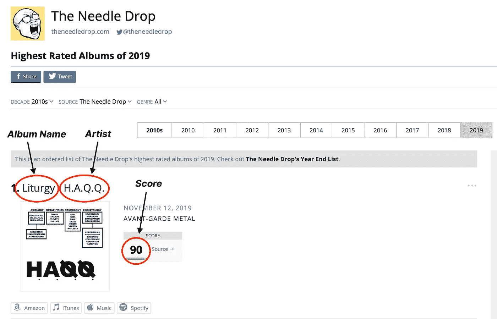

图一。要提取的年度相册 HTML 元素

为了从年度相册中提取必要的信息，我使用了 [rvest 包](https://rvest.tidyverse.org/)，它允许使用选择器或 XPath 字符串从 HTMLs 中轻松抓取网页。使用与 AOTY 上列出的每个评论项目的专辑名称、评论分数和艺术家相关联的 HTML 文本元素的 XPath，我能够检索 Fantano 在剩余 3 年中的所有评论，并将它们与现有的 Kaggle 数据合并，以创建从 2010 年到 2021 年所有 Needle Drop 评论的综合数据集。

然而，即使在我们的完整数据集汇集在一起之后，在抓取数据时也出现了许多明显的错误，以及 Kaggle 评论数据和 web 抓取的评论数据之间某些属性的表示差异。例如，如前面的图所示，专辑名称和艺术家都列在同一个 HTML 文本元素中，这需要额外的数据清理来将这两个字符串分离到我们的数据集中不同的列中。数据清理是数据收集过程中的第一步，贯穿于整个过程，无论是纠正重复条目、删除缺失值的行，还是确定如何处理某个特征表示中的差异。在考虑了这些错误之后，我们就能够进入下一步；**观察我们的数据，以确定哪些特征可能对构建我们的回归模型有用，以及在给定数据集的情况下我们可以提取哪些附加特征。**

## 特征抽出

为了构建一个完整的模型，我们需要预测更多的属性，而不仅仅是艺术家姓名、专辑名称和分数，特别是考虑到分数将被用作我们的预期响应。因此，**我们利用 Spotify API 为每张专辑**提取额外的音频特征，并将其与我们简单的专辑数据集相结合，试图分离出任何可能有助于预测范塔诺得分的特征。具体来说，我使用了 [spotifyr 包](https://www.rdocumentation.org/packages/spotifyr/versions/2.1.1)，该包旨在使在 r。

在使用 Spotify Web API 检索数据并集成到我们的合并数据集时，出现了一些挑战:

*   **聚合音频特征:**首先，考虑到专辑本身除了艺术家姓名和总时长之外并没有太多存储的特征，我需要根据专辑的曲目来确定聚合单个音频特征的最佳方式。例如，在专辑的各个曲目中，平均出“可跳舞性”和“响度”等特征是有意义的，这些特征的评分范围是 0 到 1，而其他特征如基调或拍号本质上更明确，需要不同的聚合函数。因此，对于这些非数字特性，我初始化了一个函数来检索每个特性的*模式*值并存储它。
*   **处理“同名”艺术家:**在 Kaggle 数据集中，也有大量同名专辑被列为“同名”，用于指示所有以艺术家本人命名的专辑。因此，当调用 Spotify API 时，对查询数据集的*艺术家*名称而不是*专辑*名称感到厌倦是很重要的，因为这样做会检索到我们数据集中所有标题为“自我命名”的专辑的错误信息。
*   **数据格式的差异:**最后，Kaggle 数据集和我们的 web 抓取输出之间的某些数据值的表示是不同的。例如，我们的网络搜集数据中的分数以 0 到 100 的倍数表示，而 Kaggle 数据集中的分数仅以 1 到 10 的范围表示。像这样的小错误需要在继续我们的数据分析之前消除，以避免误解或错误的结果。

在解决这些数据清理错误并成功检索每个专辑的聚合音频特征后，**最终清理的数据集由 19 个特征(包括我们的响应变量，评论分数)和 1，889 个观察值组成。**确切的特征及其相关数据类型如下表所示:

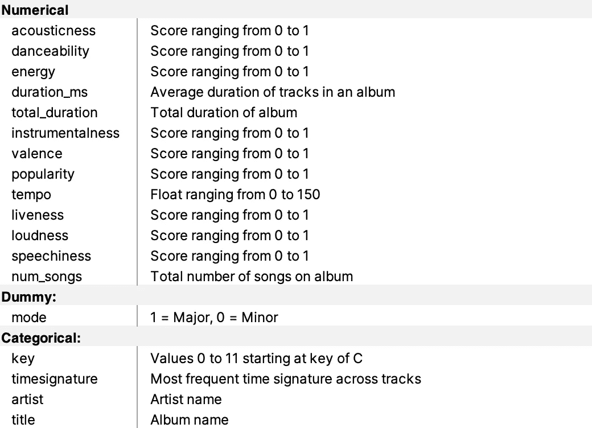

表 1。功能列表

# 第二步。探索性数据分析

在构建我们的模型之前，我想衡量数据集在某些关键特征方面的分布，并观察特征之间或特征与我们的响应变量之间是否有任何明确的关联。具体来说，我使用了以下 EDA 来确定要使用的适当模型，并开始评估 Needle Drop 的专辑评论分数与给定专辑的不同属性之间的关系。

## 关键特征的分布

首先观察专辑间的分数分布，如图 2 所示，它看起来近似正态分布。这是意料之中的，因为我们会假设一个有声望的音乐评论家主要会给出 5-7 范围的评论，很少给专辑评分在 1-2 的下限和 9-10 的上限，除非在极端情况下。它稍微偏左，但是，这也是意料之中的，因为大多数评估等级倾向于稍微偏左，给人的感觉是“6”或“7”比 1-10 等级所暗示的 5 或 4 更接近“足够”。在开发和解释我们的统计模型时，我们将牢记分数的分布。

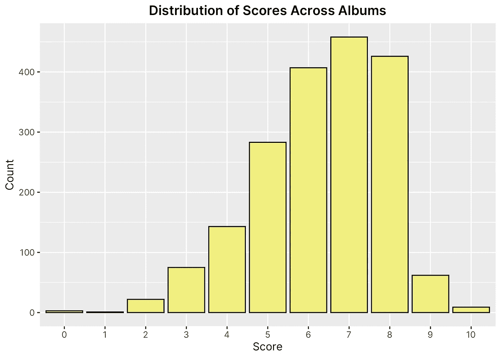

图一。所有专辑评论的分数分布

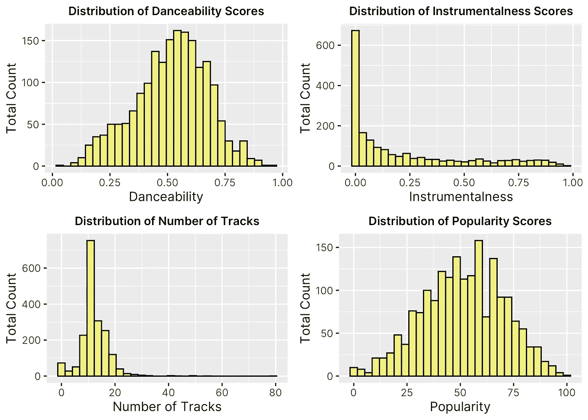

图 3。各种关键特征的分布

除了 Fantano 分数的分布，我还对观察我们模型的所有关键特征的分布感兴趣。上面的图 3 显示了感兴趣的主要内容。查看这些直方图，有一些有趣的事情需要注意。首先，有趣的是，受欢迎程度和可跳性都是正态分布的。这具有直观的意义，因为 Fantano 倾向于回顾大量在公众眼中众所周知或已经产生大量宣传的专辑，同时也关注一些不太为人所知的专辑，从而在他的评级专辑的流行度中创建相对正常的分布。此外，他似乎主要关注抒情歌曲，而不是沉重的器乐，如“乐器性”的分布所示，这是使用 Spotify Web API 提取的音频特征之一。

在整个 EDA 部分，我主要感兴趣的是看是否有任何明显的偏见，凡塔诺评分专辑的方式基于某些属性。例如，鉴于他对实验性嘻哈音乐和实验性流派的高度赞赏，正如他为数不多的 10/10 专辑评级所指出的那样，其中包括诸如死神握、肯德里克·拉马尔和斯旺等艺术家，我很有兴趣看看他是否对某些类型的音乐持有任何主观偏好，从而使他倾向于给某些类别更高或更低的分数。因此，除了看关键特征，我决定看看他评论的艺术家的分布，观察是否有任何特别突出的频率或平均评级。

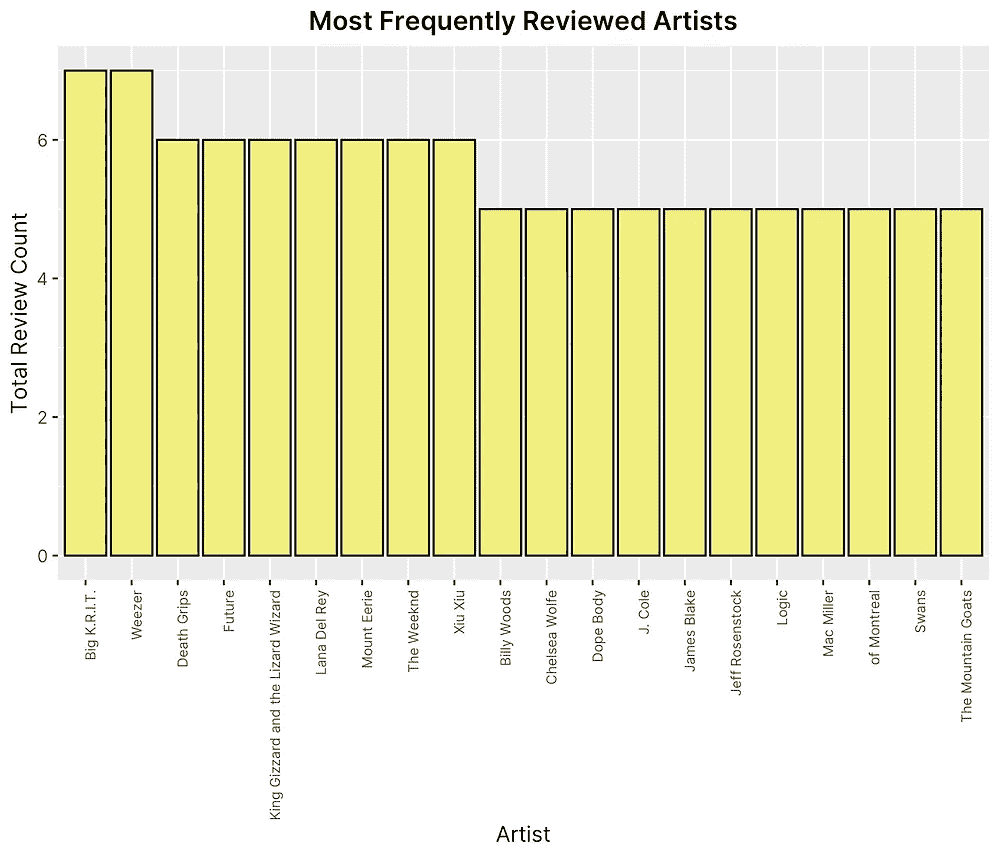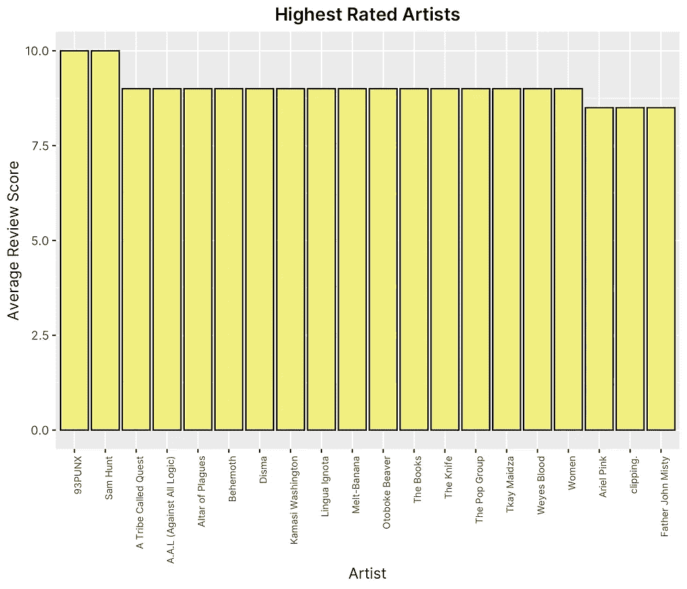

图 4。最常见的艺术家和最高评级的艺术家

看上面的图 4，似乎他评论最多的前三名艺术家是 Big K.R.I.T、“威泽”和“死亡之握”,而他给出最高平均评分的前三名艺术家是 93PUNX、“山姆·亨特”和一个叫做 Quest 的部落。值得注意的是，平均评级和评级频率可能在很大程度上取决于每个艺术家发行的专辑数量，这使得这些列表更容易间接解读。然而，它确实有助于暗示，总体而言，凡塔诺并不倾向于某个特定的艺术家子集或类别，而是似乎涵盖了广泛的流派，这表明存在较少的主观偏见。

## 策划反对回应

在从数据集的分布中获得深刻见解后，我有兴趣看看是否有任何特征与分数有明确的关系或关联。为了确定这一点，我绘制了所有 12 个数字特征与响应的关系，如下图 5、6 和 7 所示。

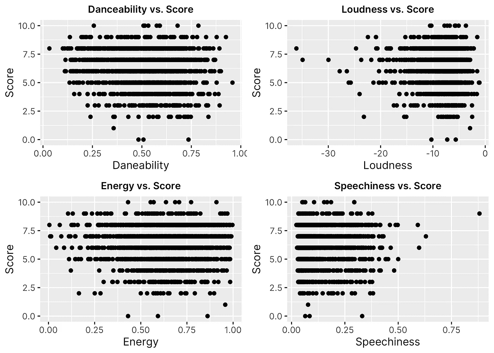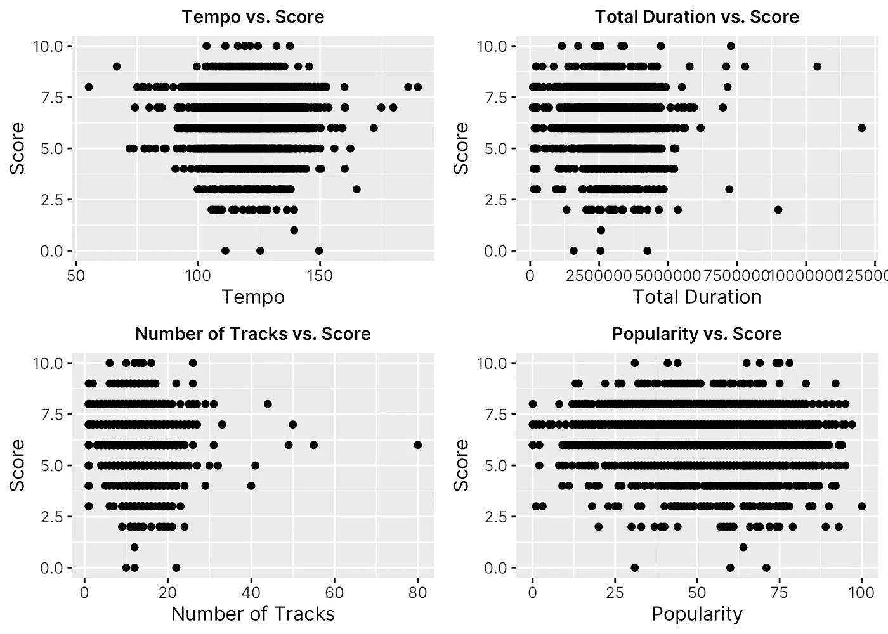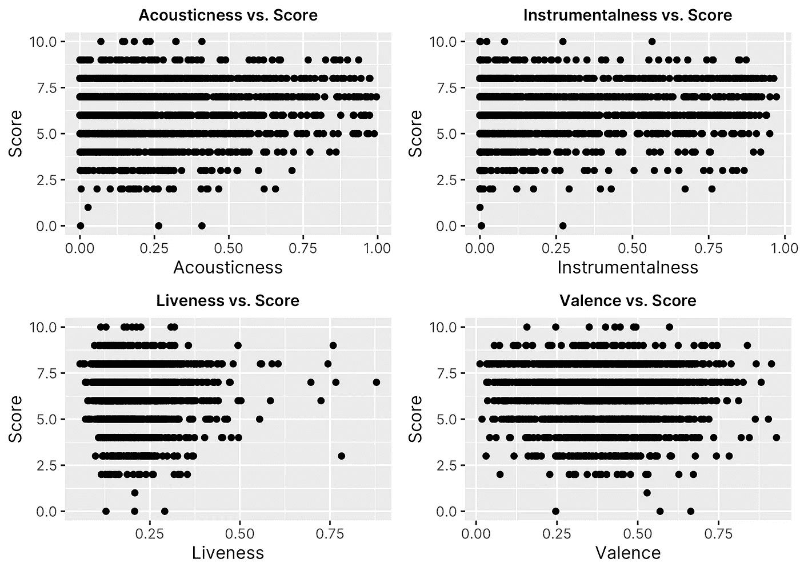

图 5、6 和 7。根据评审分数绘制的特征

考虑到分数是一个离散的、有序的变量，使用散点图来评估直接关系就有点困难了。然而，有几个关键趋势值得注意。首先，可以清楚地看到，作为一个整体，Fantano 在他的得分方面趋于相对一致，因为大多数图都显示了得分值的某种正态分布，类似于之前看到的得分分布。此外，很明显，某些特征作为一个整体在 Fantano rates 作为一个整体的专辑中更为常见，例如“语感”和“响度”较低而“可跳舞性”和“流行度”略高的专辑。

## 观察成对相关性

最后，为了将我们的功能和评论分数之间的关系转换成一种更容易理解的格式，我创建了一个关联矩阵热图，显示功能之间以及每个功能和回复(“分数”)之间的成对关联。相关矩阵尤其有助于了解是否存在任何强关系或要素之间是否高度相关，这在统计建模中非常重要，以避免多重共线性。

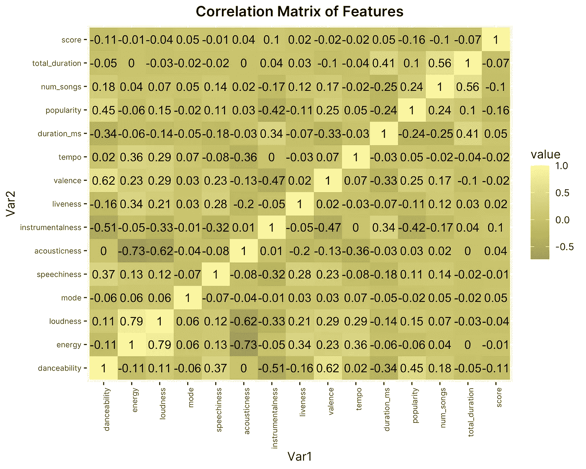

图 8。音频特征和响应的成对相关矩阵

如图 8 中的值所示，总体而言，要素与响应之间似乎没有太多显著的相关性，因为没有一个要素的相关性超过通常的多重共线性阈值 0.8。然而，也有一些突出的例子，如“声音”与“能量”和“响度”之间的强负相关，以及“能量”和“响度”之间的正相关。这是有意义的，因为这两个音频特征似乎测量了关于轨道的相似事物，或者似乎直观地彼此携手前进。然而，观察特征和反应之间的关系，似乎很少有相关性。虽然这似乎暗示了使用我们给定的数据集及其各自的特征来预测 Fantano 的评论分数可能是困难的，但值得注意的是，关键特征和响应之间较小的相关值并不意味着模型不会提供有用的见解。我们在报告的最后阶段考虑了这些趋势和见解:建立一个回归模型来预测 Fantano 的评论分数。

# 第三步。统计建模

在建立统计模型之前，需要考虑的一个主要因素是**确定表示和预测响应的最佳方式。**专辑评论评分的情况特别有趣，因为评分值是以离散的尺度报告的，但具有顺序意义，这意味着每个数字可以被解释为高于或低于等间隔的其他分数，但只能以整数的格式报告。这让我怀疑运行回归模型或分类模型是否更合适，因为两者都有一定的好处。

**与分类模型相比，回归的主要好处是最终模型和特征系数的可解释性**。具体而言，回归模型将考虑到分值之间的关系*，并开发一个能够预测分值的模型，理解每个特征可能根据其值产生更高或更低的分值。然而，有可能我们的预测模型将能够更好地预测分数，方法是根据具体导致“10”专辑与“7”专辑的主要特征将它们分类。*

鉴于我们分析的目的不仅是预测 Fantano 的分数，而且是为了了解产生更高或更低分数的每个特征之间的关系，以及识别他的评分方法中的潜在偏差，我决定回归模型将更适合。

## 基线建模

在进行实际的回归之前，我决定建立一个**基线回归模型**，以便与其他模型进行比较。正如我们在 EDA 部分所看到的，与< 5 或> 7 范围相比，5–7 分数范围内的观察结果数量要多得多。具体来说，在所有潜在分值中，评分为 6 的评论最多。考虑到这一点，我想看看预测每张专辑价值为 6 的模型会有什么表现。在将数据划分为 80/20 的训练测试部分并计算预测值和实际值之间的残差(假设每个预测值为 6)后，我发现基线模型的均方根误差为 **1.6499** 。

## 多元线性回归

接下来，我创建了一个线性模型，使用之前划分的训练数据的所有数字特征和评论分数作为响应。的摘要输出如下图 9 所示。

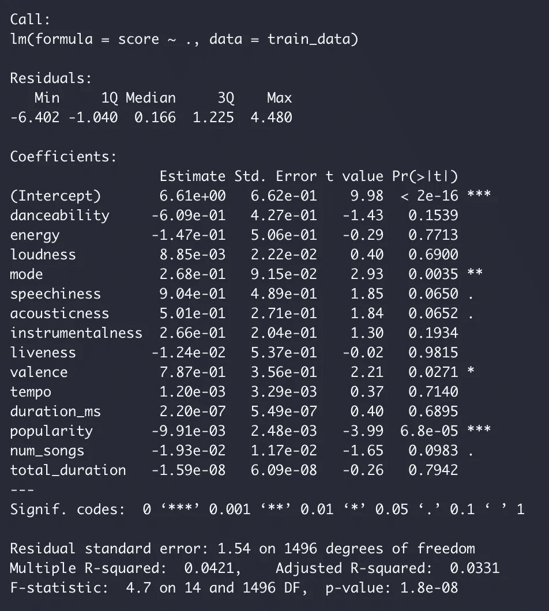

图 9。多元线性回归输出

查看输出的结果，似乎只有一些特征在 0.05 的水平上具有统计显著性，包括模式、效价和流行度。观察图 10 中线性回归模型的每个特征的估计系数，似乎即使一些特征(如效价)被评估为具有统计显著性，它们的系数也足够小，对最终反应只有微小的影响。此外，该模型似乎没有涵盖数据中的大部分差异，正如低调整的 R 平方值所表明的那样。然而，当重新计算均方根误差时，我们发现比我们的基线模型 **1.58** 略有改善。

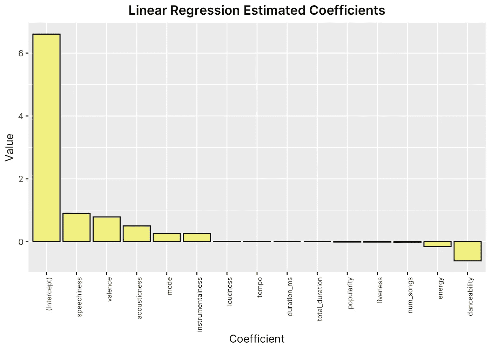

图 10。使用线性回归估计系数

在最后一步，我们将尝试使用**逐步回归、**一种将特征选择纳入回归的方法来改进我们的基线和基本线性回归模型。

## 逐步回归

鉴于我们的许多特征在我们的初始模型中似乎没有统计学意义，我想看看我们是否可以通过移除无用的特征或彼此高度相关的特征来改善我们的回归。实现这一点的一种技术是使用 [**逐步回归**](http://www.sthda.com/english/articles/37-model-selection-essentials-in-r/154-stepwise-regression-essentials-in-r/) ，它试图通过基于特征在预测响应中的有用程度迭代地添加和删除特征来找到特征的最佳子集。例如，我们在 EDA 中发现，一些变量似乎彼此高度相关，比如“能量”和“响度”。逐步回归有助于测试移除一个或另一个是否有助于改进我们的预测模型，假设它们可能会导致一些多重共线性问题或对我们的预测准确性产生负面影响。逐步线性回归的输出如下图 11 所示。

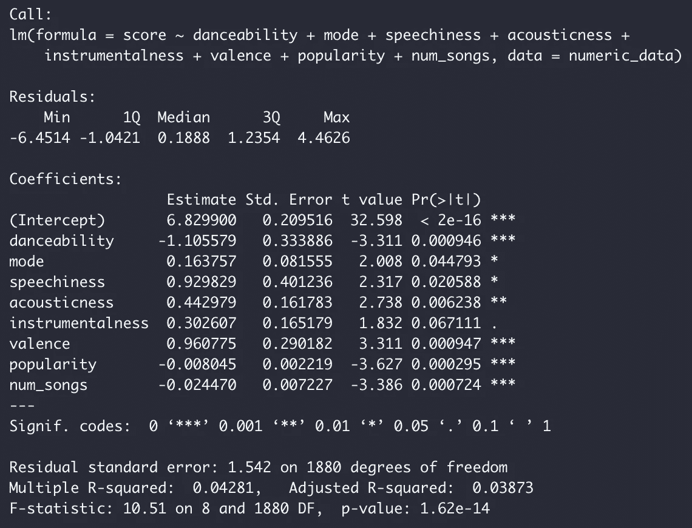

图 11。逐步回归输出

将其与我们的初始回归进行比较，我们可以看到逐步回归已经移除了我们的几个特征，只留下了 14 个原始特征中的 8 个。此外，我们将调整后的 R 平方值略微提高到了 3.87%，尽管对于预测模型来说仍然非常低。重新计算我们的模型的均方根误差，我们看到另一个边际改善，新值为 **1.56** 。此外，查看基于估计系数的特征重要性图，我们可以看到每个变量对分数的影响比以前显著得多，表明逐步回归旨在仅包括*有用的*系数。

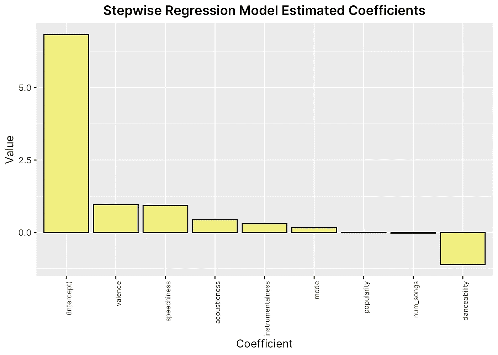

图 12。逐步回归的估计系数

虽然较低的 R 平方值在很大程度上可归因于分数的正态分布以及我们的训练集中中间范围分数和高/低分数之间的不平衡，但很明显，鉴于均方根误差持续下降到 1.5 左右，我们的预测模型并没有达到非常高的准确度。这意味着我们的模型的标准偏差平均约为实际得分的 1.5 分，这在 1 到 10 的范围内是显著的。在没有进一步调查的情况下，很难确定为什么我们的预测模型不能在准确性方面提高很多的确切原因，但是，看起来我们的 EDA 在指示需要与我们的响应有更直接关系的更有用的特征方面可能是正确的。

# 结论

这份报告有两个目的:确定我们是否可以建立一个统计模型来预测安东尼·范塔诺的专辑评论得分，并确定是否有某些特征使专辑或多或少地受到好评，至少在范塔诺的评论中是这样。在进行了大量的 EDA 和运行两种不同的回归模型后，似乎无法仅根据专辑的音频特征(如从 Spotify 的 Web API 中提取的)来轻松预测 Fantano 的评论。

## 含义

这个结论对音乐听众和评论家都有非常有趣的意义；特别是，它可能意味着使一张专辑“值得 10/10”的特征可能不仅仅是听觉体验或其曲目的价值，甚至可能包括不可测量的特征，如单个听众对一首歌的情感价值，或不包括在我们的模型中的特征，如涉及的歌词或主题。

此外，这也暗示了安东尼·范塔诺作为音乐评论家的一些非常有趣的事情(以及为什么他可能会被认为是非常有声望的)；他似乎对不同专辑的音频特征保持不偏不倚，不会仅仅根据基本特征(如歌曲的流行度或响度)倾向于更高或更低的评级。作为一名音乐评论家，范塔诺可能会受到尊重，因为他能够成功地以客观的形式看待一张专辑，而没有融入他自己对某些流派或艺术家的音乐偏好。

## 为了进一步的调查

虽然我们的预测模型的结果不是特别显著，但它似乎表明了在预测音乐评论家评论的情况下进行更多进一步研究的潜力。特别是，将非听觉特征纳入我们的数据集将是有趣的，例如歌曲的歌词、讨论的主题或歌曲唤起的情感。此外，建立一个类似的模型，但使用不同的音乐评论家或新闻来源，如 Pitchfork，会很有趣，以查看是否出现类似的趋势，或者评论家的评级趋势是否彼此明显不同。