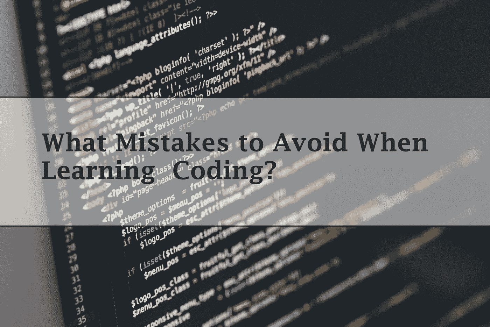
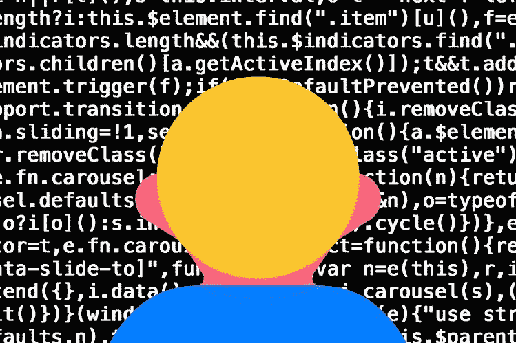

# 学习编码要避免哪些错误？

> 原文：<https://levelup.gitconnected.com/what-mistakes-to-avoid-when-learning-coding-4c3e15a2a109>

我记得当我刚开始学习编码时，我漫无目的地跟着 YouTube 上的一个教程。我试图编写一个简单的批处理程序，即使我最终成功了，我也不知道我为什么要这么做。

在那个时候，我没有学到任何新东西，我只是复制了别人告诉我的东西，并按照视频中的说明去做。如果我刚刚下载了批处理文件，它将和我在视频旁边输入的一样。

视频有时太快，我跟不上，我不得不后退几秒钟，否则会有编译器错误，视频没有显示如何修复。这种沮丧是疯狂的，但当时我不知道更好，所以我必须处理它。

# 如何以更高效的方式学习？

一般来说，学习任何东西都需要一定的注意力，但是对于编程，你必须更加专注于你正在做的事情。你将要学习的一些主题可能对你来说太复杂和抽象了，所以你必须全神贯注。

有一年夏天，我开始学习一些基本的 CSS 和 HTML，但在记笔记或记忆东西方面做得并不好。可以肯定地说，我太专注于我可以用语言做的事情，而不是如何学习语言。这又回来困扰着我，因为几个月后，我几乎不记得那个夏天的任何事情。

教程对于初学者来说是很棒的。老实说，我已经记不清我读过多少教程了。仅仅通过看或读一个教程就能创造出有用的东西，这是一种很棒的感觉。此外，看那些知道自己在做什么的人的视频会让你觉得你也知道。

但是太容易陷入只看教程的陷阱了。放视频很简单。做艰苦的工作不是。努力工作会让你成为一名开发者。

我在辅导课上经常遇到的问题是，所有的思考都是由讲师提前完成的。老师做这项工作意味着我不必这样做。这并不好，因为这意味着我在欺骗自己，同时认为我在学习。

# 练习，练习，再练习！

我知道，如果你看一个新东西的教程，当你觉得你的时间得到了最好的利用时，很难练习。但是我向你保证不是，对于一个有抱负的新开发人员来说，实践是最好的事情。不要误会我的意思，尽管这总比根本不学要好。

照片由[哈维·加西亚·查维斯](https://unsplash.com/@javchz?utm_source=medium&utm_medium=referral)在 [Unsplash](https://unsplash.com?utm_source=medium&utm_medium=referral) 拍摄

我在那个年龄所能做的最好的决定之一就是加入一个编码网站，更准确地说是 Codecademy。我和他们没有任何关系，但这就是我的故事。那时候它们是一个非常酷的信息丰富的网站。你可以从那里学到任何东西，而不必注册付费课程或免费试用。

这个地方最酷的一点是，我学到了一些概念，并立即自己进行了测试。我犯了错误，他们告诉我我错了，我改正错误，我再试一次，你知道什么又错了。这是一个帮助我自己找出正确答案的循环，揭示正确答案的选项一直在那里，通过这种方式它在我的大脑中根深蒂固。

# 探索

2020 年做开发者很难。技术发展迅速，每时每刻都在进步。让我们快速前进的概念之一是抽象。抽象是一件伟大的事情。有人把一些困难的事情抽象出来，让它变得更容易。

照片由 [Fotis Fotopoulos](https://unsplash.com/@ffstop?utm_source=medium&utm_medium=referral) 在 [Unsplash](https://unsplash.com?utm_source=medium&utm_medium=referral) 上拍摄

不要只关注一些事情，尝试探索不同的平台和概念。挑战自己，尝试一个困难的项目，如果你只能完成一半，不要气馁，你仍然比不尝试要好。停滞不前是很容易的，但是如果你探索你的可能性，并努力推进你的知识，你会获得更多。

# 结论

学习编程并不像大多数人想象的那么难。好吧，是的，它有一些难以理解的概念和事情，但如果你知道如何正确地做，你可以实现很多事情。当我刚开始的时候，我犯了很多错误，但是今天我是一个公开的开发者，我的程序已经在全国销售。让我最开心的是，如果你们中的一些人能从我犯的这些错误中吸取教训。