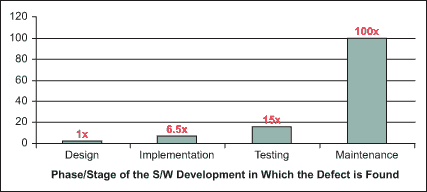

# 大多数开发人员对 bug 的误解是什么？

> 原文：<https://levelup.gitconnected.com/what-most-developers-get-wrong-about-bugs-653b4e94b317>

## 谁该为 bug 负责？怪开发商？怪测试员？

照片由 [Pexels](https://www.pexels.com/photo/stressed-black-male-entrepreneur-working-on-laptop-in-park-4560092/?utm_content=attributionCopyText&utm_medium=referral&utm_source=pexels) 的[赖爷 Subiyanto](https://www.pexels.com/@ketut-subiyanto?utm_content=attributionCopyText&utm_medium=referral&utm_source=pexels) 拍摄

*“你需要修复这个错误，是你造成的。”；“请在 EOD 旁边修复这个 bug！”—* 你听到了这些。

这种信念。认为虫子是我们的错。

谁该为这些错误负责？我们需要追踪羞辱吗？为什么责备很重要？

> 在最近的一次“WTF”行动中，我的老板决定在我们的 bug 跟踪模板中添加一个“责任人”字段，这将增加责任性(尽管我们已经有了将 bug 与功能/故事联系起来的方法)。— [来源](https://softwareengineering.stackexchange.com/questions/154733/my-boss-decided-to-add-a-person-to-blame-field-to-every-bug-report-how-can-i)

Boss 相信这将[引发开发者](https://news.ycombinator.com/item?id=4179298)进行健壮的测试。每个开发者在责备之后都会变得更好。

> 那么，为什么不额外增加一点公开羞辱呢？— [责任人](https://news.ycombinator.com/item?id=4179298)

所有这些指责导致了更好的软件。计划将在创纪录的时间内完成。怪开发商吧。

通过这种方法，羞辱可以提高表现。减少 bug。谁在乎我们是否伤害了开发者的感情。

这不会打击开发者的士气。很好玩吧？我们是一家人，没事的。

另一方面，经理。他们根本没有罪。这就是为什么"该受责备的人"字段是？对吗？

每一个 bug 的根源都是单个开发者。这是普遍的看法。我以前的雇主说— *“我们把虫子放进去了”*。

# 这种信念有什么问题？

失败没有单一的原因。大多数 bug 都有很多失败原因。

不要对错误做出反应。积极思考。这就是根本原因分析的主要思想。

用一种被动的方法，你修补你自己。有了主动性，你就养成了修复 bug 的习惯。一个改进的过程。

反应式思维导致以下实践。糟糕的、错误的、昂贵的版本。经理们称赞开发人员的交付。经理们指责开发人员引入了代价高昂的错误。

主动思考会带来更好的实践。处理缺陷的有组织的方法。收集因果数据，这些数据可以在将来使用。

主动思考导致更少的修补程序。当 bug 定期重新打开时，你知道原因仍然未知。这类似于不良做法，被称为*【猎枪手术】*。你经历了很多地方，并针对错误进行了调整，却没有找到原因。

进行根本原因分析的正确步骤如下:

*   详细缺陷分析的班次；添加根本原因信息
*   评估缺陷模式；了解更多关于产品弱点的信息
*   做根本原因分析；发展对缺陷类别的理解
*   针对这些缺陷培训人员
*   把它变成一个过程

我们能从根本原因分析中学到什么？根本原因分析揭示了几个错误类别:

*   编码缺陷
*   配置缺陷
*   设计缺陷
*   需求缺陷
*   流程缺陷

大多数缺陷需要两个人才能发生。业务分析师和开发人员，用于遗漏的需求。开发人员和企业，对于已知的错误。第三方和开发者，等待 API 时。

# 为什么根本原因分析很重要？

开发人员不是测试人员。他们可以测试一下。不深入。

我们制造东西。只测试关键路径。测试它应该做什么。

bug 不是来自开发者。即使是懒惰的人。他们溜了进去。

> 根据定义，bug**会泄露，因为程序员*没有*发现他们自己代码中的 bug。很多时候，只需要第二双眼睛就能发现一只虫子。—乔尔·斯波尔斯基**

测试人员的工作是破坏东西。他们发现了虫子。他们折磨我们的作品。可悲，但却是事实。

但是为什么要用测试员呢？开发者也是 IT 窥视者。学习它们来测试软件。

> 对吗？号码

使用开发人员作为测试人员的成本。成本很高。而你不会得到质量的回报。开发人员并不致力于测试。

所有阵营的人都应该一起努力。开发者，简单介绍一下。测试人员，集体讨论测试用例。业务，提供有价值的业务输入。

开发软件需要团队协作。没有它，环境变得有毒。

糟糕经理的成本和损失是显而易见的。管理者越差，不感兴趣程度越高。员工会产生厌恶、承诺不足和倦怠。

经理要对每一个 bug 负责。不是开发商。他们应该指派一名专家。

他们应该更好地训练你。他们应该细化要求。

他们在招聘时犯了一个错误。解雇人的时候。

开发者需要修复 bug。这是我们工作的一部分。

请记住原因。将这些信息告知企业。为他们创建一个单独的问题。

不要做马虎的工作。编写那些单元测试。注意代码。尽可能多的测试。

运用前瞻性思维。不知道原因就不要修复 bug。

避免这种— *“修好了，不知道怎么弄”。*使用— *“我修复了 bug。事情发生的原因是这样的！”*

虫子很贵。开发功能、发现 bug，然后修复，这些都要花很多时间。

在软件开发后期修复 bug 的成本要高得多。这就是为什么根本原因分析和适当的修复是必要的。

修复软件缺陷的相对成本(来源:IBM 系统科学研究所)

# 受到...启发

 [## 我的老板决定在每个 bug 报告中添加一个“责任人”字段。我怎样才能让他相信…

### 我认为在这里要观察的关键方面是团队中对“老板”和其他人的沟通有多开放…

softwareengineering.stackexchange.com](https://softwareengineering.stackexchange.com/questions/154733/my-boss-decided-to-add-a-person-to-blame-field-to-every-bug-report-how-can-i)  [## 为什么我在我们的漏洞跟踪系统中增加了一个“应受责备的人”字段|黑客新闻

### 所以几天前我在我们的 bug 跟踪系统中添加了一个“责任人”字段，这个决定吸引了很多…

news.ycombinator.com](https://news.ycombinator.com/item?id=4179298)  [## 开发人员是否也应该充当测试人员？

### 无论我们(3 个开发人员和 1 个设计人员)如何努力测试应用程序和实现的用例，仍然有一些…

softwareengineering.stackexchange.com](https://softwareengineering.stackexchange.com/questions/102507/should-a-developer-also-act-as-a-tester/102652#102652) 

# 参考

[【1】](https://www.hpl.hp.com/hpjournal/96aug/aug96a2.pdf)用于高回报流程改进决策的软件故障分析— Robert B. Grady

[【2】](https://www.codeproject.com/Articles/327886/Use-Root-Cause-Analysis-for-Defect-Prevention-in-y)在你的软件开发过程中使用根本原因分析来预防缺陷

[【3】](https://www.joelonsoftware.com/2000/04/30/top-five-wrong-reasons-you-dont-have-testers/)你没有测试员的五大(错误)理由——乔尔·斯波尔斯基