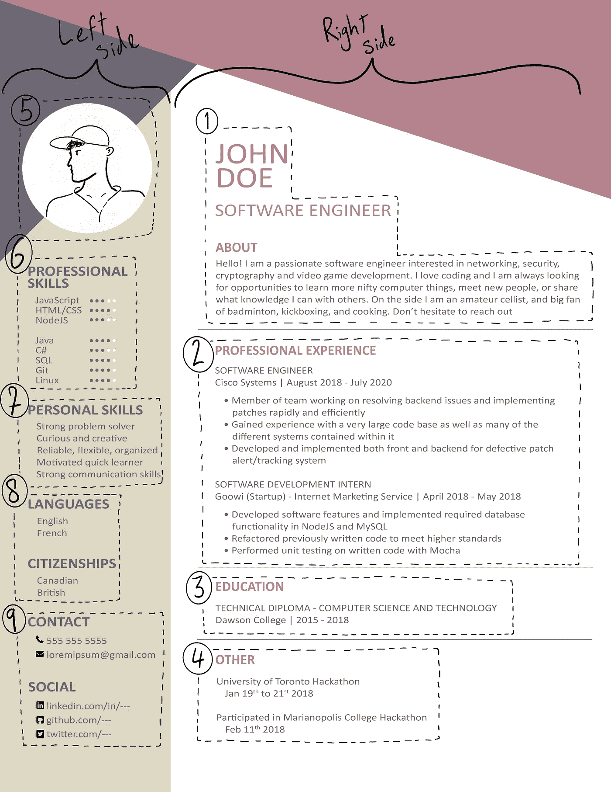

# 我的软件简历是什么样的

> 原文：<https://levelup.gitconnected.com/what-my-software-resume-looks-like-79f6753c6fc3>

## 如何保持干净，清晰，简洁，有点随意。

首先，你可以看一下我的简历，然后我们将逐节讨论每一个部分，包括提示、技巧、选择背后的原因以及我在每一部分中想要传达的信息。

# 右侧对左侧

你可能注意到的第一件事是，我的简历垂直分为两部分。我给右侧更多的空间，因为这是招聘人员看到我的照片后，我希望他们的目光首先投向的地方。

右侧包含了关于我的候选资格、我是谁以及我的职业和教育经历的最相关的信息。通常这就是招聘人员想要的，所以我希望他们不用看就能找到。

将简历一分为二，保持右边的整洁，并有清晰突出的部分名称，这使得我的简历可以非常快速地浏览。

# 第 1 节—我是谁

我以大写字母开头我的名字，接着是我的职称，最后是一个友好的导语，人们可以在大约 10 到 20 秒内阅读，这将告诉他们我是谁。作为个人选择，我倾向于通过包含非软件爱好来使我的选择稍微随意一些。我这样做的目的是为了表明我是一个全面而友好的人，在工作之外也有兴趣。

# 第 2 部分—专业经验

很简单，我在哪里工作，我在那里的头衔，然后是一些关于我的角色和成就的要点。

我试着从招聘人员寻找什么的角度来思考。来看看我最近的职位。我列出了我的关键技能:解决问题和快速实现解决方案，大型代码库的经验，以及完整系统的个人开发和实现。我在强调我可以雇佣的技能，而不是仅仅闲聊我的日常职责。

# 第 3 节——教育

我上学的地点和时间，我获得的学位和证书的名称。

# 第 4 部分—其他

另一个是我列出工作之外我对软件有热情的任何事情。我需要更新它，并添加个人项目，但你可以扔在这里的任何东西都会很好地填充你的简历。个人项目、开源协作、代码指导计划等。

# 第 5 部分—我的照片

在我的简历上放一张照片可能是我最有争议的一点，因为它违背了学校里教授的关于简历制作的一切。

然而，我非常喜欢有一张照片，原因有三。这有助于我的简历脱颖而出，让我作为候选人更令人难忘，如果照片拍得好，会让我显得友好和专业。

我的 LinkedIn 和 Glassdoor 个人资料上有一张照片，为什么我的简历会有所不同？我希望这是招聘人员看到的第一样东西，这样他们在阅读我简历的右侧时，脑海中就会有我的照片。通过让他们遵循这个顺序，我的目标是让他们把他们所阅读的一切与他们友好和专业的精神形象联系起来。

我的一句口头禅是，如果一家公司因为我的简历有一点色彩和一张照片而不雇用我，我可能无论如何也不适合那里。

# 第 6 节—专业技能

在这一节中，我列出了我的编码语言、框架、库等等。我用技能泡泡；他们太棒了。如果你不能添加技能气泡，尝试找出另一种方法来显示你对每种方法的适应程度。

## 记住！然而，这部分是针对你有自信的技能。

在面试中，你决定放入这一部分的任何东西都是公平的。所以如果你在四年前的 Javascript 课上使用了一个框架，它可能不属于这里。你不希望在面试中不得不解释说，事实上，你对你所强调的技术一点印象都没有。

把这一部分集中在你最强的技能上也能让你快速浏览。如果你确实想提及一项你认为与该职位相关的技能，但你对它不太适应，或者在过去很短时间内使用过，那就把它留在求职信中吧，我会在本文 中提到这一点

# 第 7 部分—个人技能

这一部分不是最重要的。这主要是填充，尤其是当我没有太多的经验。这会让你的简历增色不少。我倾向于快速列出我认为使我成为优秀软件员工的五大技能。

# 第 8 部分——语言和国籍

如果你只说你申请的地方的语言，并且只有一个国籍，你可以完全省略。

然而，如果你会说多种语言，我会推荐你把它们包括进来。你永远不知道一家公司与谁打交道，他们很可能从中看到价值。他们可能有说该语言的客户，或者在使用该语言的国家有另一个办公室。

对于公民身份，我把它包括在内，因为我申请的是英国的工作，但只有在加拿大公司工作的经验，并想强调我不会有工作签证的麻烦。

# 第 9 部分—联系和社交

您只需在这里填写公司如何联系您以及您的相关在线信息。

*如果你想问我任何问题或者只是连接和谈论代码，或者任何与 comp-sci 相关的东西，为什么不加入我管理的 Discord 服务器*