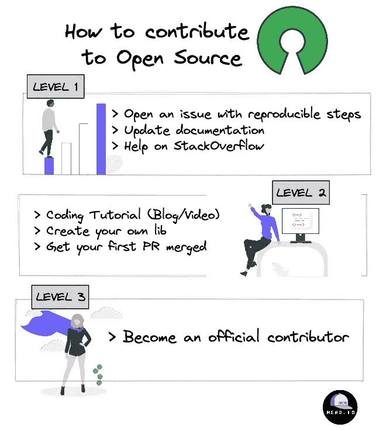

# 开源能为您的数据事业做些什么

> 原文：<https://levelup.gitconnected.com/what-open-source-can-do-for-your-data-career-53ecb747c111>

## 而且你不需要编码就可以开始。

[数字图像]库沙拉·凯瓦特，[https://unsplash.com/photos/KZs5Bt5VDng](https://unsplash.com/photos/KZs5Bt5VDng)

今天的数据世界使用了许多开源工具，从数据工程到数据科学和深度学习。这是一个从多方面发展你职业生涯的独特机会。在最近的一次播客数据会谈中。Club ， [Merve Noyan](https://www.linkedin.com/in/merve-noyan-28b1a113a/) ，分享了她如何从 GitHub 上的婴儿学步到 HuggingFace 上的开发者倡导工程师。受这个演讲的启发，我想谈谈我对开源如何在我的职业生涯中帮助我的思考，一直到数据工程师。

# 🍼开源领域的一小步

## 可重现的问题

为开源做贡献可能会很可怕。你从一个未知的代码库、一种不同的工作方式和公关过程中的大量自动化开始？

嗯，你不必编码来做你的第一步！

我第一次面对开源是因为我有一个 python 包的问题。在 StackOverflow 上没有运气之后，我决定看看 GitHub 的问题。一个类似的问题已经存在，但是背景很差，所以我用一个广泛的如何重现这个问题的方法进行了评论。一天后，维护者发布了一个补丁🎉

对图书馆有意见吗？我通常是这样做的:

1.  直接去 GitHub repo 查看文档。

2.如果文档中没有任何有用的信息，我会查找任何问题。**不要忘记移除默认过滤器** `open`并搜索所有问题。大多数情况下，您必须深入挖掘已关闭的问题来查找相关信息。

3.如果没有现有的/相关的问题，我将打开一个。我会花足够的时间提供复制它所需的所有信息。

这个过程被低估了，但对维护者来说却很有价值。拥有一个问题的多个数据点以及如何重现的清晰步骤是解决问题的一半工作。

## 推广和文件支持

没有编码也有其他参与方式:

*   更新文档
*   帮助 StackOverflow
*   在社交媒体(Twitter/Linkedin)上分享

这些也能让你在网上交流知识，结识不可思议的人。

# 🦸下一关

## 你的第一个编码教程

在致力于某人的代码之前，为什么不通过一个“hello world”项目来分享你的知识呢？

这不太可怕，因为你控制着一切，而且在功能方面不需要太疯狂。主要目标是教一些东西。它可以是一个博客或一个视频，但最好将代码库放在某个地方。这里有一些我做的[书面编码教程](https://betterprogramming.pub/your-next-container-strategy-from-development-to-deployment-66167c0d028a)和[视频](https://www.youtube.com/watch?v=DxTEzywnBOc&t)的个人例子。

额外收获:接触你所报道的任何事物的创造者；有时候，他们会超级乐意重新分享和突出你的作品！

## 你的第一个图书馆

它不需要成为一个有数百万用户下载的伟大的库。它可以是你为了解决你遇到的特定问题而创造的东西。如果你面临挑战，很有可能有人也会面临同样的挑战。

它甚至不需要成为一个图书馆。它可以是框架、代码片段或样板文件。这就是我用 [pyspark 样板](https://github.com/mehd-io/pyspark-boilerplate-mehdio)所做的。我想要一个简单的样板文件，可以在不同的项目中重用。没有什么完美和奇特的，但它解决了我的一个问题。

## 您的第一个拉动式请求(PR)

既然你已经独自做出了贡献，你已经准备好去看别人的项目了。值得看看 GitHub 上的`first good issue`标签和**在植入任何东西之前开始讨论。**

因为不符合设计决策，你的公关被拒绝了，这很令人沮丧。Merve Noyan 强调维护人员总是很乐意与您讨论，因为他们尊重您的时间和对项目的承诺。

多个经验丰富的活动将促进开源贡献。

以下是其中的几个例子:

*   贡献冲刺:许多开源项目都有专门的贡献冲刺，维护人员将把他们的时间集中在加入和帮助新的贡献者上。
*   黑客啤酒节
*   谷歌代码之夏

作者图片

# 📣推广您的项目

没有人想要 git 克隆和阅读您的自述文件来设置您的项目。最后一英里是部署您的项目，以便用户可以轻松地使用它。

如果你的项目是一个库，把它推到适当的位置(例如:python 的 PyPI)

对于其他类型的项目，有几个平台可以帮助您:

*   提供了一个笔记本运行时来展示你的项目
*   [HuggingFace Space](https://huggingface.co/docs/hub/spaces) 提供了一种托管 ML 演示应用的简单方法
*   [Streamlit](https://streamlit.io/) 在几分钟内将数据脚本转化为网络应用

# 🌟从为开源做贡献到获得你梦想的工作

在公共场合工作有一个很大的秘密:它是公开的。谁都可以查。这也可以加快技术面试，因为你可能已经通过一些公关证明了你的能力。

一些公司也给你机会为他们自己的开源项目做公共公关。这很好，因为你的编码测试在其他面试中是可见的。

# 🚀去投稿吧！

这是为开源做贡献的最好机会。

有很多项目。

许多平台降低了部署和展示您的作品的技术壁垒。

你所做的一切都将是公开的，这是未来参考的黄金。

所以，不要犹豫，开始行动吧！

# 迈赫迪·瓦扎又名迈赫迪欧·🧢

感谢阅读！🤗 🙌如果你喜欢这个，**跟着我上**🎥 [**Youtube**](https://www.youtube.com/channel/UCiZxJB0xWfPBE2omVZeWPpQ) ，✍️ [**中等**](https://medium.com/@mehdio) ，或者🔗 [**LinkedIn**](https://linkedin.com/in/mehd-io/) 了解更多数据/代码内容！

**支持我写作** ✍️通过加入媒介通过这个[**链接**](https://mehdio.medium.com/membership)