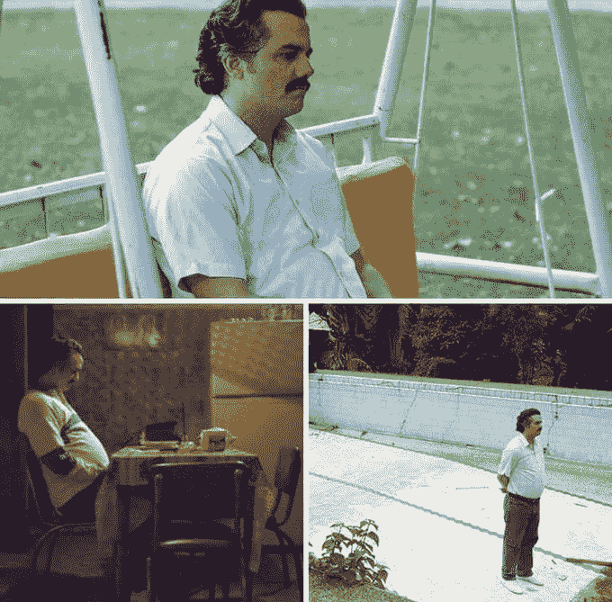

# 关于重构，产品、工程和商业需要理解什么

> 原文：<https://levelup.gitconnected.com/what-product-and-business-needs-to-understand-about-refactoring-7c5f2840b73b>

我在未能说服产品我们需要重构那段麻烦的代码后

还记得你作为一名工程师不得不与技术债务作斗争的那些时候吗？你需要向你的产品经理解释你需要时间来重构代码。产品经理，带着良好的意图和不了解情况的严重性，推了回去。现在你陷入了僵局。你觉得产品经理不理解你，产品经理觉得自己是对的。所以你把首席执行官拉进来。首席执行官看着你说，“先说功能，后说技术债务。如果你需要重构你的代码，这意味着你一开始就没有写好。讨论结束。”

我在 10 分钟内变老了 7 个月

所以你不情愿地回到自己的办公桌前，低着头，沮丧地发现企业似乎并不理解重构代码的重要性。

然后，当你坐下来思考发生了什么时，几个想法突然出现了。您会想起那些因为您和 QA 在您的自动化测试中遗漏了关键的产品 bug 的时候(不要告诉单元测试纯化论者我们几乎没有任何 bug！).啊，你花了几个星期写的代码，因为前一个工程师放进去的所有复杂的逻辑太乱了，然而你没有时间来适当地重写它们。你心想，“如果代码是干净的，我们就可以避免这种情况。”

听起来很熟悉？

太熟悉了。软件工程通常是一项吃力不讨好的工作。当传呼机没有在凌晨 3 点叫醒你时，你知道一切都很好。然而，当事情变糟时，人们都围着你转。你不知道如何解释投入时间进行重构的价值，因为向他们解释重构就像向盲人解释黄色是什么颜色一样。但你知道这是必须的。更糟糕的是，每个人都怀着良好的意愿对待这场争论。

首席执行官希望事情尽快完成，这样他就可以销售。所以所有的努力都必须致力于特性开发。产品经理希望优先开发功能，以获得更多付费用户和更好的产品参与度。因此维护工作退居其次。(既然一切似乎都运转良好，那么急什么呢？)你想要重构代码，因为你知道如果你不这样做，你会睡得更少，有更多的 bug，整个业务进展更慢，最终所有人都会失败。

罕见的照片显示，一位首席执行官在想，为什么去年花了一周时间才完成的主页横幅的更改现在要花六周时间。

啊，专业知识的顶峰是一个孤独的地方，特别是当说服不是你的那杯茶的时候(一般来说，软件工程师不擅长说服产品和业务)。

那么，我们必须如何弥合这种背景差异呢？各方如何解决这些隐藏在地毯下的痛点？

一、所有部门需要在一件事上保持一致: [**每个团队的最终目标都是让业务赢**](https://medium.com/swlh/strategic-thinking-for-software-engineers-bf938a58cdca) 。当每个人都认同这一点时，那么**就很容易做出善意的假设**。除非员工带着恶意对待他的工作(这通常只发生在无所事事的员工身上)，否则他们通常都有良好的意图，尤其是知识工作者。

接下来，**各方不仅要听说了什么，更重要的是，要听没说的话**。为什么这样因为每个部门都有不容易被其他部门使用的上下文。从他们口中说出来的话通常带有这样的假设，即那些陈述的基本背景是共享的背景。事实几乎总是如此。否则，所有的争论都会友好地解决。因此，积极倾听、带着共鸣倾听至关重要。

专业提示:像霍根一样倾听。

此外，理解产品团队的担忧也是至关重要的。提前一个月发布一个功能意味着公司可以更快地获益。然而，同样重要的是要明白，今天做出的任何妥协明天都要付出代价。如果没有适当的重构，六个月以后五天内要写的特性可能要花三个星期。然而，这通常是一种未知的权衡，事后无法衡量。产品经理只能依靠工程师告诉他们的估算。未来迭代的偶发事件经常没有被讨论，因为工程师对将要发生的事情知之甚少，产品经理对工程工作的复杂性知之甚少。

> 对此没有灵丹妙药。

然而，有一些技术可以用来避免它们。首先，考虑长远很重要。一个人想得越长远，就能做出越好的决定。不要让短期收益和狭隘的愿景束缚你未来更大的收益。第二，理解重构是特性开发的一部分很重要。这不是一项单独的努力。第三，**为特性工作和重构制定年度预算很重要**。根据经验，我建议在一个日历年内，9 个月用于特性工作，3 个月用于重构。任何增加预算的谈判都可以单独进行。

这样做是为了给产品一个九个月的预算，从上到下优先考虑最重要的特性。同样，工程师有三个月的时间来确定代码中需要修复的地方，这样以后执行起来会更快。记住，重构是特性开发的一部分。

当我还是 Rakuten Viki 的一名机器人工程师时，我可以决定分工。这种模式对我们来说非常有效。我可以安排几个月的工作来保持代码处于足够好的状态，同时能够快速移动。我们是世界上第一个开发全功能安卓即时应用的[。](https://android-developers.googleblog.com/2017/01/android-instant-apps-starts-initial.html)给我们的最后期限是两周，以便我们的代码能够与即时应用程序兼容。这不是一项容易的任务。我必须将一个 16 MB 的 APK 文件压缩到 4 MB，同时还要满足其他五个要求，同时还要保持播放流媒体视频广告的能力，整合 MediaPlayer 和 ExoPlayer 以及其他几个功能。我们取得了成功，因此，谷歌在他们世界各地的研讨会上以我们为参考，并在他们的[案例研究](https://developer.android.com/stories/instant-apps/viki)、[商业广告](https://www.youtube.com/watch?v=J7EZgXJQGz0)和[技术会议](https://www.youtube.com/watch?v=tXqat1JOmS8)中介绍我们。这最终导致我们享受了许多其他成功的冒险，例如被提名为 [Android Excellence、](https://android-developers.googleblog.com/2017/10/android-excellence-congratulations-to.html) [编辑选择](https://blog.viki.com/viki-app-recognized-by-google-as-editors-choice-d5fadbb0a7d7)、 [Google Play Awards](https://blog.viki.com/rakuten-viki-nominated-for-google-play-awards-featured-at-google-i-o-2018-c99ee0a9a30f) 以及许多其他奖项的一部分。这一系列的成功使我们的工程团队受到许多优秀工程师的关注。所有这一切都要归功于我们能够充分清理我们的代码，如果需要的话，能够以疯狂的速度前进。随着我们将能力分成 75%的特性工作和 25%的重构的过程，**如果我们需要的话，我们总是可以选择非常敏捷。有切换到超快模式的选项而不需要它总比没有它希望你做的要好。**

总之，记住**每个团队的最终目标都是让企业成功。**因此

1.  假设意图良好。
2.  所有各方都应该听听说过的话，更重要的是，没有说过的话。
3.  积极倾听，并感同身受地倾听。

在处理特性工作和重构之间的争论时，

1.  记住要考虑长远。
2.  始终将重构视为特性开发的一部分，而不是单独的努力。
3.  为特性工作和重构提出年度预算。建议的划分是 75%的特性工作和 25%的重构。这两者都必须被视为特性开发的一部分。

___

正如斯蒂芬·柯维所说，首先寻求理解，然后被理解。

为了避免将特性开发和特性工作混为一谈，我将特性工作定义为与重构无关的特性开发中所需的工作。这可能是错误修复、积压、特性迭代、A/B 测试需求和新特性需求。

我还必须指出，Android 即时应用的两周工作是有代价的。因为我们几乎没有时间把它拿出来，这导致了大量的技术债务，我们花了一些时间来清理。然而，这是一个明显的例子，如果业务需要快速发展，我们可以选择。拥有这种选择而不需要它，总比不希望你需要它要好。