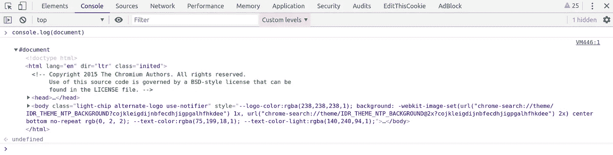

# 什么是真正的 DOM？

> 原文：<https://levelup.gitconnected.com/what-really-is-the-dom-4d0068da2254>

我发现刚开始 web 开发的人常常很难理解文档对象模型或 DOM 的概念。我确实做了。我经常以一种模糊或抽象的方式看到这个话题。我记得在早期，很难找到任何好的资源来解释 DOM 到底是什么。这让我相信这是一些模糊的机器，或概念，在你的浏览器后台工作。然而，因为我知道这是每个 web 开发人员都应该很好掌握的东西，我只是低着头告诉自己我理解它，但实际上我并不理解。

当我开始使用 React 时，这个 DOM 的概念变得更加复杂。我会在教程中看到 ReactDOM 这个术语，并读到一些关于 React 的“虚拟 DOM”的片段。我知道这是 React 的主要好处之一，但由于我并不完全理解 DOM，所以当谈到理解 React 的虚拟 DOM 时，我很早就接受了失败。我想我必须一步一步地罚款，我不可能在第一步之前完成第二步。

我想外面还有和我一样的人。如果是你，欢迎。这篇文章是给你的。我将揭开 DOM 的神秘面纱，甚至简单介绍一下 React DOM。这真的不太难，所以让我们开始吧。

# 快速介绍

所以首先，DOM 只是一个节点(或对象)树。每个节点代表浏览器页面的一部分，查看者与该部分进行交互。DOM 并不特定于 Javascript 或任何其他语言。它只是所有浏览器都引用的结构，构成了所有的网页。老实说，理论说够了。

# 我们开始吧

我相信您对 Javascript 中的文档对象很熟悉。如果你不是，我鼓励你看一看 [MDN](https://developer.mozilla.org/en-US/docs/Web/API/Document) 或【W3Schools.com】T2 的文档。这个文档对象本质上就是 DOM。如果你在你的控制台中运行 *console.log(document)* ，你将会看到一个包含当前页面所有 HTML 的对象。

这实际上是你的文档对象的模型。通过 *Elements* 选项卡检查元素时，您会看到非常相似的事情。出现的 HTML 元素列表*实际上就是 DOM* 。它是文档对象的模型。这很简单，而且花了我太长时间来组装。熟练使用文档对象和浏览器*元素*标签对于任何 Javascript 开发人员来说都是绝对必要的，但是有些人可能没有意识到，当您使用这些工具时，您是在直接使用您的 DOM。

我一了解到这一点，DOM 是某种模糊而复杂的东西的想法就完全消失了。我感到松了一口气，但有点傻，因为我真的已经理解 DOM 很长时间了。我只是不知道我做到了。

# 虚拟世界

我想我应该接触一下虚拟 DOM，因为它已经成为前端网络技术的黄金标准。React 是它的先驱，但很快就有 Angular、Vue 和 Elm 紧随其后。

既然我们理解了 DOM 到底是什么，那么虚拟 DOM 就很容易理解了。每当屏幕上的更改被触发时，React 会拍摄当前 DOM 的快照，然后在后台创建 DOM 的副本，并实现新的更改。它将快照和 DOM 与新的更改进行比较。在将任何内容呈现到屏幕之前，通过比较这两者，React 知道 DOM 的哪些节点将被更改。它使用这一知识来仅重新呈现已经改变的节点。这种只更新需要更新的内容的想法对于 web 开发来说是相当新的，并且是革命性的。它使重新渲染非常有效，并允许在屏幕上发生更多的事情，而牺牲很少的性能。

现在你知道了。我希望这澄清了任何关于 DOM 的困惑。如果你仍然困惑，我建议你继续努力。让你的思想在这上面工作一段时间，并尝试继续你在这个主题上的教育。最终会成功的。