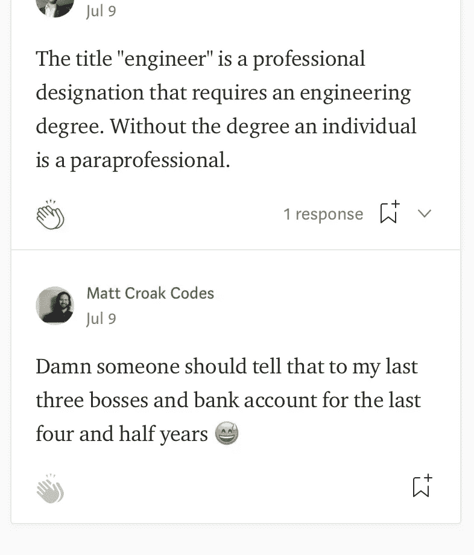
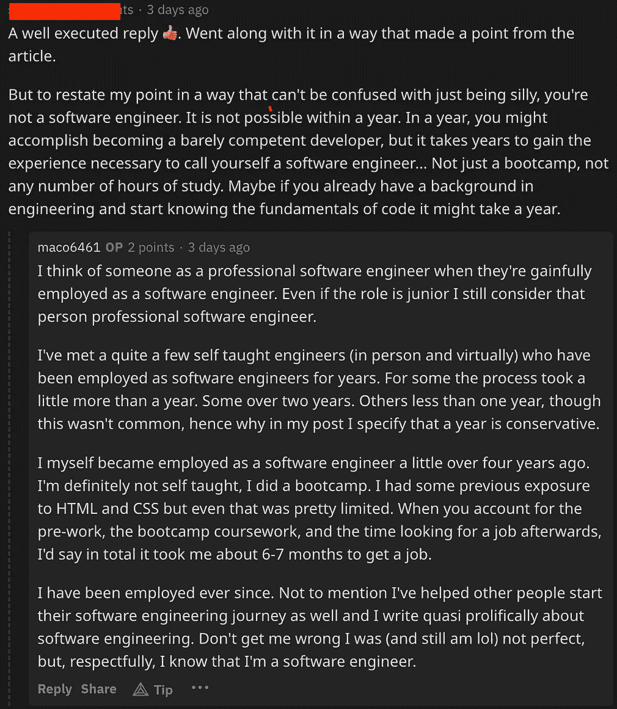

# 是什么让你成为一名“专业”的软件工程师

> 原文：<https://levelup.gitconnected.com/what-really-makes-you-a-professional-software-engineer-fe9ce8f873fc>

## 多年经验？一个学位？还是其他完全不同的东西？


克里斯蒂娜@ wocintechchat.com 在 [Unsplash](https://unsplash.com/s/photos/software-engineer?utm_source=unsplash&utm_medium=referral&utm_content=creditCopyText) 上的照片

不久前，我在 [Quora](https://beginnercoder.quora.com/It-still-amazes-me-the-hairs-people-will-split-when-determining-who-is-or-isn-t-a-professional-software-engineer) 上写了一篇帖子，回应一些用户说，除非你符合他们的标准，否则你不是真正的*专业软件工程师。我决定在那篇文章的基础上展开，写这篇文章，不是因为我需要，也不是因为大多数人还不明白我要写什么。*

我写这篇文章是因为我想让第一次做工程师的人遇到一些事情**鼓励**他们应该谷歌一下“是什么让你成为一名专业的软件工程师？”至此，让我们来看看一些人认为要成为一名专业软件工程师，你需要满足哪些“标准”。

有人认为你需要有一个学位。

另一个人说你需要有一年以上的工作经验，但没有具体说明是多少年。

稍后我们会详细讨论这两个问题。

自从 2017 年秋季/初冬从熨斗学校的软件工程沉浸式毕业后，我第一次进入这个行业以来，这种情绪就一直存在。

自从我从训练营毕业后，我已经…

*   三份工作
*   三位老板/经理
*   稳定的(且不断增加的)薪水、福利、公司股权等。
*   在 Medium 上发表了 100 多篇科技博客文章(我从中赚了些钱)
*   作为签约(即付费)技术作家，LogRocket 的五个故事
*   为 Socket Mobile 举办了两场网络研讨会( [React Native](https://www.socketmobile.com/about-us/news-room/webinars/how-to-develop-a-react-native-app-with-integrated-data-capture-functionality) SDK 和 [Flutter](https://www.socketmobile.com/about-us/news-room/webinars/how-to-develop-a-flutter-app-with-integrated-data-capture-functionality) SDK)

我也有…

*   写了几十个个人项目
*   在我的三份工作中，开发了无数的 SaaS、应用程序、网站
*   精通多种语言和框架
*   回答了超过 150 个关于[堆栈溢出](https://stackoverflow.com/users/7927036/matt-croak)的问题
*   发布包到[npmjs.com](https://www.npmjs.com/package/foodie)和[发布开发](https://pub.dev/packages/capturesdk)

我为自己做出的贡献感到自豪，但我说这些并不是为了吹牛。我这么说是为了表明，即使有了以上所有这些，仍然有*人会因为这样或那样的原因试图声称我不是一个“专业”的软件工程师。*

这是我之前提到的最近的两个。



这两种观点做出了相同的假设，但出于两个不同的原因。先说第一个。

## “准专业人员”

这个术语对我来说听起来很熟悉，但是我不能马上确定我在哪里听到的。在谷歌上搜索了一下后，我想起我在大学里听过很多。

为什么？因为 SUNY·科特兰最出名的可能是培养出了优秀的教师。

这个术语几乎专门用于谈论需要特定许可或证书的工作或角色，如 ***教学*** 。

> 剧透提醒:[做软件工程师不需要执照或者认证](https://www.howtobecome.com/how-to-become-a-software-engineer#:~:text=There%20are%20no%20licensure%20requirements,pursue%20depending%20on%20their%20interests.)。

这是一个更广泛使用的术语，指的是与专业人员一起工作并协助他们的专业人员，例如助教或医疗助理。我从未听说过“软件工程助理”或“区域软件工程师助理”这样的职位。


简而言之，对于软件工程来说，这并不真正适用。

> 注:*埃隆马斯克，此人执迷不悟* ***一大堆*** *的软件，* [实际上并没有软件工程或计算机科学学位](https://www.bestcolleges.com/news/analysis/2021/10/19/did-elon-musk-go-to-college/)。任何认为自己不是“专业人士”的人都应该去检查一下自己的脑袋。

即使把一个没有软件工程学位的软件工程师称为准专业人员是合适的，我最初的观点仍然成立——在过去的四年半里，我一直在做三份工作的*软件工程师*(请注意没有“助理”)。

不管是否非专业，这是一份支撑我的职业，给了我一个我珍惜的工作与生活的平衡。我和我共事过的人都认为我是专业人士。

## 计时员

下一个人提供了一个更主观的观点，但仍然很普遍。归根结底，个人认为一个人有足够的时间被认为是“专业的”软件工程师。前面提到的那个人，似乎认为一年不够——我敢打赌他们并不孤单。

那么，什么是足够的呢？两年够吗？三个？四又二分之一(*眨眼眨眼*)？

截断点在哪里？还是不仅仅是时间？是时间问题，也许只是一种*的感觉*有人拥有*？*喜欢他们*觉得*喜欢某人是合法的*？*


就个人而言，感觉最重要的人是招聘经理或老板。不是 Reddit 上的软件工程纯粹主义者。

在开始训练营的 6 个月内，我成为了一名有收入的软件工程师。我事先确实对 CSS 和 HTML 有一些了解。否则，软件工程对我来说是非常陌生的。

跳到今天，我有不错的薪水，福利，WFH 等等。

现实是，有些人需要一年以上。其他人更少。

*每个人*以*不同的*速度学习，并且有*不同的*学习方法和*不同的*获取资源的途径。在我的训练营中，我比大多数人都走得慢，但是毫无疑问，与自学相比，在训练营中，我在整个过程中走得更快。

现在，有了*多*年的经验，你能成为*更好的*软件工程师吗？

当然了。

这是否意味着一个在四个月的编码训练营后两个月才开始工作的入门级软件工程师不是专业的软件工程师？


## 那么到底是什么让你成为一名“专业”的软件工程师呢？

有些人可能会认为我关于如何让一个人成为专业软件工程师的想法很激进，但是我不能再隐瞒我的观点了。我提前为那些阅读这篇文章的人所产生的任何想法道歉。

好的…在这里…

> 让你成为专业软件工程师的是有人付钱让你成为软件工程师。

我坚信，如果一家公司足够相信你的能力，愿意付钱让你发挥这些能力(你知道，有些人可能会认为这是一份专业协议),并让你加入他们的团队/公司，那么你就是一名专业人士。

我认为这使你成为世界上最好的软件工程师吗？当然不是。但这并不意味着你不能称自己为专业人士。

## 如果你还没拿到钱呢？

你可能在读这篇文章的时候会想…

> 嗯，我还没有得到我的工作。这是否意味着我不是软件工程师？

虽然你没有被雇佣，而且从技术上来说*不是一个*专业的*软件工程师，但这并不意味着你根本不是一个软件工程师。*

把它想象成一个真正的好厨师，但不是专业厨师。

这并没有降低他们的厨艺，或者说他们不是一个好厨师。人们还是信任这个人的厨艺，相信一定会好的。

他们有工资做饭吗？号码

那会削弱他们烹饪的能力吗？


这就是你应该如何看待*自己*。

你还不是专业的软件工程师……*。*

*你*是*写软件。*

*你*能够建造东西。**

*你很棒，而且越来越棒。*

*如果你已经到了训练营的尾声，或者你已经有了大量的投资组合并正在申请工作，那么你很有可能是一个有价值的*专业*候选人(即使一些招聘经理还没有看到)。*

*冒名顶替综合症迫在眉睫，等着任何借口把你吸进去，让你退出。我已经经历过了，老实说，在某些时候我仍然会有这种感觉。*

*但是你不能屈服于它的压力。*

*当我的训练营失败时，我立即开始寻找电视行业的新工作，以及如何拿回我的钱。直到我决定在这条道路上全力以赴，我才真正变得优秀。*

*编程，就像任何你想擅长的事情一样，需要你全身心地投入。*

*你已经走到这一步了。无视别人的想法*继续编码*！*

## *摘要*

*对于什么是“专业的”或“真正的”软件工程师，有很多人会吹毛求疵。他们会告诉你，你需要一个学位，或者你需要一定的时间。*

*你的重点不应该是向他们证明你自己，而是向招聘经理和老板证明你的能力。他们才是重要的人。*

*在我看来，只要你受雇编写软件，你就是一名专业的软件工程师。*

*如果你还没有软件工程的工作呢？*

*嗯，从技术上来说，你可能不是一个“专业”的软件工程师，但是只要你在写代码，做项目，建立你的投资组合，我相信你是一个软件工程师，如果你坚持下去，你会成为一个“专业”的软件工程师。冒名顶替综合症就像失败和拒绝一样是旅程的一部分。*

*不要让这个说服你你不够好。坚持下去。继续申请。*

*继续编码。✌️*

*您在编码之旅的哪个阶段？你对什么是“专业的”或“真正的”软件工程师有不同的看法吗？请在评论中告诉我！*

*[***升级您的免费 Medium 会员资格***](https://matt-croak.medium.com/membership) *并接收来自各种出版物上数千名作家的无限量、无广告的故事。这是一个附属链接，你的会员资格的一部分帮助我为我创造的内容获得奖励。**

**您还可以通过电子邮件* *订阅，每当我发布新内容时，您都会收到通知！**

# *参考*

*[](https://beginnercoder.quora.com/It-still-amazes-me-the-hairs-people-will-split-when-determining-who-is-or-isn-t-a-professional-software-engineer) [## 我仍然很惊讶人们在决定谁是或不是专业人士时会吹毛求疵…

### 当人们在决定谁是或者不是专业软件工程师时，他们的细微差别仍然让我感到惊讶…

beginnercoder.quora.com](https://beginnercoder.quora.com/It-still-amazes-me-the-hairs-people-will-split-when-determining-who-is-or-isn-t-a-professional-software-engineer) [](https://blog.logrocket.com/author/matthewcroak/) [## 马修·克罗克，LogRocket 博客的作者

### 一个布鲁克林的熨斗学校的校友，马修是一个后期制作助理变成软件工程师与一个富有成效的…

blog.logrocket.com](https://blog.logrocket.com/author/matthewcroak/) [](https://www.socketmobile.com/about-us/news-room/webinars/how-to-develop-a-react-native-app-with-integrated-data-capture-functionality) [## 网上研讨会:使用集成数据捕获技术进行本地反应

### 使用 React Native 和数据捕获与 Socket 集成，了解应用程序开发的来龙去脉…

www.socketmobile.com](https://www.socketmobile.com/about-us/news-room/webinars/how-to-develop-a-react-native-app-with-integrated-data-capture-functionality) [](https://www.socketmobile.com/about-us/news-room/webinars/how-to-develop-a-flutter-app-with-integrated-data-capture-functionality) [## 网络研讨会:集成数据采集的 Flutter

### 使用 Flutter 和与 Socket Mobile 集成的数据捕获，了解应用程序开发的来龙去脉…

www.socketmobile.com](https://www.socketmobile.com/about-us/news-room/webinars/how-to-develop-a-flutter-app-with-integrated-data-capture-functionality) [](https://stackoverflow.com/users/7927036/matt-croak) [## 用户马特·克罗克

### 全栈 Web 开发人员。目前在 Socket Mobile 上开发 JavaScript SDK，以确保与…

stackoverflow.com](https://stackoverflow.com/users/7927036/matt-croak) [](https://www.npmjs.com/package/foodie) [## 美食家

### 命令行界面包，寻找你的位置附近的餐馆。使用谷歌地图的位置和地理定位…

www.npmjs.com](https://www.npmjs.com/package/foodie) [](https://pub.dev/packages/capturesdk) [## capturesdk |颤振包

### 这是用于 Socket Mobile 的捕获库的 Flutter CatureSDK。在安装软件包之前，您需要…

公共开发](https://pub.dev/packages/capturesdk) [](https://work.chron.com/paraprofessional-4981.html) [## 什么是准专业人员？

### 什么是准专业人员？。准专业人员是指没有资格或执照从事特定工作的工人…

work.chron.com](https://work.chron.com/paraprofessional-4981.html) 

[https://www . how tobe come . com/how-to-be-a-software-engineer](https://www.howtobecome.com/how-to-become-a-software-engineer)

[https://www . best colleges . com/news/analysis/2021/10/19/did-elon-musk-go-to-college/](https://www.bestcolleges.com/news/analysis/2021/10/19/did-elon-musk-go-to-college/)

# 分级编码

```
Thanks for being a part of our community! More content in the [Level Up Coding publication](https://levelup.gitconnected.com/).Follow: [Twitter](https://twitter.com/gitconnected), [LinkedIn](https://www.linkedin.com/company/gitconnected), [Newsletter](https://newsletter.levelup.dev/)Level Up is transforming tech recruiting 👉 [**Join our talent collective**](https://jobs.levelup.dev/talent/welcome?referral=true)
```