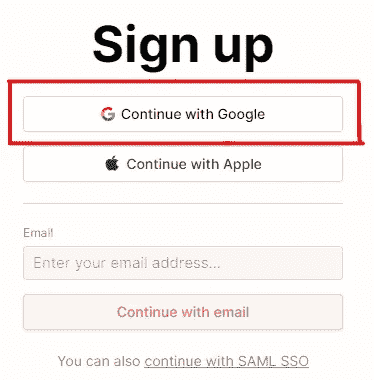
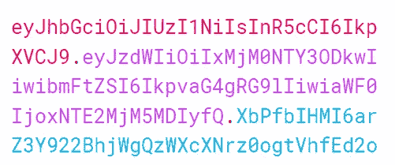
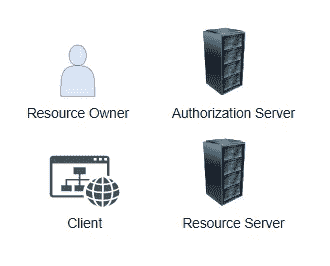
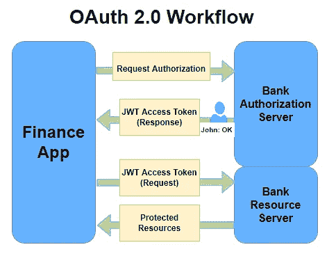
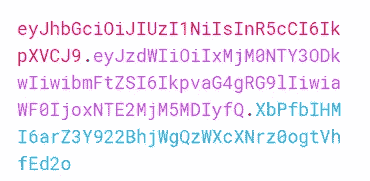

# JWT 和 OAuth 2.0 到底是什么？

> 原文：<https://levelup.gitconnected.com/what-the-heck-are-jwt-and-oauth-2-0-865312ed2aff>


[JSON Web 令牌](https://icons8.com/icon/rHpveptSuwDz/json-web-token)图标由[图标 8](https://icons8.com/) 组成

# 目录

*   背景/问题陈述
*   什么是 JWT？
*   JSON Web 令牌是如何以及何时使用的？
*   OAuth 2.0 是如何工作的？
*   JWT 接入令牌在 OAuth 2.0 中的作用
*   JSON Web Token 的内部工作方式
*   一些最后的提示和可行的建议

# 背景/问题陈述

## 创建您的自定义登录流很困难

有时也有风险。要设计一个安全、轻量级的登录程序，需要对网络安全原理有深刻的理解，并具备良好的软件设计知识。


事实证明，这对小型和大型公司来说都是相当具有挑战性的——如果您未能正确加密敏感信息，该怎么办？如果您的密码哈希很容易被利用怎么办？

## 对身份提供者的委托



为了避免这些复杂性，我们**将这些任务委托给身份提供者**，并使用常见的**‘登录谷歌’**或**‘登录脸书’**认证方法。

在使用此类身份验证方法时，您可能会经常看到诸如 [**OAuth 2.0**](https://oauth.net/2/) 和 [**JWT**](https://jwt.io/) **之类的术语。**

但是 OAuth 2.0 到底是什么，它与 JWT 有什么关系？

在本文中，我将分享您需要了解的关于 OAuth 2.0 和 JWT 的一切。如果你是一名软件架构师、软件工程师，或者只是一名热情的技术人员，你绝对应该继续读下去，了解更多！

# 什么是 JWT？


简而言之，JWT——也称为 JSON Web Token——是通过 JSON 对象在不同方之间安全传输信息的标准。

通过 JWT 传输的信息也可以被验证，因为它是数字签名的。数字签名信息允许我们确保我们收到的信息不被篡改，**从而确保信息的完整性。**



另外，如果您好奇，这是 JSON Web 令牌的紧凑形式。

# JSON Web 令牌是如何以及何时使用的？

通常，您会看到 JWT 被用于多种身份验证/授权场景。


例如，当您在网站上集成 Google Sign-In 时，您可能会遵循 OAuth(开放授权)2.0 标准，并在交易结束时收到一个 JWT 访问令牌。

然后，JWT 访问令牌用于**授权客户端应用程序访问受保护的资源。**

# OAuth 2.0 是如何工作的？


为了更好地理解 JWT，我们需要首先理解 OAuth 2.0。

这里有一个 TLDR；OAuth 2.0 版本说明。我将只关注 OAuth 2.0 的核心概念，这足以让您理解 jwt 在 OAuth 2.0 中的作用。

在这个解释中，让我们使用一个开发人员的例子，他正在构建一个需要与银行服务器接口的财务应用程序。

在这个例子中，我们的**财务应用**需要访问**我们的用户(即约翰)的银行信息**来显示一个财务仪表板，供我们的用户跟踪他的财务状况。

## 在 OAuth 2.0 中有 4 个角色



1.  **资源所有者:**拥有受保护资源的用户，即 John
2.  **客户端:**需要访问受保护资源的系统，即我们的财务 app
3.  **授权服务器:**处理授权流程的服务器，以便您的客户端(金融 app)可以访问受保护的资源，即银行的授权服务器
4.  **资源服务器:**接收访问请求并返回受保护资源的服务器，即银行的资源服务器

****下例中受保护的资源指的是 John 的银行信息。***

## **通用 OAuth 2.0 工作流程**

这是 OAuth 2.0 工作流，用于我们的财务应用程序访问用户的银行信息。



工作流程可能看起来很复杂，但如果你试着慢慢阅读和理解，它实际上是非常符合逻辑的。

1.  **金融 app (client)** 通过提供**客户 ID** 和**客户机密**作为标识，向**银行授权服务器**请求授权。
2.  **银行的授权服务器**基于所提供的凭证来认证**财务 app(客户端)**，并通过询问 **John(资源所有者)**是否同意让**财务 app(客户端)**访问他的**受保护的银行资源来验证该请求是否被允许。**
3.  **约翰(资源所有者)**授权**财务 app(客户端)**访问他的**受保护的银行资源。**
4.  **银行的授权服务器**然后返回**带有 **JWT 访问令牌的金融应用(客户端)**。**
5.  **金融应用(客户端)**现在可以使用 **JWT 访问令牌从**银行的资源服务器**请求**受保护的资源**。**
6.  **银行的资源服务器**在识别出有效的 **JWT 访问令牌**后，根据请求返回**受保护资源**。

***注意*如果银行决定使用 Google 作为身份提供者，也可以使用 Google 的授权服务器扩展上述工作流程。***

# **OAuth 2.0 中 JWT 接入令牌的作用**

简单来说， **JWT 访问令牌**在这里起到**的作用，证明请求**提取**受保护资源**的用户**确实被授权访问。**

> JWT 接入令牌是一种授权机制。

# JSON Web Token 的内部工作方式


回想一下，JWT (JSON Web Token)是 ***一种通过 JSON 对象在不同方之间安全传输信息的标准。***

但是**为什么 OAuth 2.0 使用 JWT 标准？** **为什么 OAuth 2.0 不能简单地使用加密字符串进行认证？JSON Web Token 到底是怎么工作的？为了找到这些问题的答案，让我们探索 JSON Web Token 的内部工作原理。**

## **JWT 常用案例**

首先，记住 JSON Web 令牌最常用于**授权目的**。此外，由于其设计，它也可以用于**信息交换**，因为 jwt 是**数字签名的**。因此，您可以**验证消息内容没有被篡改。**

## **JSON Web 令牌结构**


JSON Web 令牌的简洁形式如下所示。


JSON Web 令牌有 3 个部分— **头、有效负载和签名。每个部分由句点/点分隔。** 此处，**报头为红色文字**，**有效载荷为紫色文字**，**签名为蓝色文字**。

## **报头—令牌的第一部分**


JWT 令牌的头只是一个包含两条信息的 **JSON 数据——令牌的类型和使用的签名算法(即 HMAC SHA256)**

**举例:**

```
{
  "alg": "HS256",
  "typ": "JWT"
}
```

这个 JSON 数据然后将被 **Base64Url 编码**以形成 JWT 的第一部分。

Base64Url 编码输出:`eyJhbGciOiJIUzI1NiIsInR5cCI6IkpXVCJ9`

***注意*
- Base64Url 编码是指将二进制数据(即 101101)转换成 ASCII 字符串格式。
-间距很重要。如果您尝试将上面格式良好的 JSON 数据粘贴到 Base64Url 编码器中，您将得到这个输出*** `ewogICJhbGciOiAiSFMyNTYiLAogICJ0eXAiOiAiSldUIgp9`。**我用来 base64url 编码的 JSON 数据是** `{“alg”:”HS256",”typ”:”JWT”}`

## 有效负载—令牌的第二部分


有效负载包含关于实体(通常是用户)的数据。

**例如:**

```
{
  "sub": "1234567890",
  "name": "John Doe",
  "iat": 1516239022
}
```

同样，JSON 数据被 **Base64Url 编码**以形成 JWT 的第二部分。

## 签名—令牌的第三部分/最后一部分


我们的 JSON Web 令牌的最后一部分——**签名**——更加复杂，但是非常关键。

签名需要 **4 个输入**

1.  base64Url 编码的**头 JSON 数据**(即`eyJhbGciOiJIUzI1NiIsInR5cCI6IkpXVCJ9`)
2.  base64Url 编码的**有效载荷 JSON 数据**(即`eyJzdWIiOiIxMjM0NTY3ODkwIiwibmFtZSI6IkpvaG4gRG9lIiwiaWF0IjoxNTE2MjM5MDIyfQ`)
3.  **一个秘密串/密钥**(即`secret`)
4.  **头 JSON 数据**中指定的**签名算法**(即 HMAC SHA256)

对于 4 个输入，签名通过以下算法创建:

```
HMACSHA256(
  base64UrlEncode(header) + "." +
  base64UrlEncode(payload),
  secret
)
```

HMAC SHA256 的输出将是`XbPfbIHMI6arZ3Y922BhjWgQzWXcXNrz0ogtVhfEd2o`

***注意* —签名保证消息的完整性。如果这里的秘密是用私钥签名的，我们也可以确保身份验证和不可否认性。***

## **JSON Web 令牌——结合了所有 3 个部分(头、有效负载和签名)**

报头:`eyJhbGciOiJIUzI1NiIsInR5cCI6IkpXVCJ9` 有效载荷:`eyJzdWIiOiIxMjM0NTY3ODkwIiwibmFtZSI6IkpvaG4gRG9lIiwiaWF0IjoxNTE2MjM5MDIyfQ` 签名:`XbPfbIHMI6arZ3Y922BhjWgQzWXcXNrz0ogtVhfEd2o`



# 一些最后的提示和可行的建议

如果你成功了，恭喜你！现在**您已经理解了 JSON Web Token 的基本概念**以及它是如何在 OAuth 2.0 等标准中使用的**。**

在你离开之前，我想分享一些**有价值的可操作的要点**和你在未来项目中使用它们时与 JWT 互动的技巧。

1.  **不要**在 JWT 有效载荷中存储敏感数据。**有效载荷是 base64url 编码的，不是加密的。**攻击者可以**运行简单的 base64url 解码来提取有效载荷内容。**
2.  务必将 JWT 存储在 httpOnly cookies 中。由于许多用户需要 JWT 来向后端发出授权请求，所以您需要将 JWT 存储在某个地方。**存储 jwt 最安全的地方是 httpOnly cookies。**
3.  一定要为你的 JWT 签名使用强有力的秘密。如果你把你的秘密命名为你的应用/公司名称，你就是在要求被利用！一个好的经验法则是秘密的长度越长越好。

还有…就是这样！

**就像大多数网络安全专业人员无法逃避编码一样，大多数开发人员也无法逃避对核心安全原则的理解。**

我很感激有一个网络安全的学术背景和丰富的软件工程经验，这使我能够结合我在这两个领域的技能。

然而，你不必学习网络安全 3 年来学习所有必要的知识，以成为一名伟大的软件工程师/架构师！只要继续你正在做的事情——一次阅读一篇文章，一次实现一个技术概念——你就会成功！

如果你想加速你在软件领域变得更加技术化和熟练，一定要给我一个关注！干杯！

**资源**

*   [https://jwt.io/introduction](https://jwt.io/introduction)
*   [https://jwt.io/#debugger-io](https://jwt.io/#debugger-io)
*   [https://auth0.com/intro-to-iam/what-is-oauth-2/](https://auth0.com/intro-to-iam/what-is-oauth-2/)
*   [https://auth0.com/docs/secure/tokens/access-tokens](https://auth0.com/docs/secure/tokens/access-tokens)

# 分级编码

```
Thanks for being a part of our community! More content in the [Level Up Coding publication](https://levelup.gitconnected.com/).Follow: [Twitter](https://twitter.com/gitconnected), [LinkedIn](https://www.linkedin.com/company/gitconnected), [Newsletter](https://newsletter.levelup.dev/)Level Up is transforming tech recruiting 👉 [**Join our talent collective**](https://jobs.levelup.dev/talent/welcome?referral=true)
```