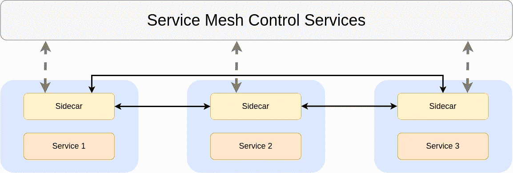

# 什么是服务网格？

> 原文：<https://levelup.gitconnected.com/what-the-heck-is-service-mesh-a2471ddc6f3b>

## 一种新的设计模式使得服务之间的通信变得容易

克林特·王茂林在 [Unsplash](https://unsplash.com?utm_source=medium&utm_medium=referral) 上拍摄的照片

多年来，微服务一直是科技界的热门词汇。如果你已经实现了微服务，你会知道很难跟踪服务是如何相互作用的。

服务网格就是为了解决这个问题而出现的。服务网格提供了处理服务间通信的基础设施层。它使通信安全可靠。其他功能包括负载平衡、身份验证、授权、服务发现等等。

服务网状架构

# 它是如何工作的？

Sidecar 扩展了其附属服务的功能。服务和边车是松散耦合的。

照片由[在](https://unsplash.com/@drew_beamer?utm_source=medium&utm_medium=referral) [Unsplash](https://unsplash.com?utm_source=medium&utm_medium=referral) 上绘制的光束器

现实生活中的独立边车没有任何用途。在服务网格场景中，sidecar 模式被用作与其他服务进行安全通信的代理。

您将与通信相关的协议、参数和配置卸载到边车。这使得微服务独立于用于通信的协议。

服务间通信的变化根本不会影响服务。

# 服务网格的功能

以下是服务网格的组件及其功能—

## **服务实例窗格**

服务的副本称为实例。pod 是服务的一个实例。它可以是单个容器，也可以是一堆容器。

## **容器编排**

您需要一个框架来进行容器编排，因为所有的服务都部署在容器中。Kubernetes 在这个用例中占主导地位，并且是用于这个目的的最广泛使用的工具。

## 边车

如前所述，sidecar 是一个代理，它管理与它所连接的服务的通信相关的一切。所有入站和出站流量由边车管理。

## 安全通信

安全通信有两个功能——***加密*** 和 ***认证授权*** *。*

服务网格能够对服务之间的数据传输进行加密和解密。它还管理现有连接的超时和重用。现有的服务网格可以是使用 mTLS、PKI 和其他协议的通道上的加密数据。

服务网格还可以授权和认证来自 web 或服务之间的请求。

## 服务发现和负载平衡

服务发现帮助您发现服务的实例。服务网格使用应用层负载平衡。

服务发现帮助服务发现该服务想要与之交互的其他服务的可用实例。

## 制导机

服务网格是一个分布式系统，你需要一个集中的控制平面来管理这个系统。控制平面强制实施网络属性，如路由表、负载平衡、服务发现等。

# 结论

像网飞、Lyft 和 Twitter 这样的公司已经为自己建立了一些微服务。许多开发人员遵循他们的应用程序设计。如果你有一些微服务，那么简单的架构就足够了。如果您有数百个微服务，像服务网格这样的架构是很好的。

*喜欢自己体验媒介？考虑通过注册会员* *来支持我和其他作家* [***。会员每月只需 5 美元，它支持我们，作家，没有额外的费用。你也有机会通过写作赚钱。如果你这样做，我会收到一部分费用，不会多花你多少钱。谢谢大家！***](https://singhamrit.medium.com/membership)

 [## 通过我的推荐链接加入 Medium-Amrit Pal Singh

### 作为一个媒体会员，你的会员费的一部分会给你阅读的作家，你可以完全接触到每一个故事…

singhamrit.medium.com](https://singhamrit.medium.com/membership)