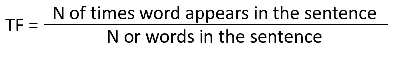
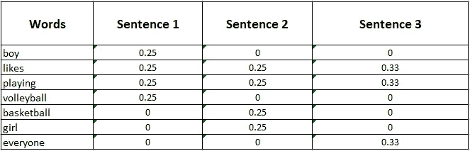
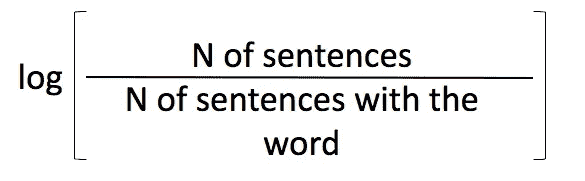
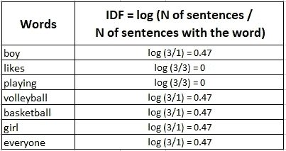
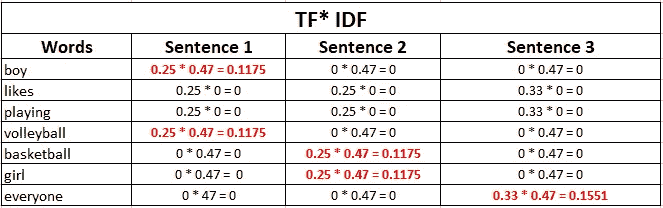

# 计算机如何从文本中提取有意义的信息

> 原文：<https://levelup.gitconnected.com/what-the-heck-is-tf-idf-69ead52c908b>

## TF-IDF:理解搜索引擎和其他机器学习应用中使用的这种技术


图片来自 [Pixabay](https://pixabay.com/?utm_source=link-attribution&utm_medium=referral&utm_campaign=image&utm_content=1246674) 的[安妮·斯普拉特](https://pixabay.com/users/anniespratt-4900708/?utm_source=link-attribution&utm_medium=referral&utm_campaign=image&utm_content=1246674)

如果你正在学习机器学习(ML)，特别是自然语言处理(NLP)，你可能会遇到这个缩写。*【TF-IDF】*。我一直在我阅读的每一篇关于自动文本摘要的研究论文中找到它。

*"TF-IDF..又来了！”*永远是我的思考。

重述一个关键概念。在 NLP 中，文本术语/单词被转换成数值，因此算法可以执行计算并从中推断信息。

例如，在我关于[余弦相似度](https://towardsdatascience.com/cosine-similarity-intuition-with-implementation-in-python-51eade2674f6)的文章中，我选择每个句子的数值(特征)为:

*   字数
*   基础文本中包含的字数

TF-IDF 是我可以选择的另一个特性。

它是一个属性，告诉你关于这个词或术语的一些有意义的东西。但是 TF-IDF 怎么算，TF-IDF 等于 0.23 或者 0.60 或者 0 不代表什么？

TF-IDF 的目标是对文档中“术语”(如单词)的重要性进行评分。它通过比较单词在文档中的相关性和同一个单词在不同文档中的重要性来工作。

将“文档”视为一个通用术语。它可以指句子。

# 术语频率(TF)

我们先来看 TF。

TF 表示一个单词在其句子中的常见或罕见程度。它只看它的句子*。它不考虑其他的。我将用下面的句子来说明它是如何工作的。*

```
*Sentence 1: boy likes playing volleyball
Sentence 2: girl likes playing basketball
Sentence 3: Everyone likes playing*
```

*TF 的公式如下。*

**

*图一。TF 的公式。作者图片*

*每个句子中“男孩”这个词的 TF 值是多少？*

```
***Sentence1; word "boy":** 1/4 = 0.25 (It appears 1 time. the sentence has 4 words)
**Sentence2; word "boy":** 0/4 = 0
**Sentence3; word "boy":** 0/3 = 0*
```

*这是所有的 TF 计算。*

**

*图二。所有 TF 计算[2]。图片作者。*

# *反向文档频率(IDF)*

*另一方面，IDF 从整个文档/句子集合的角度说明单词的重要性。*

*IDF 显示一个单词在所有文档中的总体常见(或罕见)程度。*

*   *IDF = 0(或接近 0)，意味着这个词太常见了。*
*   *IDF = 1，这个词很少见/不太常见。*

*这听起来可能很奇怪，但这是因为许多文档中的“common”意味着这个词与提取文档的关键信息无关。*

*像**“如何”、“什么”、“这个”这样的词以及其他常用词**并不能告诉你关于特定文档的太多信息。*

*例如，考虑一下我在这篇文章中使用的句子。想象一下，每个句子都是关于一项运动的，而你正试图按它们给每个句子分类。*

*根据 IDF 值，篮球和排球将排名靠前。*

***换句话说**——在文档 X 中常见的单词，但在其他文档 Y 和 Z 中不常见的*更能说明文档 X 的含义**

*计算 IDF 值的公式如下。*

**

*图 3。IDF 公式。作者图片*

**

*图 4。所有 IDF 计算[2]。图片作者。*

# *把所有的放在一起*

*一旦你有了 TF 和 IDF，你就把它们相乘。*

**

*图 5。TF-IDF 公式。作者图片*

*这就是了——考虑到所有其他句子，句子中每个单词的相关性。*

**

*图 6。TF-IDF 最终结果[2]。作者图片*

***读取最终结果的方式是:***

*   *“男孩”和“排球”是第一句中最相关的词。*
*   *“女孩”和“篮球”是第二句中最相关的词。*
*   *“每个人”是第三句中最相关的词。*

*“likes”和“playing”在句子 1 中与“boy”具有相同的 TF，但因为它们在其他句子中也太常见，所以它们在提供关于句子 1 的关键信息方面不太相关。*

*概括地说，在各种文档/句子中过于常见的术语可能与提取特定文档/句子的关键信息无关。而稀有术语更有可能泄露关键信息。*

*对于 Python 中的实现，请查看 Cory Maklin 的文章*

# *结论*

*TF-IDF 是 NLP 中使用的一种流行的单词权重测量方法。它被用于搜索引擎，文本摘要系统和其他。这是一个有趣的方法来找出一个词/术语是如何相关的。*

*理解起来没那么复杂，但是有点棘手。这会造成混乱。让我迷惑的一点是“逆文档频率”这个名字。“词频”很清楚，但“逆文档频……”就没那么多了。至少第一眼看不出来。*

*总的来说，现在阅读关于文本摘要和 NLP 的论文会感觉不那么费劲了。*

*渐渐地，所有的概念都很好地融合在一起了，我迫不及待地想深入研究一下“单值分解(SVD)”。大概是下一篇吧。*

*感谢阅读。*

# *参考*

*[1] [计算 TF-IDF 值的简明介绍](https://towardsdatascience.com/a-gentle-introduction-to-calculating-the-tf-idf-values-9e391f8a13e5)*

*[2] [自然语言处理|TF-IDF 直觉|文本预处理](https://www.youtube.com/watch?v=D2V1okCEsiE)*