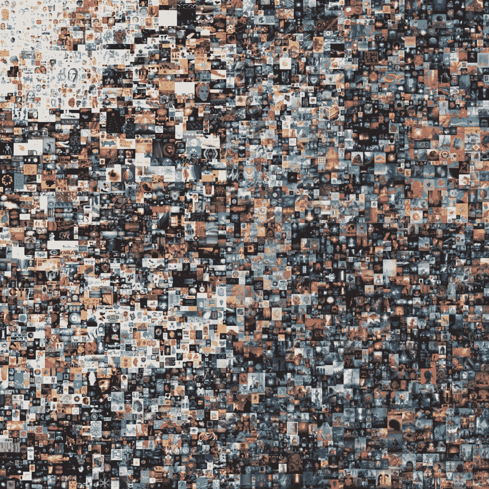
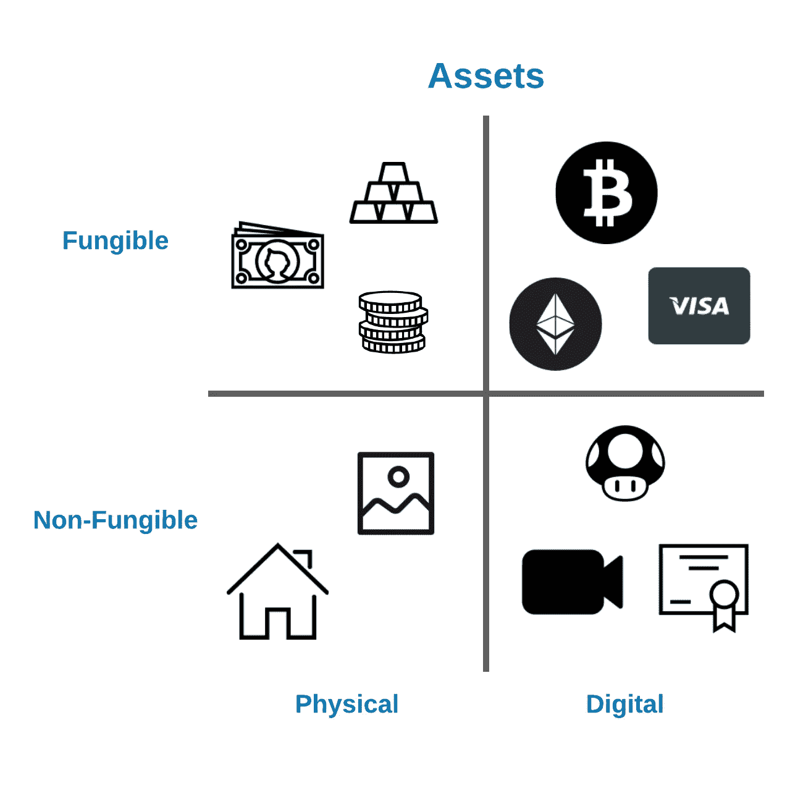
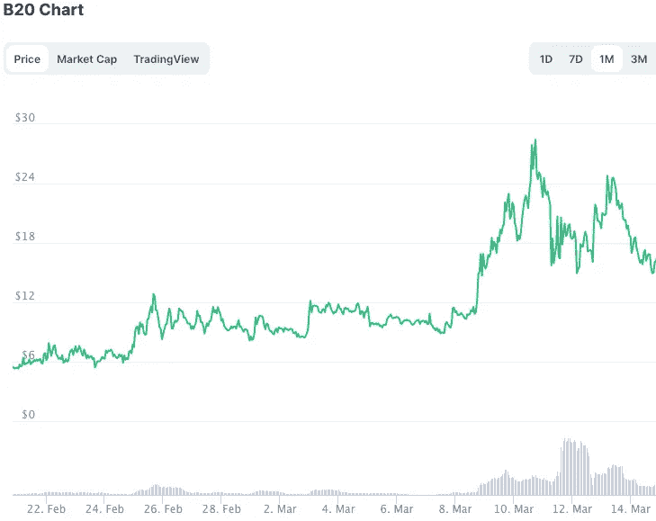

# NFT 是什么鬼？

> 原文：<https://levelup.gitconnected.com/what-the-hell-are-nfts-e9bd3a4210df>

## 进一步放权，还是精心操纵市场？

每一天:2021 年 2 月 16 日诞生的第一个 5000 天。来源:佳士得

一个 NFT 代表不可替代的令牌——这显然澄清了一切。最近，随着加密生态圈持续爆发到 2021 年，NFT 开始声名鹊起。上面的艺术品是 NFT 的作品，最近**以 7000 万美元的天价卖出。这件数码艺术品是由笔名为 Beeple 的艺术家 Mike Winkelmann 创作的。它描绘了他自 2013 年以来创作的每一件艺术作品，但采用了数字格式。**

> 这件艺术品从来没有任何实物——没有牌匾，没有框架，什么都没有。取而代之的是，你猜对了，它带有一个运行在区块链技术上的数字证书。这就是 NFT 的特质。

有趣的是，从 2 月 25 日开始，**everydays 的初始要价被设定为 100 美元**。在投标的前八分钟内，20 名投标人将价格推高至近 100 万美元。拍卖结束前一小时，要价约为 1400 万美元。仅在最后 10 分钟内，价格飙升至 3500 万美元。在最后几秒钟，最终出价定为 6025 万美元，加上佳士得艺术品拍卖的 900 万美元。

这场 NFT 拍卖会的一个极具影响力的方面是，佳士得报告称，他们将接受加密货币作为支付方式——这对这家拥有 255 年历史的拍卖行来说是第一次。在一个适合于未来加密传奇的故事之后， *Everdays* 的买家只被化名 Metakovan 所知，他恰好管理着一个名为 Metapurse 的收集 NFT 的大型基金。

> “我觉得我捡了个便宜，”—梅塔科万在以 7000 万美元的价格购买了 Everdays 的乙醚后说。

密码市场上的 NFT 交易数量正在不断增加。Twitter 首席执行官杰克·多西在他的第一条推文中出售了一首 NFT，而埃隆·马斯克决定通过出售一首关于 NFTs 的歌曲的 NFT 来搜索这个空间。

这仍然回避了一个问题— **到底为什么 NFT 会以天文数字的价格爆炸？**嗯，和通常的加密空间一样，它需要把事情分解成基本的部分。

# 进一步解释——什么是 NFT？

我们来分析一下。首先，不可替代仅仅意味着你不能将一种资产与另一种资产互换。对于 NFTs 来说，令牌只是一个位于区块链上的真实性证书，这使得令牌对每个人都是可验证的和可见的。因此，NFT 是艺术、视频、音频和任何其他形式的数字创作中的独特数字资产。

以下面的图表为例。我们将各种资产分成物理、数字和可互换的盒子。左上方的方框代表可替代的实物资产，如黄金、法定货币或赌场筹码。这些是实物资产，你可以很容易地以特定的比例将它们交换。

在右上角，我们有数字但仍可互换的资产，如比特币、以太坊甚至信用卡积分。

转到下面的不可替代资产，像房子或画这样的实物资产实际上不能互相交易。右下角是 NFT 所在的地方。在这里，我们有不可替代的数字资产，伴随着唯一性和真实性的数字证书。

> 这些数字资产可能包括视频或视频游戏项目。我的意思是，如果 Runescape 中的蓝色派对帽仅游戏项目就能卖近 7000 美元，想象一下如果第一顶蓝色派对帽有 NFT 奖。

用 LucidChart 做的

# 从无到有创造一些东西

回到 NFT 基金元钱包，他们收集所有这些独特的数字资产是有原因的。该基金赚钱的方式始于创造他们所购买的 NFT 的*部分股份*。元钱包创建了 2000 万个 B.20 代币的上限供应，其中每个代币代表其所有数字资产价格的 1/10，000，000。据说，这可以让你分散昂贵奢侈品的所有权。

梅塔科万从 Beeple 公司以巨额价格购买数字资产。一旦 MetaPurse(或者说 Metakovan)拥有了这些数字资产，他们就会同时推广他们的 B.20 代币。然后，当人们每天购买数字资产，如 *Everydays* 时，他们会看到这些代币的价格上涨。

> *因此，现在元钱包不仅拥有这些数字资产，还拥有这些资产在 B.20 代币中的“分散”份额。这意味着，随着代币价格的上涨，元钱包及其普通公众股东积累的总财富也在增加。*

请记住，这只是通过创建一个代表这些数字艺术品总价格一小部分的数字令牌来实现的。在这种情况下，像 MetaPurse 这样的基金能够简单地通过细分其共享资产的所有权来创造巨额财富。

## 创作者的希望

你是否认为 NFT 空间是道德的取决于你。就我个人而言，我相信如果有人首先可以在艺术上花费数千万美元，那么我看不出为什么将这种(尽管是浪费的)哲学推广到普通大众是一件坏事。然而，我认为值得记住的是，在任何危机时期，我怀疑任何人会发现第一个 Charizard 的数字证书非常有价值。

然而，这个领域并没有止步于此——许多人看到的一些真正的增长是将这个想法扩展到内容创作者领域。基本的想法是，任何艺术家，无论是画家、乐队，你能想到的，都可以创建他们自己的数字产品的 NFT，然后他们分散到分数份额。

> 通过这种方式，酷玩乐队的早期粉丝可以看到他们的酷玩代币随着乐队的持续成功而涨价。这不是一个疯狂的想法吗？我真的无法说出这对社会意味着什么，但我不得不说这对我来说是一个非常令人兴奋的想法。你怎么想呢?NFTs 是一种分享成功的新方式，还是利用当前围绕区块链和一般加密的大肆宣传的加密空间？

我希望您喜欢阅读这篇文章，并且能够了解一些关于 NFTs 的知识。我只是最近才开始了解它们，它们确实是一种有趣的新技术——尤其是在肯定会出现高度争议的观点的情况下。如果你发现这篇文章的任何部分很有见地，或者想了解更多，我鼓励你在下面留下评论。感谢阅读！