# 我们每天下载的不同种类的软件…

> 原文：<https://levelup.gitconnected.com/what-the-ware-23ab95347d25>

## 这是什么？软件有这么多的分类，但是不同的类型是什么呢？——作者[克雷格·戈登-佩恩@beardy.digital](https://medium.com/u/d14973fad051?source=post_page-----23ab95347d25--------------------------------)

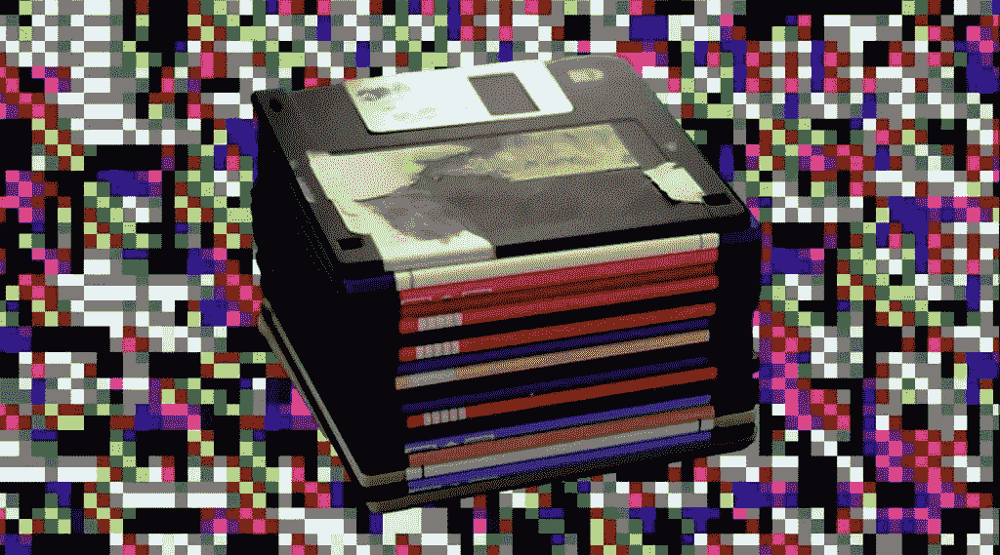

软件泛指产品或工具，在计算术语中，“软件”用来区分“硬件”。有许多类型的*器皿*可供选择，我们将探索不同的类别

# 废弃器皿

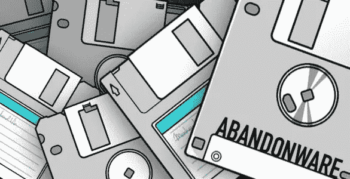

废弃器皿

**废弃软件**或**废弃软件**是被其所有者和制造商忽视的软件，没有官方支持，尽管它可能仍受版权保护，但所有者可能不会跟踪版权侵犯。

废弃软件通常发生在产品寿命结束时。当这种情况发生时，它会导致一些问题，如软件不再能够被购买或下载，它可能缺少技术支持或只能在一种不再可访问的介质(如软盘)上获得。

属于废弃软件类别的软件往往会被废弃软件网站重新出售，或者被存档网站作为历史记录保存。

大多数废弃软件网站分发旧游戏，这些旧游戏通常被模仿，因为它们运行的系统已经不能购买了。

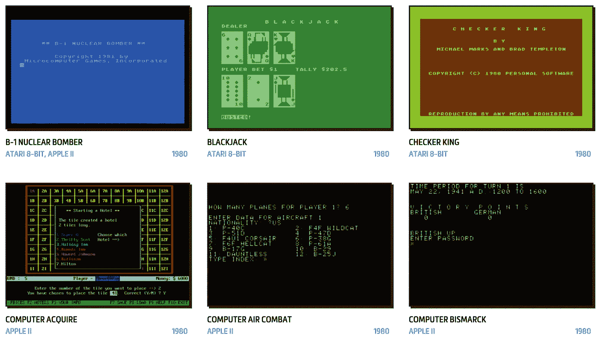

分布式废弃软件示例

# 广告软件

**广告软件**，或**广告支持软件**，是通过在软件的用户界面展示广告，通常是在线广告来产生收入的软件。

广告软件通过点击付费模式或浏览量模式产生收入，因此这些广告显示许多不同的广告或以一种可能使用户意外点击广告的方式放置广告并不罕见。

广告可以分为静态广告、横幅广告、全屏广告、视频广告甚至弹出广告。

android 游戏中典型的全屏广告示例

# 膨胀器皿/垃圾器皿

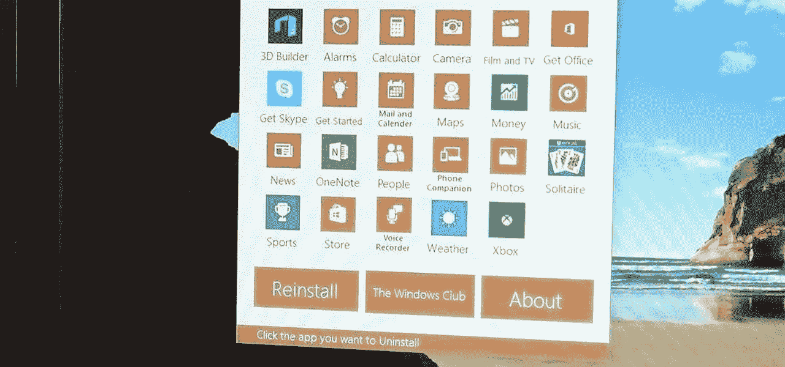

软件中包含膨胀软件

**臃肿软件**或**臃肿软件**是指因效率低下而变得臃肿的软件，或通常由制造商预装在设备上的软件，购买者大多不需要。

膨胀软件通常会对设备的性能产生负面影响，通常会浪费宝贵的资源，如内存、处理时间、磁盘 I/O 或存储。它们还会导致系统启动和关闭延迟。

用户通过“扎根”他们的手机来绕过手机上的膨胀软件。这可能会使制造商的保修无效，但给用户更多的控制权，使他们能够做一些事情，如卸载设备附带的默认应用程序

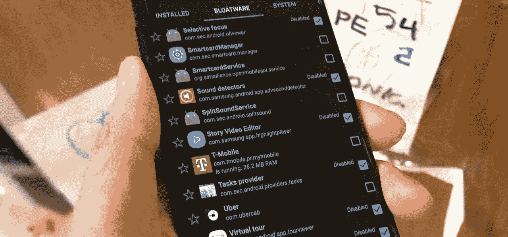

用户移除膨胀件

# 乞丐软件/罪恶软件/唠叨软件/烦恼软件

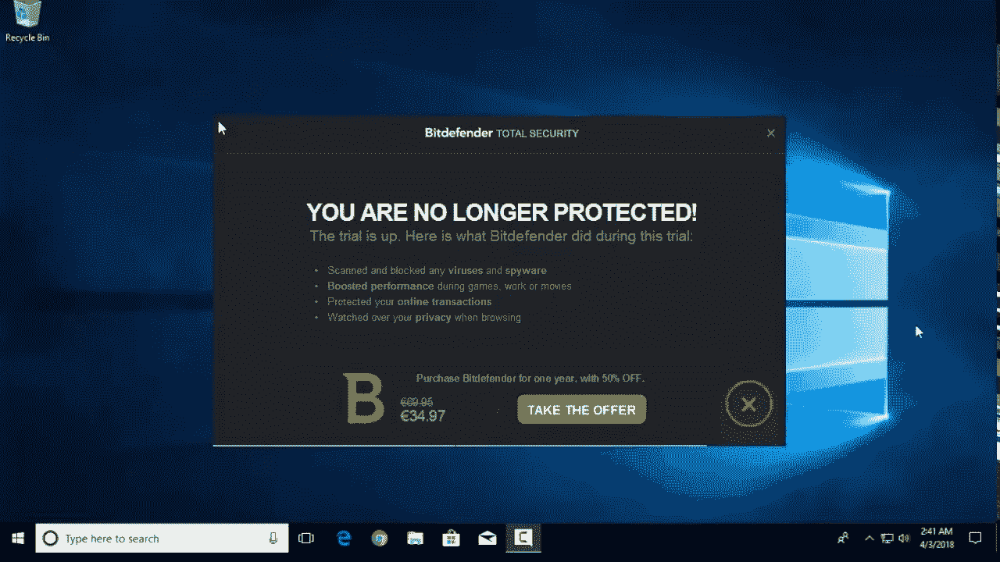

在免费试用期结束后不断提醒用户付费使用的电脑软件

Nagware 是一款不断提醒用户购买许可证的软件。它通常在用户启动程序时弹出一条消息，或者在用户使用应用程序时间歇地弹出一条消息。

一些软件会试图以一种令人讨厌的方式做到这一点，例如增加启动时显示消息的时间，或者遮挡部分屏幕。

有些软件会显示一个对话框，其中包含支付信息和一条消息，说明支付将删除通知，通常在启动时或在应用程序运行的一段时间后显示。这些通知旨在骚扰用户，迫使其付费。

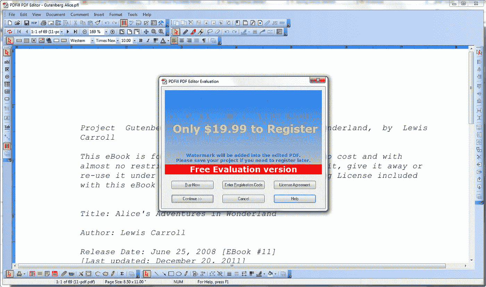

nagware 对话框弹出的一个例子

# 恶魔软件，残废软件

Demoware

**演示软件或瘫痪软件**是一种软件，它具有一个完整程序的某些功能，并对其余功能添加限制。通常只有在你下载并运行了你想要使用的功能后，你才会被告知这种限制，然后才发现这种限制。

一个例子是视频转换软件，它在输出视频中添加水印，或者一个文件清理应用程序，它只能清理它找到的文件总量的 5%。

这背后的想法是，它允许用户仔细查看程序的特性，而不能够使用它来生成输出。残废软件旨在展示它的潜力，但它本身是没有用的。

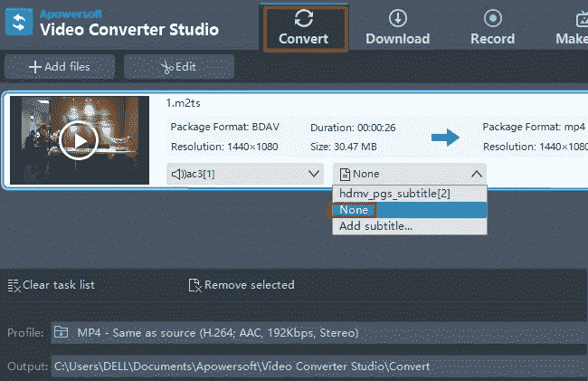

带水印的演示软件示例

# 免费软件

免费软件

**免费软件**是免费分发给用户的软件。每个出版商都为自己提供的免费软件定义了自己的规则。

与通常免费发布的开源软件不同，免费软件的源代码通常是不公开的。

免费软件可能旨在通过鼓励销售他们创造的功能更强的版本或其他软件产品来使其开发者或作者受益。

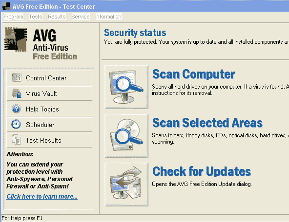

自由软件

# 恶意软件

恶意软件

**恶意软件**或**恶意软件**是故意设计来对计算机造成损害的软件。

如果程序暗中违背计算机用户的利益，它们也被认为是恶意软件。例如，索尼音乐光盘公司一度悄悄在购买者的电脑上安装了一个 rootkit，目的是防止非法拷贝，但它也报告了用户的收听习惯，无意中创造了额外的安全漏洞。

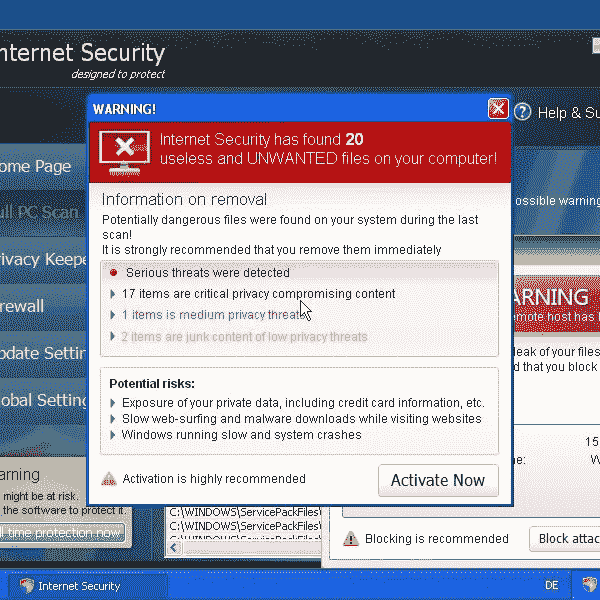

搜索恶意软件的示例

# 明信片/卡片/电子邮件

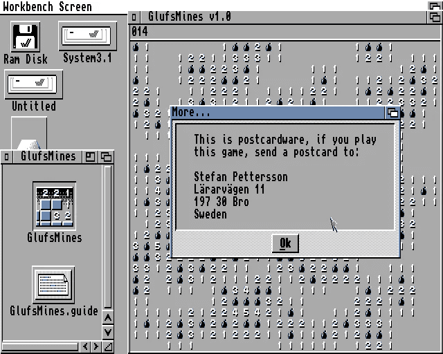

明信片弹出窗口示例

**Postcardware、cardware 或 Emailware** 是类似于 shareware 的软件，开发者允许使用该软件，只要用户给开发者发一张明信片或电子邮件。它可以像时间限制软件一样工作，作者在收到明信片或电子邮件后给用户发送一个密钥。它通常与激活键一起使用。

明信片软件在过去更受欢迎，现在很少能在软件中看到明信片弹出窗口。

一些流行的明信片软件是 mac 版的 JPEGView 和一些版本的 Linux。

只是寄张明信片

# 流氓软件/恐吓软件/勒索软件

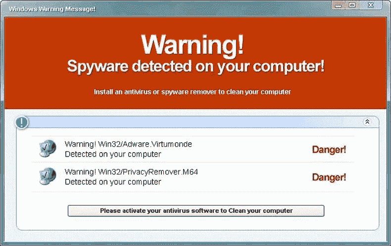

scareware 显示的典型警告

**Rougueware/scare ware/Ransomeware**是一种软件，旨在误导用户相信他们的计算机上有病毒，试图说服他们购买一个虚假的删除工具，该工具实际上在他们的计算机上安装了恶意软件。

自 2008 年左右以来，流氓安全软件一直是桌面计算中的一个严重安全威胁。

一些最早流行的例子是《勇敢的哨兵》和《间谍网》。

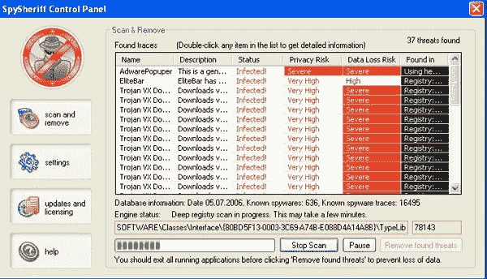

间谍警长截图

# 共享软件

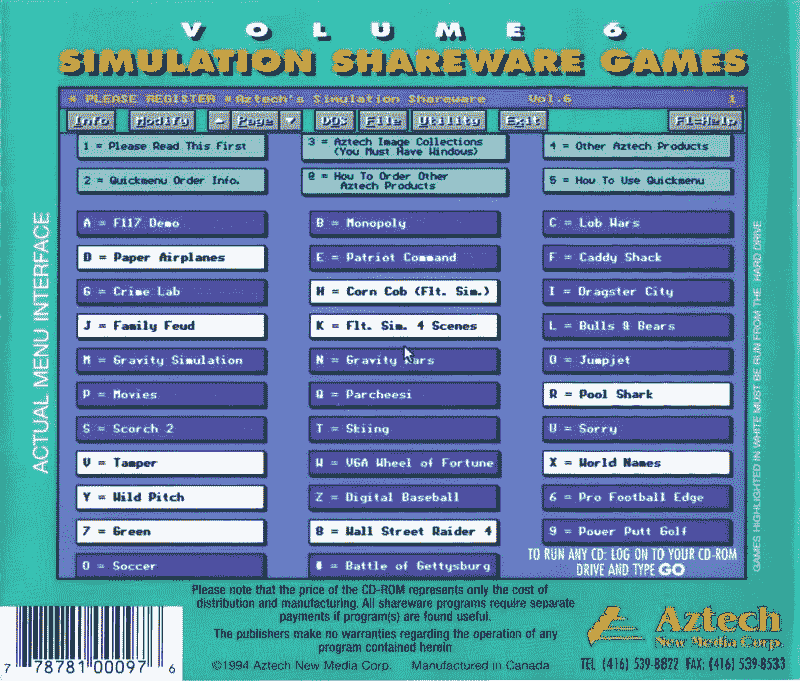

共享软件游戏封底

**共享软件**是最初免费提供给用户的软件，或者与许多其他软件捆绑在一起，并鼓励其用户制作和共享程序的副本。

有许多类型的共享软件，虽然它们可能不需要预先付费，但许多都是为了以某种方式创收。有些仅限于个人非商业用途，在商业企业中使用需要购买许可证。软件本身可能在功能上受到限制或有时间限制，或者它可能提醒用户付费会受到欢迎。

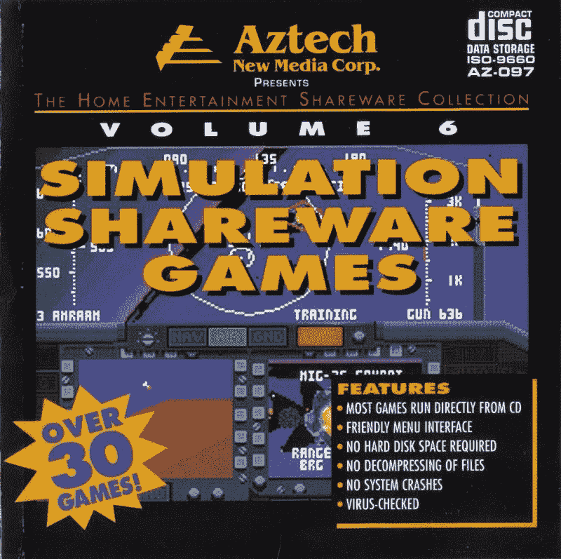

共享软件游戏封面

# 间谍软件

间谍软件

**间谍软件**或**间谍软件**是在用户不知情或未经用户同意的情况下，旨在恶意收集个人或组织信息的软件。

间谍软件可以与正版软件一起分发和捆绑，也可以通过访问恶意网站意外添加。大多数间谍软件是在不知情的情况下安装的，或者是通过欺骗手段安装的。间谍软件包括诸如键盘记录器之类的软件，它们记录你键盘上的每一次击键。

间谍软件

# 雾件

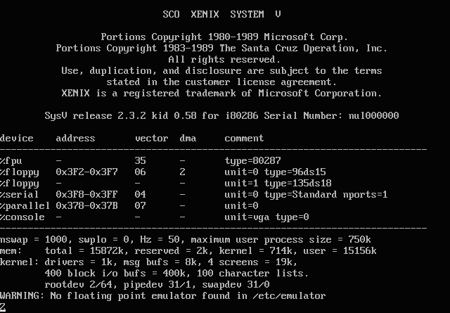

微软 Xenix

**Vaporware** (或 **vapourware** )是一种软件，通常会在据称发布的几个月或几年前向公众发布，很少有关于其开发的细节被发布。

过去，开发者被指控故意推广 vaporware，以阻止客户转向提供更多功能的竞争产品。

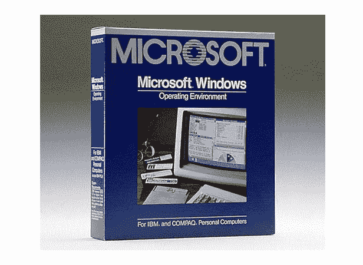

Microsoft Xenix 是第一批 vapourware 类型的版本之一

# 瓦雷兹

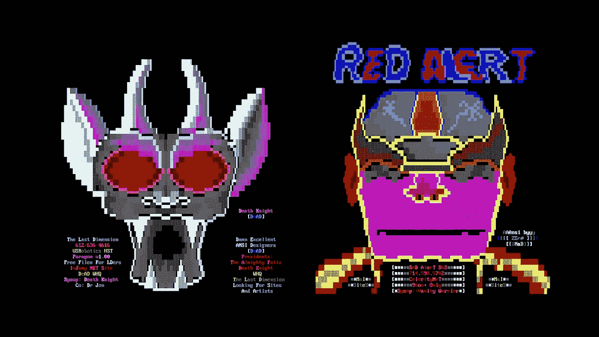

Ascii 艺术，一个通常与 warez 一起发布的例子

**Warez *(w4r3z)*** 用来指盗版软件，通常通过互联网分发。该软件可能会使用“破解”等技术消除任何复制保护或许可限制。

warez 的用户很少为该软件付费，因为在大多数情况下，这些限制已经被移除，并在文件共享和 torrenting 网站上发布

warez 的生产和/或分发在大多数国家都是非法的，众所周知，warez 软件包含捆绑在不受限制的软件中的病毒、rootkits 和间谍软件。

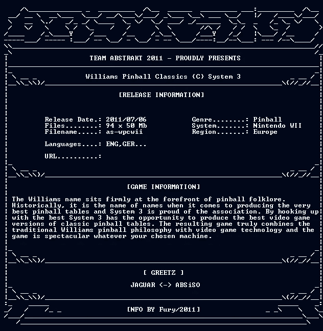

warez nfo 文件的示例，通常与 warez 软件一起发布