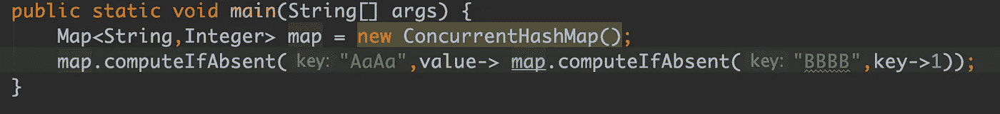
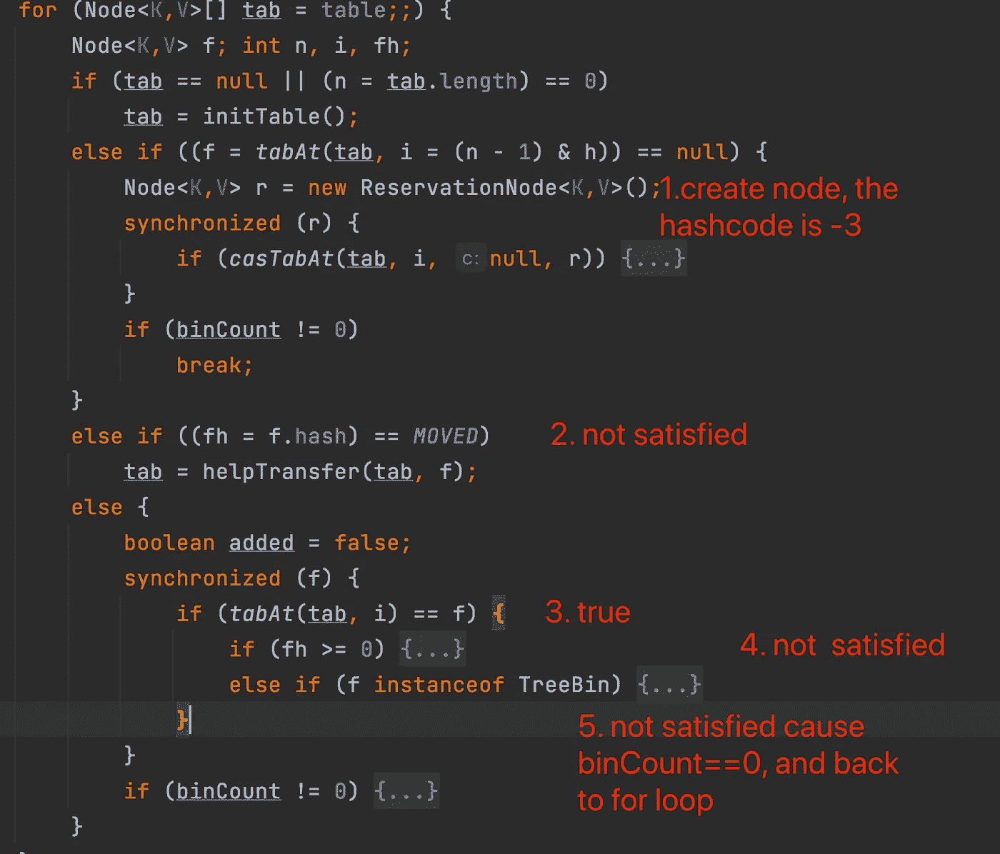

# JDK-8 中的 ConcurrentHashMap 有一些 bug

> 原文：<https://levelup.gitconnected.com/what-there-are-some-bugs-in-concurrenthashmap-de168de084a8>

是的，你没看错。在 JDK-8 中，ConcurrentHashMap 中有一些 bug，可能会给你带来麻烦。

ConcurrentHashMap 是我们日常工作中最常用的集合类之一。其特点是高性能和线程安全。然而，有两个错误影响了这个熟悉的地图的性能。问题在`computeIfAbsent()`。

*   `computeIfAbsent()`多线程获取同一个键时阻塞。
*   在`computeIfAbsent()`中，ConcurrentHashMap 可能会陷入死循环。

# *性能 Bug*

我们都知道`computeIfAbsent()`可以把下面两个操作合二为一，并保证它的线程安全。

*   确定一个键是否为空。
*   否则，执行逻辑就像 put 方法一样。

这样做是使用 synchronized，但是如果用相同的键重复 invoke computeIfAbsent 方法，它总是被阻塞。换句话说，当多个线程获取同一个键时，computeIfAbsent 会阻塞，这会影响性能(https://[bugs.opnejdk.java.net/browse/JDK-8161372](http://http))。幸运的是，此问题已在 JDK-9 中得到解决。如果你仍然使用 JDK-8，我们找到一个变通办法。

# 计算机中的无限循环不存在

这是一个致命的错误。问题是，我们在另一个 computeifaxine 中用一个偶然相同的 hash 码(在附加的例子中,“AaAa”和“BBBB”也有相同的 hash code)进行 computeifaxine。

让我们仔细看看这段代码会发生什么。

这张图片可以清楚地解释为什么会出现这个 bug。

*   第一个 if 为真，因为 f = tabAt(…)等于 null
*   然后创建一个 hashcode 为-3 的 ReservationNode
*   显然，第二个 if *((fh = f.hash) == MOVED)* 不满足
*   tabAt(tab，i) == f 为真
*   if (fh>= 0)不满足，因为 fh = -3
*   if(binCount！=0)不满足，因为 binCount==0
*   并返回到 for 循环

这些错误已经在 JDK-9 中得到修复。如果你还在使用 JDK-8，强烈建议你升级到 JDK-9。

感谢阅读。