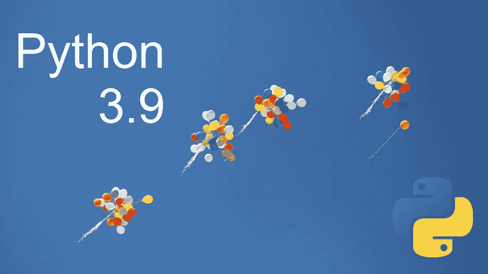

# Python 3.9 有什么值得期待的

> 原文：<https://levelup.gitconnected.com/what-to-expect-in-python-3-9-206b486ec2a4>

## 大蟒

## 了解 Python 下一版本的新特性

照片由[安库什·明达](https://unsplash.com/@an_ku_sh?utm_source=unsplash&utm_medium=referral&utm_content=creditCopyText)在 [Unsplash](https://unsplash.com/s/photos/release?utm_source=unsplash&utm_medium=referral&utm_content=creditCopyText) 拍摄

Python 3.9 预计将于 2020 年 10 月 5 日星期一发布。在发布正式版之前，开发人员计划发布六个 alpha 版、五个 beta 版和两个候选版。

 [## Python 最适合做什么？

### 了解 Python 编程语言的主要应用，也许你可以在你的下一个项目中使用它。

medium.com](https://medium.com/@bajcmartinez/what-is-python-best-for-6f509fea0727) 

在撰写本文时，第一名候选人最近于 8 月 11 日获释。现在，我们正在焦急地等待第二个候选版本，可能会在 9 月 14 日发布。

因此，您可能想知道 Python 3.9 中有什么新功能。对吗？

有一些重要的变化将决定 Python 程序的工作方式。最重要的是，在这个最新版本中，您将获得一个基于**解析表达式语法(PEG)** 的新解析器。类似地，合并`|`和更新`|=`联合操作符被添加到[字典](https://docs.python.org/3.9/library/stdtypes.html#dict)中。

让我们更深入地了解一下 Python 3.9 即将推出的所有特性和改进。

# 基于 PEG 的新型解析器

与旧的 LL(1)解析器不同，新的解析器有一些关键的不同，使它更加灵活，更经得起未来的考验。基本上在 LL(1)中，Python 开发人员使用了一些“技巧”来避免其局限性。进而影响添加新语言特性的灵活性。

PEG 和基于上下文无关语法的解析器(例如 **LL(1)** )之间的主要区别在于，在 PEG 中，选择操作符是有序的。

让我们假设我们写这个`rule: A | B | C`。

现在，在 LL(1)解析器的情况下，它将生成构造来推断 A、B 或 C 中的哪一个必须被扩展。另一方面，PEG 将尝试检查第一个选项(例如 A)是否成功。只有当`A`不成功时，它才会继续下一个替代方案。简单地说，PEG 将按照书写的顺序检查选项。

# 支持 IANA 时区

在实际应用程序中，用户通常只需要三种时区。

1.  协调世界时。亦称 COORDINATED UNIVERSAL TIME
2.  系统的本地时区
3.  IANA 时区

现在，如果你已经熟悉 Python 以前的版本，那么你可能知道 Python 3.2 引入了一个类`datetime.timezone`。基本上，它的主要目的是为 UTC 提供支持。

真正意义上，当地时区仍然不可用。但是，在 Python 3.0 版本中，开发人员改变了原始时区的语义，以支持“本地时间”操作。

在 Python 3.9 中，他们将增加对 IANA 时区数据库的支持。大多数时候，这个数据库也被称为“tz”或 Olson 数据库。所以，不要和这些术语混淆。

所有 IANA 时区的功能都打包在 [zoneinfo](https://docs.python.org/3.9/library/zoneinfo.html) 模块中。这个数据库非常受欢迎，广泛分布在类 Unix 操作系统中。但是，请记住，Windows 使用完全不同的方法来处理时区。

# 添加了 Union 运算符

在 Python 以前的版本中，合并或更新两个字典的效率不是很高。这就是为什么开发人员现在引入联合操作符，如用于合并的`|`和用于更新字典的`|=`。

例如，之前我们使用`d1.update(d2)`时，它也会修饰`d1`。因此，要修复它，我们必须实现一个类似于`e = d1.copy(); e.update(d2)`的小“黑客”。

实际上，我们在这里创建了一个新的临时变量来保存这个值。但是，这种解决方案不是很有效。这是添加这些新的 Union 操作符的主要原因。

# 介绍 removeprefix()和 removesuffix()

你有没有觉得需要一些函数，可以很容易地删除前缀或后缀从一个给定的字符串？

现在，你可能会说已经有一些像`str.lstrip([chars])`和`str.rstrip([chars])`这样的函数可以做到这一点。但是，这就是困惑的开始。实际上，这些函数处理的是一组字符，而不是一个子串。

因此，肯定需要一些单独的函数来从字符串的开头或结尾移除子字符串。

为`removeprefix()`和`removesuffix()`提供内置支持的另一个原因是，应用程序开发人员通常自己编写这个功能来提高他们的生产力。但是，在大多数情况下，它们在处理空字符串时会出错。所以，一个内置的解决方案对现实世界的应用非常有帮助。

# 标准集合中的类型提示泛型

您有没有注意到`typing`模块中重复的集合层次结构？

例如，您可以使用`typing.List`或内置的`list`。因此，在 Python 3.9 中，核心开发团队决定在`typing`模块中增加对泛型语法的支持。该语法现在可以在该模块中可用的所有标准集合中使用。

这个特性的主要优点是现在用户可以很容易地注释他们的代码。它甚至有助于教师以更好的方式教授 Python。

# 添加了 graphlib 模块

在图中，拓扑顺序在识别作业流中起着重要的作用。这意味着它遵循线性顺序来判断哪个任务将在另一个任务之前运行。

`graphlib`模块使我们能够对图形进行拓扑排序。它主要用于哈希节点。

# Python 3.9 中增强的模块

在我看来，主要的努力发生在改进现有模块的时候。您可以通过更新 35 个模块的庞大列表来评估这一点，以优化 Python 编程语言。

一些最重要的变化发生在`gc`、`http`、`imaplib`、`ipaddress`、`math`、`os`、`pydoc`、`random`、`signal`、`socket`、`time`和`sys`模块内部。

# 功能已弃用

在 Python 版中，约有 16 项功能被弃用。详细信息可以从[官方 Python 3.9 公告](https://docs.python.org/3.9/whatsnew/3.9.html#deprecated)中获取。在这里，我将试着给你一个最重要的东西被否决的简要概述。

如果你曾经使用过`random`模块，那么你可能知道它可以接受任何可散列类型作为种子值。这可能会产生意想不到的后果，因为无法保证哈希值是否具有确定性。这就是为什么开发人员决定只接受 None、int、float、str、bytes 和 bytearray 作为种子值。

另外，从现在开始，你必须指定`mode`参数来打开一个`GzipFile`文件进行写入。

# 移除了什么？

在 Python 以前的版本中，总共有 21 个不推荐使用的特性现在已经完全从语言中删除了。你可以在 [Python 的网站](https://docs.python.org/3.9/whatsnew/3.9.html#removed)上看到完整的列表。

感谢阅读！