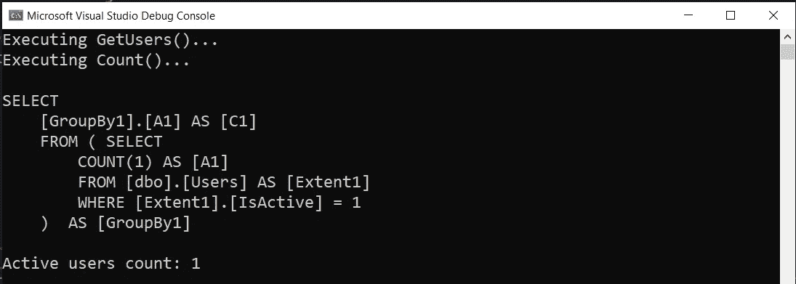
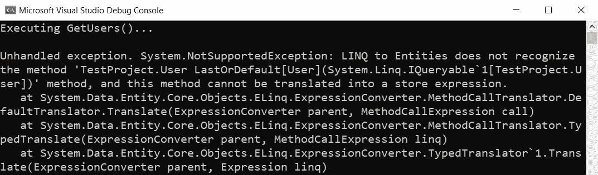
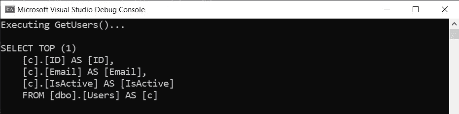
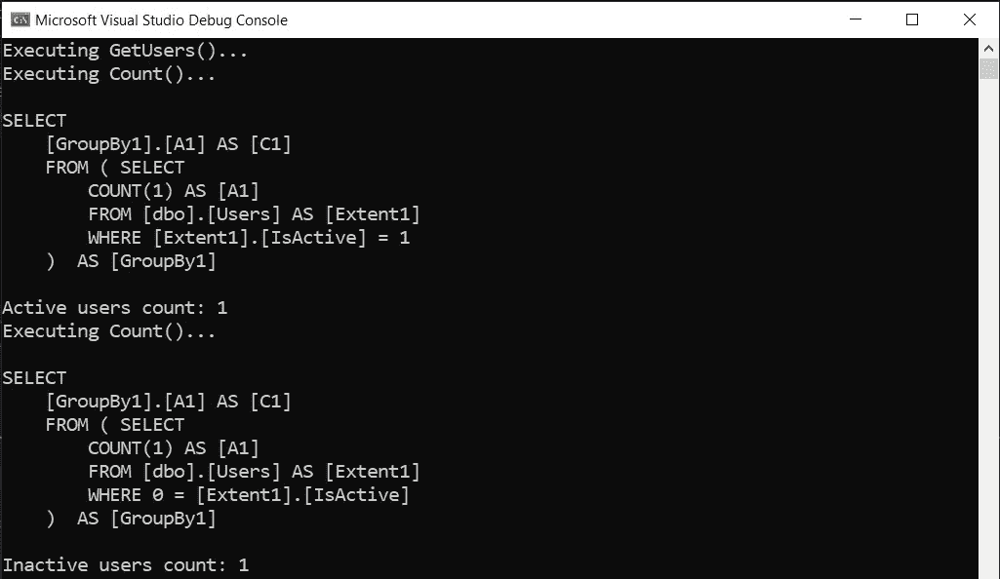
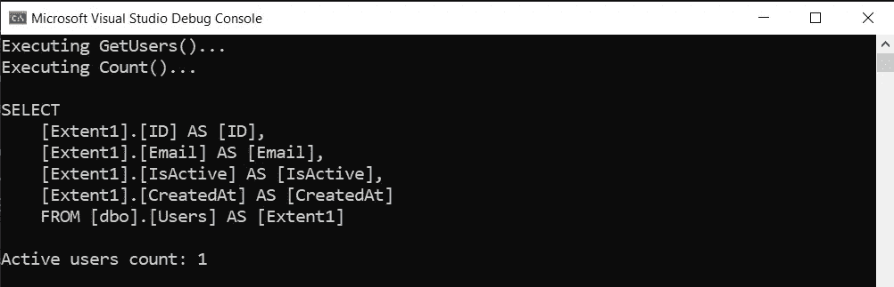
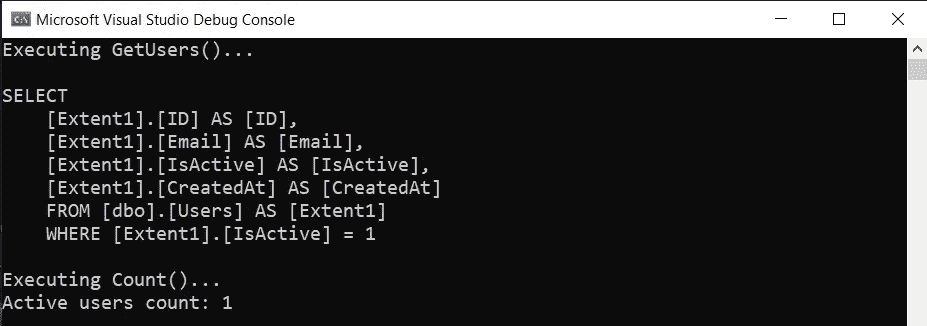
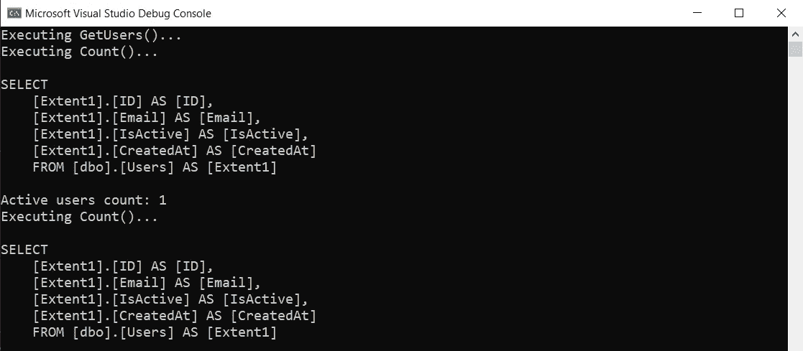

# 从存储库返回什么:IQueryable、IEnumerable 或 IReadOnlyList？

> 原文：<https://levelup.gitconnected.com/what-to-return-from-repositories-iqueryable-ienumerable-or-ireadonlylist-91c0647fe5e1>

## 在项目中构建健壮的数据访问层。


由 [Max Duzij](https://unsplash.com/es/@max_duz?utm_source=medium&utm_medium=referral) 在 [Unsplash](https://unsplash.com?utm_source=medium&utm_medium=referral) 上拍摄的照片

当在存储库中实现 get 方法时，它应该返回一组域对象(`GetUsers, GetProducts, GetWhatever`)，开发人员可以在几种返回类型之间进行选择:

*   `IQueryable<T>`
*   `IEnumerable<T>`
*   `IReadOnlyList<T>`或任何其他物化集合。

选择这些返回类型之一会影响应用程序的性能、设计和可维护性。因此，有意识的选择是在项目中创建健壮的数据访问层的重要部分。

## 示例定义

我们需要定义一个简单的领域模型，`DbContext`实现，并在进入本文主题之前播种一些简单的数据。

下面是代码(我用的是实体框架 6):

有了上面的代码，首先我们可以开始分析作为存储库 get 方法的返回类型的`IQueryable<T>`接口。

# IQueryable <t>返回类型</t>

`IQueryable<T>`接口允许您将 C#表达式转换成 T-SQL 查询，以便直接在数据库端执行。

让我们定义一个简单的用户存储库，为其消费者提供一个`IQueryable<T>`类型:

当您从存储库方法返回`IQueryable<T>`类型时，每个域服务或其他消费者可以对其应用必要的过滤器:

执行`SendNotifications`方法的结果:



几件需要注意的事情:

*   只有在实际请求结果时，才执行对数据库的查询(只有在调用`Count()`方法时，而不是`GetUsers()`)。
*   SQL 查询包含`IsActive`标志，这意味着当表达式被添加到`IQueryable<User>`对象时，最终查询被构造。
*   存储库不需要定义任何其他 get 方法，比如`GetInactiveUsers`或`GetUserByEmail.``IUsersRepository`的消费者可以自己构建任何查询。

然而，当在一个大项目中从您的存储库中公开一个`IQueryable<T>`接口时，会出现许多问题:

## 1.重复的域规则

向活动用户发送通知是在`SendNotifications`方法中实现的业务规则。

然而，真实的系统将有几十个与活跃用户相关的规则在不同的域服务中实现。例如，另一个域服务可以为每个活跃用户提供折扣。

但是明天需求可能会改变。例如，企业可能决定不为系统的所有活跃用户发送通知并给予折扣，而只为一年前注册的活跃用户提供折扣。

随着`IQueryable<T>`的实现，开发者将不得不进入每一个与活跃用户打交道的域服务，并由此修改代码

```
var activeUsersCount = *users
    .Where(user => user.IsActive)
    .Count();*
```

对此

```
var minusYearDate = DateTime.UtcNow.AddYears(-1);var activeUsersCount = users
    .Where(user => user.IsActive **&&** **user.CreatedAt < minusYearDate**)
    .Count();
```

因此，代码库变得更加难以维护，因为有几个地方需要更新，而且很容易遗漏一些东西。

## 2.数据访问细节泄露到域层

当`IQueryable<T>`从存储库中公开时，消费者不能使用他们习惯的所有 LINQ 表达式，因为不是每个表达式都可以转换成 T-SQL 查询。例如，试图在`IQueryable<T>`类型上执行简单的`LastOrDefault`方法将导致运行时异常:

```
Console.WriteLine("Executing GetUsers()...");User user = _usersRepository.GetUsers().**LastOrDefault()**;
```

执行结果:



事实上，T-SQL 不包含从表中读取最后一行的特殊语句。最后一行只能使用定制的 T-SQL 代码进行检索，该代码必须按照主键对表记录进行降序排序，然后对排序后的集合应用`TOP (1)`操作符。这就是标准的`LastOrDefault`实现抛出`NotSupportedException.`的原因

然而，执行`FirstOrDefault`方法将会成功，因为它可以很容易地转换成标准的`SELECT TOP (1)…` T-SQL 查询:



还有许多其他的 LINQ 语句不能编译成 T-SQL。因此，使用`IQueryable`存储库的域服务需要知道哪些语句可以转换成 T-SQL 并在数据库端执行，哪些不能。他们应该知道实现`IQueryable<T>`接口的数据库提供者的实现细节。**但事实上，这一切都不应该是域服务**所关心的。

## 3.从 IQueryable <t>到 IEnumerable <t>的隐式转换</t></t>

`IQueryable<T>`接口继承自`IEnumerable<T>`。因此，从`IQueryable<T>`到`IEnumerable<T>`的隐式转换是可能的，这会导致意外的数据库调用。

假设代码库中有一个简单的助手扩展方法:

```
public static IEnumerable<T> WhereNotNull<T>(
    this IEnumerable<T> items) 
{     
    return items.Where(x => x != null); 
}
```

在`IQueryable<T>`类型上可以无意识地调用`WhereNotNull`扩展方法:

```
IQueryable<User> users = _usersRepository.GetUsers();var notNullUsersCount = users.**WhereNotNull()**.Count();
```

这样的代码将在开始用`WhereNotNull`方法执行内存过滤之前从数据库加载所有用户。这可能会导致系统性能意外下降。

## 4.冗余数据库调用

存储库的消费者应该记得具体化结果，以避免意外的数据库查询。

运行上述代码将导致两次数据库调用:



当然，通过在一次数据库调用中将更多数据加载到内存中，可以很容易地解决这个问题，因此所有后续的过滤都将只在内存中进行:

```
IEnumerable<User> users = _usersRepository.GetUsers()**.ToList()**;
```

但是，这样的事情在大项目中很容易被忽略。因此，由许多数据库调用引起的性能问题会经常发生。

# IEnumerable <t>返回类型</t>

`IEnumerable<T>`接口是一个标准。NET 接口，该接口允许您循环访问元素集合。它是`IQueryable<T>`接口的另一种替代，作为存储库 get 方法的返回类型:

现在让我们试着通过简单地切换到`IEnumerable<T>`接口来理解对于存储库消费者来说有哪些`IQueryable<T>`问题得到了解决:

## 1.重复的域规则仍然是一个问题吗？

使用`IEnumerable<T>`存储库方法的域服务仍然可以获得`IEnumerable<T>`集合，然后应用必要的过滤器，就像使用`IQueryable<T>`一样。

然而，应用于`IEnumerable<T>`集合的过滤器不会被转换成 T-SQL 查询。过滤将在内存中进行。

执行结果:



如您所见，T-SQL 查询中没有`IsActive`过滤器，就像在`IQueryable`示例中一样。

但是这如何解决域规则重复的问题呢？

在上面的例子中以`IQueryable<T>`的方式使用`IEnumerable<T>`接口会从表中加载大量冗余数据，导致性能问题。在我们的例子中，表中的所有用户都将被加载到内存中，尽管只需要活动用户。

避免这种性能问题的常见方法是在存储库方法中封装过滤器:

执行`GetActiveUsers`方法的结果:



现在域服务或其他消费者不需要执行任何过滤，只需要从存储库中调用`GetActiveUsers`方法，这将使用`IQueryable<T>`接口创建一个高效的 T-SQL 查询。

关于活动用户的意思的知识仅包含在`GetActiveUsers`方法中。更改需求只会导致更新该方法中的代码。这提高了系统的可维护性。

## 2.数据访问细节是否仍然被泄露到域级别？

这个问题不再与`IEnumerable<T>`接口相关。在上面的例子中，只有存储库处理`IQueryable<T>`接口。域服务或存储库的其他消费者不再知道`IQueryable<T>`，而只是在内存收集中处理`IEnumerable<T>`。

## 3.从 IQueryable <t>到 IEnumerable <t>的隐式转换？</t></t>

对于存储库消费者来说，这不再是一个问题。

## 4.冗余的数据库调用怎么办？

从存储库中公开一个`IEnumerable<T>`仍然会导致意外的数据库调用。

执行结果:



正如您从 profiler 结果中看到的，忘记及时物化一个`IEnumerable<T>`集合*(例如，通过在第 2 行调用* `*ToList*` *方法)*会导致多次从数据库表中加载大量数据。

# IReadOnlyList <t>返回类型</t>

除了与冗余数据库调用相关的性能风险，返回一个`IEnumerable<T>`并不总是一个好的设计决策。

`IEnumerable<T>`接口由许多人实现。NET collections 提供了非常有限的功能——向前迭代元素集合。然而，有时存储库消费者可能需要其他功能，比如通过索引或键访问元素。

当然，任何从存储库中获得`IEnumerable<T>`集合的人都可以将其转换成任何其他需要的类型——列表、数组、字典等。

但是请这样想:从项目中的每个方法返回`object`类型，而不是返回更具体的类型，如`int`、`string`等等，这样可以吗？从技术上讲这是可能的，因为`object`是。NET，但至少会导致:

*   由于相同的方法签名，降低了代码的可读性。
*   由于大量的类型转换降低了系统性能。

当总是从每个存储库 get 方法返回`IEnumerable<T>`接口时，也会出现同样的问题。所以应该返回一个更具体的类型，可以是`IReadOnlyList<T>`接口:

那么，我们通过从存储库中返回一个`IReadOnlyList<User>`(或任何其他物化集合)来实现什么呢？

*   对存储库 get 方法的一次调用将总是导致一次数据库调用。消费者不需要记住物化结果，因为存储库现在负责物化它们。
*   `IQueryable<T>`接口和相关代码封装在存储库中。它消除了存储库消费者的复杂性，因为他们只处理常规的。净收藏。
*   存储库将最具体的类型返回给消费者，因此他们不需要强制转换返回的结果。此外，从方法中返回最具体的类型有助于获得清晰的方法签名。

# 摘要

关键要点:

*   从存储库中返回最具体的物化集合，以避免潜在的性能和设计问题。
*   避免从存储库中暴露`IQueryable<T>`类型。然而，在存储库中使用`IQueryable<T>`类型有助于构建好的查询。

感谢阅读。如果你喜欢你所读到的，看看下面这个故事:

[](/5-ways-to-implement-repository-pattern-in-c-e12565e4d4a2) [## C#中五大存储库模式实现的比较

### 一个成熟的软件工程师通常知道解决同一个编程问题的几种方法，并做出选择…

levelup.gitconnected.com](/5-ways-to-implement-repository-pattern-in-c-e12565e4d4a2) 

可以考虑订阅我的电报频道 [**软件开发日报**](https://t.me/sd_daily) 从我这里获取更多内容。

还有，考虑成为[中等会员](https://esashamathews.medium.com/membership)。