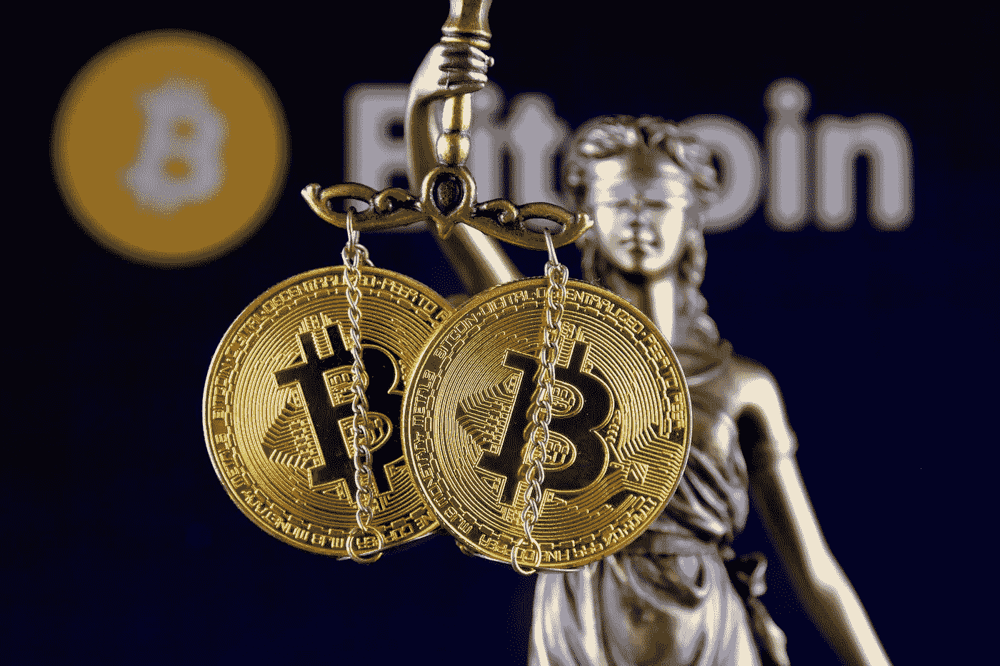
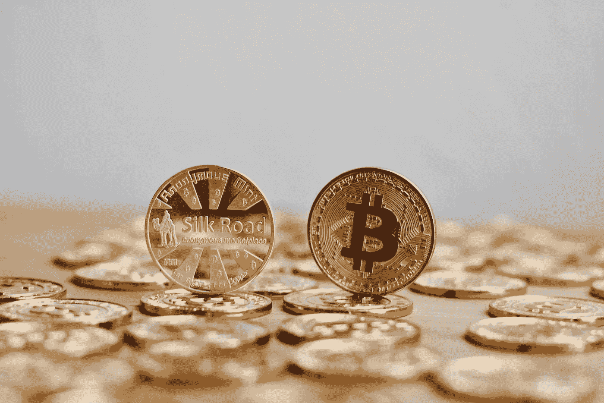
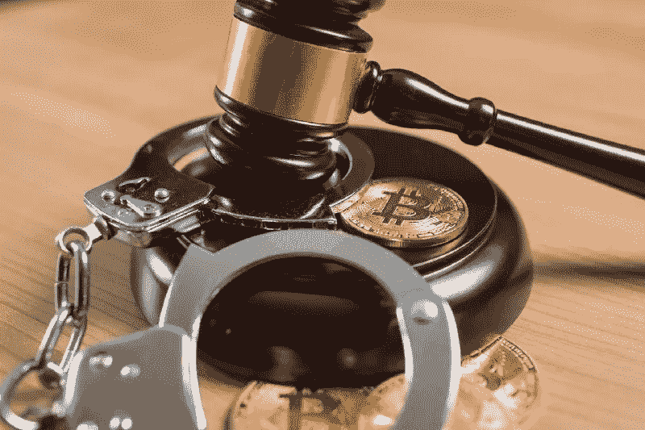
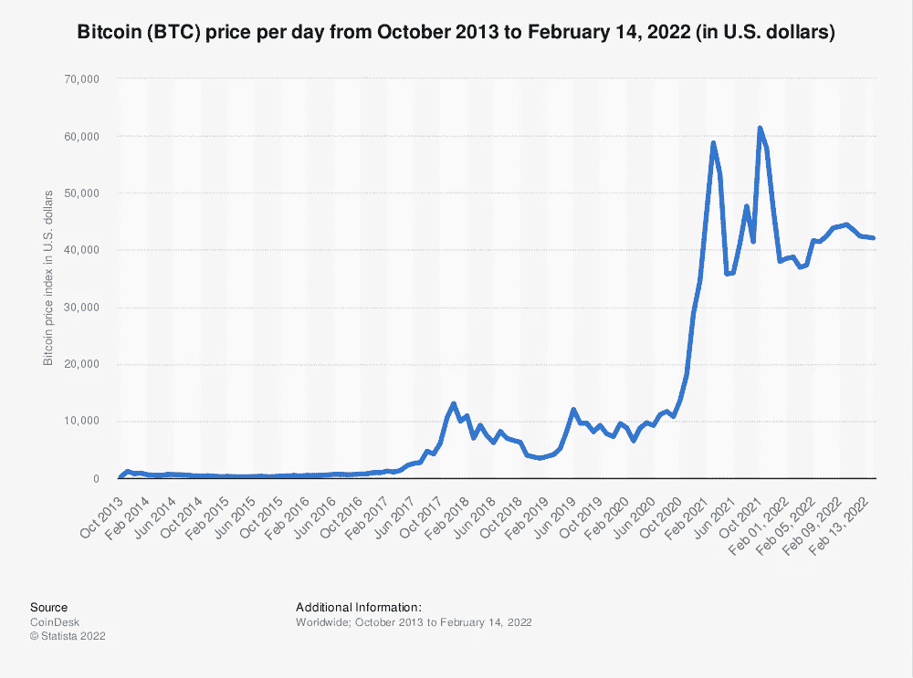

# 美国政府将如何处理 Bitfinex 比特币？

> 原文：<https://levelup.gitconnected.com/what-will-the-us-government-do-with-the-bitfinex-bitcoin-bb3e83f4af41>

## 退回去？卖掉它？毁掉它？抓住它？

来源: [Shutterstock](https://www.shutterstock.com/image-photo/symbol-law-justice-physical-version-bitcoin-776497783)

我最近一直在[探索](/the-stolen-bitfinex-bitcoin-has-been-recovered-the-blockchain-helps-catch-criminals-again-634f6a4803c8)美国联邦特工如何成功利用区块链的透明度和可追溯性，在 2016 年 Bitfinex 加密交易所期间没收了 36 亿美元的比特币。

这个案件提供了面对和探索围绕比特币的一些更常见的异议和误解的机会——它也提供了对两个不太可能的犯罪大师的生活的迷人见解。

撇开罪责不谈，我最近一直在思考的问题是，现在由美国政府持有的 Bitfinex 比特币将会发生什么？

他们不仅仅找回了装满捆扎整齐的美钞的箱子。探员们还没有没收一辆闪亮的跑车或游艇，这些车或游艇可以被改变用途或出售以补偿犯罪受害者。

不，他们持有的是比特币——一种被联邦政府内各种[高级人物](https://medium.com/gitconnected/why-are-governments-choosing-to-remain-ignorant-and-short-sighted-about-bitcoin-e2e62bfcb71e)描述为“投机资产”的加密货币(美联储主席杰罗姆·鲍威尔)；“极度低效”和“犯罪分子的工具”(财政部长——珍妮特·耶伦)；和“不会有好结果”(参议员伊丽莎白·沃伦)。

就连前总统唐纳德·特朗普——很少有人会隐瞒自己的观点——也形容比特币只不过是[【稀薄的空气】](https://www.forbes.com/sites/youngjoseph/2020/06/10/donald-trump-said-bitcoin-is-based-on-thin-air-but-wall-street-is-buying-en-masse/?sh=ed97ad44d275)——也许这是共和党人和民主党人实际上达成一致的一个话题？

综上所述，人们不禁要问，凭良心说，美国政府能拿回收的比特币做什么。卖掉它们肯定会显得虚伪？

然而，事实证明，在最近的历史上，他们至少有一次正是这样做的——出售从犯罪企业缴获的比特币。由于他们做这件事的方式和时间，他们在这个过程中也损失了至少 100 亿美元。

那么，Bitfinex 比特币接下来会发生什么？

# 补偿犯罪受害者

我不打算重温我对比特币和犯罪之间所谓交集的揭穿。如果你错过了，我希望你能看看我的[上一篇文章](/the-stolen-bitfinex-bitcoin-has-been-recovered-the-blockchain-helps-catch-criminals-again-634f6a4803c8)。

这是关于比特币现在的情况。

根据美国联邦调查局的网站，民事资产没收法对犯罪收益的适当处理做出了规定，包括在调查过程中扣押的金钱和货物。

被没收的枪支通常会被销毁，除非它们可以出售，所得的钱可以做好事。建筑物、汽车和其他财产可能会被改变用途，用于公共利益或执法目的，否则它们会被出售，所得资金用于赔偿受害者。

也许与这个故事最相关的是一项规定，即在可能和适当的情况下，被没收的钱(无论是现金还是电子形式)通常会返还给受害者。

那么这种情况下有可能吗？还是合适？在这种情况下，联邦政府准备好将比特币视为“货币”了吗？

# Bitfinex 已经补偿了它的客户

了解 Bitfinex 黑客攻击后发生的事情，以及该公司为赔偿损失了交易所持有的比特币的客户而采取的措施，可能会有所帮助。

简而言之，在考虑如何恢复客户的信心后，Bitfinex [向客户发行了一种债务代币——BFX](https://www.nasdaq.com/articles/will-bitfinex-hack-victims-get-their-bitcoin-back)——价格为黑客攻击造成的每一美元损失兑换一个代币。在接下来的几个月里，这些代币可以以每张 1 美元的价格出售，或者转换成母公司 iFinex 的股票，这将产生正回报率。

每一个在黑客攻击中损失资金的 Bitfinex 客户，因此在接下来的几个月里都收到了*至少*等值的退款。他们不一定得到补偿(或免受影响)的是比特币价格的涨跌，这一点值得记住:

2016 年期间，单个比特币的价格从 435 美元到 973 美元不等。在 2016 年 8 月 2 日——被黑的那天——价格在 590 美元左右(在撰写本文时，价格徘徊在 42000 美元左右)。

那些受到黑客攻击影响的人可能会因为当时提供的补偿而平静下来，因为他们没有想到比特币会被追回。

直到联邦调查局追踪到它。

# 投资者想分一杯羹？

美国司法部宣布，Bitfinex 黑客攻击的受害者可以通过法庭程序取回他们的比特币。然而，这一过程将是复杂的、耗时的和昂贵的，这也许是他们赖以拖延索赔者的原因？

这里很明显的一点是，尽管那些在 2016 年亏损的人得到了补偿，但他们可能更愿意以 2016 年的价格持有比特币，并能够享受比特币在此后几年中 7000%的收益。

现在他们的比特币回来了，似乎许多人都在制造噪音，想要分享收益。

# Bitfinex 也想要回它们

Bitfinex 在其网站上的一篇博客文章中宣布，它将与 DOJ 合作，收回它认为应该归还给他们的比特币。当然，从黑客攻击中恢复是有成本的，采取措施来恢复客户的信任也是有成本的。

部分是为了支付这些成本，也是为了筹集资金，2019 年，Bitfinex 创建了一个名为 UNUS SED LEO 的公用事业令牌。在 [LEO 的白皮书](https://www.bitfinex.com/wp-2019-05.pdf)中，Bitfinex 承诺将从黑客攻击中收回的任何资金的 80%用于回购和烧毁 LEO 令牌。这将增加那些留在私人保管下的人的价值，并补偿那些在试图筹集资金时投资 LEO token 的人。

将此归结为一两句简单的话:

*   Bitfinex 认为，它在黑客攻击后通过发行代币来补偿客户是出于善意。顾客们已经物有所值地拿回了他们的钱(或更多)。
*   他们发行了 LEO token 来筹集资金，以支付成本并筹集更多资本，并明确表示，如果比特币被追回，任何追回的资金都将用于收回这些成本。
*   他们可能还会认为，如果客户想以 2016 年的价格购买更多的比特币，他们可以在那时这样做，使用 Bitfinex 返回给他们的美元(这是我的，不是他们的！)

会发生什么还有待观察。DOJ 可以将所有找回的比特币交还给 Bitfinex，但如果哪怕只有一个客户能够对他们丢失的 BTC 提出可信的法律主张，那么这可能会对其他所有人产生重大影响。

与此同时，在此期间，美国政府仍然持有一种加密货币——如果高级官员可信的话，它目前认为这种货币设备没有任何真正的效用或可行的未来！

这让我想到，美国政府过去对从罪犯手中缴获的比特币做了什么？

近代史上有一个著名的例子——丝绸之路。

# 丝绸之路比特币

大多数人第一次听说比特币是作为丝绸之路运作的一个相关和不可或缺的部分，丝绸之路是一个暗网市场*，在那里可以使用比特币自由和匿名地购买毒品、枪支和黑客工具。

美国政府最终在 2013 年末逮捕了丝绸之路的创始人罗斯·乌布里希特(又名恐怖海盗罗伯茨)。

2020 年 11 月，美国国税局截获并没收了一批 69370 比特币，据信是一名黑客从丝绸之路窃取的，调查由此结束。

这就提出了一个问题——美国政府如何处理被查封的比特币？

**此外，暗网市场仍在继续运营，受到政府机构的监控，有些仍会偶尔被关闭。一些 Bitfinex 比特币的洗钱活动被揭露涉及将其上传和下载到* [*AlphaBay 暗网市场*](https://podcasts.apple.com/gb/podcast/unchained/id1123922160?i=1000550776744) *。*

# 罗斯·乌布里希特——美国的金并

我第一次对比特币感兴趣是在 2017 年左右，但直到 2021 年，我才[对其进行了第一笔投资](https://tobyhazlewood.substack.com/p/the-simple-risk-free-process-i-used)。从那以后，我变得有点狂热，试图从各个角度去理解它。

受投资大师查理·芒格(著名的比特币憎恨者)的一句话的启发，我试图在研究中保持客观:

> “除非我能比反对我的人更好地陈述反对我的观点，否则我无权发表意见。我认为，只有当我达到那种状态时，我才有资格说话。”
> 
> *——查理·芒格*

我明白芒格在这里所说的——与其寻找理由去相信某件事，不如去调查担忧和愤世嫉俗的根源。

因此，作为我对比特币了解的一部分，我开始探索丝绸之路的历史。我如饥似渴地阅读了尼克·比尔顿的《美国金并》一书，理解了比特币是如何以及为什么成为丝绸之路运作的内在因素。

在这本书的早期，我们了解到黑暗网络、Tor 浏览器和比特币是 Ulbricht 用来从头开始建立在线市场的基本元素。这是他的自由主义理想的体现，并创造了一个顾客可以在网上购买他们想要的东西的地方，没有政府的干涉、道德判断或监督。

来源: [Shutterstock](https://www.shutterstock.com/image-photo/digital-currency-physical-bitcoin-coin-gold-744986095)

该网站的访问者可以购买各种毒品和其他非法商品，使用比特币匿名支付，就像人们用现金向罪犯支付此类商品，希望避免被发现一样。

在鼎盛时期，该网站每天产生数万美元的销售额。在被捕时，乌尔布里切特的估计净资产为 2850 万美元。他在旧金山公共图书馆[被捕后，联邦调查局特工立即搜查了他的公寓](https://edition.cnn.com/2013/10/04/world/americas/silk-road-ross-ulbricht/index.html)，他们没有发现装满现金的手提箱，而是发现了各种 u 盘，里面装着乌布里切特藏匿的比特币。

我立刻想知道这些比特币怎么了。鉴于丝绸之路的大部分故事发生在 2013 年之前，当时一个比特币的价格不到 1000 美元，如果优盘仍在美国政府手中，美国政府似乎可能已经走运了？

# 丝绸之路比特币怎么办？

2015 年 11 月， [BBC 报道](https://www.bbc.co.uk/news/technology-54833130)最后一批 22000 枚比特币在丝绸之路被查获。这使得乌尔布里切特被捕后，美国政府没收的比特币总数达到约 17.5 万枚。

在对他的审判中，政府[提交了 5 封证明信](https://www.vice.com/en/article/539ey3/the-heartbreaking-letters-from-families-of-silk-road-overdose-victims)，这些信是由从丝绸之路购买毒品的不幸者的家人写的，他们死于意外过量用药和药物的不良反应。对这些受害者的家庭进行补偿是有道德依据的，尽管这不会让他们的亲人起死回生。

这将如何工作，或者是否会发生还不清楚——这可能需要出售至少一点比特币来提供补偿？

在跟踪货币的流动和来源方面，虽然比特币可以用来保护持有和使用它的人的匿名性，但通过区块链可以很容易地跟踪单个硬币的流动。

每枚硬币留下的痕迹将被永久、不变地记录下来，并保存在整个网络的数字账本中。这实际上*增加了*加密货币的每个单位如何从一个人转移到另一个人的透明度。

来源: [Shutterstock](https://www.shutterstock.com/image-photo/bitcoin-regulation-btc-cryptocurrency-coin-judge-1401029288)

正是这种透明度使执法机构能够追踪从丝绸之路上被盗走的比特币，并将其没收。它还帮助联邦特工发现，参与此案的两名特工——卡尔·福斯(Carl Force)和肖恩·布里奇斯(Shaun Bridges)——自己在调查期间叛变，从丝绸之路窃取了比特币，后来试图出售这些比特币以谋取私利。

透明度也有助于让[联邦政府追踪并没收 69370 枚比特币](https://www.wired.com/story/feds-seize-billion-stolen-silk-road-bitcoin/)，这些比特币是一名黑客在乌布里切特被捕 7 年后从丝绸之路窃取的。

这些比特币的没收让美国政府陷入了两难境地。丝绸之路比特币怎么办？

# 他们卖掉了它们(可能还会打折)

在截至 2015 年底的 17.5 万枚比特币中，政府将它们拍卖给了出价最高的买家。尚不清楚这些比特币的实际价格，但 [BBC 的一篇文章暗示](https://www.bbc.co.uk/news/technology-34808275)最后一批 22000 枚比特币被分成 2000 枚卖给了 11 个不同的竞标者。

这些硬币很可能以低于市场价的价格售出(我无法想象拥有那些曾被用来在丝绸之路上购买毒品的硬币会有什么荣誉可言)。事实上，BBC 报道称，此次拍卖吸引了总共只有 11 名竞标者的“低投票率”。

在试图计算政府可能赚了多少钱的同时，考虑比特币多年来的价格波动也是有意义的。

来源: [Statista](https://www.statista.com/statistics/326707/bitcoin-price-index/)

价格在 2013 年 11 月达到 1164 美元的峰值，就在 Ulbricht 被捕之后(巧合？).从那时起直到 2015 年 11 月，价格从未超过 375 美元。

如果我们假设最好的情况，17.5 万枚比特币以每枚 375 美元的价格出售，那么通过拍卖它们筹集的资金总额将为 6560 万美元。

**如果美国政府持有这些比特币，并以 61000 美元(略低于历史最高水平)的价格出售，他们将赚 107 亿美元。**

简而言之，他们通过出售比特币而不是 HODL 化比特币(比特币的俚语，用于离线冷藏)错过了超过 100 亿美元。

# 2020 年查获的 69370 个比特币怎么处理？

现在的问题似乎是，联邦政府应该对美国国税局 2020 年 11 月扣押的比特币做些什么(如果有的话)。到目前为止，我还没有找到关于这些比特币被做了什么的确切报告。

**或许 Bitfinex 的比特币已经被加入同一个钱包？**

这似乎给政府提出了一个道德难题。

Bitfinex 比特币最终可能会回到 Bitfinex 或个人客户手中，但美国政府很可能还监管着另一个 back 尤其是丝绸之路调查中剩下的那个。

如果他们在加密交易所出售比特币，这可能看起来像是对比特币的隐性官方认可:

*   这将是对比特币确实是一种存储和分配价值的有效机制的承认。
*   这将表明人们接受比特币可以有效地作为一种可以升值的投资资产(自从这些硬币在丝绸之路上使用以来，人们已经这么做了)。
*   这在某种程度上是承认，比特币和区块链并不危险，因为它们支持匿名——事实上，它们被政府收回的事实是比特币通过区块链的设计实现的透明度。
*   这将类似于政府从比特币这一技术中获得经济利益，而许多政府高官一直热衷于贬低和疏远这项技术。

也许他们已经在逐渐出售比特币，一次一点，以便以尽可能好的价格将其兑换成美元，并试图避免公开承认这些事实？

这肯定会帮助他们避免像拍卖另一个丝绸之路比特币那样损失如此惊人的金额。

或者也许，只是也许他们拿着它们想看看会发生什么？

# 最后一个选择

还有最后一种可能性很小但确实存在——政府出于原则摧毁丝绸之路比特币。

如果美国政府真的反对比特币，并且看不到它的真正用途或目的——这不太可能，但我猜是可能的——他们可以选择通过安全地处理包含密钥的硬件设备来销毁比特币。

不时有比特币持有者的故事出现，他们持有大量比特币，却在[丢失了物理存储设备](https://www.bbc.co.uk/news/uk-wales-55658942)。其他人[丢失了密码](https://www.businessinsider.com/bitcoin-owner-who-lost-password-made-peace-potentially-huge-loss-2021-1?r=US&IR=T)和恢复短语，因此被阻止访问他们的比特币。不管怎样，这些比特币已经一去不复返了。

网络上最多只会发行 2100 万枚比特币——这是计算机协议中的一项规定。丢失的存储设备上的任何比特币都永远消失了。据估计，到目前为止，已经发行的所有比特币中有多达 [20%可能会永久丢失。](https://www.investopedia.com/news/20-all-btc-lost-unrecoverable-study-shows/)

如果美国政府认为比特币没有实际价值，那么它可以发表声明，永久销毁这 69370 枚比特币，进一步减少流通数量。不过，我暗自怀疑他们不会那样做。

# 最终想法

比特币在丝绸之路的兴衰中发挥了不可否认的重要作用。有人可能会说，如果没有比特币，丝绸之路就不会出现，这在某种程度上可能是真的。也就是说，如果比特币不存在或者不那么容易被采用，一种处理支付和保持匿名的替代手段可能会发展起来。

同样重要的是要记住，现金*总是*允许人们匿名支付商品和服务——比特币只是利用了这一属性，并在在线环境中实现了这一点。

我们可能永远不会知道美国政府决定如何处置其持有的来自丝绸之路的比特币(以及来自 Bitfinex 等其他刑事诉讼和调查的任何比特币)。

想到联邦政府目前持有超过 30 亿美元的比特币，我觉得很好笑。比特币是一种加密货币，许多高级官员反复形容它基本上毫无意义，而且有潜在的危险。

*如果你喜欢阅读这样的故事，并愿意支持 Medium 上的作家，可以考虑注册***成为 Medium 会员。一个月 5 美元，给你无限的故事。如果你注册使用我的链接，我会赚一小笔佣金。**

* [## 通过我的推荐链接加入灵媒——托比·黑兹伍德

### 作为一个媒体会员，你的会员费的一部分会给你阅读的作家，你可以完全接触到每一个故事…

tobyhazlewood.medium.com](https://tobyhazlewood.medium.com/membership)* 

*注意:*本文仅供参考。不应将其视为财务或法律建议。在做任何重大财务决定之前，先咨询财务专家。**