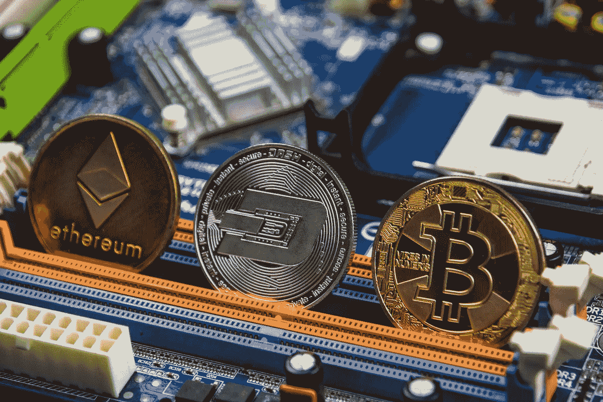
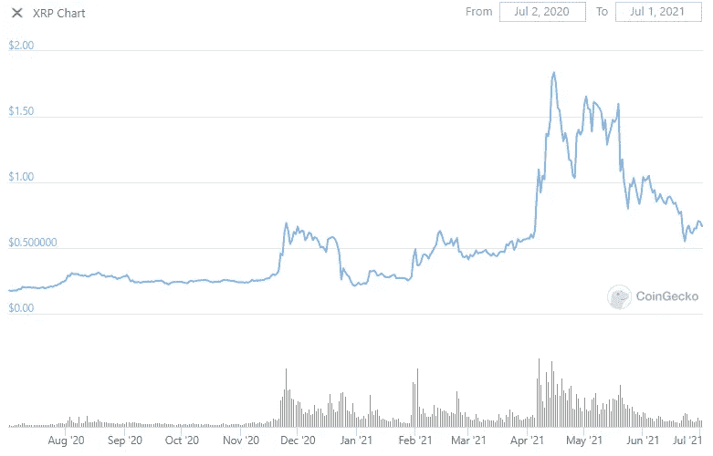
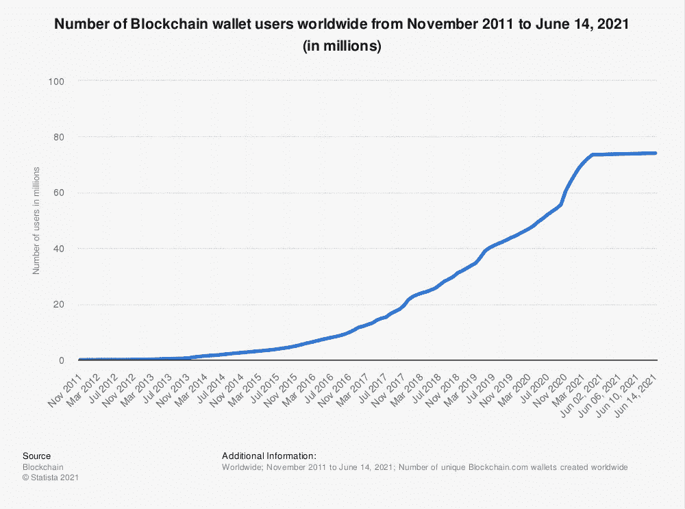

# Ripple IPO 对加密货币世界意味着什么？

> 原文：<https://levelup.gitconnected.com/what-would-a-ripple-ipo-mean-for-the-world-of-cryptocurrencies-eb50b9c0c4bf>

Ripple 计划通过申请首次公开募股，在加密货币的世界掀起波澜。硬币经历了动荡的过去 12 个月，但现在，随着上市的谈论越来越多，我们可能会看到 XRP 成为一个加密潮流的引领者。

Ripple 是加密货币 XRP 的背后公司，这是 XRP 分类账的原生令牌，但它上市的举动对该硬币来说是一种非常不寻常的方法。通常情况下，加密货币公司通过风险投资或首次发行硬币(ico)筹集资金，但 Ripple 打算通过首次公开发行筹集资金来引领潮流。

*(图片:* [*【守宫】*](https://www.coingecko.com/en/coins/xrp) *)*

正如我们从 XRP 的价格历史中可以看到的那样，加密货币在过去的 12 个月里经历了一段特别不稳定的时期。这在很大程度上归因于 2020 年 12 月美国证券交易委员会的法律挑战和社交投资的激增，XRP 在社会情绪方面享有与 Dogecoin 相似的声誉。

但是，对于更广阔的加密货币世界来说，加密世界的这一前所未有的举动意味着什么呢？连锁 IPO 会对加密技术的接受和采用产生蝴蝶效应吗？

# 探索 Ripple 的首次公开募股

Ripple 首席执行官布拉德·加林豪斯已经表示，Ripple 可能很快就会进行首次公开募股。“未来 12 个月，你会看到加密/区块链领域的首次公开募股。我们不会是第一个，也不会是最后一个，但我希望我们处于领先地位。对我们公司来说，这是一种自然的进化，”加林豪斯在 2020 年初暗示道。

然而，在新冠肺炎疫情事件之后，Ripple 发现自己正在与美国证券交易委员会的法律挑战作斗争，该委员会声称，XRP 的集权程度必须被视为一种证券——正因为如此，Ripple 通过出售未注册的证券非法筹集了 13 亿美元。

Ripple 最大的股东 SBI 集团的首席执行官吉田隆(Yoshitaka Kitao)表示，该公司打算在 SEC 的诉讼结束后上市。“在目前的诉讼之后，Ripple 将上市。现任 CEO 想这么做。克里斯想那样做，”[奇托就此事说](https://www.financemagnates.com/cryptocurrency/news/japans-sbi-to-reward-shareholders-with-free-xrp/)。

Ripple 首次公开募股的时机可能很重要，疫情将许多新的 T2 散户投资者推向股票、股份和加密货币。

根据欧洲自由金融投资研究主管 Maxim Manturov 的说法，新的投资者涌入“实际上看起来像是疫情和随后的刺激计划的结果。这创造了一个散户投资者可以开始投资股票的资金池。根据富达报告，2020 年有 2600 万个零售账户，比 2019 年增长 17%，而日交易量翻了一番。”

曼图罗夫补充称:“高盛(Goldman Sachs)最近上调了散户投资者对 2021 年股票需求的预期，从 1000 亿美元上调至 3500 亿美元。”。

*(图片:***)**

*正如我们从上面的图表中看到的，加密货币的采用在疫情之后也有所加快，目前全球有近 8000 万区块链钱包用户活跃。Ripple 计划的首次公开募股可能会把两个世界联系在一起，成为两种投资策略之间的桥梁。*

# *Ripple 的首次公开募股会如何影响 XRP 和加密资产的价格？*

*今年 4 月，当 Ripple 计划在向 SEC 提起诉讼之前上市的消息变得明朗后，XRP 的市值上涨了 15%。这一攀升表明，这一雄心勃勃的举措无疑引起了旁观者的兴趣。然而，也有理由相信，公开上市可能会将人们的兴趣从硬币上转移到 Ripple 的股票上。开辟第二条投资渠道可能会侵蚀持有硬币的习惯。*

*然而，对于 Cointelegraph 作家兼分析师 Rakesh Upadhyay 来说，启动 IPO 的决定可能是一个幼稚的决定——这表明“在 IPO 之后，市场参与者可能会有耐心，但他们很快就会寻求结果。如果结果没有出来，将会影响价格。”*

*“价格大幅下跌将使 Ripple 难以筹集资金。它一直在出售代币，这表明它没有赚到足够的钱来资助其运营，”Upadhyay 声称。“但与以前不同的是，IPO 之后，Ripple 也不能在没有事先宣布的情况下出售代币。一旦宣布，这将再次打击价格。”*

*尽管存在这些合理的担忧，但公平地说，IPO 将有助于提高 Ripple 和 XRP token 在更广泛的市场中的知名度。对于散户投资者来说，传统的首次公开募股很难买入，对于那些愿意支持该项目的人来说，拥有一项已经能够买入的加密资产可能是一个很好的投资机会。*

*这种积极的影响可以在更广泛的加密货币世界[中感受到，为更多的 IPO 打开了大门，为投资者在投资之前更好地了解资产及其功能提供了更多机会。IPO 带来的更大透明度，对于那些不确定是否信任一个不可预测的市场的人来说，可能是建立信任的一种非常有效的方式。](/the-difference-between-cryptocurrency-and-blockchain-1d8c27282943)*

*对于 Ripple 来说，如果该公司在公开市场实现更快支付系统的潜力，那么 IPO 的时机很可能会受到启发。即使涟漪式上市没有按计划进行，它至少可以作为更广泛市场的一个极好的试金石。在一个由外部投资和首次发行硬币主导的加密货币领域，启动 IPO 的潜力可能会为整个加密世界提供一个重大机遇。*