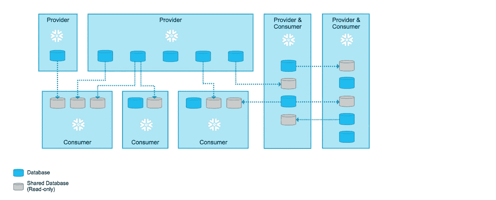
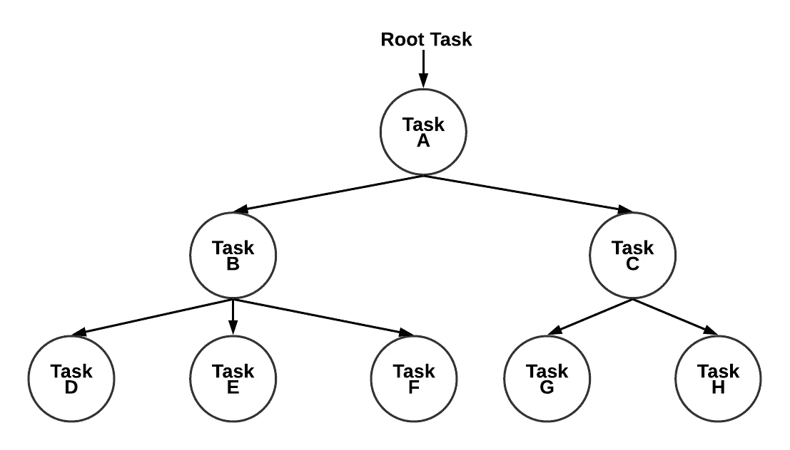
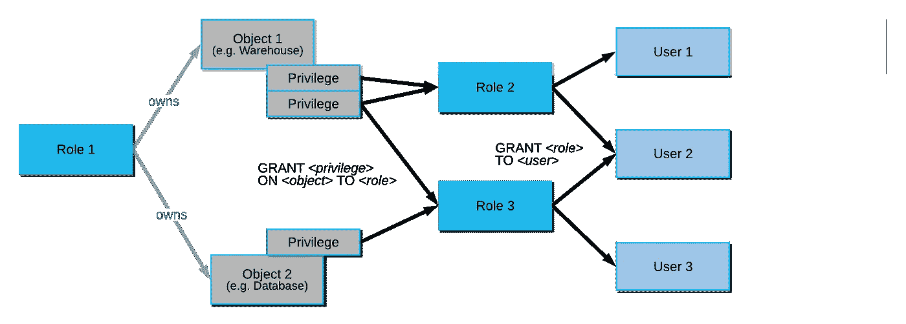
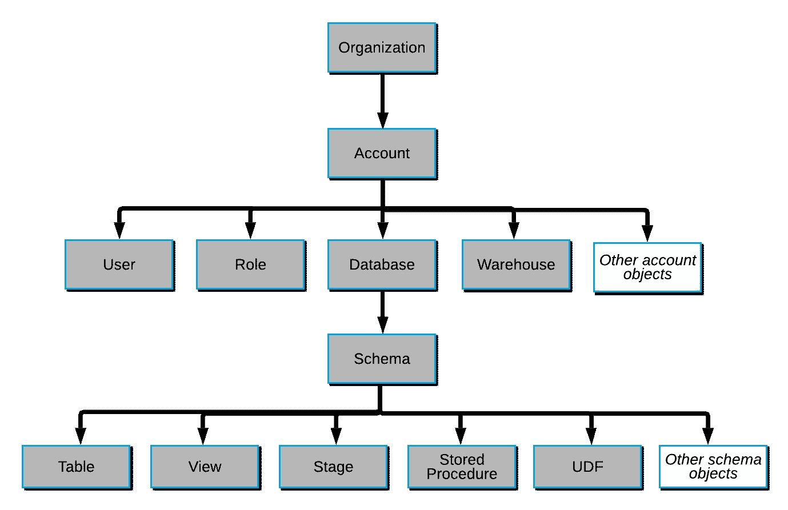

# 你能用雪花做什么

> 原文：<https://levelup.gitconnected.com/what-you-can-do-with-snowflake-c7130dbcb780>

## 雪花的主要特征

Unsplash 上的图像

 [## 用我的推荐链接加入媒体-乔治皮皮斯

### 阅读乔治·皮皮斯(以及媒体上成千上万的其他作家)的每一个故事。您的会员费直接支持…

jorgepit-14189.medium.com](https://jorgepit-14189.medium.com/membership) 

[雪花](https://www.snowflake.com/)是一种流行的基于云的数据存储和分析服务。就我个人而言，当我检查新技术和产品时，我希望有一个最重要特性的总结。这可以让我们对产品有一个大致的了解，并了解它是否满足我们的需求。在这篇文章中，我将尝试概述雪花的一些重要特征。

## 支持不同的云平台

雪花账户可以托管在前 3 大云提供商上，例如:

*   自动警报系统
*   蔚蓝的
*   GCP

## Python 连接器 API

另一个特性是你可以使用 Python 连接器 API[连接 Python 和 Snowflake](https://predictivehacks.com/how-to-get-data-from-snowflake-using-python/) ，这对那些倾向于使用 Python 和 Jupyter 笔记本的数据科学家非常有用。

## 命令行客户端(SnowSQL CLI)

使用 [SnowSQL](https://docs.snowflake.com/en/user-guide/snowsql.html) 你可以通过命令行连接 Snowflake 来执行 SQL 查询和执行所有 DDL 和 DML 操作，包括将数据加载到数据库表和从数据库表中卸载数据，并且可以作为交互式 **shell** 运行，或者通过 stdin 或使用-f 选项以批处理模式运行。

## 装载和卸载数据

您可以从以下位置加载几乎任何类型的数据(csv、Parguet、JSON、XML、Avro、ORC ):

*   本地文件系统
*   AWS S3
*   谷歌云存储
*   微软 Azure

我觉得非常酷一个特性是 copy 命令的错误处理选项。例如，您可以跳过有错误的行，或者您可以指定您接受跳过多少行，如果超过此阈值，则您可以取消复制命令。此外，在加载数据时，它会考虑元数据中的更改，因此如果源文件中没有更改，它不会运行 copy 命令。

除了加载数据，您还可以通过将数据发送到 AWS S3 等其他来源来卸载数据。

## 不同类型的表和数据库

有 3 种类型的表和数据库，例如:

*   **临时**只要会话处于活动状态就可用
*   **瞬态**
*   **永久**

## 转换数据

雪花给了我们在上传数据时转换数据的可能性。例如，我们可以忽略一些列，我们可以生成其他列。

## 用雪管连续装载

Snowflake 有一个叫做 [Snowpipe](https://docs.snowflake.com/en/user-guide/data-load-snowpipe-intro.html) 的特性，它允许我们在文件可用时自动从文件中加载数据。

## 时间旅行和自动防故障

有了雪花，[你可以回到过去](https://docs.snowflake.com/en/user-guide/data-time-travel.html)，这意味着你可以“撤销”你已经运行的命令，比如修改一个表，删除一个表或者模式等等。故障保护可确保历史数据在发生系统故障或其他灾难性事件(如硬件故障或安全漏洞)时受到保护。

## 克隆表、模式和数据库

只需一行命令，我们就可以轻松地克隆表、模式和数据库。此外，我们可以像交换阶段和生产表一样交换表。

## 数据共享

雪花使我们能够与雪花和非雪花用户共享数据。

雪花文档上的图像

## 数据采样

我们可以很容易地生成表格的随机样本。这是一个非常有用的工具，因为处理样本数据是很常见的，尤其是当我们处理百万/十亿行的大表时。

## 计划任务

我们可以计划单个任务或任务树的任务。这些任务可以是 SQL 命令或存储过程。这些任务可以在几分钟内定义，也可以使用 CRON 符号定义。我们可以获得详细的日志、历史记录，并且它支持错误处理。

雪花文档上的图像

## 数据流

您可以定义数据流[流](https://docs.snowflake.com/en/user-guide/streams.html)，如果源数据发生变化，目标数据也会随之变化。

## 物化视图

使用雪花，您可以创建物化视图。

## 动态数据屏蔽

您可以创建屏蔽策略来屏蔽特定用户和角色的 PII 数据。这意味着不同的用户可以看到不同的数据。

## 访问控制管理

雪花提供了强大的[访问控制管理](https://docs.snowflake.com/en/user-guide/security-access-control.html)和角色。

雪花文档上的图像

雪花文档上的图像

# 外卖

雪花是一个非常强大的工具。在这篇文章中，我们提到了**你可以用它做什么。如果你有兴趣看一些**如何**用雪花做一些很酷的东西的例子，请继续关注。**

最初发布于[预测黑客](https://predictivehacks.com/what-you-can-do-with-snowflake/)