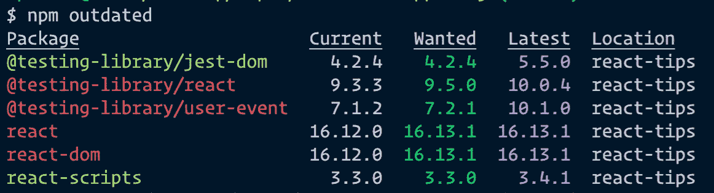
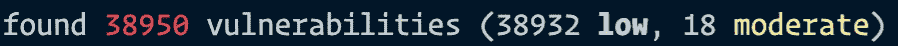
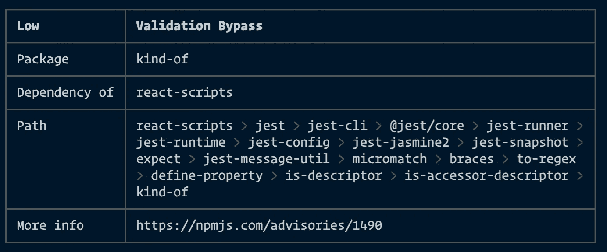

# 关于 NPM 你应该知道什么

> 原文：<https://levelup.gitconnected.com/what-you-should-know-about-npm-2b198dab6e9d>

你应该掌握的命令和核心原则。


由 [Paul Esch-Laurent](https://unsplash.com/@pinjasaur?utm_source=medium&utm_medium=referral) 在 [Unsplash](https://unsplash.com?utm_source=medium&utm_medium=referral) 上拍摄

NPM 或节点包管理器是当今 web 开发的基石。无论您是使用 Node.js 还是使用 React 或 Angular 之类的库构建前端，这项技能都是不可避免的。

我无法想象不使用 NPM 开发一个应用程序(但我很肯定有办法)。它允许您管理包，并提供一个有用的界面来使用它们。

# NPM 的安装

如果要为项目初始化 NPM，需要在计算机上安装 Node.js。这包括你开始需要的一切。

你可以从[官方页面](https://nodejs.org)下载节点。只要按照说明做，你就可以开始了。

现在，要确保 NPM 在您的计算机上，您可以打开终端并键入以下命令:

```
npm -v
```

它应该显示已安装软件包的当前版本，例如 6.13.4。

# npm 初始化

为了安装、更新或删除项目中的包，您必须初始化`package.json`。Create React App 等大部分首发包都已经有这个文件了。在这种情况下，可以跳过这一步。

否则，您可以使用以下命令初始化 npm:

```
npm init -y
```

**注意:**如果想更快的生成`package.json`，可以在命令中添加`-y`标志。

# 拆解包. json

现在，为了很好地理解 NPM 是如何工作的，以及如何正确地处理项目的配置，你应该知道`package.json`包括什么。

让我们看一个创建 React 应用程序包的例子:

package.json

*   您可以在`dependencies`和`devDependencies`中看到所有已安装的软件包。有什么区别？
*   `dependencies`应该包含构建你的应用的库和框架，比如 Vue、React、Angular、Express 等。很明显，这些包既用于生产，也用于开发。
*   应该包含开发过程中使用的包或者用来构建你的包的包，例如，测试库、jest、gulp-jade 等。只有在开发项目时，这些包才是必需的。
*   您可以在`scripts`中定义自己的命令。例如，通过运行`npm start`你将在本地运行 React app，或者通过运行`npm test`所有编写的单元测试。

**注意:**小心运行`npm eject`，因为这是单向运行！

`npm eject`将复制所有的配置文件和可传递的依赖项(Webpack，Babel，ESLint 等。)作为`package.json`中的依赖项。如果您想自己配置捆绑和构建项目，这可能很有用。

# 依赖项的版本控制

`package.json`中的每个包都是用键值对编写的。键是包的名称，值是版本。

版本号在 S [emVer 语法](http://semver.org/)(语义版本规范)中，它用不同的含义指定每个部分。SemVer 分为三个部分，由一个点分隔:

```
"react-scripts": "3.3.0"// "react-scripts": major.minor.patch
```

主要版本、次要版本和修补程序代表软件包的不同版本:

*   *主要* —如果发布了主要版本，它包括对依赖关系的重大更改，这可能会导致应用程序的意外行为。
*   *次要* —包括向后兼容的新特性。app 的运行应该不会受到影响。
*   补丁 —包括向后兼容的错误修复。

## ~和^呢？

npm 使用波浪符号(~)和插入符号(^)来分别指定要使用的修补程序和次要版本。

所以如果看到`~1.0.2`就表示安装版本`1.0.2`或者最新补丁版本比如`1.0.4`。如果看到`^1.0.2`表示安装版本`1.0.2`或最新的次要或补丁版本如`1.1.0`。

# npm 安装

现在，既然您已经知道了`package.json`包含了什么，那么您可能想在您的项目中安装其他的依赖项。你可以这样做:

```
npm i lodash --save
```

`i`代表安装，`lodash`是包的名称。还应该添加标志`--save`保存到`dependencies`中。

如果你想安装一个包作为 devDependency，你应该添加标志`--save-dev`或者仅仅是`-D`。

要在您的机器上全局安装依赖项，添加`-g`标志，您就可以开始了。

**注意:**无论是安装在`dependencies`还是`devDependencies`中，您都应该阅读软件包的文档。

# npm 更新

NPM 依赖的常见问题是新版本经常发布，出于各种安全和漏洞原因，它们应该保持最新。那么什么才是合适的更新策略呢？

首先，让我们探索哪些依赖项应该更新:

```
npm outdated
```

您将得到一个类似如下的表格:



此表显示软件包应该更新到“需要的”列中给出的版本。您可以通过以下命令修复它:

```
npm update// ornpm update <dependency_name>
```

但是，如果依赖项需要重大更新，它将无法使用此命令，因为它包含了重大更改。

这些案例应该通过在`package.json`中重写版本并运行`npm install`来手动更新。之后，您应该检查您的代码并测试应用程序。

# npm 审计

如果你安装了你想要的包，在最后一行你会看到这个，这可能会很烦人:



要查看更多细节，您可以运行命令`npm audit`:



你会得到一个有漏洞的包的详细列表。如果您查看`Path`字段，它显示了依赖路径。所以，在这种情况下， *react-scripts* 依赖于 *jest* ，jest 依赖于 *jest-cli* 等等。最后，*类*依赖包含一个应该被修复的漏洞。

许多漏洞可以通过运行上面提到的或下面提到的更新依赖项来修复:

```
npm audit fix
```

但是，有些依赖关系可能不会自动修复。如果您使用的包发生了重大变化，更新后可能会破坏您当前的项目，就会发生这种情况。在这种情况下，您应该手动检查您的代码。

# 最后的话

随着每个新版本的发布，NPM 正在向前端开发领域大步迈进。[据其联合创始人 Laurie Voss](https://frontendhappyhour.com/episodes/npm-install-beer-save-in-mouth/) 称，其用户群正在发生变化，大多数用户根本不用它来编写 Node。

更确切地说，它正在成为人们用来在前端组装 JavaScript 的工具，并且正在成为编写现代 JavaScript 不可或缺的一部分。

然而，它的缺点是定期的依赖关系更新，这会在维护项目时带来很多麻烦。因此，并行地定义开发和维护策略是一个很好的实践。

感谢阅读！